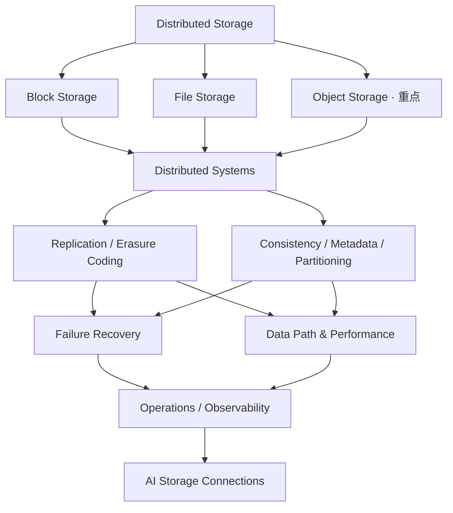

# Distributed Storage Notes

长期维护的 **Distributed Storage 技术知识库**，系统整理分布式存储的通用架构、机制与工程实践，重点深入 **Object Storage**，并逐步连接 AI Storage 与高性能数据路径。

本仓库不作为 Dell ECS / ObjectScale 项目复盘、AI Storage 面试教程或面试速记；产品案例只使用公开资料，不记录内部实现细节。

**当前建设顺序：Object Storage 基础主线已完成 → Data Protection 第一阶段已完成 → Distributed Systems Foundations 已完成 → Consistency / Metadata / Partitioning 第一阶段已完成 → Failure Recovery 第一阶段已完成 → Recovery / Operations 第二阶段已完成 → Data Path / Performance 第一阶段已完成 → Data Path / Performance 第二阶段已完成。** 八阶段分别已有 6 / 3 / 3 / 3 / 3 / 3 / 3 / 3 篇正文；其余专题仍以目录骨架和后续规划为主。目录编号用于导航，不代表必须依次阅读。

## Knowledge Map

从 Block / File / Object 三类访问模型进入，再了解共用的分布式机制，接着考察故障、性能与运维，最终连接 AI 工作负载。图中的箭头表示阅读方向，不表示严格的技术依赖；复制、元数据和数据路径在实际系统中相互影响。

## 知识目录

| 目录 | 页面定位 | 后续范围 |
| --- | --- | --- |
| [01 · Overview / Storage Architecture](docs/01-overview/README.md) | 全景与架构入口 | 访问模型、架构分层、控制面与数据面 |
| [02 · Storage Fundamentals](docs/02-storage-fundamentals/README.md) | 单机存储与 I/O 基础 | 介质、持久化、缓存、性能指标 |
| [03 · Object Storage](docs/03-object-storage/README.md) | **重点主线，后续深度与篇幅高于 Block / File** | 对象模型、S3 语义、读写链路、布局、版本与生命周期 |
| [04 · Block Storage](docs/04-block-storage/README.md) | 块访问模型与边界 | 卷、块寻址、快照、与上层文件系统的关系 |
| [05 · File Storage](docs/05-file-storage/README.md) | 文件访问模型与边界 | 命名空间、目录、文件共享与缓存语义 |
| [06 · Distributed Systems](docs/06-distributed-systems/README.md) | 分布式协调与系统假设 | 故障模型、共识、成员管理、幂等与重试 |
| [07 · Replication / Erasure Coding / Data Protection](docs/07-data-protection/README.md) | 冗余与数据保护 | 副本、纠删码、故障域、跨区域保护 |
| [08 · Consistency / Metadata / Partitioning](docs/08-consistency-metadata-partitioning/README.md) | 语义、索引与数据归属 | 一致性、元数据、分片、放置与热点 |
| [09 · Data Path / Performance](docs/09-data-path-performance/README.md) | 请求经过的路径与成本 | I/O、网络、缓存、瓶颈、基准测试 |
| [10 · Failure Recovery / Operations / Observability](docs/10-recovery-operations-observability/README.md) | 故障后的恢复与持续运行 | 检测、修复、迁移、容量、监控与排障 |
| [11 · Typical Storage Systems](docs/11-typical-storage-systems/README.md) | 用公开系统检验通用模型 | 对象、块、文件系统的统一维度对照 |
| [12 · AI Storage Connections](docs/12-ai-storage-connections/README.md) | 连接训练与推理的数据需求 | 数据集读取、KV Cache、GPU 数据路径 |

## 划分原则与扩展方式

- **访问模型与共用机制分开。** Block / File / Object 解释用户看到的接口与语义；复制、一致性、元数据等机制集中维护，避免在三种存储下重复写教程。
- **机制与恢复过程分开。** 数据保护回答“如何冗余、能承受什么故障”，故障恢复回答“故障发生后如何检测、修复并恢复服务”。
- **对象存储作为主线。** 优先补齐对象语义和完整读写链路，再连接共用机制；Block / File 先覆盖模型、边界与对照，后续按实际需要深入。
- **案例与 AI 连接建立在基础之上。** 典型系统用于验证通用概念；AI 专题讨论工作负载如何改变存储需求，并回链基础章节。
- 每个目录先保留一个 `README.md` 入口。确有独立内容时再增加语义化命名的 Markdown 文件，并更新所属入口链接；本阶段不预建大量空文章或多层目录。
- 后续正文统一用中文解释并保留常用英文术语，结合问题、数据路径、取舍与故障场景；系统特定结论标注公开来源、版本或适用条件。待展开项只表示规划，不表示已完成。

## 下一阶段建议优先专题

以下建议承接已完成的八阶段基础，具体范围由后续任务确定。

1. Data Path / Performance 高性能数据路径阶段。
2. Integrity / Silent Corruption / Scrubbing。
3. Observability / Capacity Operations。

以上是后续优先建议，不代表已完成；正文按明确任务逐一完善，本轮止于 Data Path / Performance 第二阶段三篇。
