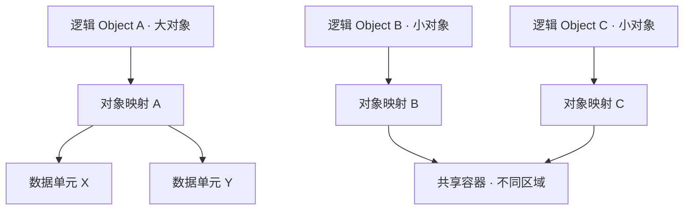

# Object Model：对象身份、内容与底层布局

对象存储首先回答一个问题：**应用用什么名字找到哪一份数据，而不需要知道数据在哪块盘上？** 理解这个契约，才能正确理解覆盖写、列举和读写路径。

本文讨论常见的 Bucket / Key 对象模型，并用 Amazon S3 的 general purpose bucket（通用桶）说明具体语义。不同产品可以扩展接口；这里不将某种产品实现当成对象存储的统一标准。

## 1. Bucket / Object / Key 为什么要分开？

假设应用保存一份月度报告：

```text
Bucket: reports
Key:    monthly/2026-10/summary.json
Data:   {"total":100}
```

Bucket 提供对象所属的命名空间和管理边界；Key 是这个空间内的名字；Object 是该名字当前对应的内容与属性。相同 Key 可以出现在不同 Bucket 中，因此只记录 Key 通常不足以完整定位对象。

| 概念 | 回答的问题 | 不应混淆的对象 |
| --- | --- | --- |
| Bucket | 对象属于哪个命名空间与策略边界？ | 不必对应单独的磁盘、目录或存储池 |
| Key | 用哪个名字寻址对象？ | 不必是文件路径，也不必等于内容哈希 |
| Object Data | 保存了哪些字节？ | 不等于 Key，也不等于某个物理文件 |
| Metadata | 如何描述、管理和解释对象？ | 不等于对象正文中的业务字段 |
| Version | 同一个名字的哪一次可寻址状态？ | 不等于内部副本数量或布局编号 |

**AWS S3 契约：**通用桶的 Key 命名空间是扁平的。`monthly/2026-10/summary.json` 中的 `/` 是 Key 的一部分；Prefix 与 Delimiter 可以组织出类似目录的列举视图，但不因此产生文件系统目录层级。参见 [AWS：Naming Amazon S3 objects](https://docs.aws.amazon.com/AmazonS3/latest/userguide/object-keys.html)。

这样设计使对象寻址不必依赖逐层目录解析，也便于按 Key 做路由与分区。但代价是应用不能仅凭名字包含 `/` 就假设存在目录锁、目录原子重命名或目录权限继承。命名方便组织数据，不自动带来文件系统语义。

在示例中，将所有 `monthly/2026-10/` 对象改名，不是修改一个目录项就能完成的事务。若业务需要“整批内容一起切换”，必须另行设计发布协议；本章只建立这一边界。

## 2. Object Data 与 Metadata 分别解决什么问题？

Data 是不透明的字节序列。报告可以是 JSON，也可以是图片或压缩包；对象服务无需理解 `total` 字段的业务含义，就能保存和返回这些字节。

Metadata 描述对象。它使系统和客户端不必读取全部 Data，也能回答“多大、什么格式、哪个状态、能否使用已有缓存”等问题。

| 层次 | 示例 | 作用 |
| --- | --- | --- |
| 系统定义的对象属性 | 长度、修改时间、Content-Type、ETag | 支持协议、对象管理和客户端判断；其中有的由系统生成，有的允许用户指定 |
| 用户定义的元数据 | `x-amz-meta-report-type: monthly` | 随对象保存应用自定义描述 |
| 系统内部元数据（架构模型） | 数据位置、布局标识、提交状态 | 支持寻址与状态管理，通常不直接作为用户元数据暴露 |
| 正文中的业务数据 | JSON 中的 `total` | 由应用解析和解释，不能自动当作对象索引字段 |

**AWS S3 契约：**本文的 user-defined metadata 指上传时通过 `x-amz-meta-*` 保存的键值属性。这类属性不能上传后直接逐字段原地修改；修改需要通过带新元数据的对象替换 / 复制操作完成。不要将这一限制推广到所有对象属性或所有独立附属接口。参见 [AWS：Working with object metadata](https://docs.aws.amazon.com/AmazonS3/latest/userguide/UsingMetadata.html)。

Data 与 Metadata 的职责不同，并不意味着它们必须位于两个独立服务。实现可以将二者一起存储，也可以用索引引用数据单元。对应用更重要的是：一次读取得到的长度、属性和字节是否属于同一个对象状态。

**通用架构推导：**如果新 Metadata 已可见，但它引用的数据尚未准备好，客户端可能看到不存在的位置或错误长度。若新数据已写入而 Metadata 未发布，数据可能尚不能通过 Key 访问。这是后续读写路径必须处理的协调问题。

Metadata 也不是免费的业务数据库。它有大小和查询方式的约束；保存一个 `report-type` 属性，并不意味着标准 LIST 可以按它任意检索。需要复杂查询时，应先明确哪些索引由对象接口承诺，哪些需应用另行维护。

## 3. 同一个 Key 被覆盖，还是同一个对象吗？

名字可以不变，内容却已经变了。把 Key 当作永久内容身份，会导致缓存、断点读取与业务引用指向意料之外的数据。

继续使用同一个 Key：

| 时刻 | 发生的操作 | Key 的默认读取结果 |
| --- | --- | --- |
| T1 | 写入内容 A：`{"total":100}` | A |
| T2 | 写入内容 B：`{"total":120}` | B（假设覆盖已成功，且无后续写入） |

这里的 A / B 是内容状态标签，不是实际 AWS Version ID。未开启版本保留时，不能因为我们在解释中称它们为两个状态，就假设客户端仍能通过接口读到 A。

**AWS S3 契约：**Bucket 开启 Versioning 后，每次写入会生成 Version ID；默认 GET 读取当前版本，指定 `versionId` 可以定位特定版本。本文只介绍身份概念，不展开版本开启、暂停或历史删除机制。参见 [PutObject](https://docs.aws.amazon.com/AmazonS3/latest/API/API_PutObject.html) 与 [GetObject](https://docs.aws.amazon.com/AmazonS3/latest/API/API_GetObject.html)。

从寻址角度，可分别理解：

- `(Bucket, Key)`：当前名字对应的状态，可以随覆盖改变。
- `(Bucket, Key, Version ID)`：在支持版本寻址的接口中指定一个版本；它也可能因后续显式删除而不可读。
- 内部 generation / layout ID：实现为协调写入或定位数据使用的标识，不应直接等同于 API Version ID。

### ETag、Version ID 与校验值为什么不能混用？

ETag 用于资源状态验证和条件请求；Version ID 用于版本寻址；Checksum 用于校验数据完整性。三者用途不同。AWS 文档明确说明 ETag 是否等于对象数据的 MD5 取决于写入与加密等条件，不能普遍假设相等。参见 [AWS 对象元数据说明](https://docs.aws.amazon.com/AmazonS3/latest/userguide/UsingMetadata.html)。

工程上应把 ETag 当作接口返回的验证值使用，而不是自行从名字或正文推导。AWS 明确说明 ETag 反映内容变化，不反映元数据变化，参见 [Object API 的 ETag 说明](https://docs.aws.amazon.com/AmazonS3/latest/API/API_Object.html)。它也不保证标识每一次写入；相同内容的两次写入可能有相同 ETag，却具有不同 Version ID。需要精确引用历史版本时，不要用 ETag 替代 Version ID。

## 4. 为什么一个 Object 不等于一个底层文件？

对象是接口上的访问单元，内部存储单元是实现为容量、I/O 与调度选择的组织方式。二者可以一对一，也可以一对多或多对一。

**通用示意，非某个产品实现：**一个对象可能拆成多个内部数据单元；多个小对象也可能共用一个容器的不同区域。这里的“数据单元”不是 Multipart Upload 的上传分片，也不指定任何编码方案。



这种解耦允许系统迁移物理位置或优化小对象布局，同时保持 Bucket / Key 不变。应用只依赖逻辑身份，不必随着设备变化更新引用。

代价是系统必须维护映射，并在读取时定位正确区域、拼接字节、校验数据和控制放大。小对象可能不只消耗其正文大小，还消耗索引、对齐和请求处理成本；大对象则可能需要多个数据单元协同读取。

因此，不能用“一个对象对应一个 inode”或“PUT 就是往单文件写入”推导所有对象系统的性能与故障行为。对象可见状态与底层单元状态的协调见[读写路径](03-read-write-path.md)；冗余布局留给[数据保护专题（目前为骨架）](../07-data-protection/README.md)。

## 5. 对象、文件与块的关键差别是责任边界

| 维度 | 对象模型（以本章 S3 范围为例） | 文件模型（以典型文件系统接口为例） | 块模型 |
| --- | --- | --- | --- |
| 寻址 | Bucket / Key，可选 Version ID | 路径与文件句柄 | 卷与逻辑块地址 |
| 更新粒度 | 完整对象替换 | 按偏移读写，具体原子性取决于接口 | 按块或块范围读写 |
| 命名空间 | Key 与 Prefix | 目录、文件及其关系 | 通常不理解文件名字 |
| 应用通常依赖的语义 | 对象级读写、条件判断、列举 | 打开、重命名、权限、共享访问等 | 写入顺序、持久化与块访问 |
| 上层承担的责任 | 复杂查询、跨对象协调、业务发布 | 应用仍需处理事务与并发 | 文件结构、业务索引或数据库语义 |

对象的 Range GET 可以读取部分字节，不意味着对应存在任意偏移的原地写接口。类似地，文件支持按偏移写，也不意味着所有文件系统都提供整文件原子替换。比较时要逐项检查契约，而不是只比较外观看起来都能保存“一个文件”。

修改报告中的 `total` 字段时，文件接口可能更新一个范围；本章范围内的 S3 PUT 则提交完整新正文。后者简化对象级状态边界，但可能增加写入流量。选择模型时，应看访问模式、更新频率和需要的协调能力。

## 阅读衔接与来源

本篇建立了“名字、当前状态、可选版本、正文、元数据和底层布局”的区别。下一篇用同一个报告说明操作如何改变这些状态：[S3 Core Semantics](02-s3-core-semantics.md)。通用一致性、索引与分区问题见[08 专题（目前为骨架）](../08-consistency-metadata-partitioning/README.md)。

AWS 来源核对日期：**2026-10-02**。本文中的 AWS 结论以链接文档为准，内部映射与布局图为通用示意。

[章节入口](README.md) · [下一篇：API Semantics](02-s3-core-semantics.md)
