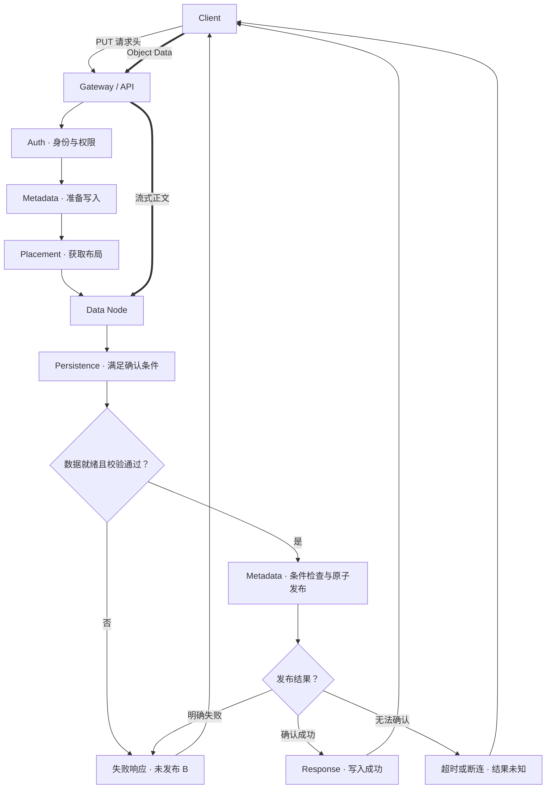
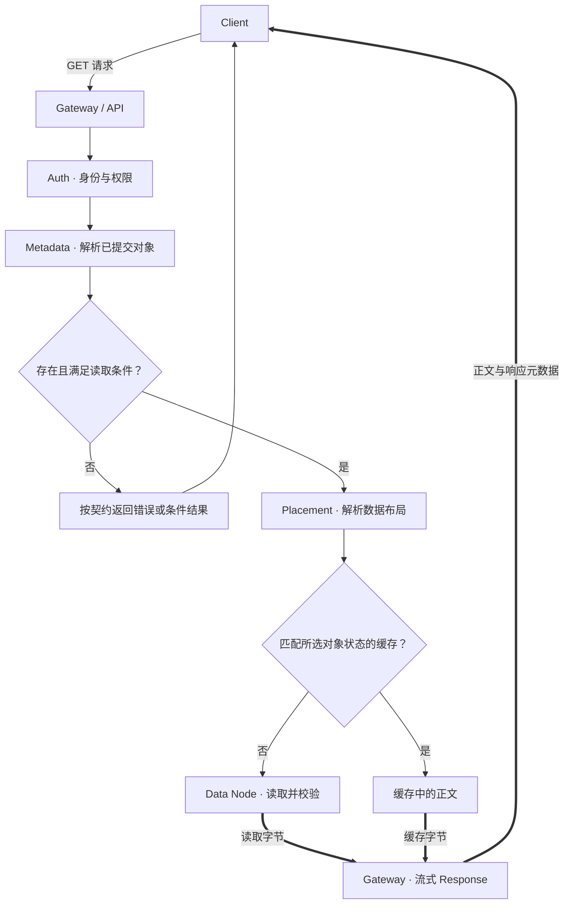

# Read / Write Path：从请求到可读状态

[API Semantics](02-s3-core-semantics.md)说明了对象接口应承诺什么。本篇追问：**系统需要完成哪些工作，才能把这些承诺变成一次可靠的 PUT / GET？**

以下是通用的逻辑架构模型，采用网关代理正文传输、写入准备后发布元数据的示意路径。它不是 AWS S3 内部架构说明，也不要求所有对象存储都有独立 Gateway、Metadata Server 或固定的持久化顺序。

## 1. 先区分职责，避免把每个框都当作一个服务

逻辑上可以沿着 Client → Gateway / API → Auth → Metadata → Placement → Data Node → Persistence → Response 理解一次写入。实际系统可能合并、并行或重复部分步骤；GET 也不需要重新持久化对象才能响应。

| 职责 | 核心工作 | 需要理解的边界 |
| --- | --- | --- |
| Client | 选择对象、构造请求、传输字节、处理响应 | 超时后可能不知道提交结果 |
| Gateway / API | 解析协议、路由、处理连接与响应 | 网关收到正文不等于对象已经提交 |
| Auth | 验证身份并判断是否允许此操作 | 身份合法不等于拥有 Bucket / Key 的读写权限 |
| Metadata | 管理对象身份、可见状态、属性和数据引用 | 不应将未就绪的数据引用公开成完整对象 |
| Placement | 决定或解析数据归属与布局 | 可能是算法、缓存或元数据字段，不必是远程服务 |
| Data Node | 接收 / 读取实际数据单元 | 接收完毕与达到持久化条件是不同事件 |
| Persistence | 达到系统规定的持久与确认条件 | 条件依赖系统配置和故障模型，不等于固定的某个 `fsync` 调用 |
| Response | 返回状态、属性及必要的正文 | 服务提交和客户端收到响应之间仍可能有故障 |

Auth 可能需要先加载 Bucket 策略或对象属性，Metadata 访问可能隐含路由，Placement 也可能直接从 Key 计算。上表表达职责，而不是强制的 RPC 顺序。

## 2. Metadata / Control Path 与 Data Path 的区别

**Metadata / control path** 传递身份、权限、路由、条件检查、布局与状态提交等信息，回答“可否操作、操作哪份状态、数据在哪里”。这里的 control path 指请求中的控制信息，不等于所有管理面的配置操作。

**Data path** 传递实际正文，回答“哪些字节从哪里到哪里”。在本篇模型中，PUT 正文经过 Client → Gateway → Data Node；GET 正文沿相反方向返回。

两条路径逻辑上分离，但不能独立兑现对象契约：路由错误会使正确字节写到错误归属；数据未就绪而元数据已发布会使对象不可读。小对象可能主要受控制路径延迟影响，大对象更容易受正文传输、内存复制和设备吞吐影响。

这也说明为什么优化不能只看磁盘带宽。若每次请求需要多次串行查索引，即使设备很快，首字节延迟仍可能很高。详细性能方法留给[09 数据路径与性能专题（目前为骨架）](../09-data-path-performance/README.md)。

## 3. PUT：数据就绪与状态发布如何配合？

继续示例：`reports/monthly/2026-10/summary.json` 从 A 更新为 B。下面图中细实线表示控制和状态推进，粗线表示正文传输；回到 Client 的细线只表示写入响应。准备状态和发布步骤都是示意。

图中正文箭头不意味着允许未授权请求写入；身份与权限判定、流量接收和数据分配之间需要实现自己的控制。接收请求头与接收正文也可以流水化，不必先把整个对象放入网关内存。

### 第一步：解析对象身份与操作条件

Gateway 确定 Bucket、Key、声明的属性和 `If-Match` 等条件；Auth 判断请求者是否有权限。协议错误、权限失败或确定的前提失败应阻止对象被发布。

客户端自定义的 Metadata 与系统内部写入状态是两类信息。请求带来的属性不能自行决定其内部提交身份或数据位置。

### 第二步：准备一个尚未对读者公开的新状态

示意实现为 B 准备数据引用和布局。在 B 未完整就绪前，Key 仍指向已提交的 A。准备过程可以记录任务身份或暂存位置，但这不意味着客户端已经能 GET B。

这个分离解决“覆盖过程中如何保留完整旧内容”的问题。代价是系统要追踪准备中、已提交等状态，并能在故障后识别未完成工作。

条件判断不能只在准备时检查一次。如果准备期间另一写者发布了 C，最终发布 B 时必须按接口契约再次约束状态，或采用等价的原子协议；否则先读 ETag、后覆盖仍会发生竞争。

### 第三步：定位、传输与持久化

Placement 确定目标布局；Gateway 将正文流式传给数据节点。实现可能做长度检查、数据校验、加密等处理，但处理的顺序和职责归属需要由具体系统定义。

关键区别是：进入网关缓冲区、写入节点内存、落到某个持久层、满足配置规定的确认条件，是不同事件。不能看到“数据节点 ACK”就默认所有系统都有相同的数据保护承诺。

一些系统将日志作为持久依据，另一些系统依赖其他持久化组织方式；这里不规定同步落盘到几块设备，也不展开副本或编码算法。确认条件与故障域的关系留给[07 数据保护专题（目前为骨架）](../07-data-protection/README.md)。

### 第四步：发布对象状态，再返回成功

在本篇示意中，数据达到要求后，系统将 Key 的可见引用从 A 切换为 B，并使正文、长度及相关对象属性属于同一个已提交状态。Metadata 本身也需要达到系统的恢复要求，不能只在临时内存里切换引用就宣称完成。

“先准备、后发布”有助于理解单对象完整可见性，但不是规定所有系统必须执行两次元数据 RPC。等价实现可能把日志、索引和数据提交组织在其他结构中。

AWS 的公开 API 保证成功 PUT 和单 Key 原子更新，公开文档并未因此公开其内部提交协议。该区别见 [PutObject](https://docs.aws.amazon.com/AmazonS3/latest/API/API_PutObject.html) 与 [AWS consistency model](https://docs.aws.amazon.com/AmazonS3/latest/userguide/Welcome.html#ConsistencyModel)。

## 4. PUT 中途故障：先看提交边界，再看客户端响应

下表仍是上述架构模型的故障推导。A / B 仅代表内容状态，且假设没有其他并发更新：

| 故障位置 | 此模型中的对象可见状态 | 客户端与服务端需要区分的事情 |
| --- | --- | --- |
| 授权或准备失败 | A 保持可见；首次创建则仍不存在 | 请求还没有产生新的已提交对象 |
| 正文只传了一部分 | B 不可见 | 有临时字节，不代表有完整新对象 |
| 数据已就绪，最终发布明确失败 | A 保持可见 | 底层有 B 的字节，不代表 Key 已引用 B |
| 发布请求超时或执行节点崩溃 | 结果需要判定，不能仅凭超时断言 A 或 B | 服务内部也可能需要恢复记录来确定是否提交 |
| B 已发布，成功响应丢失 | B 已可见，但客户端未知 | 不应回滚一份已承诺给其他读者的状态来“配合超时” |

这解释了上一篇重试示例的根源：提交点与响应送达不是同一事件。系统需要可恢复的提交判定，客户端则需要按 API 和业务状态判断能否重试。

本轮只说明这些约束，不展开未引用数据的回收流程或故障恢复协议。进一步问题链接到[08 一致性与元数据](../08-consistency-metadata-partitioning/README.md)和[10 故障恢复专题](../10-recovery-operations-observability/README.md)，两者目前仍为骨架。

## 5. GET：先解析已提交状态，再取得属于它的字节

GET 不是逐步反向执行 PUT。它需要解析已提交对象身份及布局，再从正确位置读数据；它不需要重新创建对象或执行一次写入提交。

下图仍采用网关代理正文的示意架构。缓存仅用来展示可能的分支；它可以位于客户端、网关或节点，也可以完全不存在。

### 解析身份：当前 Key 与指定版本是不同的请求

当前 Key 的 GET 解析当时符合一致性契约的可读状态；指定版本的 GET 则解析对应版本。读路径应将后续布局与字节绑定到选中的对象状态，而不是每读一个内部单元都重新查“最新 Key”。

例如读取 A 的前半段后发生覆盖 B，如果下一单元突然切到 B，会破坏单次读取的完整对象边界。示意实现可以使用稳定的数据引用或内部 generation，具体方式不是 API 标准的一部分。多个独立 Range 请求的协调仍是客户端需要处理的问题。

### 定位字节：布局不是正文，缓存也不是绕过语义的许可

Placement 可能从 Metadata 取得引用，也可能用算法解析数据归属。只要结果能定位选中的状态，就不必有一个名为 Placement 的独立网络服务。

缓存应满足这次读取的身份、条件和可见性要求。不能因 Key 相同就忽略已成功的覆盖或删除；需要校验、失效或其他符合契约的机制。缓存可以节省数据读取，也会带来状态管理成本。

### 返回数据：开始响应不等于客户端已收齐对象

读取通常可以按数据单元流水化，边读、边校验、边返回，无需先缓存完整对象。校验发现的问题必须按协议处理，不应把损坏字节当作正常对象返回；具体校验粒度与失败处理取决于实现。

若 HTTP 成功头已经发出，后续正文传输中断，系统通常不能再把同一响应改成另一种 HTTP 状态码。客户端因此仍要检查响应体是否完整及必要的完整性信息。GET 的对象原子性，不等于网络传输不可中断。

## 6. 三篇文章如何对应起来？

| Object Model | API Semantics | Read / Write Path 中需要兑现的职责 |
| --- | --- | --- |
| Bucket / Key 是逻辑寻址 | PUT / GET 操作指定名字 | 解析身份、鉴权、路由与布局 |
| 内容与属性属于某个状态 | 完整 PUT、单 Key 原子读取 | 数据就绪与元数据发布协调 |
| 当前名字与具体版本不同 | 覆盖与版本寻址的边界 | 将读取绑定到所选状态 |
| ETag 是验证值 | 条件写与条件读 | 在正确的提交 / 读取边界判断条件 |
| 逻辑对象不同于底层单元 | API 返回逻辑操作结果 | 控制内部单元、持久化、拼接和响应 |

读完这条知识链，应能沿着一个问题继续追踪：**应用期待哪个对象状态、API 对这个状态做了什么承诺、系统需要完成哪些工作才能兑现承诺？** 更深入的冗余、索引、分区和恢复机制留给对应专题。

AWS 接口来源核对日期：**2026-10-02**。本文流程图、准备 / 发布模型和故障表是通用示意及工程推导，不描述 AWS 内部实现。

接下来把一次上传拆成会话内的准备与最终提交：[Multipart Upload](04-multipart-upload.md)。上传 Part 与内部单元不是同一种身份；这也是后续版本和布局章节的连接点。

[上一篇：API Semantics](02-s3-core-semantics.md) · [章节入口](README.md) · [下一篇：Multipart Upload](04-multipart-upload.md)
