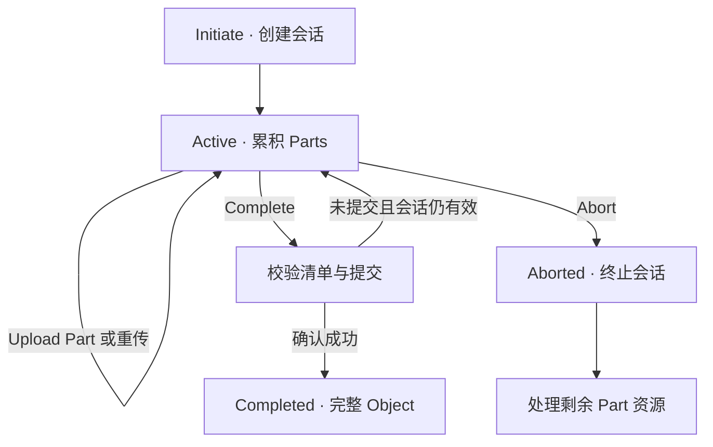

# Multipart Upload：上传会话与对象发布

[Read / Write Path](03-read-write-path.md)区分了数据准备和对象发布。Multipart Upload 将这一边界暴露为多个 API：客户端可以分批准备正文，最后提交一个完整对象，而不是每上传一段就产生一个普通对象。

**适用范围：**具体 API 行为以 Amazon S3 **general purpose bucket** 为准，默认 Bucket 从未开启 Versioning、权限完整、无并发同 Key 更新；例外单独标注。本文不描述 S3 内部数据布局，也不提供 CLI 操作教程。AWS 来源核对日期：**2026-10-02**。

## 1. 为什么不把失败的大对象上传从头再来？

假设月度报告还包含一个 128 MiB 的归档：`reports/monthly/2026-10/archive.bin`。传到末尾时连接断开，如果只能使用一次完整上传，请求重试可能重新发送大量已经传过的字节。

Multipart 的思路是将传输组织成可独立完成的 Part，再通过最终提交确定对象。Part 可以并行、乱序上传，失败时只重传相关 Part；最终正文的顺序由 Part Number 决定，而不是网络请求完成顺序。参见 [AWS：Multipart upload overview](https://docs.aws.amazon.com/AmazonS3/latest/userguide/mpuoverview.html)。

它解决的是传输并行与局部重试，不是对象局部原地修改。工程代价包括更多请求、客户端 Part 清单、未完成会话管理，以及“Part 已上传”和“Object 已提交”两层结果判定。

## 2. Initiate / Upload Part / Complete / Abort 改变什么状态？

Initiate 对应 AWS `CreateMultipartUpload`。返回的 **Upload ID** 标识一次会话；后续请求还需指定 Bucket、Key，以及必要的 Part Number。为同一 Key 发起两次上传，会得到两次独立会话，不是自动续传同一任务。参见 [CreateMultipartUpload](https://docs.aws.amazon.com/AmazonS3/latest/API/API_CreateMultipartUpload.html)。

| 操作 | 上传会话层面的变化 | 普通对象接口的可见状态 |
| --- | --- | --- |
| Initiate | 建立会话，保存上传相关参数 | 不发布新对象；若已有 A，仍读取 A |
| Upload Part | 为会话的一个 Part Number 保存正文与返回信息 | Part 成功不等于新 Object 可 GET |
| Complete | 校验提交清单并构建完整对象 | 确认成功后发布对象；存在并发时需另行判断当前状态 |
| Abort | 终止未完成会话并处理 Part 资源 | 不删除原有 A，也不是对已完成对象执行 DELETE |

表中普通读取状态假设没有其他写者，提交失败不等于会话必然仍可使用。概念性状态图如下；不是 AWS 内部状态字段：

“客户端结果未知”不是图中的一种对象状态：它表示客户端尚不能确认服务实际停在哪个状态，不能直接沿图当作失败重试。

## 3. Part 已经占用资源，为什么 Complete 前仍不是 Object？

**AWS API contract：**对象由成功完成的 Multipart Upload 构建。Complete 使用客户端提供的 Part Number / ETag 清单，按 Part Number 升序拼接；最终对象关联发起上传时提供的对象元数据。参见 [CompleteMultipartUpload](https://docs.aws.amazon.com/AmazonS3/latest/API/API_CompleteMultipartUpload.html) 与 [Multipart overview](https://docs.aws.amazon.com/AmazonS3/latest/userguide/mpuoverview.html)。

Part 是会话内的准备资源，没有独立的普通 Bucket / Key 对象身份。新 Key 尚无已提交对象时，上传若干 Part 不会使普通 GET 读到“目前上传的前半段”；旧对象 A 存在时，也不会被准备中的正文逐段替换。

`ListParts` 和 `ListMultipartUploads` 用来观察上传资源，不能把它们等同于普通对象的 LIST。前者回答一次会话有哪些已完成 Part，后者观察未完成会话；参见 [ListParts](https://docs.aws.amazon.com/AmazonS3/latest/API/API_ListParts.html) 与 [ListMultipartUploads](https://docs.aws.amazon.com/AmazonS3/latest/API/API_ListMultipartUploads.html)。

**通用工程推导：**准备资源和公开对象分离，使应用不会误读半成品，也允许上传暂停。代价是系统必须同时管理对象命名空间和上传会话；只统计正常 LIST 的对象数量，不能完整解释上传资源占用。

## 4. Part retry 是替换会话槽位，不是追加对象版本

**AWS API contract：**同一会话内，上传相同 Part Number 会覆盖此前该编号的 Part。Part Number 既标识槽位，也指定其在最终正文中的顺序。参见 [UploadPart](https://docs.aws.amazon.com/AmazonS3/latest/API/API_UploadPart.html)。

用两个 64 MiB Part 上传归档，示意过程为：

| 时刻 | 操作 | 会话中已确认的 Part |
| --- | --- | --- |
| T1 | Initiate，得到示意 Upload ID `uA` | 空 |
| T2 | 上传 Part 2，返回示意 ETag `e2` | `2 → e2` |
| T3 | 上传 Part 1，返回 `e1` | `1 → e1, 2 → e2` |
| T4 | 用修改后的字节重新上传 Part 2，返回 `e2b` | `1 → e1, 2 → e2b` |
| T5 | Complete 提交 `(1,e1), (2,e2b)` | 形成 Part 1 加新 Part 2 的完整正文 |

`uA / e1 / e2b` 是解释用标签，不是实际 AWS 返回值。这里没有三个 Object Version；T4 替换的是准备资源，T5 才产生完整对象。

AWS 要求客户端保存上传返回的 Part Number 与 ETag，形成自己的完成清单，不应直接把服务端列举结果当作业务提交清单。参见 [Multipart listings 注意事项](https://docs.aws.amazon.com/AmazonS3/latest/userguide/mpuoverview.html)。

**重试推导：**相同槽位重传相同字节，可以降低失败上传的重传范围，但不提供“请求恰好执行一次”。不要让多个工作线程并发改写同一槽位，然后凭较早一次成功响应决定最终正文；完成时应使用客户端协调后确认的 Part 内容与返回信息。

客户端还需遵守 Part 大小、数量与校验模式的具体约束。本例使用连续编号；不将“允许乱序传输”扩展为“任何编号清单、校验方式都能完成”。本篇不展开校验算法或限额调优。

## 5. Complete 成功判断比单看 HTTP 状态更复杂

**AWS API contract：**Complete 请求的 Part 清单必须按编号升序，每项带对应 ETag；Part 不存在或 ETag 不匹配可能产生 `InvalidPart`，清单顺序错误可能产生 `InvalidPartOrder`。处理期间服务可以先发出 HTTP `200 OK`，随后在响应体中返回错误。因此必须解析最终响应体，或检查 SDK 的最终结果，不能仅凭响应头确认提交。参见 [CompleteMultipartUpload](https://docs.aws.amazon.com/AmazonS3/latest/API/API_CompleteMultipartUpload.html)。

这与上一篇 GET 正文中断的情况不同：这里即便响应体收齐，里面也可能明确表示提交失败。

| 客户端观察 | 可以确认什么 | 不应直接推断什么 |
| --- | --- | --- |
| 仅收到 HTTP 200 头 | Complete 已开始处理响应 | 新对象已经提交 |
| 收到明确的最终成功结果 | 本次上传已完成 | 在并发环境下它永远是当前对象 |
| 收到完整的明确错误 | 按错误处理本次请求 | 所有错误都能用同一种重试方式解决 |
| 连接断开，未取得最终结果 | 提交结果需要判定 | 必然没有产生对象 |

`NoSuchUpload` 表示指定会话不存在，可能是 ID 无效、已 Abort 或已 Complete，不能单凭这个错误判定先前的 Complete 失败。参见同一 [Complete API 的错误说明](https://docs.aws.amazon.com/AmazonS3/latest/API/API_CompleteMultipartUpload.html)。

超时后应核对预期对象或版本的业务身份，并结合会话结果判断，不能只看 Key 存在就认定是自己的上传。Complete 也支持条件请求；其条件冲突及重新上传要求应按 API 文档处理，而不是照搬普通 PUT 的重试流程。本篇不重复[核心语义中的条件写说明](02-s3-core-semantics.md)。

**并发与版本的 AWS 例外：**多个 Multipart 会话更新同一 Key 时，不能假定“最后完成的一次必为当前版本”。版本开启时，AWS 按较晚发起上传的时间确定这些会话对应版本的当前关系；未开启版本时，期间其他请求也可能改变最终可见结果。参见 [Concurrent multipart upload operations](https://docs.aws.amazon.com/AmazonS3/latest/userguide/mpuoverview.html)。下一篇建立版本状态模型，不将顺序执行示例误当成并发排序保证。

## 6. Incomplete upload 的资源生命周期

**AWS 产品行为：**Multipart 会话本身没有默认自动到期时间，已上传 Part 的存储会产生费用，需要 Complete 或 Abort。若配置了中止未完成上传的生命周期规则，另按该规则处理；这里仅指出可存在这一策略，不展开 Lifecycle Policy。参见 [Multipart overview](https://docs.aws.amazon.com/AmazonS3/latest/userguide/mpuoverview.html) 与 [CreateMultipartUpload](https://docs.aws.amazon.com/AmazonS3/latest/API/API_CreateMultipartUpload.html)。

Abort 不是给正常对象加 Delete Marker，也不能用来撤销已完成的对象发布。已完成对象的删除，需要转到对象或版本 API。

**AWS API contract：**Abort 与在途 Part 上传存在竞态，在途请求仍可能成功或失败；为了释放全部 Part 占用，可能需要再次 Abort，并按官方文档用 ListParts 验证。参见 [AbortMultipartUpload](https://docs.aws.amazon.com/AmazonS3/latest/API/API_AbortMultipartUpload.html)。

**工程推导：**取消任务应先协调上传工作者停止发起新请求，再处理在途请求、执行终止并验证资源结果。一次“任务取消”按钮成功，不能自动证明所有上传资源已经完成清理。应用进程崩溃后，丢失 Upload ID 也不是服务端释放资源的指令。

## 7. Multipart Part、Object Version 与 Storage Unit 的分界

| 概念 | 标识与作用范围 | 改变的事情 |
| --- | --- | --- |
| Multipart Part | Bucket / Key / Upload ID / Part Number | 会话内的传输准备内容 |
| Object Version | Bucket / Key / Version ID | 已提交对象的可寻址状态，下一篇展开 |
| Internal Storage Unit | 实现定义的单元 / 布局标识 | 正文在底层如何组织与定位 |

Part 大小与底层 chunk 大小没有必须相等的契约。服务可以重新切分、聚合或保留内部引用；Complete 的逻辑拼接也不证明服务必须将所有字节重新复制进一个物理文件。此处是通用模型推导，不声称 AWS 采用其中任何一种实现。

Multipart 解决传输准备与提交；Versioning 决定提交后保留哪些可寻址状态；[Object Layout](06-object-layout.md)讨论这些状态如何映射到内部单元。

[上一篇：Read / Write Path](03-read-write-path.md) · [章节入口](README.md) · [下一篇：Versioning / Delete](05-versioning-delete.md)
