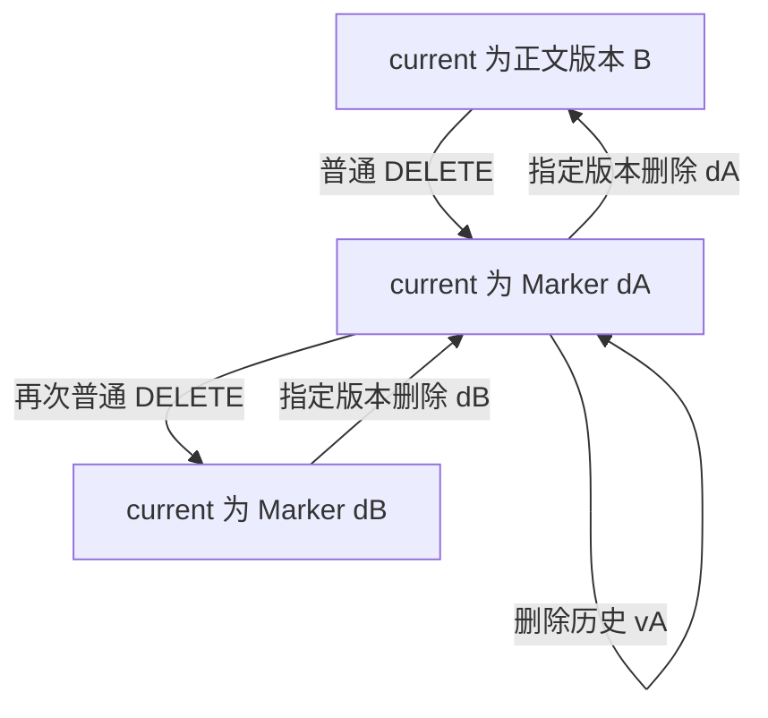

# Versioning / Delete：当前状态、历史版本与删除标记

[Multipart Upload](04-multipart-upload.md)说明了准备中的 Parts 何时成为完整对象。本篇转向提交之后：**同一 Key 下保留了哪些状态，普通读取选择哪一个，DELETE 又删除了什么？** 不重复基本对象定义，也不展开 Lifecycle 或 Garbage Collection。

**适用范围：**以 Amazon S3 **general purpose bucket、Versioning 持续 Enabled** 为主要模型，权限完整、不受额外删除保护限制、对象可直接读取。状态时间线均无并发修改，vA / vB / dA 等均为示意标识，不是实际 Version ID。AWS 来源核对日期：**2026-10-02**。

## 1. Current Object 不是历史集合中的另一个物理对象

在[对象模型](01-object-model.md)中，`(Bucket, Key)` 定位当前状态，带 Version ID 的请求定位具体版本。版本开启后，可以把一个 Key 理解为“多个版本记录，以及其中被选择为 current 的一个记录”。

这种描述是逻辑模型，不代表实现必须维护一个独立的 current pointer 服务。当前记录既可能是包含正文的对象版本，也可能是无正文的 Delete Marker；它不是在所有历史版本之外额外复制的一份“Current Object”。

**AWS API contract：**Version ID 由 S3 生成，是不能编辑的不透明字符串。版本开启前已存在的对象保留 `null` Version ID；开启后新写入获得各自的 ID。不能用字符串大小排序版本，也不能自行生成 ID 指定下一次 PUT。参见 [How S3 Versioning works](https://docs.aws.amazon.com/AmazonS3/latest/userguide/versioning-workflows.html)。

| 标识 | 能说明什么 | 不能说明什么 |
| --- | --- | --- |
| Key | 当前名字是什么 | 内容是否仍是之前读过的状态 |
| Version ID | 指定哪一份版本记录 | 内部块位置、可排序的业务序号 |
| ETag | 条件请求所使用的验证值 | 每次写入的唯一身份，或所有元数据变化 |
| Upload ID | 哪一次未完成上传会话 | 已提交对象的版本身份 |

Version ID 可以稳定指定一个尚未删除的具体版本，但“版本可寻址”不等于“版本永远不能删除”。特别是 `null` 版本，需要结合 Bucket 的版本状态判断，不能套用新生成 ID 的保留模型。

## 2. 覆盖写：替换 current 的含义，而不是消灭旧版本

继续报告示例：`reports/monthly/2026-10/summary.json`。

| 时刻 | 顺序操作 | 保留的版本记录 | 默认 GET |
| --- | --- | --- | --- |
| T1 | PUT A：`{"total":100}` | vA：A（current） | A |
| T2 | PUT B：`{"total":120}` | vA：A，vB：B（current） | B |
| T3 | GET，指定 `versionId=vA` | 不改变版本集合 | A |

**AWS 产品行为：**Enabled Bucket 的覆盖产生新版本，旧版本不被此次覆盖删除。并发写可以保留多个版本，但并不替业务决定哪个结果才是“正确的最终状态”。参见 [S3 Versioning](https://docs.aws.amazon.com/AmazonS3/latest/userguide/Versioning.html)。

保留旧内容解决误覆盖后的回看问题，也允许消费者明确引用某个版本。代价是版本正文、属性和版本枚举的持续管理成本，而不仅是当前对象的成本。

这里的时序表只描述依次完成的 PUT。并发 Multipart Upload 的当前版本关系具有前篇指出的发起时间规则，不能用“最后收到成功响应”代替所有接口的版本排序规则。

## 3. Delete Marker 为什么不是零字节文件？

**AWS API contract：**普通 DELETE（不带 `versionId`）在 Enabled Bucket 中插入 Delete Marker，使其成为当前记录。它拥有 Key 与 Version ID，但没有对象正文。参见 [DeleteObject](https://docs.aws.amazon.com/AmazonS3/latest/API/API_DeleteObject.html)。

在上面的 vA / vB 之后执行普通 DELETE：

```text
保留的记录：vA(A)、vB(B)、dA(Delete Marker)
current：dA
```

| 请求 | 在权限等前提满足时的 AWS 行为 |
| --- | --- |
| GET，不指定版本 | 当前为 Delete Marker，返回 404 与 `x-amz-delete-marker: true` |
| GET，指定 vB | 返回历史正文 B |
| GET，指定 dA | 不返回正文，返回 405 与 Delete Marker 相关响应头 |
| ListObjectsV2 | 不列出当前为 Delete Marker 的这个 Key |
| ListObjectVersions | 可以观察对象版本及 Delete Markers |

这些差异参见 [Working with delete markers](https://docs.aws.amazon.com/AmazonS3/latest/userguide/DeleteMarker.html) 与 [ListObjectVersions](https://docs.aws.amazon.com/AmazonS3/latest/API/API_ListObjectVersions.html)。权限不足仍可能先产生其他错误，不能用这张表替代鉴权与错误处理。

零字节对象则仍是有正文长度为零的正常对象，普通 GET 可以成功，LIST 也可以列出它。Delete Marker 表达的是默认名字视图下的删除状态，不是“空内容的替代值”。

## 4. 普通 DELETE 与指定版本 DELETE 的两个不同目标

**AWS API contract：**指定 `versionId` 的 DELETE 删除那一份版本或标记，不额外插入 Delete Marker；删除指定正文版本不可通过 Versioning 撤销。参见 [Deleting object versions](https://docs.aws.amazon.com/AmazonS3/latest/userguide/DeletingObjectVersions.html)。

下表是相互独立的例子，起点都为：vA(A)、vB(B)、dA(Marker)，current 为 dA。

| 请求 | 目标 | 结果 |
| --- | --- | --- |
| DELETE，无 `versionId` | 修改当前名字的默认可见性 | 新增 dB；dA、vA、vB 保留，current 为 dB |
| DELETE，`versionId=vA` | 删除历史正文版本 A | vA 移除；current 仍为 dA |
| DELETE，`versionId=dA` | 删除当前标记 | 若无其他标记或并发修改，vB 成为 current，B 再次默认可读 |

AWS 明确指出：current 已是 Marker 时，继续普通 DELETE 会再加一个 Marker，不是去掉已有 Marker。删除指定 Marker 才是在本例中重新暴露 B 的操作。参见 [Managing delete markers](https://docs.aws.amazon.com/AmazonS3/latest/userguide/ManagingDelMarkers.html)。



图假设 vB 仍存在且没有其他修改。删除 dB 后若下面还有 dA，默认 GET 仍是删除状态，不能把“删掉一个标记”理解成“无条件恢复正文”。

## 5. Logical visibility、Version existence 与 Physical existence

判断删除是否完成，必须先说明在哪个层次：

| 层次 | 问题 | 示例 |
| --- | --- | --- |
| 默认可见性 | 无 Version ID 的 GET 能否读到正文？ | current 是 Marker，默认正文不可见 |
| 版本存在性 | 指定 vB 是否还可通过 API 读取？ | vB 保留时仍可读；显式删除后不可读 |
| 内部物理存在性 | 数据区域是否已释放、覆盖或擦除？ | 由存储实现管理，不能从 API 响应推定介质处理时刻 |

**AWS 契约与通用推导的边界：**Versioning 保留正文版本是公开 API 状态；指定版本的永久删除意味着该版本不再由版本接口提供恢复能力，不意味着接口向客户端证明了每个底层单元的即时擦除。

如果正文版本仍保留，正常 LIST 看不到 Key 也不能当作“版本数据成为垃圾”的证据。即便版本已从 API 移除，实现仍可能有正在读取的引用、共享容器或其他回收约束。后一部分是通用布局问题，不描述 AWS 内部机制；[Object Layout](06-object-layout.md)进一步解释。

## 6. Versioning 如何改变 retry 和恢复的理解？

### 写入重试：可能保留两次成功产生的版本

顺序示例：PUT B 成功但响应丢失，客户端重新 PUT 相同 B，两个请求都完成时可能得到两个不同版本。内容相同不代表版本相同。保留旧版本降低了覆盖后丢失历史的风险，但不让请求自动变成 exactly-once。参见 [Versioning workflows](https://docs.aws.amazon.com/AmazonS3/latest/userguide/versioning-workflows.html)。

上一篇 Complete 的未知结果还需判定具体上传是否完成，不能将新建另一个会话当作无成本、无额外版本的续传。版本身份与上传身份应分别记录。

### 删除重试：默认视图相同，版本集合仍可能增加

普通 DELETE 超时后重试，可能增加另一个 Marker。应用看到同样的 404，不代表只执行过一次删除。指定 Version ID 的删除则固定目标；它不会因为同 Key 后来出现新版本，就自动转而删除新版本。

### 恢复：区分读旧版本与改变默认视图

读取 vA 是取得旧正文，不改变 current；移除一个特定 Marker 在条件满足时可以改变默认视图；将旧内容重新写回则创建新的版本。它们对版本集合的影响不同，应用要先确定恢复目标，不能统称为一个“回滚”。

上述恢复仅指对象 API 层面的状态选择，不展开分布式系统修复流程。若目标正文版本已被永久删除，Versioning 不能把它重建回来，参见 [Deleting object versions](https://docs.aws.amazon.com/AmazonS3/latest/userguide/DeletingObjectVersions.html)。

## 7. Enabled 模型的边界与生命周期代价

AWS Bucket 的版本状态包括 Unversioned、Enabled 和 Suspended。开启后不能回到从未开启的状态；暂停也不删除已有版本。参见 [S3 Versioning 的 Bucket 状态](https://docs.aws.amazon.com/AmazonS3/latest/userguide/Versioning.html)。

暂停后新写入使用 `null` Version ID，已有同 Key 的 `null` 版本可被覆盖，而先前非 null 版本保留。参见 [Adding objects to versioning-suspended buckets](https://docs.aws.amazon.com/AmazonS3/latest/userguide/AddingObjectstoVersionSuspendedBuckets.html)。因此“每次写入永久新增一个唯一版本”的本篇主模型仅适用于持续 Enabled 的情形；暂停下的完整删除规则不在本轮展开。

AWS 将各正文版本按完整对象而非前一版本的差分来计费；这属于产品计费与对象保留语义，不能据此证明底层是否复用物理数据。参见 [S3 Versioning](https://docs.aws.amazon.com/AmazonS3/latest/userguide/Versioning.html)。

**工程推导：**容量与保留决策需要区分 current、noncurrent、Delete Marker 和未完成上传资源。只删除默认名字或统计当前对象大小，会忽略不同生命周期状态的占用。

Lifecycle Policy 回答哪些版本何时到期；Garbage Collection 回答失去有效引用后如何安全回收。二者留在[章节后续规划](README.md)，本篇只建立状态边界，不预建空文章。

[上一篇：Multipart Upload](04-multipart-upload.md) · [章节入口](README.md) · [下一篇：Object Layout](06-object-layout.md)
