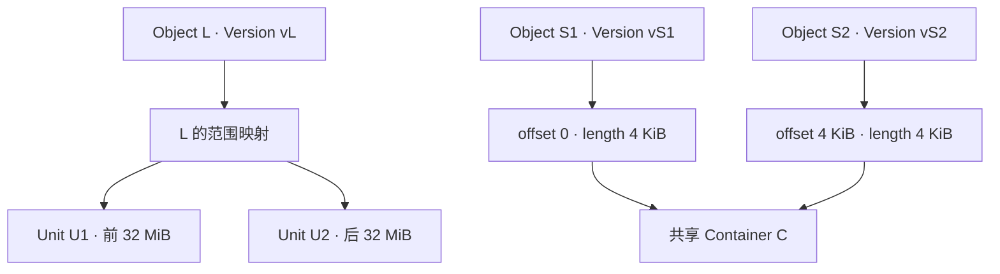

# Object Layout：逻辑对象与物理单元的解耦

前两篇区分了上传会话和对象版本。本篇讨论它们与内部布局的边界：**一份可读 Object / Version 的字节，如何组织成底层能分配、读取和管理的单元？**

本文全部采用通用架构模型、示意数字与工程推导，不描述 AWS 或其他产品的内部实现。Logical Object 与 Physical Storage Unit 的解耦首先是接口身份与物理布局职责的分离，不要求每个实现都部署独立映射服务，也不要求都使用相同分块或聚合策略。

## 1. 为什么不能把 Key 直接当成一个固定物理文件？

[Object Model](01-object-model.md)给出了映射的基本概念。这里进一步看动机：对象大小、更新频率和访问粒度由业务决定；设备 I/O、分配粒度和空间组织由存储实现决定，两者通常不匹配。

如果接口身份直接绑定一个固定设备位置，物理迁移或布局改变就可能迫使用户改变引用。如果强制一个对象占用一个独立大分配单元，极小对象会浪费空间；如果只使用很小的单元，大对象则可能产生过长的索引与大量 I/O。

解耦让 Bucket / Key / Version 的语义保持稳定，内部则按工作负载选择单元大小与组织方式。代价是映射元数据、寻址成本、状态协调和空间管理的复杂度。

## 2. Object → internal data units 的映射保存什么？

一种示意映射可以包含逻辑字节范围、单元标识、单元内偏移和有效长度。具体实现也可以使用规则计算、树形索引或其他形式；下表不是要求系统必须建立这样的数据库行。

| 逻辑身份 | 对象内字节范围 | 内部引用（示意） | 定位出的区域 |
| --- | --- | --- | --- |
| 大对象 L / 版本 vL | `[0, 32 MiB)` | Unit U1，offset 0 | U1 中的 32 MiB |
| 大对象 L / 版本 vL | `[32, 64 MiB)` | Unit U2，offset 0 | U2 中的 32 MiB |
| 小对象 S1 / 版本 vS1 | `[0, 4 KiB)` | Container C，offset 0 | C 的第一个 4 KiB 区域 |
| 小对象 S2 / 版本 vS2 | `[0, 4 KiB)` | Container C，offset 4 KiB | C 的另一个区域 |

图中的单元不是 Multipart Part，vL 也不是 Unit ID。多个对象共用容器中的不同区域，不意味着它们具有相同对象身份、权限或生命周期；大对象拆成多个单元，也不会自动产生多个用户可见 Object。

映射还必须与[读写路径](03-read-write-path.md)的发布状态协调。正文已写入并不代表引用已经提交；读某一版本时，不能因其他写者更改当前 Key 而混用另一版本的单元。

## 3. 大对象分块：控制操作粒度，但增加映射和调度

大对象拆成内部单元，可以限制单次 I/O 或内存处理粒度，支持不同范围的读取调度，也允许多个单元并行处理。它不要求客户端知道这些边界。

主要代价包括：

- 单元越小，映射项越多，查找、请求调度和校验开销可能越高。
- 顺序读取若需要过多小请求，吞吐可能受请求处理而非介质带宽限制。
- Range GET 若跨多个单元，需要定位、读取并拼接目标字节。
- 单元粒度过大则可能在小范围读取时带入大量不需要的数据。

例如示意的 32 MiB 单元，如果实现每次必须读满单元，应用只取 4 KiB 时会产生很高读放大。但支持子范围读取、缓存或其他布局的实现可能不付出同样成本；不能从单元大小单独推导实际读取量。

Multipart 的上传边界不规定这些内部边界。两个 64 MiB Part 完成一个 128 MiB 对象，内部可以按另一粒度组织；Complete 的逻辑拼接也不规定一定发生整对象二次复制。API 与实现的区别回看[Multipart Upload](04-multipart-upload.md)。

## 4. Small object problem：正文之外的固定成本

小对象问题通常不是“设备放不下小文件”，而是每个对象的固定管理与请求成本，相对于正文显得很大。

| 成本 | 为什么小对象更敏感？ | 聚合是否消除它？ |
| --- | --- | --- |
| 对象级 Metadata | Key、版本身份、属性、索引等不能只按正文大小缩放 | 通常仍要保留独立逻辑对象的记录 |
| 分配与对齐 | 小正文可能占用更大的分配范围 | 可以降低部分对齐浪费，但取决于布局 |
| 协议与请求处理 | 鉴权、查找、调度的固定开销占比上升 | 物理聚合不自动减少客户端的对象请求数 |
| 设备 I/O | 大量零散访问可能触发较多 I/O | 可改善局部性，也可能引入额外读取 |

示意：正文为 1 KiB，而相关索引和属性占 512 B，元数据与正文之比为 50%。这是说明固定成本的数字例子，不是某个产品的元数据实测，也不能直接作为完整的空间放大率。

小对象聚合将多个对象正文放到共享容器中，可能减少独立分配、文件或 I/O 的开销。但系统仍需要知道每个对象在哪里、多长、属于哪个版本，不能把“正文聚合”误当成“逻辑元数据合并成一个对象”。

故障时，如果某个映射指向错误偏移，系统可能读到邻接对象的字节。因此还需正确的长度、完整性与隔离约束。聚合改善布局效率，也扩大了共享容器管理的责任范围。

## 5. Read / Write / Space amplification 先定义分母

下面统一采用一次指定对象访问或固定测量窗口的示意口径，不包括本篇范围外的数据保护开销。不同系统与测试口径不一定相同，比较前要写清测量层次。

| 指标 | 本篇示意定义 | 需要注明的条件 |
| --- | --- | --- |
| Read amplification | 底层实际读取字节 / 应用实际需要的正文范围字节 | 是否含元数据读、预读、缓存命中与后台读 |
| Write amplification | 底层实际写入字节 / 本次 API 提交的正文字节 | 是否含日志、元数据、重试与后台重写 |
| Space amplification | 归属测量集合的实际占用 / 同一集合的保留正文大小 | 分配空洞、索引、版本集合与共享空间如何归属 |

**简单计算：**读取 4 KiB 正文却需读一个 64 KiB 聚合区域，仅此正文路径的 Read amplification 为 16。若能只读目标范围，或正文已缓存，实际值会不同。

**写放大示意：**一个 4 KiB 对象替换，如果实现只追加 4 KiB 新正文并更新小索引，正文布局成本较低；如果实现必须重写 64 KiB 容器，仅这次容器写入的比值就是 16。它们是两个可选实现，不是聚合的必然结果。

还要区分应用更新粒度与内部写放大：应用修改 4 KiB 业务数据，但按对象接口重新提交 128 MiB 完整正文，这首先是应用/API 层的更新粒度代价。不能把业务改动的 4 KiB 与一次 API 正文的 128 MiB 混用为同一指标分母。

版本保留也不能一律叫作垃圾空间。例如保留两份各 128 MiB 的合法版本，其保留正文为 256 MiB；只以当前 128 MiB 为分母会得到不同结果。应单独标记版本保留成本，再计算布局浪费。

## 6. Fragmentation：逻辑连续与物理连续不必一致

Internal fragmentation 指分配单元内部未被有效内容使用的空间，例如 1 KiB 正文独占 4 KiB 区域。External fragmentation 指可用区域被分散成空洞；能否有效使用这些区域取决于分配器与布局，并不是所有系统都要求连续大空间。

聚合容器也可能随着对象更新或删除出现局部空洞。若 S1 已不再被任何有效版本引用，而相邻 S2 仍存在，系统不能因为 S1 的逻辑删除就释放整个容器 C。

**通用工程取舍：**重写或整理容器可能改善空间利用率与局部性，却增加后台读写、临时容量需求与前台流量竞争；完全不整理又可能累积空洞。本篇只解释这些代价，不展开具体整理算法或 GC 调度。

## 7. Logical deletion 与 Physical reclamation 不是同一个事件

[Versioning / Delete](05-versioning-delete.md)区分了默认不可见和版本不存在。落到布局层，还要区分单元引用、分配器可用空间及介质擦除。

| 事件 | 可以理解为 | 不代表 |
| --- | --- | --- |
| current 成为 Delete Marker | 默认名字视图没有可读正文 | 所有历史版本已删除 |
| 某正文版本从接口移除 | 不再通过该版本 API 读取 | 内部单元立即全部可释放 |
| 某区域无有效保留引用 | 满足一项回收前提 | 所有在途读取和共享布局约束已解除 |
| 分配空间被回收 | 分配器可以再次使用该区域 | 原有字节已经按某种安全标准擦除 |

前两项是逻辑对象/版本语义；后两项为通用实现职责。不能仅根据 DELETE 的成功响应或正常 LIST 的结果，得出底层物理存在性与安全擦除结论。

如果仍有历史版本引用某区域，那是有效保留数据，不是单纯的回收延迟；如果上传尚未 Complete，Part 占用又属于另一类准备资源。三个状态的所有权和回收条件不能混用。

具体引用管理、回收安全和 Lifecycle 到期策略属于[章节后续规划](README.md)。本轮止于理解边界，不展开 GC 专题或系统恢复实现。

## 8. 大对象与小对象如何改变数据路径的成本重心？

| 访问模式 | 常见成本重心 | 需要同时检查的代价 |
| --- | --- | --- |
| 大对象顺序读写 | 正文吞吐、内存复制、网络与设备带宽 | 单元数量、并行度与拼接 / 校验成本 |
| 大对象小范围读取 | 精确寻址与读取粒度 | 预读、缓存和跨单元读取放大 |
| 大量小对象读写 | 对象级索引、鉴权、调度和 IOPS | 聚合后的额外读取、容器更新与空间空洞 |

这不是固定的性能结论：缓存、访问局部性、请求并发和实现选择会改变重心。应将正文大小、对象数量、Range 分布、元数据请求和实际 I/O 一起测量；方法留给[09 性能专题（目前为骨架）](../09-data-path-performance/README.md)。

至此，六篇形成了从接口到内部成本的链条：对象身份 → 基本操作 → 读写提交 → 分批上传 → 版本与删除 → 物理布局。数据保护只在[07 专题](../07-data-protection/README.md)后续展开；索引、分区机制只连接[08 专题](../08-consistency-metadata-partitioning/README.md)，不在本篇重复写正文
