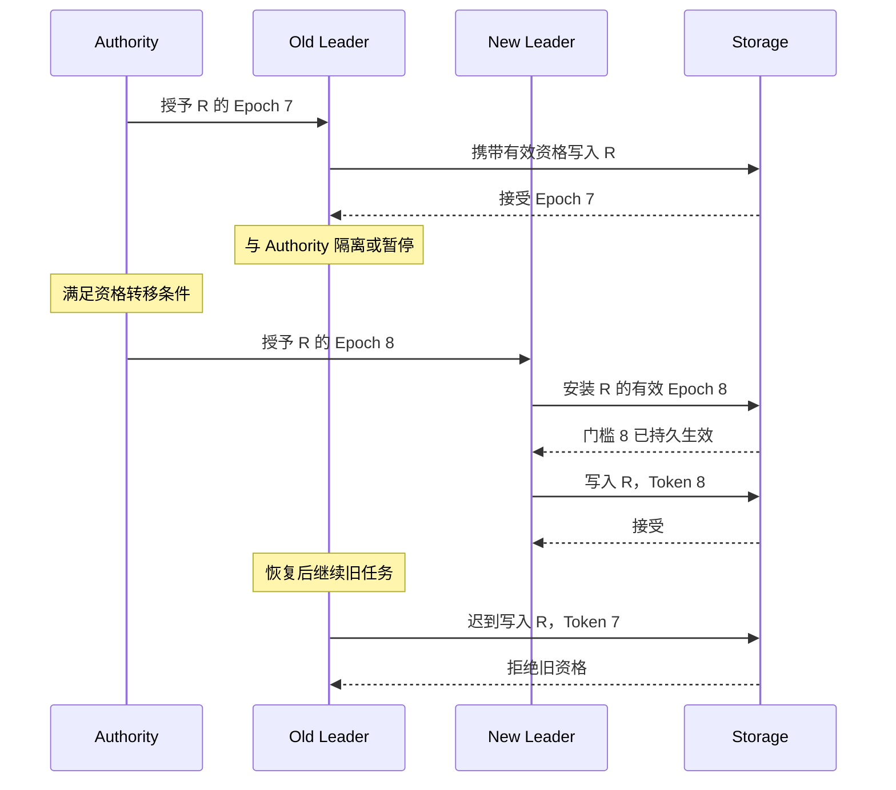

# Quorum / Leader / Lease / Fencing：谁现在有资格修改状态？

[Failure Model / Timeout](01-failure-model-timeout.md)说明“联系不上”不等于“已经停止”。如果旧写入者只是被隔离，新写入者又开始工作，系统如何避免两者同时修改同一资源？

本文采用通用协调模型，讨论资格授予、时效与资源侧检查。图中的 Authority 表示可靠的资格授予机制，不要求部署一个单机服务，也不指定选举协议；序号和操作均为示意，不是具体产品内部实现。

## 1. Quorum 的相交性质只是协调的一项条件

[Replication](../07-data-protection/01-replication.md)已经介绍 N / R / W、集合相交及 Write ACK。本篇不重复计算：相交使两个操作集合至少共享参与者，但**共享一个节点不等于该节点自动知道应接受哪次提议、哪位 Leader 或哪份提交状态。**

例如两个候选者分别从相交的参与集合得到响应。如果共同参与者没有“同一资格周期内不能同时授权冲突候选者”等协议约束，两个集合都相交也可能产生冲突授权。响应的持久化、旧周期状态如何处理，同样影响安全性。

| 概念 | 解决的问题 | 单独不足以说明什么？ |
| --- | --- | --- |
| Quorum | 哪些参与集合必须相交或达到门槛？ | 如何选择同一决定、处理旧消息及保存决定 |
| Consensus | 多个参与者如何在规定故障假设下形成相容的决定？ | 任意故障和网络条件下都能持续取得进展 |
| Write ACK | 此次数据写入是否达到配置要求？ | Leader 身份、完整对象提交或请求只执行一次 |

Consensus 通常需要约定决定的一致性、合法性以及在特定条件下的进展要求。Quorum 可以成为协议的一部分，但不是完整协议。**Quorum ≠ Consensus**，不意味着它们无关，而是不能只把“数够响应”当作已经解决协调。

Raft、Paxos、Viewstamped Replication、Zab 等属于可按需要继续学习的 Consensus Protocol；本篇不展开其日志、投票或算法步骤。有关应用一致性的正文留给[08 专题（目前为骨架）](../08-consistency-metadata-partitioning/README.md)。

## 2. Coordinator、Leader 与 Ownership 是三种描述

| 描述 | 本篇含义 | 需要明确的边界 |
| --- | --- | --- |
| Coordinator | 汇集一次请求、调度节点或收集结果的职责 | 不必拥有排他的修改资格，也不必是持久角色 |
| Leader | 在某范围、某资格周期内承担特定协调或排序职责 | 不必是整个集群唯一 Leader，资格可以转移 |
| Ownership | 对某资源执行受保护操作的当前资格 | 需要说明范围、持有者、有效条件与执行侧如何验证 |

一个 Leader 可以同时协调很多请求，一个普通请求 Coordinator 也可以把修改送给合法 Leader。不能仅凭组件名称，推断它拥有修改所有状态的资格。

Leader 状态之所以有用，是它可以集中某些决策、减少重复协调；代价是资格转移与旧请求处理必须严谨。**Leader ≠ 永久 Ownership。** 缓存中的 Leader 地址、旧的成功选举结果，以及多数节点暂时仍记得它，都不足以证明一条迟到写入此刻有资格执行。

## 3. Lease：让资格有期限，但期限需要协议支撑

Lease 是带有有效期限和续期规则的权利安排。它可以用于写入资格，也可以用于缓存或其他权利；本篇只讨论单个资源范围内的独占写入资格。

授予侧承诺在规定有效期内遵守排他规则，持有者需要按约续期，并在资格不确定或失效时停止受保护工作。若持有者崩溃，系统可在满足协议的到期条件后转移资格，避免必须等它主动释放。

**Lease ≠ Lock 的简单同义词。** Lock 描述访问排他或共享规则；Lease 描述权利的时间边界。锁可以采用租约管理有效期，租约也可以保护其他权利，二者并非互斥，但需要分别说明语义。

| 时间或执行条件 | 为什么影响 Lease？ |
| --- | --- |
| 时钟跳变或速率偏差 | 持有者与授予者可能对剩余时间形成不同判断；需要符合协议的计时与保守边界 |
| 续期响应延迟 / 丢失 | 授予侧可能已续期，持有侧却未知；不能因为发出了续期就自行延长资格 |
| 进程暂停或长时间排队 | “刚检查过 Lease”与真正发出操作之间可能已经跨过期限 |
| 写入消息在网络中延迟 | 发出时有效，不代表到达资源时仍有效 |

使用本地 elapsed / monotonic time 可以避免部分 wall-clock 跳变问题，但不能自行消除暂停、漂移或消息延迟。Lease 是否依赖同步时钟、速率上界或资源侧校验，要由实际协议说明；不能假设所有租约实现有相同条件。

## 4. Split Brain：两个执行者都认为自己有资格

Old Leader 与资格授予侧隔离时，可能仍能访问 Storage。另一侧在满足转移条件后选出 New Leader，而 Old 还持有旧缓存、旧任务或延迟消息。

Split Brain 在这里指对同一受保护范围出现不相容的资格认知或活动。两个进程都声称是 Leader，不必然造成破坏；危险在于资源仍接受两者冲突的修改。应约束**谁的效果可以被提交**，不能仅要求所有进程在任意瞬间都具有相同认知。

让旧 Leader 自觉停止很重要，但不充分。检查 Lease 后的暂停、旧包的延迟都可能绕过一次本地检查；改客户端路由也不能保证旧写入已消失。

## 5. Fencing：在资源侧拒绝旧资格

Fencing 指阻止不再合格的执行者继续影响受保护资源。常见方案是在资格转移时产生有序的 Fencing Token，操作携带 Token，Storage 或其他资源拥有者校验它，并拒绝旧周期操作。

以下采用一个明确的示意协议：同一资源 R 的每次资格授予得到更高 Epoch；Storage 持久维护 R 的准入门槛及持有者信息。**新 Leader 先在 Storage 安装 Epoch 8 并确认门槛生效，再开始受保护写入。** 资格授予已满足原协议的转移条件，图中不展开选举过程。

图中 Token 不是客户端随意选择的大整数。授予与校验机制必须使资源能够验证来源、持有者和资源范围，且新周期不会重用旧资格身份。

另一种常见方式是在资源第一次接受更高 Token 的写入时同步推进门槛。其区别是：**资源尚未得知新 Token 前，单凭选举已经产生更高 Epoch，不能保证它立即拒绝旧写。** 新旧写入的生效顺序与资格切换点必须由协议定义，不能把“New Leader 获得 8”和“所有资源已屏蔽 7”画成同一事件。

## 6. 一个 Token 要真正起作用，还缺哪些约束？

| 约束 | 若遗漏，会出现什么问题？ |
| --- | --- |
| 在正确范围内比较 | 不同资源的序号相互干扰，或某个分片仍接受旧资格 |
| 资源侧校验与效果提交协调 | 旧写先通过校验，暂停后跨过新门槛，再提交效果，形成检查与使用之间的竞争 |
| 门槛可恢复且不倒退 | Storage 重启后忘记 Epoch 8，重新接受 7 |
| 所有受保护路径都执行约束 | 常规写被拒绝，后台或旁路请求却继续产生旧效果 |
| 在途操作跨越切换点有确定规则 | 仅在入队时检查，不能解释已入队但尚未提交的旧写 |

“校验与效果提交协调”可由同一事务、串行执行门槛或等价机制实现，不要求一定用同一种存储 API。已经在新门槛生效前合法提交的旧效果，不会因 Fencing 自动撤销；需要排除的是不符合切换规则的后续效果。

在图中规则下，低于门槛的 Token 被拒绝；等于当前 Epoch、且持有者与其他条件合法的多个操作仍可以执行。Fencing 不要求每次写入都获得一个新 Epoch，也不负责把同一写入的两次重试合成一次。

Epoch / Term / Generation 常用于区分资格周期或状态代际，但名称不能替代语义：Term 未必就是可直接给所有外部资源使用的 Fencing Token，Generation 也可能只标识数据状态。[对象读写路径](../03-object-storage/03-read-write-path.md)中的数据 generation、S3 Version ID 与这里的写入资格，不应混为同一类身份。

**Fencing Token 是通用设计思想，不是统一产品接口。** 某些实现直接校验当前资格，某些采用有序门槛，还有系统使用其他隔离方式；应检查它真正阻止旧效果的边界，而不是要求所有系统都传同一种整数 Token。

## 7. 修改资格确定了，为什么仍要讨论 Retry？

一个携带合法 Epoch 8 的请求也可能已提交却丢了响应。New Leader 重发时，两次请求都具有合法资格；Fencing 不会告诉它哪次已执行，也不会阻止重复 Increment 或重复资源分配。

因此资格身份回答“谁可以修改”，Operation ID 回答“这是哪个逻辑操作”。两者都可能出现在同一请求中，作用不同。下一篇讨论[Retry / Idempotency / Deduplication](03-retry-idempotency-deduplication.md)。

## 来源与适用边界

- [Chubby 原始论文，OSDI 2006，第 2.4 节](https://static.usenix.org/events/osdi06/tech/full_papers/burrows/burrows_html/)：核对延迟请求、lock generation 与接收方检查 sequencer 的公开设计；本文未照搬其接口或参数。
- [Amazon Builders' Library：Leader election in distributed systems（官方 PDF）](https://d1.awsstatic.com/builderslibrary/pdfs/leader-election-in-distributed-systems.pdf)：核对资格期限、暂停和失联时的工程风险，不将其产品实现作为通用标准。

核对日期：**2026-10-02**。Epoch 7 / 8、门槛安装及资源检查表为明确限定的通用模型与工程推导；本篇不实现 Consensus Protocol，也不展开成员变更或元数据事务机制
