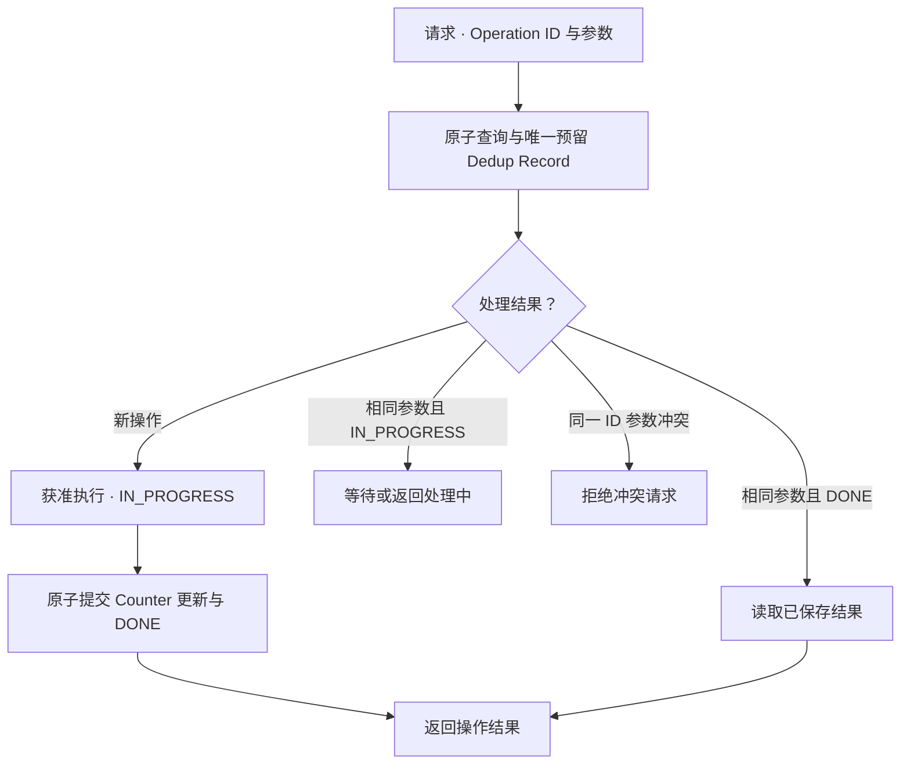

# Retry / Idempotency / Deduplication：不确定时重新执行会怎样？

[Failure Model / Timeout](01-failure-model-timeout.md)解释了 Unknown Result；[Coordination / Ownership](02-quorum-leader-lease-fencing.md)解释了当前修改资格。但合法执行者也会遇到响应丢失：**重新发出同一业务意图，究竟是补上一次未完成操作，还是再产生一次效果？**

本文采用通用请求与状态模型。Repair Task 只作为“创建任务记录”的例子，Storage Unit 只作为“分配资源”的例子，不展开修复执行、分配算法或消息队列。S3 的少量产品例外单独标注范围与官方来源。

## 1. Retry 增加尝试次数，不会自动消除 Unknown Result

暂时失联、过载或响应丢失，使客户端必须考虑 Retry。它可以让原本未到达的请求获得下一次机会，也可能让已经执行的操作再次执行。

应区分 **逻辑操作 O** 与 **传输尝试 A1 / A2**：A2 可以是 O 的重试，但服务端如果没有识别 O 的机制，就可能把 A2 当作独立新操作。

重试决策至少需要三个条件：操作契约允许怎样重复、失败是否确定未产生效果、当前业务意图和前提是否仍有效。参数错误或确定的前提失败，不应靠无限重发相同请求解决；结果未知也不应因为客户端给它贴了“失败”标签，就当作可无条件重做。

[S3 Core Semantics](../03-object-storage/02-s3-core-semantics.md)已经说明覆盖、删除和并发重建的重试风险；[Read / Write Path](../03-object-storage/03-read-write-path.md)说明了 Unknown Commit Result。本篇讨论可复用机制，不重复这些时间线。

## 2. Idempotency：重复效果的性质，先明确观察范围

Idempotent Operation（幂等操作）指在指定语义状态上，重复应用同一操作，与应用一次具有相同最终效果。例如将属性设为确定值、将指定记录置为不存在，比“递增一次”更容易具有这个性质。

但“最后正文都是 B”只是一个状态投影：修改时间、版本记录、计量或外部动作仍可能不同。**重复执行得到相同最终状态，不等于请求只执行了一次。** API 应明确承诺比较哪些效果，不能用一个字段相同替代完整契约。

幂等也不自动保护并发：一次设为 B 已经成功，随后别人设为 C，迟到的“再设为 B”仍可能把 C 覆盖回去。需要条件判断、稳定目标身份或其他业务协议，不是只给操作贴上 idempotent 标签。

## 3. 五类存储操作，为什么重复后果不同？

下表是通用示意。前两行按固定目标、固定参数、无其他写者，并仅比较所列逻辑状态；后三行先假设服务端没有去重机制。

| 操作 | 重复执行的后果 | 较合适的控制方式 |
| --- | --- | --- |
| PUT 同一确定状态 B | 当前正文仍可能为 B，但可能重复写入、生成属性或其他记录 | 明确接口幂等范围；并发场景增加条件；需要识别同一意图时使用受支持的 Operation ID |
| DELETE 同一固定目标 | 静态目标保持不存在；目标名字被重用时可能误删新状态 | 绑定稳定身份或前提；需要保留首次结果时去重，不能只靠名字相同 |
| Create Repair Task | 每次产生新的 Task ID，可能建立两个相同目的的任务 | 用同一 Operation ID 映射回同一 Task ID；任务创建去重不等于任务执行只发生一次 |
| Counter Increment | 10 → 11 → 12，重复一次多计一次 | 将 Operation ID 的完成记录与 Counter 更新协调提交 |
| Allocate New Storage Unit | 每次产生不同 Unit ID，并可能重复占用容量 | 保存 Operation ID → Unit ID / 分配结果；重试返回原结果，而不是再分配一个 |

对于 Amazon S3 general purpose bucket，Versioning 开启时，每次成功 PUT 会产生独立版本；不带 `versionId` 的重复 DELETE 可以继续增加 Delete Marker。因此不能把“当前可见正文相同／默认不可见”当作完整版本状态幂等。依据 [PutObject](https://docs.aws.amazon.com/AmazonS3/latest/API/API_PutObject.html) 与 [Managing delete markers](https://docs.aws.amazon.com/AmazonS3/latest/userguide/ManagingDelMarkers.html)，这里只指出例外，不扩写版本机制。

## 4. Deduplication：识别同一个操作，并记住其处理状态

Deduplication（去重）通过操作身份识别重复请求，避免同一逻辑操作再次产生不该重复的效果，或返回此前的结果。它是实现机制；Idempotency 是指定语义上的效果性质。天然幂等的状态更新未必需要保存每次结果，非幂等的 Increment 则可以借助正确去重，对同一 Operation ID 暴露不重复计数的接口。

| 标识 | 主要用途 | 需要核对什么？ |
| --- | --- | --- |
| Request ID | 标记某请求，常用于追踪 | 是每次传输尝试的新 ID，还是服务端承诺用于去重的逻辑 ID？ |
| Operation ID | 标记跨重试稳定的业务操作 | 同一意图是否一直复用？新的意图是否分配新 ID？ |
| Idempotency Key | 调用者通过受支持接口声明去重身份 | 服务端支持范围、参数绑定、保留期限与返回规则 |

名称不是保证。一个仅记录在日志里的 Request ID，或客户端任意添加的 Header，不会自动让服务端去重；本文不假设 S3 PUT / DELETE 提供这里示意的通用 Key 契约。

标识还要有作用域，例如 `(Tenant, API, Operation ID)`，并绑定目标和语义参数。两个用户不能因偶然复用同一个 ID 而共享结果；相同 ID 却从“增加 1”改成“增加 2”，应按契约拒绝参数冲突，不能悄悄返回旧结果或当作新操作。

也不能只用正文 Hash 判断意图相同：业务可以有意创建两份完全相同的资源。Hash 适合核对同一 ID 的参数是否一致，不普遍替代调用者声明的操作身份。

## 5. Dedup Record 保存什么，怎么处理并发重试？

一种示意记录包含：操作作用域与 ID、语义参数指纹、处理状态、已确定的结果或资源 ID，以及记录有效边界。状态可以包含 `IN_PROGRESS` 与 `DONE`；名字和持久化方式由实现选择。

同一 ID 的两次请求可以同时到达。不能都先查到“不存在”，随后各执行一次；需要唯一预留、条件写或等价机制选出当前执行者。下面展示可在同一持久事务中更新 Counter 和完成记录的限定模型：

图中已完成请求返回此前确定的语义结果，不再次 Increment；处理中不等于“没做”，不能另开一个执行者盲目重做。预留后的执行者崩溃，需要从可恢复事实判定结果或安全继续，具体恢复机制不在本篇展开。

## 6. 为什么“写一条完成记录”还不够？

以 `O42 = Increment 1` 为例，Counter 初始为 10。下面两种朴素顺序都有故障窗口：

| 提交顺序与故障点 | 重试看到什么？ | 错误后果 |
| --- | --- | --- |
| Counter 已变为 11，尚未写 DONE 就崩溃 | 没有完成证据，误当作未执行 | 再 Increment 到 12 |
| 先写 DONE，Counter 更新前崩溃 | 以为已经完成 | 返回成功，但 Counter 仍为 10 |

在图中限定事务模型内，需要 Counter 更新与可恢复完成记录共同提交，使这两个状态不能各自独立宣称成功。初始 `IN_PROGRESS` 只表示某执行者已开始，不能充当完成证据；记录和业务数据还需要相称的持久性。

如果资源分配发生在另一个服务，单独保护本地 Dedup 表不等于保护远端分配。下游也要识别相同操作、共享可恢复提交边界，或有能判定结果的协议。只有入口返回“已去重”，而下游每次都生成新 Unit ID，仍会重复占用资源。

去重记录也不能只放在首次入口的易失缓存里。重试换到另一个节点或旧节点重启后，仍应在承诺范围内找到原处理状态。[上一篇 Fencing](02-quorum-leader-lease-fencing.md)限制当前执行资格，但不会代替这些记录；新 Leader 接续同一意图时，需要沿用逻辑操作身份，并携带自己的合法资格。

## 7. Dedup Record 的生命周期也是契约的一部分

永久保存每个操作会增加容量、索引与查询成本；过早删除则可能把迟到重试当成新请求。

| 生命周期问题 | 需要明确的规则 |
| --- | --- |
| 记录保留多久？ | 覆盖契约允许的重试窗口；写明起算点与有效范围 |
| 记录过期后旧请求到达？ | 可以拒绝过期身份，或明确窗口外可能作为新操作；不能继续承诺无限期去重 |
| 资源已被删除但操作曾完成？ | 创建重试不应仅因资源不在就自动再创建；要按记录与契约返回原身份、历史结果或明确状态 |
| `IN_PROGRESS` 很久未结束？ | 超过等待阈值不能直接证明原执行未生效；接管还需执行资格和结果判定 |
| 客户端重启后丢失 Operation ID？ | 新生成 ID 会成为新意图；需要在所承诺的客户端故障范围内保存或恢复身份 |

简单 TTL 可以限制存储成本，但 TTL 本身不能证明网络中不存在旧请求。若希望记录移除后仍拒绝过期请求，就还需要可验证的身份有效期、会话状态或其他契约机制。本节只说明去重状态的有效边界，不展开对象 Lifecycle / GC 或记录清理算法。

## 8. At-most-once、At-least-once、Exactly-once：先说明在哪一层

这些术语可能描述传输、处理或持久效果。这里统一比较**一个已识别逻辑操作在指定资源上的效果**，不表示网络只发送一次。

| 承诺 | 效果与进展的边界 | 不能自行推出什么？ |
| --- | --- | --- |
| At-most-once | 最多形成一次效果，也可能零次 | 一定成功，或客户端一定知道结果；不重试也只是减少主动尝试，不等于完整去重机制 |
| At-least-once | 在恢复可达、持续重试及其他约定进展条件下，操作至少完成一次；可能重复 | 无限故障下仍必定完成；有限次重试就已保证最终完成 |
| Exactly-once | 在指定身份、持久状态与故障／进展假设下，效果形成一次 | 所有代码、I/O 和消息都只发生一次，或每个外部服务天然共享此保证 |

“客户端重试 + 服务端去重”可以在定义良好的边界内实现一次效果，但还需处理参数绑定、并发、业务提交、记录持久性、路由和保留窗口；名字相同不构成证明。反过来，也不应声称 Exactly-once 在任何系统中都不可能。

端到端难点在于边界跨越。例如任务记录已创建一次，但随后调用外部分配接口超时；本地任务去重不告诉系统下游是否已经分配。若下游不支持共享操作身份或结果判定，本地完成记录无法填平该窗口。参与者越多，需要协调的持久事实越多，故障时也越可能必须等待或返回未知结果。

即使只形成一次效果，成功响应仍可能丢失，因此 **Exactly-once 的效果保证也不等于客户端即时获知成功**。业务状态“处理中 / 结果未知”应继续保持真实含义。

## 9. Retry Policy 管理负载，不能替代语义设计

重试会增加请求和 I/O。退避、随机抖动、尝试次数与总 deadline，可以减少同步重试和长时间占用；还应考虑 SDK、Gateway 和调用者多层重试是否重复放大流量。但更慢地重复 Increment，仍会多计一次。

本章到这里形成三问：**远端结果是否确定？当前执行者是否有资格？同一意图重复后会发生什么？** 后续[Consistency / Metadata](../08-consistency-metadata-partitioning/README.md)与[Recovery](../10-recovery-operations-observability/README.md)可以复用这些边界，目前仍为骨架，不在本轮展开。

## 来源与适用边界

- [Amazon Builders' Library：Making retries safe with idempotent APIs](https://aws.amazon.com/builders-library/making-retries-safe-with-idempotent-APIs/)：核对调用者身份、参数绑定、原子性与迟到重试问题；本文不照搬其具体 API 契约。
- [Lee 等：Implementing Linearizability at Large Scale and Low Latency，SOSP 2015](https://sigops.org/s/conferences/sosp/2015/current/2015-Monterey/126-lee-online.pdf)：核对完成记录的持久化、重试找到记录和记录有效期等公开设计约束；不展开该协议。
- [Timeouts, retries, and backoff with jitter（官方 PDF）](https://d1.awsstatic.com/builderslibrary/pdfs/timeouts-retries-and-backoff-with-jitter.pdf)：核对重试负载与退避边界。

核对日期：**2026-10-02**。S3 例外仅适用于上文指定的 general purpose bucket 版本状态；其余表格、O42、Counter 事务图及任务 / 分配例子为通用模型与工程推导，不要求所有存储系统采用同一种 Dedup 实现。

[上一篇：Quorum / Leader / Lease / Fencing](02-quorum-leader-lease-fencing.md) · [章节入口](README.md) · [回看：Failure Model / Timeout](01-failure-model-timeout.md)
