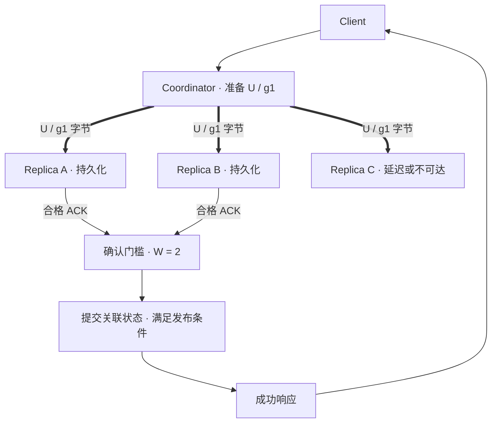

# Replication：副本数量与写入承诺

[Object Layout](../03-object-storage/06-object-layout.md)已解释 Object 如何映射到 Internal Storage Units。本篇从一个内部单元 U 出发：**如果保存 U 的节点突然消失，系统凭什么继续读取它？又凭什么在写入时返回成功？**

以下采用通用模型与工程推导，不规定某个产品的内部协议。U 的新状态记作 generation g1；generation 用来区分内部写入状态，不等于 S3 Version ID。示例假设故障是崩溃、不可达或已识别的数据丢失，不讨论恶意节点。

## 1. 为什么单份持久化还不够？

持久化解决的首先是数据能否跨越某类进程重启或断电。若唯一设备永久损坏，已经落盘的字节仍可能丢失；若节点暂时不可达，数据可能还在，却无法提供服务。

Replication 为同一数据状态保留多份完整副本，使某些副本失效时，其他副本仍能提供字节。它也可能增加读请求的可选来源，但能否从任意副本读取，还取决于该副本是否具备请求所需的状态。

| 目标 | 需要回答的问题 | 多副本本身不能保证什么？ |
| --- | --- | --- |
| Durability | 已承诺的数据在故障后能否保留？ | 没有传播的新写入、所有副本一起失效时的数据保留 |
| Availability | 此刻能否按接口契约完成读写？ | 网络不可达、确认门槛不足、元数据不可用时继续服务 |
| 读取选择 | 是否有其他合格来源承接读取？ | 陈旧副本可直接充当最新状态；读性能必然线性增加 |

Replication 也不自动提供历史保留：如果删除或错误覆盖被正确复制到全部副本，多份副本会一起反映这个操作。版本保留与备份是其他语义，本篇不展开。

## 2. Replication Factor 是目标布局，不是当前状态

记 Replication Factor 为 N，表示某一保护单元的目标完整副本数，**包含第一份**。N=3 的 U 在目标状态下有三份完整 g1，不是“原件加三个副本”。系统也可能使用其他计数约定，读配置时应核对。

若 U 有 S 字节，仅计算正文且忽略日志、元数据、对齐等成本，N 份副本占用约 N×S；三副本的占用倍数为 3，额外冗余为 200%。这不是完整系统的 Space amplification 实测。

目标 N=3 不代表任意时刻都已存在三份最新状态：某副本可能尚未写完、只有 g0、暂时不可达或已经丢失。需要分别记录目标数量、合格副本数量和可达数量。

Primary / Replica 是常见逻辑模型：Primary 可以承担排序或写入协调，其他副本接收数据。但系统也可以由请求协调者组织复制，而没有长期唯一 Primary。**“协调本次请求”不自动等于“拥有所有写入的排序权”。** 本篇图中的 Coordinator 只表示一次请求的协调职责。

## 3. 同步与异步：哪些复制工作处在响应的关键路径？

同步复制指成功响应等待指定远端副本达到规定状态；异步复制指某些副本的传播不处在此次成功响应的等待条件中。这里的“同步”描述确认依赖，不要求串行发送，也不必等待全部副本。

| 示意策略 | 返回前至少完成什么？ | 故障窗口与代价 |
| --- | --- | --- |
| 单份持久化后异步传播 | 一份 g1 达到规定持久化条件 | 延迟较低；其他副本到达 g1 前，唯一新数据来源失效可能丢失已确认写入 |
| 等待部分副本 | 指定数量的不同副本达到规定条件 | 提高确认时已有冗余；未等待副本仍可能落后 |
| 等待全部 N 份 | 全部目标副本达到规定条件 | 减少确认时的副本缺口；一个慢副本或不可达副本也可能阻塞写入 |

实现可以同时向三份副本发送，只等待其中两份，因此一次写入既有同步等待集合，也有后续异步完成部分。异步并不意味着“肯定丢数据”，它意味着成功承诺中存在一个必须明确的传播窗口。

## 4. Write Acknowledgement 究竟确认了什么？

记 W 为本篇模型中写入成功所需的不同副本 ACK 数量，1≤W≤N。ACK 必须绑定同一 U、同一 g1 和明确的持久化条件。重试带来的重复 ACK、同一设备上的两个文件，不能凭数量当成两个独立保护来源。

“接收进内存”“写入持久日志”“数据已进入最终布局”是不同确认点。持久日志可以成为确认依据，但前提是它在规定故障模型下可恢复出所需数据；一个 ACK 标签不能替代这些条件。

下面展示 N=3、W=2 的并行复制示意。细线为请求或控制，粗线为正文；图中持久化条件由这个示例预先约定。Coordinator 不必存储第四份副本。

C 的写入可以稍后完成，其处理不画在本次成功路径上。若 A / B 未达到门槛，图中的发布步骤不能因为“已经发送三份”而继续。

回到对象层，一个 Object 可能引用多个 U。系统要让全部所需单元达到相应保护条件，并使对象引用与提交记录满足自身恢复要求，才能兑现完整对象的成功响应。**数据副本的 W 个 ACK 不是完整对象 API 提交协议。** 这沿用[Read / Write Path](../03-object-storage/03-read-write-path.md)的数据就绪与发布边界。

## 5. Quorum：集合相交解决什么，又没有解决什么？

Quorum 的基本思想是规定足够的参与集合，使某些操作集合必须相交。对固定的 N 个副本，若一次写入获得 W 个合格响应，读取检查 R 个不同副本，且 R+W>N，则读集合至少与该写集合共享一个成员。

例如 N=3、W=2、R=2：g1 写在 A / B，读 B / C 时能接触到 B。若 W=1、R=1，写 A、读 C 就可能完全错开。这是集合关系，不是已经证明“从两个响应里任取一个都是最新值”。

将相交用于读取最新已提交状态，还需要固定或正确协调的成员集合、状态身份、提交判定及读取选择规则。即使没有并发写者，失败写入也可能留下局部的新状态；读者不能只比较一个未定义的序号就把它当作已提交值。并发写入、成员变更和替代节点会进一步改变假设。

同理，2W>N 能使固定集合中的两个写集合相交，却不自动规定写入总顺序。**R+W>N 或多数 ACK 不能单独推出线性一致性，也不能直接等同于 Raft / Paxos。** 一致性与排序问题只回链[08 专题（目前为骨架）](../08-consistency-metadata-partitioning/README.md)。

[Dynamo 原始论文](https://www.allthingsdistributed.com/files/amazon-dynamo-sosp2007.pdf)第 4.5～4.6 节给出了 N / R / W 和可替换参与节点的公开模型。它是特定系统论文，不是 S3 当前 API 契约；本篇的固定集合示例也不沿用其全部失败处理机制。

## 6. 写入中途节点故障：字节状态与提交状态分开看

仍取 N=3、W=2，并假设没有其他写者。g0 是旧状态，g1 是准备中的新状态；下面是图中模型的工程推导。

| 故障时刻 | 可能留下的副本状态 | 能否据此判定对象写入成功？ |
| --- | --- | --- |
| A 已持久化，B / C 未确认 | A 有 g1，其他副本可能为 g0、部分 g1 或实际已完成但 ACK 丢失 | Coordinator 尚未确认 W，不能直接宣布成功；超时也不证明所有写入都未发生 |
| A / B 已确认，C 不可达，尚未发布 | g1 的数据门槛已达到，目标副本尚未齐全 | 还需完成提交与元数据条件；有两份字节不等于对象已可见 |
| A / B 已确认并完成发布，响应丢失 | g1 已提交，客户端结果未知 | 客户端超时不回滚已提交状态；重试应遵循接口契约 |
| 确认后 A 永久丢失，C 尚无 g1 | B 可能是唯一剩余 g1 来源 | 数据可能仍在，但冗余已进一步下降；能否继续读写取决于读写门槛及控制路径 |
| 已提交数据仍在，Coordinator 崩溃 | 部分节点持有 g1，提交信息需由可恢复状态判定 | 不能因协调者消失而任意选 g0 / g1，也不能只凭副本数量重建提交结论 |

不可达是观察结果，不等于永久丢失。表中不展开故障检测、角色切换或补齐副本的执行流程；它们留给[恢复与运维](../10-recovery-operations-observability/README.md)。

## 7. Degraded 不等于不可读，也不等于安全余量充足

本篇把 Degraded 用作描述：某数据状态的合格或可访问副本未达到目标保护布局。产品可能有更细的状态名称，不能用这个词反推某产品必定允许读写。

三副本缺一份时，如果两份剩余副本都有当前已提交数据，且其余条件满足，W=2 的后续写入仍可能完成；W=3 则不能按原门槛成功。只有一份最新数据时，读取可能成功，W=2 的写入却可能不可用。旧副本“节点在线”不能补上最新数据的保护缺口。

同样，三份完整副本都已就绪，才可在仅考虑字节保留的模型中承受任意两份副本丢失；W=2 刚确认时，尚未补齐的第三份不能算入 g1 的容错预算。实际能承受几个节点或机架失效，还需看[Failure Domain & Placement](03-failure-domain-placement.md)。

## 8. 调整 N 与 W，改变的是不同维度

| 调整 | 可能得到什么？ | 需要支付或重新检查什么？ |
| --- | --- | --- |
| 固定 N，提高 W | 确认时更多来源保有新状态 | 更依赖多个可达节点，等待延迟与写入失败概率可能增加；最终 N 份容量成本并不因此改变 |
| 固定 W，提高 N | 完整传播后更多读取来源与保护余量 | 容量、传播流量、状态跟踪成本上升；确认时已有冗余不因目标 N 增大而自动增加 |
| 允许缺副本时按较低门槛写 | 某些故障下继续接受写入 | 每次新写入的保护承诺减弱，必须明确策略，不能把静默降门槛当作仍满足原承诺 |

并行复制的等待时间通常受达到门槛所需的第 W 个合格完成事件影响；链式复制、串行协调、网络拓扑和元数据提交会改变实际延迟。提高 W 不要求延迟一定按 W 倍增加，降低 W 也不消除最终传播成本。

Replication 的优势是每个合格副本有完整字节，读取与单份数据补充不需要编码计算；代价是完整正文被重复存储和传输。下一篇用[Erasure Coding](02-erasure-coding.md)讨论如何减少冗余字节，以及成本被转移到了哪里。

来源核对日期：**2026-10-02**。正文的 N=3 / W=2、确认流程和故障表均为通用示意，不构成具体产品的配置建议或可靠性数值保证。

[前置：Object Layout](../03-object-storage/06-object-layout.md) · [章节入口](README.md) · [下一篇：Erasure Coding](02-erasure-coding.md)
