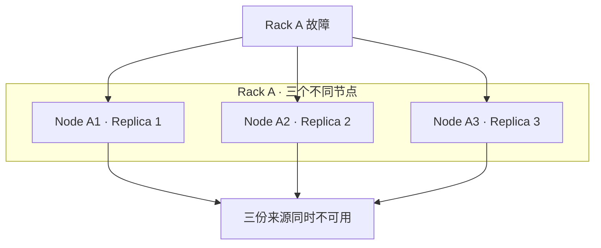
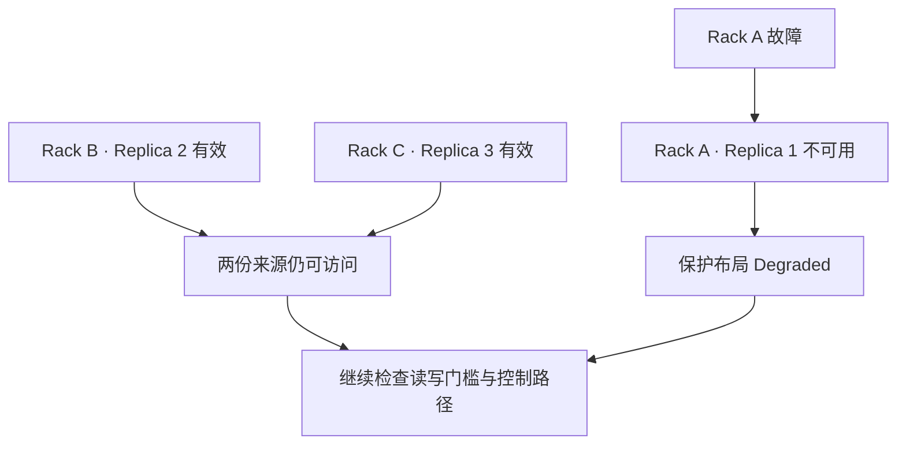

# Failure Domain & Placement：冗余必须放在正确的地方

[Replication](01-replication.md)说明确认时已有多少完整来源，[Erasure Coding](02-erasure-coding.md)说明一个编码组需要多少有效分片。本篇问：**一次真实故障会同时带走其中多少份？布局能否让剩余数据和服务满足承诺？**

本文采用通用拓扑模型与工程推导。图中 Rack A / B / C 为示意故障域，不对应任何云厂商或产品；AZ / Region 只表示部署拓扑层级，不借这些名称推断具体供应商的隔离保证。

## 1. Failure Domain 描述共同失效的边界

Failure Domain 是某类故障可能同时影响的一组资源。不同磁盘可能共享控制器，不同节点可能共享机箱电源，不同机架可能共享网络或供电。若设计只把“不是同一个节点”当作独立，保护来源仍可能一起消失。

| 层级 | 可能共同失效的原因（示意） | 只跨更小层级仍留下什么风险？ |
| --- | --- | --- |
| Disk | 介质或设备失效 | 同盘两个文件不提供设备失效隔离 |
| Node | 主机电源、操作系统或节点网络失效 | 同节点不同盘仍可能一起不可访问 |
| Chassis | 共享背板、电源、控制器或机箱设施失效 | 不同节点仍可能共用这些资源 |
| Rack | 共享供电、交换机或机架连接失效 | 不同节点 / 机箱仍可能一起不可达 |
| AZ | 部署区域内共同设施或连接故障 | 跨机架不能自动覆盖整个 AZ 的失效 |
| Region | 地域级灾害或大范围基础设施故障 | 跨 AZ 不自动等于跨 Region 保护 |

表格是常见观察尺度，不是所有环境都有的严格树形结构。网络、供电和管理边界可能交叉；同批固件、共同软件缺陷或一次误配置还可能影响地理上分开的资源。物理分散能隔离部分故障，不能隔离所有原因。

Correlated Failure 指故障相关：一个共同原因提高多份资源同时失效的可能性。不能仅凭多个设备数量，就把它们的失效概率按独立事件相乘，再宣称得到系统持久性。

## 2. 同样三副本，错误放置与合理放置有什么区别？

考虑 U / g1 的三份完整合格副本，目标为“单个机架失效后仍保有数据”。示例只讨论这个故障，不包含同时发生的软件故障或其他机架故障。

**错误放置：不同节点，全在同一机架。**

节点级分散覆盖了某些单节点故障，却没有覆盖目标中的机架故障。若机架仅断网，字节可能仍存在；若共同存储设施永久损毁，可能失去全部来源。两者在故障期间都无法从其他机架取得 U。

**满足该目标的示意放置：一份副本一个机架。**

第二图中两份来源可以保留 U 的数据；若新写入要求 W=2，剩余节点可达、空间足够且提交路径可用，就可能继续写入。若要求 W=3，则不能按原门槛写入。**合理放置兑现的是指定故障目标，不是保证任何故障下都可用。**

还必须检查成功确认时的集合。目标三副本分别放在 A / B / C，若本次只确认了 A 中唯一一份 g1，B / C 尚未到达 g1，A 失效仍可能丢失已确认的新数据。最终布局正确，不会自动填平异步传播窗口。

## 3. EC 的故障预算如何换算成机架预算？

在完整有效的 4+2 MDS Stripe 中，任意两个分片失效仍可恢复。要把这换算成 Rack 故障容忍度，应统计每个 Rack 对**同一 Stripe**持有多少分片，而不是统计集群总共有多少节点。

| 同一 Stripe 的六片布局 | 单个 Rack 失效可能带走多少片？ | 对完整数据的结论 |
| --- | --- | --- |
| 六片在一个 Rack 的六个节点 | 6 | 超出 m=2，不能保证恢复 |
| 三个 Rack，各两片 | 2 | 可承受任意单个 Rack 失效；失去两个 Rack 时剩两片，不够恢复 |
| 六个 Rack，各一片 | 1 | 字节模型中可承受任意两个这些 Rack 失效 |

跨三个 Rack 的 4+2 不必是错误布局：如果目标只覆盖单 Rack 失效，两片一域可以满足要求。反过来，即使分片跨了两个 Rack，若分布是 3+3，丢任一个就超出预算。**“跨域”是必要描述，具体域内集中度才决定它能覆盖什么故障。**

更一般地，对目标故障涉及的域集合，求它们覆盖的不同分片总数；只有损失数不超过 m，且剩余分片有效、相容并可取得，才有本篇 MDS 模型的恢复保证。若写入尚未形成完整编码布局，应改用当时已确认的保护余量，不能继续套用完整组的 m。

Replica 的条件不同：只要同一已提交状态仍有一份合格完整数据，字节就可能保留。能否提供读写服务仍需满足读取、写入与元数据等条件。数量预算与访问门槛是两种判断，不能互相替代。

## 4. Placement 需要同时满足哪些条件？

Placement 是决定数据保护单元的目标位置或位置关系。应先写清硬性保护目标，再在合格位置中权衡资源成本；单纯追求平均容量，不足以得到合格布局。

| 维度 | 想解决的问题 | 与其他目标的冲突 |
| --- | --- | --- |
| Failure isolation | 单次目标故障不会带走过多保护来源 | 更多跨域传输、更大的资源选择范围 |
| Capacity balance | 按可用容量与水位分散占用，避免局部写满 | 容量均匀不代表热点或 IOPS 均匀；空闲节点可能处于同一故障域 |
| Performance | 匹配介质、并发和负载，减少瓶颈 | 高性能资源可能集中；热点访问与字节分布并不一致 |
| Network locality | 降低跨域链路流量与请求延迟 | 把全部副本放近请求方可能削弱故障隔离 |
| Repair cost | 故障后仍有合格空闲容量、来源带宽与目标位置 | 需要预留资源，不能让正常状态占满全部能力 |

例如把 Replica 1 / 2 都放在本地 Rack、Replica 3 放远端，可能减少 W=2 的当前确认延迟；但远端未获得 g1 前，本地 Rack 故障可能带走全部已确认 g1。若承诺在成功确认时覆盖该 Rack 故障，等待集合也必须跨适当域，不能只在最终布局上跨域。

Repair cost 在这里仅是放置约束：故障后能否找到合格目标、是否有容量与网络余量。补齐数据的调度和执行流程留给[后续 Repair / Rebuild](README.md)。只有刚好容纳目标副本 / 分片的位置，可能在一次故障后无法重新达到原保护目标。

## 5. Placement Policy 与 Placement Algorithm 分别回答什么？

| 层次 | 核心问题 | 示意内容 |
| --- | --- | --- |
| Placement Policy | 什么布局才算合格？哪些目标不能违反？ | N=3，每份在不同 Rack；或 4+2，同一 Stripe 每 Rack 最多两片，覆盖单 Rack 故障 |
| Placement Algorithm | 如何从候选资源中选出具体目标？ | 根据拓扑、容量、介质与负载等输入返回节点 / 设备集合 |
| 实际布局与状态 | 已经形成什么布局？当前是否满足策略？ | 目标位置、持久化进度、实际引用、故障后缺口 |

Policy 可以有硬约束和偏好：例如 Rack 隔离为硬约束、靠近读取方为优化目标。算法找不到合法布局时，系统需要按明确契约拒绝、等待，或显式进入允许的较低保护模式；偷偷把多个来源塞回同一故障域，会改变已经对外宣称的保护条件。

有效算法也依赖正确的拓扑输入。把两个共用电源的节点误标成独立故障域，再均匀分配数据，不能修正输入中的隔离错误。

本篇不展开 CRUSH、Consistent Hash 或其他选择算法；算法与分区 / 映射细节留给[08 一致性 / 元数据 / 分区（目前为骨架）](../08-consistency-metadata-partitioning/README.md)，公开系统的具体实现留给[系统案例](../11-typical-storage-systems/README.md)。

## 6. 数据放置与数据路由不是一回事

Placement 产生或约束“数据应在哪里”；Routing 则把本次请求送到能够处理它的入口或数据来源。路由可以利用放置结果、元数据映射或缓存，但二者职责不同。

| 请求中的动作 | 更接近哪种职责？ | 不能据此推断什么？ |
| --- | --- | --- |
| 为 U 的新保护组选择三个目标节点 | Placement | 尚未写入成功，也尚未发布对象引用 |
| 将 PUT 送到负责该对象的 API / 协调入口 | Routing | 入口节点不必持有全部正文或保护组 |
| 根据已提交布局，将 GET 送到可用 Replica | Routing / 读取选择 | 选近端来源不能忽略状态身份与读取契约 |
| 解析 EC Stripe 并选择有效分片来源 | 布局解析与读路由 | 仅找得到节点，不代表片数足够或 generation 相容 |

节点失效后，一次读请求改选仍合格的来源，可以改变读取路径而不改变目标保护策略。真正改变数据归属的动作则涉及布局与状态管理，不能当作仅更新一个网络路由；具体变更过程不在本轮展开。

## 7. 把三篇与对象存储主线连接起来

**Object → Internal Storage Units → Replication / EC → Placement across Failure Domains** 是一条从接口承诺走向故障条件的分析链。

| 阅读层次 | 已经回答的问题 | 下一层需要验证什么？ |
| --- | --- | --- |
| [Object Layout](../03-object-storage/06-object-layout.md) | 一个对象状态引用哪些内部区域？ | 哪些范围构成保护单元，数据与引用是否相容？ |
| [Replication](01-replication.md) | 同一状态有多少完整来源，成功等待什么？ | 确认集合与最终布局覆盖哪些共同故障？ |
| [Erasure Coding](02-erasure-coding.md) | 哪些分片共同恢复数据，当前剩余多少余量？ | 单次域故障会丢多少相容分片？ |
| 本篇 Placement | 如何把保护预算对应到实际故障域？ | 故障后哪些数据仍在、哪些操作还能满足门槛？ |

正文保护不覆盖一切：元数据、提交记录、访问入口和依赖网络也需要各自的可恢复性与服务条件。若正文仍可恢复但入口不可用，应描述为访问不可用，不能立即宣称数据丢失；若只有局部旧字节仍在，也不能宣称当前已提交对象仍受保护。

本轮止于保护机制、预算和布局约束。故障后的 Repair / Rebuild、跨区域保护、备份与灾备等仍属于[章节后续规划](README.md)，不在本篇展开流程。

## 来源与适用边界

[f4 原始论文入口（OSDI 2014）](https://www.usenix.org/conference/osdi14/technical-sessions/presentation/muralidhar)提供了按 Disk / Host / Rack / Datacenter 故障层级设计 BLOB 保护的公开案例。引用用于说明“冗余方案需要结合故障层级”这一设计问题，不照搬其参数、编码或部署模型。

核对日期：**2026-10-02**。本文的三副本图、4+2 分布表、ACK 跨域约束和 Policy / Algorithm / Routing 区分为通用模型及工程推导，不是任何具体产品的实现说明。

[上一篇：Erasure Coding](02-erasure-coding.md) · [章节入口](README.md) · [前置：Object Layout](../03-object-storage/06-object-layout.md)
