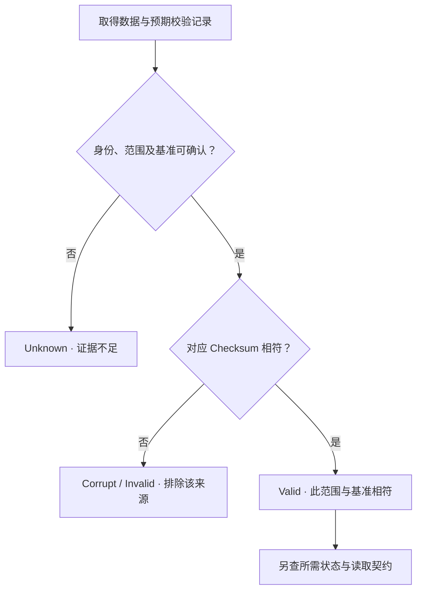

# Checksum / Data Integrity：字节存在，还要证明它属于正确状态

[Replication](01-replication.md)、[EC](02-erasure-coding.md) 与 [Placement](03-failure-domain-placement.md) 回答了保留多少恢复信息、如何隔离故障。本篇再问：三份副本都能读取，为什么仍可能无法交付正确内容？如何为一次验证定义可信的依据与范围？

以下为通用 Integrity 模型与工程推导，不规定校验算法、存储格式或固定 Block Size。本文负责检测依据与保护边界；潜伏错误如何发现见 [下一篇](05-silent-corruption-detection.md)，主动扫描与修复执行见 [Scrubbing / Integrity Repair](../10-recovery-operations-observability/07-scrubbing-integrity-repair.md)。

## 1. Durability 与 Integrity 回答不同问题

**Data Integrity** 关注内容及其关联状态是否符合预期；**Durability** 关注已经承诺的状态能否在约定故障后保留、恢复。真实持久性承诺通常也要求恢复正确状态，所以两者不是互不相关的承诺；但“持久介质上还有字节”和“验证过这些字节正确”是不同证据。

| 判断 | 需要什么证据 | 单凭什么还不够 |
| --- | --- | --- |
| 数据仍存在 | 有可取得的持久表示 | 文件数量、读成功不证明内容正确 |
| Integrity Verification 通过 | 与所需身份、范围及可信校验基准相符 | 只有同长度、同名字或多个相同副本 |
| 所需状态仍可恢复 | 有足够有效来源，以及可恢复的身份、布局与提交事实 | 只有冗余正文，不保护相关 Metadata |

**工程示意：**U / g1 原本应为 Y，后来一个错误把内容变成 X，X 又被传播到 Replica A、B、C。三份 X 都存在，甚至彼此完全一致；复制更多 X 不会制造已经缺失的 Y。若仍保有可信的 Y 校验基准，系统可能发现不符，却未必有来源修回 Y；若错误先发生、随后系统才把 X 的摘要认作基准，后续校验还可能全部通过。

因此 **Durability ≠ Integrity，Redundancy ≠ Integrity Verification**。Replication / EC 提供恢复材料，不单凭数量或编码布局证明字节正确。某些编码关系能辅助检测不一致，但其检测与纠错能力需要额外假设，不能把冗余配置当成完整性验证契约。

## 2. Checksum 是内容比较工具，不是版本身份

Checksum 根据约定范围的内容计算校验值；Verification 用相同算法与范围重新计算，再与预期值比较。**Corruption Detection** 是发现与预期不相符；一次比较本身不说明错误发生在介质、内存、传输还是 Metadata。

| 工具或标识 | 主要用途 | 不承担什么 |
| --- | --- | --- |
| 非密码学校验，如 CRC 类 | 按其设计能力检测意外内容变化 | 不提供对主动构造碰撞的通用安全保证，也不识别当前版本 |
| Cryptographic Hash | 作为内容摘要，具有相应的抗碰撞等设计目标 | 不独自证明摘要来源可信、内容最新或业务结果正确 |
| Version ID | API 层定位某个版本 | 不是对正文重新计算得到的校验值 |
| Generation | 区分内部状态演进，并绑定数据、引用与操作 | 不是字节校验算法；正确序号不保证正文无损 |
| ETag | 按具体接口契约用于资源验证与条件请求 | 不能普遍当作全文 Checksum 或唯一版本身份 |

这里的 Checksum 可泛指完整性校验值，Cryptographic Hash 也可被用作该值，不是互斥分类。算法的检测强度、计算和 Metadata 成本要结合故障模型与实现评估；不能按名称断言固定性能或“绝无漏检”。NIST 的 [Cryptographic Hash Function 定义](https://csrc.nist.gov/glossary/term/cryptographic_hash_function)用于核对其设计属性，本篇不展开密码学。

即使使用强摘要，如果错误数据和预期摘要都能被一起替换，比较仍不能证明原内容未变；摘要必须有可信来源与保护边界。ETag 与 API 版本的具体区别回看 [Object Model](../03-object-storage/01-object-model.md)，不新增 S3 行为结论。

## 3. Checksum Scope 决定你实际验证了什么

校验记录至少要能解释：哪份状态、哪个范围、什么表示、哪种算法及哪个预期值。只保存一串摘要，没有关联身份与范围，无法决定一次比较是否有意义。

| Scope | 能帮助回答什么 | 粒度代价与限制 |
| --- | --- | --- |
| Entire Object | 组装后的整份对象内容是否符合该状态的基准 | 记录可较少；只有全文摘要时，小 Range 读取通常不能独立证明全文正确 |
| Internal Storage Unit | 一个布局单元是否有效 | 不自动覆盖对象组装、单元排序或遗漏；边界见 [Object Layout](../03-object-storage/06-object-layout.md) |
| Block / Range | 特定偏移和长度的区域是否有效 | 更易定位局部损坏，但需要更多记录与范围管理 |
| EC Fragment | 某编码组、位置及 Generation 的分片是否有效 | 片正确不自动证明输入组相容或整个 Object 正确 |
| Metadata Record | 身份、引用或提交记录是否符合其校验基准 | 记录校验仍需受保护的引用与恢复依据，不是天然可信的根 |

粗粒度减少记录数量，却可能为定位小错误读取大量内容；细粒度便于局部验证，代价是计算、Metadata、更新与恢复状态更多。两者可以分层结合，没有固定最佳 Checksum Block Size。

**表示也属于 Scope。** 对象明文、压缩后的内部单元、加密结果与 EC Fragment 不是同一串字节。不能用整对象摘要直接比较单个编码片，也不能因为物理片校验通过，就省掉所需的逻辑组装检查。具体格式怎样传递校验依据，要由实现明确。

## 4. Write Path：保护正文，也保护其完整性记录

通用逻辑为 **Receive Data → Compute / Validate Checksum → Persist Data → Persist Integrity Metadata → Commit State**。这是依赖关系，不规定五次串行 RPC；实现可以流水化、合并或通过可恢复记录协调。

| 写入边界 | 必须建立的关系 |
| --- | --- |
| 接收与计算 | 校验从哪一层开始？如有上游可信值，应按同范围验证，而非只对收到的内容重新生成一个值 |
| 准备数据与校验记录 | 将 Unit / Generation、范围、表示、算法及预期摘要绑定；计算时内容不能被并发覆盖 |
| 持久化与保护 | 正文和必要 Integrity Metadata 均达到约定恢复条件；不能让唯一校验依据只留在内存 |
| 发布状态 | 提交事实能在故障后找到相容的数据与记录，不能发布一份正文配另一代校验值 |

假设 D1 已持久化，但对应 I1 未形成可恢复关系。重启后只能找到正文、找不到所需基准，应保留 Unknown，而不是对现有字节现算摘要、把它宣布为原来正确的内容。反过来，I1 存在而正文只写了一部分，也不能宣布完整写入。协调原理回链 [Metadata / Data 提交边界](../08-consistency-metadata-partitioning/02-metadata-object-index.md)，不在这里设计新事务协议。

Checksum Metadata 本身可能丢失、损坏或指向错误范围，需要相应校验、冗余及可信关联；这些手段也不能假设所有共同故障都已消除。Linux [dm-integrity 文档](https://docs.kernel.org/admin-guide/device-mapper/dm-integrity.html)用其特定块设备实现说明数据与 Integrity Tag 的故障一致更新问题；这里只引用该问题，不把其 Journal 方案写成所有对象存储的标准实现。

**End-to-End Integrity** 要声明保护的起点与终点。仅设备内部校验不能覆盖进入设备之前的软件错误；仅接收端现算校验不能证明传输前的内容没有变化。各层应保留可验证的关联，变换时明确输入与输出边界。即使路径校验完整，也不负责判断应用原本生成的业务内容是否正确。

## 5. Read Path：Valid、Corrupt 与 Unknown 都要有范围

一般过程是 **Read Data → Verify Checksum → Valid / Corrupt / Unknown**，其中数据身份、范围与可信基准是验证前提：

Valid 是在算法检测能力和可信基准假设下的结论，不是没有任何错误可能性的证明。Mismatch 表示数据与依据不符，应停止把这条来源路径作为合格输入；它并不单独证明“正文坏、Metadata 一定没坏”，根因可能仍未知。

完整的 g0 与其校验值相符，仍可能不满足要求 g1 的当前读取。**Checksum ≠ Freshness / Consistency**，不能替代 Object Identity、Generation、Ownership 或状态选择；历史读取合法使用 g0 又是另一种契约，见 [Observable State](../08-consistency-metadata-partitioning/01-consistency-observable-state.md)。

## 6. Detect 与 Correct 不能合并成一个保证

Checksum 主要负责 Detect，不提供恢复原字节所需的信息。Replication 可从其他有效完整来源复制；EC 可在其恢复假设内重构。**Corruption Detection ≠ Corruption Repair**：识别错误只是决定哪些来源仍合格，随后还要检查剩余恢复信息。

现有 [EC 正文](02-erasure-coding.md) 的 k+m 保证采用 erasure 模型：知道哪些片缺失或无效，并有足够相容的有效输入。未知错误混在输入中，不等于一个已识别 erasure；不能直接把 m 当成任意未知错误的纠正数量。有 EC 仍需要明确检测、身份与验证依据，Parity 关系并非万能校验器。

下一篇讨论当底层仍返回成功时，哪些证据会暴露问题，以及为什么“多个副本相同”不能决定正确来源：[Silent Corruption Detection](05-silent-corruption-detection.md)。

## 来源与适用边界

核对日期：**2026-10-02**。图、U / g1、X / Y、Scope 表及写入模型是通用工程推导，不规定产品格式、校验粒度或零风险承诺。

- [NIST CSRC：Cryptographic Hash Function](https://csrc.nist.gov/glossary/term/cryptographic_hash_function)：摘要的抗碰撞等设计属性，不等于来源认证或新鲜度。
- [Linux Kernel：Data Integrity](https://docs.kernel.org/block/data-integrity.html)：校验范围、路径保护及关联信息的边界；不外推具体设备支持。
- [Linux Kernel：dm-integrity](https://docs.kernel.org/admin-guide/device-mapper/dm-integrity.html)：数据与 Tag 的一致更新问题；不展开接口或部署教程。

[前置：Failure Domain & Placement](03-failure-domain-placement.md)
