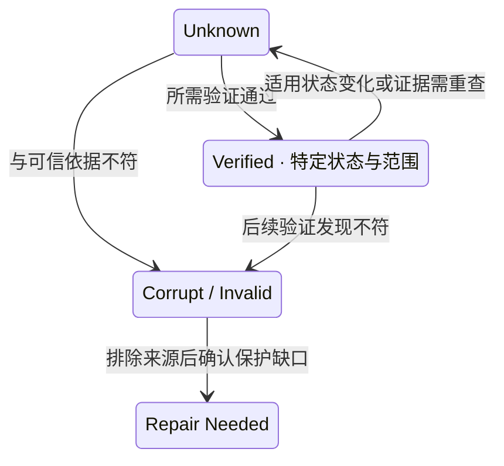

# Silent Corruption Detection：读成功，为什么还不能相信内容

[Checksum / Data Integrity](04-checksum-data-integrity.md)建立了身份、范围与可信基准。本篇回答：如果设备没报错、RPC 也成功，系统如何发现交付了错误状态？多份来源不一致时，凭什么决定使用哪一份？

以下是通用故障类别与判定模型，不假设恶意节点，也不推断某种设备的固定损坏概率。后台扫描及修复执行由 [Scrubbing / Integrity Repair](../10-recovery-operations-observability/07-scrubbing-integrity-repair.md) 承接，本篇集中讨论检测与来源资格。

## 1. Explicit Failure 与 Silent Corruption 的观察不同

这里将 **Silent Corruption** 用作通用含义：内容或其状态关联已经错误，但系统在发生时没有立即得到明确 I/O Failure。它不是一个固定硬件故障名称；“silent”还需要说明哪个观察层尚未发现错误。

| 观察路径 | 直接信号 | 普通 Availability / Retry 机制的边界 |
| --- | --- | --- |
| Explicit Failure：Read → Error | 操作报告错误，系统知道此次读取未按要求完成 | 可改选来源或重试，但并不因此确定错误范围或永久丢失 |
| Silent Corruption：Read → Success → Wrong Bytes | 下层操作成功，却提供错误内容或错误状态 | 若没有额外验证，可能根本不触发重试与恢复 |

上层校验发现 Mismatch 后，可以把下层的“成功”转换为明确的验证失败。因此 **Read Success ≠ Bytes Are Correct**，不是说系统发现损坏后仍应向用户返回成功。

若错误未发现，后续复制、缓存、迁移甚至备份可能继续传播它。Redundancy 可以复制正确数据，也可以复制错误数据；位置分散不隔离共同的错误生成或处理逻辑，回看 [Correlated Failure](03-failure-domain-placement.md)。本篇只说明传播风险，不展开备份机制。

## 2. 可能来源：区分“潜伏”与“没有报错”

| 故障类别 | 可能造成什么 | 需要保留的限定 |
| --- | --- | --- |
| Latent Media Error | 长期未读取的区域存在不可读或错误内容 | 很多介质错误会在读取时显式报错；潜伏不自动等于 Silent |
| Bit Corruption | 内容中的部分位改变 | 能否被下层发现取决于其保护范围；不能假设全部位错误都会漏检 |
| Misdirected Write / Lost Write | 内容落到错误位置，或预期写入没有真正形成 | 单份内容和自带校验都可能看似正确，需要外部身份与预期状态 |
| Torn / Incomplete Write | 新旧或部分内容混合，关联记录不相容 | 这里只讨论未被及时发现的情况，不断言所有部分写都会返回成功 |
| Memory / Transfer Corruption、Software Bug | 写入前后或处理期间生成错误字节、错误校验或错误引用 | 若错误早于校验基准形成，后续比较可能完全一致 |
| Stale State / Metadata-Data Mismatch | 将 g0 错当当前 g1，或用一份状态的 Metadata 解释另一份内容 | 可能是状态选择错误而非位翻转；仍违背所需状态的完整性边界 |

这些是排查类别，不是仅凭一种检测信号就能确认的根因。FAST 2008 的 [An Analysis of Data Corruption in the Storage Stack](https://www.usenix.org/legacy/events/fast08/tech/full_papers/bairavasundaram/bairavasundaram.pdf)区分 Checksum Mismatch、Identity Discrepancy 与 Parity Inconsistency；本篇借此核对分类边界，不采用其特定系统的故障率或恢复方案。

## 3. 不同信号证明的是不同矛盾

| 信号 | 可以发现什么 | 不能独自决定什么 |
| --- | --- | --- |
| Checksum Mismatch | 给定范围的内容不符预期校验依据 | 数据还是校验记录出错，哪份候选内容正确，原内容是否可恢复 |
| EC Consistency Violation | 已声明相容组的片不满足所检查的编码关系 | 哪片错误、能否唯一纠正，取决于编码、附加校验和故障模型 |
| Metadata / Data Identity Mismatch | Unit、Stripe、Fragment 位置或引用身份不相容 | 仅从内容相似程度选出正确状态 |
| Size / Range Mismatch | 长度、偏移或覆盖范围不符合记录 | 同长度就无错；某段通过就证明全文通过 |
| Version / Generation Mismatch | 来源不是请求或保护目标所需状态 | 字节必然损坏；合法历史状态不能一概当垃圾 |

编码检查也需要可信组身份与相容状态。把不同 Generation 的片放一起，发现关系不符，并不能直接诊断其中某块设备坏了；如果错误输入被一致编码为另一组合法内容，Parity 关系还可能通过。**EC Parity 不是万能 Integrity Detector。**

校验记录缺失、不可达或自身无法验证，应保留 Unknown，而不是略过校验并记为 Verified。若重新计算摘要只是描述了当前可见字节，没有对照可信的预期值，就没有检验这些字节是否仍为原来承诺的内容。

## 4. A = X、B = X、C = Y，为什么多数不等于正确

先限定三者声称提供同一 U / g1；X / Y 只是内容标签，hX / hY 是示意摘要名称，不是实际算法输出。A、B 可能来自同一次已损坏的复制，C 保留更早保存的正确 g1。出现次数只反映传播结果，不能给 X 授予可信身份。

| 可获得的证据 | 可以如何判断 |
| --- | --- |
| 有受保护的已提交 g1 引用与可信 hY；C 的身份、范围及计算结果均相符 | C 可成为候选有效来源；A / B 不符该基准，数量多数不能补救 |
| C 的 Y 完整且校验正确，但身份其实是 g0 | 它可能是合法历史状态，却不能用于补回需要的 g1 |
| 三者各有自带摘要，缺少可信基准或提交关联 | 自洽不代表正确，应保留 Unknown / Ambiguous，不能盲选多数 |
| Metadata 或 Generation 证据也互相冲突 | 先判定所需已提交状态与可靠依据，不能先覆盖再解释身份 |

更早保存的正确来源，必须仍属于**所需 Generation**；“旧来源”不等于“旧状态可以替代新状态”。若只剩正确 g0，而 g1 的恢复信息确实丢失，不能把退回 g0 描述为修复成功。

选择 Recovery Source 应结合 Expected Generation、Trusted Integrity Metadata、Committed State、计算校验、Layout Identity 与 Failure Evidence。基准不是天然不会坏，应按 [上一篇的保护边界](04-checksum-data-integrity.md)判断它是否可依赖；来自同一错误处理路径的多个相同报告也未必独立。

**Replica Majority ≠ Automatically Correct Data。** 合格的协调协议可以在明确假设下决定已提交状态，但简单字节多数不是该协议，更不是完整性证明。Quorum 的集合相交基础仍见 [Replication](01-replication.md)，不在本篇重写协调教程。

## 5. Latent Corruption：检测窗口会消耗恢复余量

Cold Data 长期不被读取，错误可以已经存在很久，却没有触发一次验证。以下是通用时间线：

| 时刻 | U / g1 的实际情况 | 系统仍可能看到什么 |
| --- | --- | --- |
| T0 | A、B、C 均有效 | 三份合格来源 |
| T1 | A 内容损坏，尚未访问 | 旧记录仍声称三份，实际只有两份有效 |
| T2 | B 丢失 | 仍可能误以为 A / C 都能用于恢复 |
| T3 | 请求需要 U，A 校验失败 | C 若有效则仍可修复；若 C 也永久丢失，恢复材料可能已经不足 |

潜伏损坏占掉的余量可能直到第二次故障后才显现。对 EC，同样不能把未经发现的坏片计为有效输入；恢复读取首次发现它时，可能已经无法凑够相容来源。

一个来源 Corrupt 不等于整个 Object 永久丢失，某范围不能立即修复也不等于已证实永久丢失。其他来源不可达时仍有不确定性；只有足够恢复信息确实丢失，才能判定相应状态与范围不可恢复，见 [Failure Detection / State Transition](../10-recovery-operations-observability/01-failure-detection-state-transition.md)。

这解释了为何只等用户 GET 不够：验证频率会影响错误何时暴露，以及发现时还有多少恢复余量。主动覆盖未访问数据由 [Scrubbing](../10-recovery-operations-observability/07-scrubbing-integrity-repair.md)负责。

## 6. 来源资格状态，不是一张节点 alive 表

状态是通用示意，不要求产品采用这些名称。Verified 应带身份、范围和验证时间，不等于节点上的所有数据永远健康。Corrupt / Invalid 记录来源不合格；修复需求还要依据当前有效 Layout 与 Protection Policy 判断。

Checksum Mismatch 后不应继续把该来源当作未经限定的合格 Repair 输入，也不应立即删除它或改写预期摘要来让检查通过。需要保留失败证据与相关状态；自动恢复是否可进行，取决于其他来源能否被确认。Detection 到此只建立资格与缺口，下一篇进入主动验证与安全 Integrity Repair。

## 来源与适用边界

核对日期：**2026-10-02**。X / Y、时间线、状态图和候选判断表均为通用工程推导；不规定设备概率、固定多数规则或产品恢复算法。

- [Bairavasundaram 等：An Analysis of Data Corruption in the Storage Stack，FAST 2008，§2](https://www.usenix.org/legacy/events/fast08/tech/full_papers/bairavasundaram/bairavasundaram.pdf)：核对静默错误与显式介质错误、内容与身份检测的区别；研究范围限定在其当时的系统。
- [Linux Kernel：Data Integrity](https://docs.kernel.org/block/data-integrity.html)：核对迟到的读取验证与路径保护范围问题，不将底层校验外推为当前对象状态保证。

[上一篇：Checksum / Data Integrity](04-checksum-data-integrity.md) · [下一篇：Scrubbing / Integrity Repair](../10-recovery-operations-observability/07-scrubbing-integrity-repair.md) · [返回章节入口](README.md)
