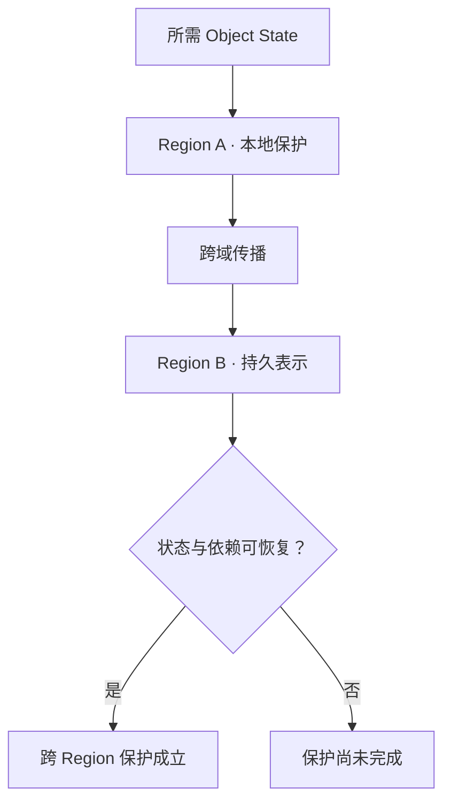

# Cross-region Protection：本地提交之后，远端保护何时成立

[Failure Domain & Placement](03-failure-domain-placement.md)说明了冗余必须跨越预期故障域。本篇把边界扩大：**整个 Region 不可用时，哪里还保存着可以独立恢复的状态？** 关注当前状态的地理保护材料；历史恢复点由下一篇 Backup 讨论，切换业务由 10 的 Disaster Recovery 承接。

**适用范围：**通用架构模型与工程推导。Region 表示一个需要整体考虑的地理故障域，不规定云厂商的区域定义、CRR 接口或内部协议。g1 / g2 等是示意 Generation，不是可排序的 S3 Version ID。

## 1. 本地冗余为什么不能覆盖整个 Region？

Region A 中的 Replica / EC Fragment 即使分散到多个 Node、Rack 或 AZ，仍可能依赖同一个区域电力、网络或服务域。A 整体不可用时，局部冗余预算并不能自动变成远端恢复来源。

Cross-region Protection 把所需状态传播到 Region B，并在那里建立可恢复的持久表示。B 可以使用不同的本地保护布局；不要求逐个复制 A 的内部 Fragment。需要保护的是声明范围内的对象状态及其关联，而不仅是某组物理字节。

图示为逻辑责任，不代表独立服务或固定调用顺序。**跨 Region 不自动等于独立。** 若两侧依赖同一不可用的 Control Plane、凭据、Metadata 服务、网络出口或 Key Management，远端字节可能仍无法被使用。同一管理权限造成的误删除，也可能同时影响两侧。独立性应对应需要覆盖的故障，而不是只看地理距离。

## 2. 远端条件是否进入客户端成功路径？

沿用 [Replication 的 Write ACK](01-replication.md)，先问成功响应承诺了什么，再讨论同步或异步。

| 模型 | 客户端成功前需要满足什么 | 收益与代价 |
| --- | --- | --- |
| Synchronous | 声明的远端持久化与状态提交条件进入确认路径 | 可以缩小已确认状态的地理保护缺口；WAN 延迟进入关键路径，远端故障可能限制本地写入可用性 |
| Asynchronous | 先完成本地提交，再推进远端保护 | 前台无需等待完整跨域保护；远端尚未完成的状态形成损失风险窗口和后台积压 |

“同步”仍需说明等待的是远端接收、持久化，还是可恢复状态已提交。远端收到 Buffer 的确认不能自行提升为 Durability 保证。同步保护也只覆盖契约声明的故障模型，不能据此宣称所有灾难都没有数据损失。

**Async Replication ACK ≠ Remote Copy Already Durable。** 本地 PUT 成功只证明本地确认条件满足；如果立即失去 A，B 可能还没有这次状态。异步复制通常也不能消除 WAN 成本，只是把传输、计算和等待移到了前台确认之外。

## 3. 从 Local Committed 到跨域保护完成

以下是通用示意状态，不是产品状态名：

| 状态 | 已知事实 | 尚不能推定 |
| --- | --- | --- |
| Local Committed | A 已提交所需状态 | B 已拥有该状态 |
| Pending Remote Protection | 状态已进入传播范围，等待执行 | 所有待传播工作都已传输 |
| Transfer | 正文或状态记录正在传输 | 接收完成、内容有效或已持久化 |
| Remote Verified | 已按预期身份、范围与校验记录验证内容 | 单凭 Checksum 就能证明 Metadata 已提交、所有恢复依赖可用 |
| Protected Across Regions | B 的数据、关联状态及声明的保护条件已成立 | 业务已经可以直接 Failover |

远端确认丢失时，发送方可能不知道 B 是否已经提交。应按稳定 Operation Identity 重试或查询所需状态，不能把重复发送等同于重复产生新状态，参见 [Retry / Idempotency](../06-distributed-systems/03-retry-idempotency-deduplication.md)。

“Local Durable”和“Cross-region Protected”应能分别观察。记录可以是每个状态的保护结果或某种提交进度边界，不要求固定 Replication Log。只有当边界的语义明确时，才可以用它概括一组对象。

## 4. Lag 的时间口径与工作量口径

Time Lag 可以描述最旧未保护状态距本地提交已经多久，或本地与远端已确认进度的时间差。Amount / Backlog 则描述待保护的操作数、对象数或字节数。两者回答不同问题：少数大型对象可能只有少量操作，却需要很长传输时间；大量小对象可能主要消耗 Metadata 与 RPC。

指标必须注明范围、采样时间和“完成”条件。仅计算已传输正文会漏掉未发布的 Metadata；只观察某个分区，也不能代表整个 Namespace。没有新写入时，按时间戳定义的指标还需要区分“没有积压”和“监测失联”。

**Replication Lag 是运行状态，RPO 是恢复目标。** 一次 `lag = 3 seconds` 的示意读数不能证明任意灾难只能丢失三秒数据，更不能证明所有 Key 组成了一致恢复点。目标和灾难时的实际恢复点在 [Disaster Recovery / RPO / RTO](../10-recovery-operations-observability/11-disaster-recovery-rpo-rto.md)中区分。

## 5. Overwrite / Delete 传播的是状态演进

假设同一 Key 按已提交顺序经历下列状态；此处没有多写者并发，DELETE 也具有可判定先后关系的状态身份。

| 本地状态 | 远端必须解决的问题 |
| --- | --- |
| g1：正文 A | 正文、Metadata 和状态身份需要形成关联 |
| g2：覆盖为 B | 迟到的 g1 不能重新变成 current |
| DELETE：名字逻辑不可见 | 不能只删除正文而丢失删除状态的顺序依据 |
| g3：重新创建 C | 迟到的旧 DELETE 不能把新对象再次隐藏 |

因此需要处理 Ordering、Duplicate Delivery、Retry 和 Stale Propagation。操作可以携带所属对象、预期状态、提交顺序依据与稳定身份，由接收侧按契约判断是否可应用。**收到一个较大的序号不是合法提交的充分证明**；排序依据必须对应真实提交状态与正确范围。

这不要求全系统使用一个全局顺序，也不规定日志实现。若承诺只保护当前状态，系统可能在符合契约时合并中间更新；若承诺保留历史版本，就必须同时保护相应历史关系。删除是否传播、保留哪些版本，也必须由保护范围明确，不能默认所有实现一致。

重复应用 g2 可以设计为同一效果，但重新创建新版本或重新分配资源未必天然幂等。内容 Checksum 相同也不能代替 Operation ID 或 Generation。参见 [Checksum / Integrity](04-checksum-data-integrity.md)及[对象状态的可观察保证](../08-consistency-metadata-partitioning/01-consistency-observable-state.md)。

## 6. 复制正确工作，也可能传播错误状态

应用把正确内容 A 合法覆盖成错误内容 B，随后 B 通过校验并复制到另一 Region。跨域复制此时可能完全符合契约，却让两侧 current 都变成 B。误删除、应用 Bug 和某些损坏状态也可能被继续传播。

**Cross-region Replication ≠ Backup。** Checksum 能判断是否符合预期字节，不能替业务判断 B 是否应该存在；地理隔离不能自动保留覆盖前的 A。恢复过去状态需要历史保留和可恢复流程，这正是 [Backup / Restore](07-backup-restore.md)的主题。

Primary / Secondary 或 Active / Passive 是常见角色安排，不是所有跨域系统的固定结构。若多个站点都能修改同一逻辑状态，还需要处理 Ownership、Conflict、Ordering、Split Brain 与 Consistency。它们不能由“有两份远端数据”自然解决；本篇不设计 Multi-writer Protocol。

## 7. 适用边界与资料

本篇从已有 Replication / Failure Domain / Integrity 模型推导跨域保护边界，没有断言 AWS S3 CRR 的状态名、版本传播规则或配置能力。保护材料可用之后，仍需恢复服务资格、Metadata、依赖和 Routing，见 10 的灾备正文。

- [AWS Well-Architected：Plan for disaster recovery](https://docs.aws.amazon.com/wellarchitected/latest/reliability-pillar/plan-for-disaster-recovery-dr.html)：用于核对跨域恢复策略与业务恢复目标的关系；具体服务功能不作为通用契约。
- [Google SRE：Data Integrity](https://sre.google/sre-book/data-integrity/)：用于核对冗余与恢复材料的互补关系，不沿用其中产品实现或时间参数。

核对日期：**2026-10-02**。状态表、g1 → g2 → DELETE → g3 与 Lag 口径为限定范围的通用示意
