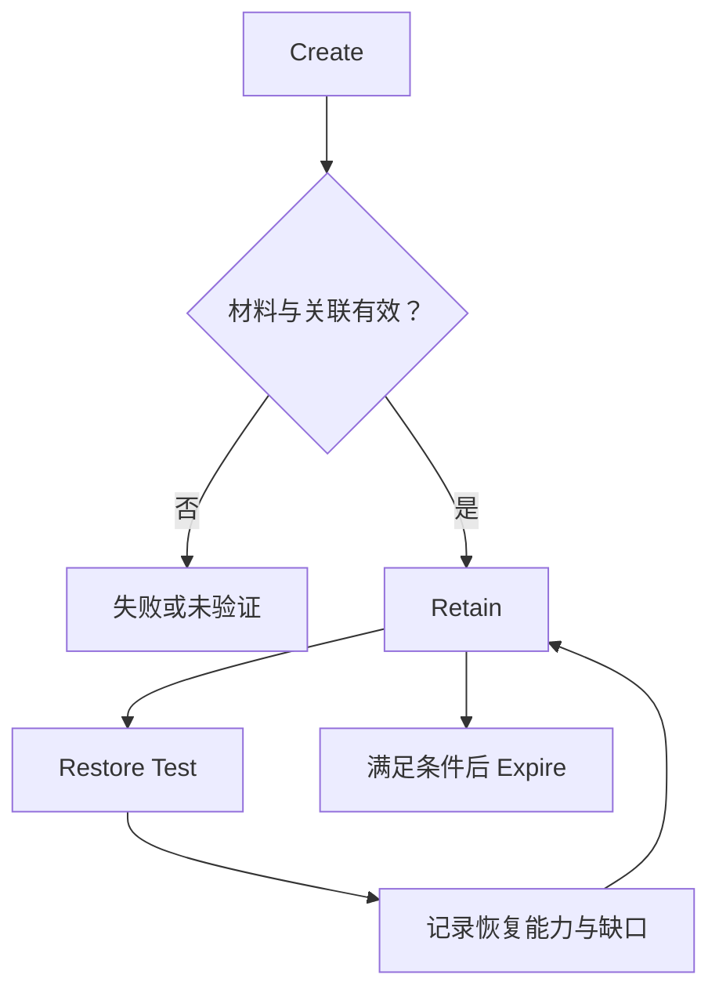

# Backup / Restore：保留过去状态，更要保留恢复能力

[Cross-region Protection](06-cross-region-protection.md)让当前状态跨越更大的故障域。但如果当前状态本身错误，更多 current 副本不一定有帮助。本篇回答：**过去正确的状态在哪里，系统能否真正把它恢复为可使用的状态？** 关注保护材料及恢复能力；灾难时的资格切换、服务激活和时间目标由 10 承接。

**适用范围：**通用工程模型，不规定备份软件、介质、云产品或合规策略。A / B、T1 / T2 / T3 均为示意状态与时刻，不假定 Namespace 具有多对象事务。

## 1. Replication 正常工作，为什么仍需要 Backup？

| 时刻 | 操作与状态 | 冗余系统的结果 |
| --- | --- | --- |
| T1 | 当前状态 A 正确 | 多副本保存 A |
| T2 | 应用误覆盖成 B，操作合法提交 | 当前状态变成 B |
| T3 | B 传播到全部保护站点 | 各站点正确地保护了错误业务状态 B |

若没有其他历史保留，A 可能已经不是任何 current Replica 的内容。复制并未失效：它保护的是已提交状态，不负责判断应用操作是否符合业务意图。

Replica 的主要目标是当前所需状态的冗余；某些复制系统也保留历史，但这不是复制自动提供的保证。Backup 的核心价值是**独立保留可回到过去的恢复材料**。它也可能备份错误 B，因此需要覆盖错误发生前的有效 Recovery Point，而不是仅仅追求“最新备份”。

独立不是要求每次复制全部字节，而是对应要覆盖的故障与删除边界。备份自身仍需要冗余和 Integrity 保护；损坏或不可获取的历史材料不能提供恢复能力。

## 2. Version、Snapshot 与 Backup 不是同一个承诺

[Versioning / Delete](../03-object-storage/05-versioning-delete.md)说明了当前视图、历史版本与显式版本删除的区别。版本历史可以成为恢复材料，但 **Versioning ≠ Backup**：保留多久、谁能删除、同一账号或 Control Plane 是否同时失效、Catalog 是否可恢复，以及恢复流程是否经过验证，都影响实际能力。

| 机制 | 主要目标 | 需要另行判断的边界 |
| --- | --- | --- |
| Replica | 当前所需状态冗余 | 是否覆盖共同故障或合法错误传播 |
| Snapshot / Point-in-time State | 某一时点或声明一致范围内的状态引用 | 所需范围是否完整、共享底层数据是否仍可用 |
| Backup | 保留并可恢复的历史保护材料 | 独立性、Retention、依赖、Integrity 与 Restore 能力 |

Snapshot 不一定复制全部数据。Copy-on-write 或 Reference-based Snapshot 可以共享底层单元，建立恢复点很快，却仍可能依赖同一设备、存储服务或引用链。因此 **Snapshot ≠ Automatically Independent Backup**。是否可作为备份材料，要检查其故障独立性与导出、保留、恢复条件；本篇不展开快照算法。

## 3. Backup Scope 必须覆盖“怎样解释字节”

只保存 TB / PB 的正文，不知道属于哪些对象、Generation 或恢复点，无法重建正确 Namespace。可能需要一起保留：

- Data、Object Metadata、Namespace，以及声明范围内的版本关系。
- Catalog / Manifest：记录备份范围、状态身份、材料位置、大小、校验与依赖。
- Restore 所需配置、权限关系及 Encryption / Key 依赖。

Catalog 本身也是需要保护、验证和定位的状态。增量备份如果依赖某个 Base 及后续材料链，任意必要部分失效都可能让恢复点不可用。材料存在与引用关系完整必须同时成立。

备份中的正文和 Metadata 应对应声明的恢复边界，不能把 g1 的 Layout 与 g2 的正文拼成一个“完成”集合。单 Key 的完整状态也不自动意味着整个 Namespace 是原子快照，参见 [Metadata / Object Index](../08-consistency-metadata-partitioning/02-metadata-object-index.md)及 [Consistency](../08-consistency-metadata-partitioning/01-consistency-observable-state.md)。跨对象一致范围必须明确说明，不由备份名称推定。

## 4. Create / Verify / Retain / Expire 是能力生命周期

Create 形成材料与 Catalog；Verify 判断范围和 Integrity；Retain 在所需窗口内保持材料及依赖；Expire 在保留要求满足后允许退出恢复集合。Restore Test 应在保留期间进行，而不是等材料过期后才尝试恢复。

这是逻辑生命周期，不规定 Scheduler。Retention 需要平衡历史恢复需求、容量成本、政策要求和过时材料的可用性。保存更久不自动保证旧格式、密钥或配置仍可恢复。删除一个 Base 前，还要确认没有仍需保留的恢复点依赖它；此处只说明依赖约束，不展开 GC。

若备份与生产完全共享 Credentials、Deletion Authority 和 Failure Domain，误操作或凭据失陷可能同时销毁两者。Separate Administrative Boundary、Immutable Retention、Offline / Logically Isolated Copy 可以覆盖不同风险，代价是管理、验证和恢复访问更复杂。隔离材料同时也要保留可用的密钥与恢复权限，不能只得到无法解密的独立字节。

## 5. Restore 的目标是可使用状态，不是复制进度

一个通用 Restore 可以按以下逻辑推进；实现可并行或合并阶段：

| 阶段 | 需要证明什么 |
| --- | --- |
| Select Recovery Point | 选定有效时点、范围，以及接受哪些较新状态缺口 |
| Locate Backup Material | Catalog、Base / Incremental 依赖与密钥可获得 |
| Restore Data / Metadata | 所需正文及解释它的状态共同恢复 |
| Verify Integrity | 按预期身份、范围和可信校验验证，不把旧但完整的状态误当成新状态 |
| Rebuild Required Index / Layout | 恢复环境能够定位、保护和读取数据；不要求沿用原物理地址 |
| Publish / Make Available | 通过合法提交边界发布恢复状态 |
| Validate Application-visible State | 目标恢复点、Namespace、权限、配置、Routing 与实际访问满足声明要求 |

恢复历史状态不是普通 Repair：Repair 补齐当前所需状态，Restore 可以有意选择过去的状态。若把历史内容重新发布为当前状态，应通过新的合法状态转换完成，而不是把旧 Generation 偷偷伪装为最新提交；读取历史材料本身也不改变 current。

## 6. Backup Exists 不等于 Restore Proven

校验材料能够提高对字节的信心，但不能独立证明恢复流程会找齐所有依赖、重建索引、获得权限并满足服务目标。**Restore finished copying ≠ Application successfully recovered。**

Restore 可能比创建 Backup 慢很多：创建可以持续分摊增量，恢复却可能需要重新处理长依赖链、重建 Metadata / Index 和保护布局。副本存在、校验通过、复制速度和业务恢复时间是不同证据，不能只用 Backup Job 的成功状态代替它们。

Restore Test 应记录实际覆盖范围、所用恢复点、缺失或跳过材料、内容验证结果与耗时。一次小范围测试成功不能证明任意规模灾难都可恢复；当前版本、配置、密钥与容量变化后，旧证据的适用条件也需要重新判断。本篇只建立恢复验证原则，不展开 Failure Drill。

## 7. 资料与下一步

- [Google SRE：Data Integrity](https://sre.google/sre-book/data-integrity/)：用于核对以恢复需求设计备份、历史保留与恢复依赖的原则，不采用其中产品参数作为通用建议。
- [AWS Well-Architected REL09-BP04：Periodic recovery testing](https://docs.aws.amazon.com/wellarchitected/latest/reliability-pillar/rel_backing_up_data_periodic_recovery_testing_data.html)：用于核对验证可访问内容与恢复过程的必要性，不引用备份产品接口契约。

核对日期：**2026-10-02**。状态表、生命周期与 Restore 阶段为通用示意；Versioning 的具体产品行为只回链已有文章，不新增 AWS S3 配置或 API 断言。

已有跨域当前状态或历史材料以后，还需要决定谁能写、激活哪里、怎样切换并验证业务，继续阅读 [Disaster Recovery / RPO / RTO](../10-recovery-operations-observability/11-disaster-recovery-rpo-rto.md)。

[上一篇：Cross-region Protection](06-cross-region-protection.md) · [章节入口](README.md) · [下一步：Disaster Recovery](../10-recovery-operations-observability/11-disaster-recovery-rpo-rto.md)
