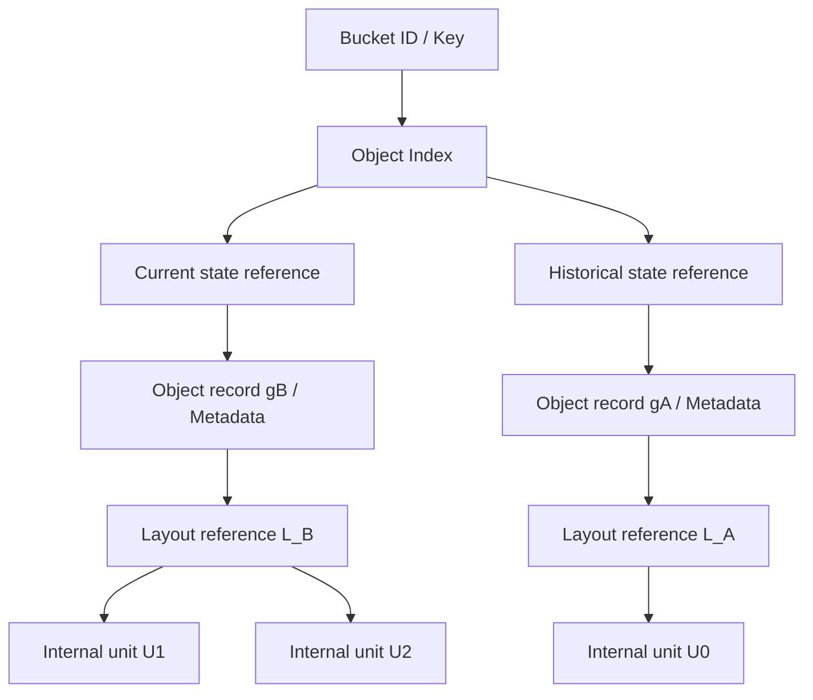

# Metadata / Object Index：如何记录与定位对象状态

一组 Data Node 已保存新对象的字节，为什么用户仍可能 GET 不到它？反过来，Index 中已经有了一个 Key，为什么也不能仅凭这一条记录返回写入成功？[上一篇](01-consistency-observable-state.md) 规定了可观察结果，本篇解释把这些结果变成系统状态所需的记录与提交边界。

以下是**通用职责模型与工程推导**。Object Index、Object Record、Layout Reference 可以合并存储，也可以由多个组件维护；图中的逻辑层不表示必须存在同名独立服务。对象与内部单元的区别沿用 [Object Layout](../03-object-storage/06-object-layout.md)，不再重复分块与聚合设计。

## 1. Metadata 不只是对象的几个标签

对象存储需要回答三个问题：这个名字存在吗、它现在代表什么、到哪里获得对应数据。用户自定义 Metadata 只是其中一部分。

| Metadata 职责 | 记录或表达什么 | 为什么需要 |
| --- | --- | --- |
| Namespace Metadata | Bucket 身份、Key 成员关系、命名空间相关规则 | 解释名称、做 Namespace 查询和访问约束检查 |
| Object Metadata | 对象大小、属性、用户 Metadata、版本相关状态 | HEAD 与 GET 必须解释同一个对象状态 |
| System / Internal Metadata | Generation、提交状态、数据引用、内部映射及其有效性 | 判断哪一组数据已发布，如何读取，以及哪些引用仍有效 |

这些分类可以重叠，是职责划分，不是三套互不相交的数据库表。权限规则也可能由另外的授权系统维护；并非所有 Namespace 信息都应重复写进每个对象记录。

**Object Index** 是按逻辑身份查找对象状态的入口。例如 `(Bucket ID, Key)` 找到当前状态引用；启用并保留版本历史的系统，还可能提供历史状态入口。Index 不是对象字节本身，也不一定把所有属性和物理地址直接放在一条索引项中。

## 2. 从名字到一组确定的数据引用

下面以一次覆盖后保留历史引用的通用示意为例。`gA / gB` 是内部对象 Generation，`L_A / L_B` 是逻辑布局标识，均不是某个产品的实际 ID。

当前引用选择的是一份**状态记录**：属性与布局引用必须共同描述 `gB`，而不是从一个缓存取最新大小，再从另一个缓存取 `gA` 的旧 Layout。历史引用是否存在、是否对用户开放，取决于产品的版本契约与保留规则；没有启用版本功能，也仍可能需要内部 Generation 区分覆盖前后的记录。

应继续区分三类标识：

- 用户可见的 Object Version ID 标识 API 层版本，语义见 [Versioning / Delete](../03-object-storage/05-versioning-delete.md)。
- 内部 Object Generation 标识某次对象状态演进或记录，未必暴露给用户，也未必与 Version ID 一一对应。
- Partition Ownership Epoch 标识修改资格的一轮归属，不是对象版本；在 [下一篇](03-partition-ownership-routing.md) 使用。

Layout Reference 连接逻辑对象和内部数据单元。映射可以是显式列表、分层引用，也可以结合可计算规则，并不要求每一层都是一次远程 RPC。Replication / EC 与物理位置在此引用之下继续组织，参见 [Data Protection](../07-data-protection/README.md)。Multipart Part 仍属于上传会话，不能把一个 Part Number 当成这里通用的内部单元地址。

## 3. Object identity 与 physical location 解耦

Key 表示用户找到对象的逻辑身份；某个磁盘地址或 Data Node 则表示当前物理位置。覆盖、故障或资源调整都可能使布局改变，却不应该要求用户改 Key 才能继续 GET。

解耦解决了位置变化对 API 身份的侵入，但引入了代价：映射本身需要正确性、可恢复性与查询能力。系统必须知道某条位置记录适用于哪个对象状态，不能仅因地址还能读到字节就认定其正确。

这里还应分开“逻辑对象更新”和“等价数据的位置映射更新”。前者改变当前对象状态；后者可以保持同一对象内容与身份。但两类更新都需要避免读者选到不完整或不再有效的引用。具体迁移与恢复流程不在本篇展开。

## 4. Metadata 如何进入 GET、PUT 与 LIST

对于 GET，一个通用过程是：解析 Bucket / Key，选择请求所需的当前或历史状态，取得与其绑定的属性和 Layout Reference，再定位并读取内部单元。即使实际实现把步骤合并或使用缓存，也必须保证最终返回的数据和 Metadata 属于同一个被选择的状态。

对于 PUT，系统需要准备新状态所需的数据与记录，在满足约定条件后发布当前状态。这里的“发布”包括使相关读取入口能够选择新状态；若契约包含强一致 LIST，Namespace / Index 的可见性也在承诺范围内。是否还经过其他确认阶段，应参考 [Read / Write Path](../03-object-storage/03-read-write-path.md)，不能从这一抽象模型推断唯一调用顺序。

LIST 通常依赖 Namespace / Index：查询哪些逻辑名称属于某个范围，并获取允许展示的状态。直接扫描所有 Data Node 的物理单元，既难以区分历史、上传中与当前状态，也把查询成本绑定到内部布局。索引有时可以从可靠事实重建，但在线 LIST 仍需要一个能表达逻辑 Namespace 的查询结构；本篇不规定 B+Tree、LSM Tree 或具体引擎。

## 5. Data 与 Metadata 的提交边界

用 `D_B` 表示新状态的数据，用 `M_B` 表示其对象记录与引用。**Data ready** 指满足本次写入契约需要的数据可读性与持久化条件，不是仅指某节点刚收到了字节。**Metadata published** 指新状态进入约定的可见范围，也不只是某个私有缓存里出现了记录。

| 发生的状态 | 用户与系统面对的问题 | 必须保留的边界 |
| --- | --- | --- |
| `D_B` 已准备，`M_B` 尚未发布 | 用户仍可能读到旧状态；新字节存在却不是 Current Object | 存在不等于可见，也不能仅凭 Data ready 返回已完成对象提交 |
| `M_B` 已发布，`D_B` 不可读或未满足保护条件 | GET 可能失败；或当前能读但已承诺的持久性没有实现 | 不能让已承诺的新状态依赖尚未满足条件的数据 |
| Metadata 更新被明确拒绝，原子发布没有生效 | 旧状态保持当前；准备数据可能仍存在 | “拒绝且未生效”需要明确结果，不应由 Timeout 推断 |
| Metadata 更新结果未知 | 新状态可能已发布，也可能没有 | 通过状态查询或同一 Operation ID 恢复结果；不能立即把候选数据当作垃圾 |
| 读取入口使用 stale Metadata | 可能继续选择旧 Layout，或使用失效的位置引用 | 是否合法取决于读取契约与请求的版本，不能一律当成允许的旧读 |

实际系统可以使用不同的提交协调方式。表格列出的是任何实现都需要解释的状态；并不规定“先写一条数据、再写一条索引”足以实现原子发布。若对象记录、Current Reference 与 Namespace Index 分开维护，还必须说明它们如何共同满足对外保证。

Metadata update 失败同样有 Partial Failure：记录写入成功，Response 丢失，协调者无法确定结果。这个 Unknown Commit Result 与已有 [Timeout](../06-distributed-systems/01-failure-model-timeout.md) 和 [Retry / Deduplication](../06-distributed-systems/03-retry-idempotency-deduplication.md) 是同一类边界，不需要重新发明“超时即未执行”的解释。

## 6. Stale Metadata、Orphan 与 Unreachable Data

“旧 Layout”不一定是错误：指定历史版本的请求本来就可能读取它。错误出现在当前状态请求按契约必须观察 `gB`，却因未经有效性检查的缓存仍选择 `gA`；或者位置引用已不适用于被选择的 Generation，却仍被用于访问。Object Record 缓存与物理位置缓存也可能有不同的失效边界。

**Unreachable Data** 描述从某个有效逻辑入口找不到数据引用的情况。字节可能还在，但缺失 Index / Layout Mapping 后，正常 GET 未必能够找到它；它也可能仍能从其他可靠记录恢复身份与引用。

**Orphan Data** 通常指失去了有效引用或归属的数据候选，例如未成功发布的新单元。判定前必须考虑历史版本、未完成但合法的写入会话、已提交记录和仍有效的读者引用。当前 LIST 看不见，远不足以证明它是孤儿；尚未发布也不代表能马上物理删除。

因此，Logical visibility 与 Physical existence 是两个轴。版本删除、上传中数据和其他不可见状态的语义见现有 [Versioning / Delete](../03-object-storage/05-versioning-delete.md) 与 [Multipart Upload](../03-object-storage/04-multipart-upload.md)。Reference Cleanup / GC 需要另外的有效引用判断，本轮只保留问题入口，不设计回收流程。

## 7. Data durability 不自动等于 Object state recoverability

假设所有数据单元都有足够冗余，但系统丢失了 Key 对应哪个 Generation、布局如何组装、哪个状态已提交的记录。它保住了字节，却未必能恢复用户期望的 Object State。

Object state recoverability 至少需要能恢复逻辑身份、状态属性、布局引用及提交 / 可见状态。必要事实可以直接持久化，也可以从其他受保护的可靠记录重建；不要求每个缓存和位置字段都永久写在同一数据库里。关键是恢复依据不能只存在于已经失效的节点内存中。

Metadata 同样需要 Availability：数据节点正常，关键索引不可查询，也可能无法服务 GET / PUT / LIST。更高的数据 Replication Factor 不能自动消除这个瓶颈。公开的 [GFS 原论文 §2.6](https://research.google.com/archive/gfs-sosp2003.pdf) 展示了 Namespace、逻辑映射、位置等不同 Metadata 职责，以及持久记录与可重建位置状态的区别；这是文件系统的历史案例，不是本仓库对象存储图的产品实现。

这也解释了为何 Metadata 规模变大后不能无限集中：保存正确状态之外，还要承担查询、更新和 Namespace 遍历的负载。[下一篇](03-partition-ownership-routing.md) 将逻辑状态划为 Partition，讨论归属与路由，不展开数据库引擎。

[上一篇：Consistency / Observable State](01-consistency-observable-state.md) · [下一篇：Partition / Ownership / Routing](03-partition-ownership-routing.md) · [返回章节入口](README.md)
