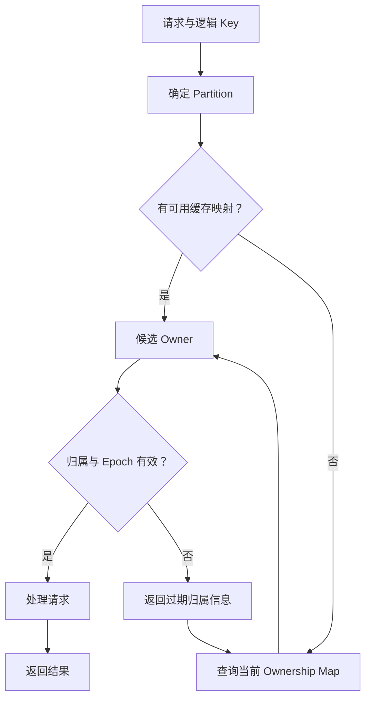

# Partition / Ownership / Routing：谁负责状态，请求去哪里

如果整个 Namespace、Object Index 和布局映射都由一个节点处理，容量、查询 QPS、更新吞吐和故障影响范围都会逐渐受到限制。[上一篇](02-metadata-object-index.md) 说明了这些记录为何必要；本篇讨论如何分摊逻辑状态，以及客户端如何找到有资格处理它的入口。

以下是**通用架构模型**。Partition 的定义、Owner 的组织方式和路由实现随系统而异；Hash / Range 是两种常见选择，不是某个产品的标准答案。本篇只建立 Ownership 转移的必要边界，不写迁移、Rebalance 或 Membership 协议。

## 1. Namespace → Partition / Shard

Partition 把一组逻辑状态划为可管理的子集。比如某组 Bucket / Key 的对象索引属于 `P1`，另一组属于 `P2`，它们可以分别承担查询与更新负载。

Shard 常被用作相近术语，但不同系统可能把逻辑分区和某份分区副本分别命名。阅读产品资料时需要确认定义。这里的 Partition 不是 Object 的内部数据块，也不是一个 EC Fragment。

**Partition Key** 是决定状态属于哪个分区的输入。例如 `(Bucket ID, Key)`，或其中经过明确规范化的一部分。只用 Bucket ID 划分，可能把一个巨大且活跃的 Bucket 全部集中到同一分区；使用完整 Key 可以分散对象，却可能增加某些 Namespace 查询的跨分区成本。

逻辑 Partition ID、处理它的节点地址和当前 Ownership Epoch 是不同信息。否则节点一变化就相当于改变了逻辑身份，客户端也难以判断旧地址是否仍有效。

## 2. Hash 与 Range：交换的是分布和查询局部性

| 方式 | 通用划分方式 | 适合的需求 | 主要代价 |
| --- | --- | --- | --- |
| Hash Partition | 对 Partition Key 做哈希，映射到逻辑分区 | 分散大量独立 Key，避免名字排序直接决定聚集位置 | 不自然保持 Key 顺序；前缀 / 范围查询可能要跨分区或依赖额外有序索引 |
| Range Partition | 按约定排序，将连续 Key 区间划给不同分区 | 有序遍历、前缀或范围查询的局部性 | Key 分布不均或连续写入可集中到某个区间；边界调整需要更新归属信息 |

一个固定 Bucket 的示意 Range 可以是 `P1: Key < "m"`、`P2: Key >= "m"`，前提是明确字符串排序和边界规则。实际复合键排序未必这样定义；例子只用来说明同一区间共享归属。

Hash 分散的是键映射，不是每个 Key 的访问次数。键数量近似均匀，也不保证字节数或 QPS 均匀；不同分区的可用资源还可能不同。Range 保持顺序，也不意味着所有 LIST 都只访问一个分区：查询范围仍可能跨过边界。

同一个系统可以给对象点查和 Namespace 遍历维护不同索引。但额外索引增加状态和提交责任，仍需满足 [Observable State](01-consistency-observable-state.md) 中的可见保证，不能把两张索引的更新差异无条件暴露给用户。

## 3. 数据均衡与访问均衡是两件事

| 情况 | 不均衡的是什么 | 为什么普通划分不足以说明问题已解决 |
| --- | --- | --- |
| Data Skew | Key 数量、Metadata 大小或对象字节数 | 相同 Key 数不代表相同空间，Metadata 规模与 Data 规模也不同 |
| Hot Key | 一个逻辑 Key 的访问频率或竞争强度 | 把其他 Key 移走，也未必降低该 Key 的读写压力 |
| Hot Partition | 一个分区的总访问、更新或扫描负载 | 可以来自单个 Hot Key，也可以来自很多中等热度 Key 的叠加 |

一个占空间很大的冷分区和一个只有少量 Key 的热分区，需要解决的瓶颈不同。只按容量做均衡，可能仍留下严重的请求排队；只按当前 QPS 分配，又可能耗尽存储空间。

把包含 Hot Key 的 Range 拆小，不会自动把同一个逻辑 Key 的串行修改拆到多个独立 Owner。是否能分摊读取、改变数据模型或降低竞争，需要另外的策略；本轮不展开 Hotspot Mitigation。

## 4. 三种机制、两个 Partition 含义

首先区分术语：**Network Partition** 是通信受阻，参与者无法按预期交换消息；**Data Partition / Shard** 是主动划分逻辑状态。一个健康运行的分布式系统也有 Data Partition；网络分区则可能让某个分区的 Owner 不可达。故障含义见 [Failure / Timeout](../06-distributed-systems/01-failure-model-timeout.md)。

另外，Partitioning、Placement、Routing 回答的是三个问题：

| 机制 | 决定什么 | 示例 |
| --- | --- | --- |
| Partitioning | 逻辑状态如何分组 | 哪些 Key 的 Index 属于 `P1` |
| Placement | 受保护的数据单元或其副本 / 分片放在哪些资源与 Failure Domain | 某个内部单元的 Replica / EC Fragment 分布在哪些节点与机架 |
| Routing | 本次请求送到哪个处理入口 | 查询 `P1` 当前归属后，把 Metadata 请求发给对应服务组 |

Metadata Partition 自身也需要保护与放置；这是对它应用 Placement，并不使 Partitioning 与 Placement 成为同一概念。一个 Partition 的 Owner 也不必持有其所有对象的 Body：它可以通过 Layout Reference 定位分布在其他 Data Node 的内部单元。适当故障域与放置取舍继续以 [Failure Domain & Placement](../07-data-protection/03-failure-domain-placement.md) 为入口。

## 5. Ownership 与 Ownership Map

Ownership 表示对某个 Partition 承担处理责任与修改资格。Owner 可以是一个节点，也可以是一个受保护的服务组；组内是否再有 Leader，是另外的实现选择，不要求所有系统采用同一模型。

一个通用 Ownership Map 可能表达：Partition ID、其覆盖的 Key 范围或 Hash 空间、当前 Owner / Endpoint、Ownership Epoch 和状态。Partition 函数回答“属于哪个逻辑分区”，Map 回答“现在由谁负责”。两者可以组合，也可以分开查询。

Map 本身是系统状态，需要可恢复和可查询。让所有数据请求都经过一个中央 Map 节点，又可能形成新的瓶颈，因此常见工程选择是缓存映射或分层发现。缓存减少查找成本，也引入 stale routing information：一个地址曾经正确，并不保证现在仍有资格修改。

Map 也不是一个永久 Ownership 证明。客户端带着旧 Map 找到 Old Owner 时，服务端与实际资源写入入口仍需要检查修改资格，而不能因为请求已经路由到这里就接受。

## 6. Routing 缓存失效时怎么办

下图只展示 Metadata / Index 请求的通用路由职责，不表示对象字节必须经过 Map 服务，也不要求每次请求都重新远程查询 Map。

实际客户端需要限制刷新和重试次数，避免转移期间形成无休止的请求放大。若 Map 也暂不可达，缓存可以帮助仍有效的路由，却不能凭空延长修改资格或消除未知结果。

还要分开两类返回：明确拒绝、且接口保证未执行的请求，可以按该契约重新路由；Timeout 或含糊错误则仍可能已经生效。不能把所有“可能发错节点”的错误都当成无副作用，再换 Owner 生成一个新的操作。稳定的 Operation ID 与去重边界应复用 [Retry / Idempotency / Deduplication](../06-distributed-systems/03-retry-idempotency-deduplication.md)。

## 7. Ownership Change：Map 变了还不够

Split、Merge、Rebalance 或 Node Change 都可能改变归属。本篇只讨论从 Old Owner 到 New Owner 的生效边界，以下 `e7 / e8` 是通用示意 Epoch：

| 基本状态 | 修改资格 | 要解释的边界 |
| --- | --- | --- |
| Old Owner，Epoch `e7` | 在当前授权仍有效时处理该分区 | 客户端缓存可能指向这里 |
| Ownership Transition | 必须有明确的权限切换规则；可以暂时暂停修改 | 仅修改 Map 不足以阻止旧执行者，新的处理方也必须具备所需已提交状态 |
| New Owner，Epoch `e8` | 按新授权处理；旧 Epoch 的修改受到拒绝 | Old Owner 恢复或延迟请求到达，都不能重新获得旧资格 |

这不是数据搬迁步骤表。转移如何传递状态、实现 Split / Merge 或调度资源留给后续；这里的最低要求是：**修改资格、已提交状态与对外切换不能互相矛盾**。不能让 New Owner 从更旧状态开始确认更新，也不能只靠“旧节点应该已经停了”。

已有 [Lease / Epoch / Fencing](../06-distributed-systems/02-quorum-leader-lease-fencing.md) 提供了协调基础：Lease 约束授权时间；Epoch 区分归属轮次；Fencing 让实际接受修改的资源拒绝失效授权。在沿用前文门槛安装的示意模型时，New Owner 开始确认 `e8` 修改前，实际执行入口的门槛应已生效，并与效果提交协调；仅授予更高 Epoch 或刷新 Map，都不能替代这一检查。

Old Owner 从暂停或网络隔离中恢复，内存中的 `e7` 和本地数据仍存在，不证明它现在有权写。Ownership Epoch 也不是对象 Generation：一次分区归属变化可能涉及很多对象，而某个对象的新版本不表示整个分区换了 Owner。

同一操作跨 Owner 重试时，去重事实也不能仅停留在旧进程中，否则新处理方可能重新执行。这里只指出 Dedup State 的归属与可恢复性要求，不展开跨 Owner 的迁移协议。

## 8. 从可见状态到负责它的入口

这三篇形成了一个完整的最小链条：Consistency 限定客户端观察；Metadata / Object Index 记录状态及数据引用；Partition 分摊这些逻辑记录，Ownership 限定修改资格，Routing 找到处理入口。字节的 Replica / EC Fragment 如何放置，则继续属于 Data Protection 的职责。

公开的 [Bigtable 原论文 §2、§5.1](https://research.google.com/archive/bigtable-osdi06.pdf) 展示了按行范围划分 Tablet，以及客户端缓存位置、失效后重新查找的历史案例。它支持理解 Range 与路由缓存的工程问题，不代表对象存储必须采用 Tablet 或同样的查询层次；本轮也不展开其存储引擎与协调实现。

[上一篇：Metadata / Object Index](02-metadata-object-index.md) · [返回章节入口](README.md) · [数据保护中的 Placement](../07-data-protection/03-failure-domain-placement.md)
