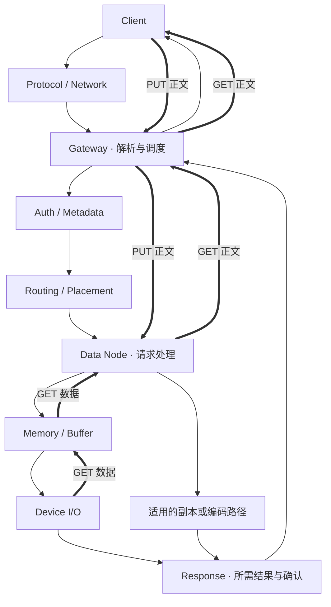

# End-to-End Cost Model：性能成本发生在哪里

设备读写很快，为什么一次 GET 仍然很慢？链路标称带宽很高，为什么应用吞吐远达不到它？分析分布式存储性能，首先要知道一次请求消耗了哪些时间与资源，而不是从某个硬件参数直接推导系统能力。

本文沿 **Client → Protocol / Network → Gateway → Auth / Metadata → Routing / Placement → Data Node → Memory / Buffer → Device → Response** 建立通用成本模型。这些是逻辑职责，可以合并、并行、复用或绕过，不要求每个系统都有独立 Gateway、Metadata Server 或固定调用顺序。对象状态与提交语义回看 [Read / Write Path](../03-object-storage/03-read-write-path.md)，这里关注成本位置。

## 1. 先画职责路径，再找实际执行路径

下图以网关代理正文的对象请求为示意，细箭头表示请求控制，粗箭头表示正文方向；正文箭头省略重复的协议与网络节点，不表示传输可以绕过它们。Device 分支只有在实际需要设备访问时才发生，缓存命中或其他持久层会改变路径；不是所有 Auth、Metadata 与 Routing 都需要远程调用。

图中箭头不是准确时序：例如 GET 的部分正文可以在后续范围还未读完时返回，PUT 的接收、校验与下游写入也可能流水化。分析实际系统时，应补上真正发生的 RPC、数据代理跳数、排队位置和等待条件。

**Metadata / Control Path** 携带身份、权限、索引、路由、布局和状态操作；**Data Path** 搬运正文及适用的保护字节。两者可共用线程、连接或设备资源。Control Path 字节量小，不代表它的延迟小；几次串行查找可能让 Data Path 迟迟无法开始。记录职责见 [Metadata / Object Index](../08-consistency-metadata-partitioning/02-metadata-object-index.md)。

## 2. 每一段都有执行成本，也可能有等待成本

| 成本 | 常见发生位置 | 应观察什么 |
| --- | --- | --- |
| CPU Protocol Processing | Client、Gateway、Data Node 的协议栈与接口处理 | 连接处理、协议解析、系统调用及相应 CPU 时间；重用连接与新建连接的路径不同 |
| Request Parsing / Serialization | 请求头、控制 RPC、响应结构 | 字段解析与编码次数、请求数量；通常既有固定成本也有随大小变化的成本 |
| Checksum / Compression / Encryption | Client、网关、数据节点或设备能力承担的处理阶段 | 实际处理字节数、算法与并行度；处理位置与顺序取决于实现，不能假设都发生在 Gateway |
| Memory Copy / Buffer | 应用、协议栈、代理节点、编码与 I/O 缓冲 | 复制次数、实际搬动字节、分配及缓冲占用；缓冲里的等待也可能影响延迟 |
| Network Transfer | 客户端链路、内部数据链路、跨域路径 | 正文与协议字节、往返等待、拥塞及重传；链路能力不等于可用的应用容量 |
| RPC | Auth、Metadata、数据或保护相关的远程调用 | 次数、串行依赖、Fan-out、请求与响应等待；本地函数调用不能一律算作 RPC |
| Metadata Lookup / Routing | 对象索引、布局解析、归属与位置查找 | 查找次数、命中状态、远程访问、过期路由带来的重新查找 |
| Queue Waiting | 客户端连接池、Worker、RPC、网络、设备等入口 | 进入与离开队列的时间、等待中的工作量、可用执行资格 |
| Device I/O | 数据、日志或 Metadata 所需的读写 | 实际请求大小、读写量、完成与持久化等待；不在此展开设备内部实现 |
| Response Path | 服务端组装、下游返回、客户端收取与处理 | 响应头、正文、确认与客户端处理的完成边界 |

Checksum 的计算、额外数据复制与设备访问不必各发生一次。多个代理跳数可能反复处理字节；Compression 可能降低网络量，却增加计算并改变字节分母；Encryption 也可能消耗 CPU 或其他执行资源。必须根据实际路径记录，不能把它们当成必然免费或必然成为瓶颈的功能。

Queue Waiting 不是附属小项：同一个处理阶段执行时间没变，等待时间仍可因竞争成倍增加。反过来，连接池只允许少量并发时，设备可能空闲，而请求正在客户端排队。下一篇将成本与 [Queueing / Concurrency](02-latency-throughput-queueing.md) 连接起来。

## 3. 延迟看依赖链，资源消耗看全部工作

End-to-end Latency 是所选起止点之间的经过时间。串行阶段的等待会累积；并行阶段受返回所需的完成条件影响；流水化则允许不同阶段重叠。不能把各层计时器、所有 RPC 耗时和设备耗时直接相加：它们可能互相包含，或同时发生。

例如，网关 RPC Span 已包含网络与数据节点处理，数据节点 Span 又包含设备等待；再将三者求和会重复计算。即使只选择互不包含的 Span，并行分支的总和也不是请求壁钟时间。需要按依赖关系识别关键路径，同时记录非关键分支的资源成本。

并行复制即使只等待部分合格 ACK，其余复制仍可能持续占用网络和设备；它们不都出现在本次响应延迟中，却影响后续请求的可用资源。**请求关键路径与系统总资源消耗是两种口径。**

流式 GET 还应区分 Time to First Byte 与 Full Response Latency。前者偏向启动、查找和首段处理，后者还包含整个正文传输。仅改善首字节时间，不证明大对象完整下载更快；返回成功响应头，也不等于客户端收齐了所需正文。

## 4. 三个不能跨越的测量边界

| 边界 | 为什么不能等同？ |
| --- | --- |
| End-to-end Latency ≠ Device Latency | 前者还包含 Client、协议、控制查找、网络、排队与响应；后者还需说明是在设备入口还是更高层统计 |
| Application Throughput ≠ Disk Bandwidth | 应用正文字节与底层 I/O 字节可能不同；Metadata、保护、重试和后台任务增加 I/O，缓存命中又可能减少它 |
| Network Bandwidth Available ≠ Achievable Application Throughput | CPU、请求并发、协议开销、往返等待、内存或设备可能先受限；多条链路和内部保护流量也不能简单合并为客户端可用带宽 |

可用一个通用资源预算思路比较候选瓶颈：对某项资源，估算每个有效应用请求消耗多少 CPU 时间、网络字节或设备操作，再与该资源当前可提供的能力比较。这个比值只能给出相应条件下的能力约束；多个阶段的能力、共享竞争与等待条件共同决定实际结果，不能仅取标称带宽算出最终吞吐。

字节口径需要统一。应用 GET 的有效正文、Client 网卡流量、内部副本流量和设备读取量是不同集合；GB/s 与 GiB/s 也需注明单位。布局造成的放大定义复用 [Object Layout](../03-object-storage/06-object-layout.md)，不在这里重复分块、聚合与放大率教程。

## 5. Small Object 与 Large Object：成本重心为什么不同

把每个请求的工作粗略分为固定部分与随处理字节增长的部分，是通用工程估算，不是拟合某个产品的性能公式。

| 工作负载 | 更容易支配成本的部分 | 判断时仍需检查什么 |
| --- | --- | --- |
| 大量 Small Object 请求 | 每次解析、鉴权、Metadata Lookup、RPC、调度及 IOPS / 队列 | 请求是否真正触及设备，是否有额外读取；物理聚合不自动减少 API 请求数 |
| Large Object 全量流式访问 | Network、Memory Copy、Device Throughput、Checksum / Encode 等按字节工作 | 是否有足够流水并行度，是否跨过很多内部单元，控制路径是否仍阻塞启动 |
| Large Object 的小 Range 请求 | 范围定位、固定请求成本与实际读取粒度 | 逻辑对象大，不代表本次请求搬了大量正文；读取放大与校验粒度可能改变成本 |

小请求正文少，无法充分摊薄每次固定成本；大请求能摊薄固定工作，却需要更多传输、缓冲和计算。由此可解释不同测试为何可能分别呈现 requests/s 上限和 bytes/s 上限，但不能仅按对象大小宣布瓶颈已经找到。

CPU 成本也不总与正文字节线性对应：压缩率和输入内容、校验实现、内存局部性、请求并发都会改变实际开销。比较时要记录数据内容与相关配置，而不使用没有测试条件的“某技术固定提升多少倍”。

## 6. Replication / EC 与后台移动增加哪些路径

[Replication](../07-data-protection/01-replication.md) 增加传播与确认分支。并行、链式或其他拓扑影响内部流量；返回所需 ACK 数量影响等待条件。等待较少 ACK 可能缩短本次关键路径，却不消除最终传播成本，也不允许改变原有保护承诺。

[Erasure Coding](../07-data-protection/02-erasure-coding.md) 增加 Encode、分片写入与协调；正常 Systematic Read 不必总执行 Decode，Degraded Read 则可能需要多个兼容输入、解码和更多来源 I/O。容量开销比例不能直接当成网络、CPU 或延迟比例。

Repair、Rebalance 等后台任务消耗的 Source Read、Target Write、校验与内部网络，会减少前台可用预算并增加等待。参见 [Recovery Task Coordination](../10-recovery-operations-observability/03-recovery-task-coordination.md) 与 [Rebalance](../10-recovery-operations-observability/04-rebalance.md)。本篇只指出性能路径，不展开后台调度或干扰优化专题。

因此，成本模型至少应说明：操作与请求范围、实际经过的职责、串并行与流水关系、正文和内部资源口径，以及前后台工作。它为瓶颈提供候选解释，是否成立仍要通过 [Benchmark](03-benchmark-bottleneck-analysis.md) 验证。

## 适用边界

正文路径图、资源预算与大小对象对照均为通用模型及工程推导，机制依据通过相对链接复用现有正文；没有产品性能数字或内部实现结论。单机介质、I/O 与持久化前置继续由 [Storage Fundamentals](../02-storage-fundamentals/README.md) 承担，不展开 HDD / SSD / NVMe、文件系统或 Linux Block Layer
