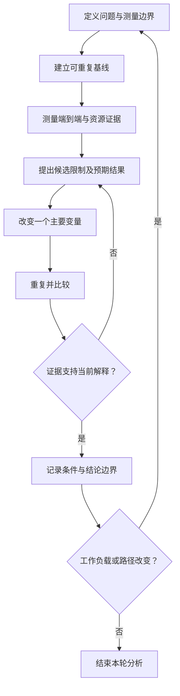

# Benchmark / Bottleneck Analysis：把性能判断变成实验

“系统吞吐 5 GB/s”几乎不足以用于判断架构能力：测了哪种请求，在哪一层数了字节，多少 Client，持续多久，是否有错误或后台任务？如果这些条件缺失，数字既难以复现，也难以解释。

本文承接 [Cost Model](01-end-to-end-cost-model.md) 和 [Queueing](02-latency-throughput-queueing.md)，建立通用的 Workload、Environment、Measurement Boundary 与受控实验方法。这里没有真实系统跑分，不提供固定硬件性能或某个工具的命令教程。

## 1. 先确定测量问题与完成边界

Benchmark 应先回答一个可检验的问题，例如“固定对象大小与保护策略下，提高请求并发是否继续增加有效吞吐，P99 付出什么代价？”它比“测最高速度”更容易约束变量和解释结果。

**Measurement Boundary** 至少写清：起点、终点、有效工作量、样本范围与时间窗口。GET 的终点可以是首字节，也可以是完整正文收取并完成所需验证；PUT 需要说明按接口何种成功条件结束。不能拿 Memory 接收速度和达到原有保护承诺的应用写入速度混比。

请求、尝试和业务操作也要分开。同一业务操作发出三次 Attempt，可能重复传输甚至产生重复效果；不能把三次发送自动当成三个有效业务结果，成功判定与去重边界应符合 [Retry / Idempotency](../06-distributed-systems/03-retry-idempotency-deduplication.md) 的相应契约。报告 offered load、请求尝试、完成 / 成功数、有效字节、错误与 Retry；不要把重传正文字节加进有效应用吞吐。端到端含 Retry 的总时间和单次 Attempt Latency 应分别说明。

## 2. Workload：把“读写测试”拆成可复现条件

| 必须记录的条件 | 它为什么会改变结果？ |
| --- | --- |
| Object / Request Size | 全量对象、Range 长度与大小分布改变固定成本占比、I/O 粒度和字节吞吐 |
| Read / Write Ratio 与操作类型 | GET、PUT、覆盖、新建或 Metadata 操作的工作与等待条件不同 |
| Sequential / Random | 需说明是对象选择、Key 访问次序，还是对象内字节范围；逻辑顺序不保证物理顺序 |
| Concurrency 与发送模型 | 配置上限、实际在途数、请求间隔及负载生成方式影响等待和压力 |
| Dataset Size / Object Count | 总字节与对象数分别影响数据规模与索引、固定请求成本 |
| Working Set / 热度分布 | 实际被访问的集合及倾斜程度可能远小于 Dataset，改变命中与热点 |
| Cold / Warm Cache | 需说明哪些层已预热、怎样形成状态；“第一次跑”不保证所有层都 Cold |
| Single Client / Multi Client | Client 数量、位置、分工与总并发改变发送能力及网络路径 |
| Test Duration / Warm-up / Steady State | 初始突发、连接建立、缓冲吸收与持续处理能力不是同一阶段 |
| 数据生成方式与内容 | 可压缩性、对象是否复用、Client 生成和校验开销可能影响计算与实际字节 |

Dataset 大于内存，也不证明测试命中不了缓存：如果 Working Set 只反复访问很小的一部分，仍可能主要测到缓存路径。相反，已有缓存和后台任务也可能使一次“Cold 测试”在各层呈现不同状态。这里仅记录测试条件，不展开 Cache / Prefetch 的实现或优化。

Warm-up 与正式窗口要分开，记录怎样判断结果进入 Steady State，以及是否还存在持续积压或后台工作。短时 Buffer 吸收会显示很高吞吐；若后续回落、队列继续增长或大量工作未完成，则不能作为持续容量结论。没有适用于所有系统的固定测试分钟数。

## 3. Environment：运行配置也是结果的一部分

| 记录项 | 必要范围 |
| --- | --- |
| 软件与测试工具 | Server / Client 版本或 Commit、接口、工具版本和有效参数 |
| Node / Client Count | 数据、控制职责与 Client 的部署范围、实际参与数量、Client 位置 |
| Network Capability | 路径与可用能力、共享链路、是否跨故障域；注明标称值和观测值的区别 |
| Storage Media | 实际介质、资源数量和参与范围；不在此做硬件选型 |
| Replication / EC Policy | 目标布局、ACK / 持久化条件、是否完整保护、是否 Degraded |
| Cache Configuration | 启用位置、容量或相关配置、预热方法；无法确认的层明确写出 |
| Concurrency / Throttling | Client、Server、连接池、后台任务等相关上限及作用范围 |
| Background State | Repair、Rebalance、Migration 是否进行，强度与并发是否变化 |

两个测试都叫“Replication”，并不表示确认条件相同；两个都叫“EC”，正常读取与缺片解码的成本也不同。比较必须保留这些边界，不能通过降低保护或改变 ACK 条件获得高数字，却描述成同等语义下的性能提升。

同样，暂停 Repair 可能改善前台延迟，却延长 Degraded 风险窗口。做受控干扰实验时，要记录这是测试条件变化及其保护状态，不能只展示前台收益。机制回链 [Replication](../07-data-protection/01-replication.md)、[EC](../07-data-protection/02-erasure-coding.md) 和 [Rebalance](../10-recovery-operations-observability/04-rebalance.md)。

## 4. Metrics：端到端结果与资源证据同时记录

| 指标集合 | 应记录什么 | 常见误读 |
| --- | --- | --- |
| Application Throughput / Request Rate | 成功有效 bytes/s、操作 / s、发送及完成数量，按操作类型分开 | 网卡内部流量被当成有效正文；API 请求率被当作设备 IOPS |
| Latency Distribution | Average、P50 / P95 / P99、样本数、窗口、首字节或完整响应边界 | 只看平均，或平均多个 Client 的 P99 |
| CPU | Client / Server 利用率及局部热点、相关配额与执行压力 | 集群平均低便排除 CPU；总 CPU 高便认定所有请求都等 CPU |
| Memory | 使用与 Buffer 占用、相关压力和随时间变化 | 短时内存吸收被误认为持续设备处理能力 |
| Network | 实际入口、内部与出口吞吐，相关队列 / 拥塞或重传信号 | 只看 Client 链路，不看副本 / 分片的内部共享链路 |
| Storage I/O / Queue | 对应层的操作数、实际字节、延迟、队列及参与设备范围 | 设备忙碌比例高即认定全部应用延迟来自设备 |
| Error / Retry | 错误、Timeout、拒绝、未完成请求与重试数量及时间 | 快速失败使平均值下降，却被当作变快；丢弃慢超时样本 |
| Background Traffic | 后台来源 / 目标 I/O、网络与并发状态 | 前台请求量没变，就假设所有资源成本没变 |

指标的时间窗口和资源范围要能够对齐。例如 Client 延迟尖峰与某节点十分钟平均 CPU，可能根本不是同一事件范围。采集本身也有成本，应保持方法一致；本篇仅说明实验所需证据，不建设 Metrics / Logs / Tracing 平台。

**Utilization 本身不是 Bottleneck 证明。** CPU 100% 值得调查，还要确认是哪个执行范围、请求是否等待 CPU、吞吐是否受其约束，以及是否另有串行或 I/O 限制。设备高忙碌比例也需要结合实际完成量、队列和请求依赖；并行设备不能只用一个 busy 百分比代表其全部能力。

## 5. Client 也是系统路径，可能先到上限

Client 负责生成数据、协议处理、连接、发送、接收和校验，还受 CPU、网卡、连接池与内存限制。Server 很空闲而吞吐不再上升，可能是 Client 无法提供更多有效请求，也可能是某个局部服务入口受限；不能仅看平均 Server CPU 就选定解释。

可分两类实验：保持总并发不变，把请求分到更多 Client，检查生成能力或局部链路是否改变结果；或者增加总 offered load，检查系统是否仍有完成能力。两者改动的含义不同，不能把“多加 Client 且并发翻倍”的结果归因成 Client 数量本身。

还需记录发送模型。Closed-loop Client 常在请求完成后再发下一个；当服务变慢，它会自动降低发送速率，可能少测到原计划到达流量下的等待。按独立节奏发送的模型也可能被 Client 能力限制。应写清是否把生成器中的排队计入延迟，并比较计划发送与实际发送，避免遗漏积压或未发送工作；这里不展开负载生成器设计。

## 6. Controlled Experiment：相关信号只是候选解释

基本流程为 **Define workload → Measure end-to-end → Observe resource utilization → Locate saturation → Change one major variable → Repeat → Compare results**。

Locate saturation 是寻找哪项限制的候选步骤，不是看见一个高利用率就宣布因果关系。实验前写下预期：如果假设成立，哪个 Throughput、Queue 或 Latency 应怎样变化？同时记录哪些条件保持不变、哪些关联效应仍不能排除。

| 主要变量 | 保持哪些条件 | 可以检验什么，仍有哪些边界 |
| --- | --- | --- |
| Concurrency | 请求大小、数据集合、客户端范围、保护与缓存状态 | 是否出现吞吐平台和排队增长；仅凭曲线仍不能确定是 CPU 还是 I/O |
| Request Size | 访问分布、保护及其他配置，明确保持并发还是字节负载 | 是否从 per-request 限制转向按字节资源限制；大小改变也会改变放大与 CPU 工作 |
| Client Count | 为隔离 Client 影响可固定总并发 / 总 offered load | 是否存在单 Client 生成或链路约束；不同网络位置仍可能是混杂因素 |
| Cache 状态或配置 | 工作集合、版本、请求组成、生成能力 | 命中路径是否改变限制；需记录预热和实际状态，不把效果一律归因于设备 |
| 后台任务启停或限额 | 前台 workload、其他条件及保护状态 | 是否出现共享资源竞争；后台数据位置或保护状态变化也可能影响路径 |

例如 Disk Utilization 高、P99 同时上升，只能提出“设备等待可能贡献尾延迟”。还应核对请求相关 I/O 和排队，观察受控改变并发或后台 I/O 后，这些信号是否按预期一起变化；如果吞吐平台仍在、设备队列已下降，就要继续查 Client、CPU、网络或 Metadata。

**Correlation ≠ Causation。** 控制主要变量也不代表物理系统完全没有其他变化：缓存、热度、拓扑与背景工作会漂移。可以交替重复基线与变更条件，检查时间变化是否解释结果；若干预同时改变了多个关键条件，应明确结论只支持关联，避免过度归因。

## 7. 常见错误：数字越漂亮，越要检查边界

| 错误 | 会误判什么 |
| --- | --- |
| Dataset / Working Set 全在缓存，却声称测到设备吞吐 | 实际测到的路径与声明不同 |
| 只测短时 Burst，忽略 Warm-up、队列和后续回落 | Buffer 吸收或瞬时资源被当成持续处理能力 |
| 只报告 Average 或混合所有请求 | Tail、操作差异和错误被隐藏 |
| 不记录 Error / Retry / 未完成工作 | 完成能力被重复流量或选择性样本扭曲 |
| 不记录 Replication / EC 与 ACK 条件 | 不同保护成本被当作同等系统性能 |
| 环境、数据或背景状态变化后直接比较 | 版本收益与条件差异无法分开 |
| 同时修改多个主要变量 | 无法解释哪个改动影响结果 |
| Client 达到上限却宣布 Server 已 Saturated | 测量边界外的限制被忽略 |
| 只看存储 bytes/s，不看前台 Latency | 大量排队或后台流量被当作应用体验提升 |

一份可解释的结果应能连成：**问题与边界 → Workload / Environment → 端到端结果及资源证据 → 受控改动 → 比较与适用限制**。不能复现时先补条件，证据不足时保留候选解释，而不是立刻引入下一种优化技术。

## 来源与适用边界

- [Google SRE：Effective Troubleshooting，Test and Treat](https://sre.google/sre-book/effective-troubleshooting/)：核对用实验检验假设、识别混杂因素和记录条件的工程方法；不扩展完整排障专题。
- [fio 官方文档：Measurements / Output / I/O Depth](https://fio.readthedocs.io/en/latest/fio_doc.html)：用于核对工具统计与实际队列边界需明确、配置深度不替代实际运行分布等问题。fio 的 I/O 数值不自动代表对象 API 的端到端性能，本文不提供 fio 配置教程。
- 延迟和 Saturation 定义沿用 [上一篇及其来源](02-latency-throughput-queueing.md)，路径和内部流量口径沿用 [Cost Model](01-end-to-end-cost-model.md)。

资料核对日期：**2026-10-02**。实验流程与变量表是通用工程推导，没有真实跑分结论。本章第一阶段止于 Cost → Queueing → Measurement，不继续展开 Cache / Prefetch、Zero-copy、RDMA 或 AI Storage。

[上一篇：Latency / Throughput / Queueing](02-latency-throughput-queueing.md) · [返回章节入口](README.md) · [前置：Storage Fundamentals](../02-storage-fundamentals/README.md)
