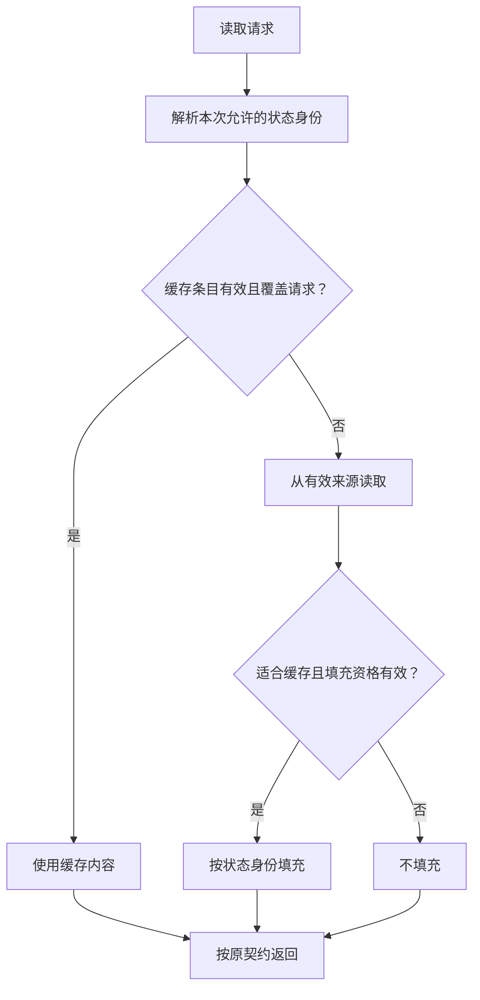

# Cache / Prefetch：减少慢层访问，承担状态责任

第一阶段已经建立 [Cost](01-end-to-end-cost-model.md) → [Queueing](02-latency-throughput-queueing.md) → [Measurement](03-benchmark-bottleneck-analysis.md)。现在的问题是：能否让部分请求根本不触及慢层，而不只是把慢层调快？Cache 复用已经取得的状态或数据；Prefetch 提前取得预测会使用的数据。两者都改变资源消耗，也引入新的状态与竞争。

本文讨论通用 Distributed Storage 数据路径，不规定缓存必须位于 Client、Gateway 或 Data Node，也不假设它一定使用 DRAM；采用本地设备的缓存同样需要说明层级、容量和成本。图与算术均为工程示意，不是产品行为或性能测量。

## 1. 先确定缓存什么，再判断命中意味着什么

缓存可以按内容和读写职责分类，这两个维度并不互斥：Metadata Cache 本身也可能承担读取加速。

| 名称 | 复用或暂存什么 | 不能因此推断什么 |
| --- | --- | --- |
| Data Cache | 对象正文、范围或内部数据单元的内容 | 命中正文不代表权限、当前版本或命名空间状态仍有效 |
| Metadata Cache | 对象属性、索引、布局或路由等状态 | 命中 Metadata 不代表正文不需要远端访问；不同状态有不同有效期 |
| Read Cache | 已取得、可再次读取的数据或状态 | 不能因为读缓存存在就降低原存储的持久化责任 |
| Write Buffer / Write-back | 尚待下刷或传播的写入；Write-back 将写入与下层更新分离 | 内存接收完成不等于持久化成功；ACK 仍须满足原有提交与保护契约 |

Write Buffer 不一定改变成功确认时机：系统可以缓冲、合并后等待规定条件再 ACK。若允许在下层尚未更新时确认，缓冲层就可能持有唯一的新状态，必须承担相应持久性、恢复和流控责任。此时不能像丢弃干净 Read Cache 一样随意 Evict 未完成下刷的数据。提交边界复用 [Read / Write Path](../03-object-storage/03-read-write-path.md)，不在这里展开写回协议。

对选定的一层，**Cache Hit** 是该层能以符合本次请求语义的有效条目满足访问；**Miss** 则需要从其他来源取得。部分范围命中应单独记账。内存里“有这段字节”但资格无法确认，不是可以直接返回的有效命中。

命中可能减少 lower-layer I/O、内部 Network Traffic 与 Latency，但不会消除全部成本：鉴权、解析、返回正文和某些 Metadata 检查仍然存在。缓存位于 Data Node 时，Client 到该节点的网络传输通常也仍然存在。

## 2. High Hit Ratio 为什么可能掩盖主要成本

定义指标时，应写明缓存层、时间窗口、操作与计数方式。以正文读取为例：

- **Request Hit Ratio**：由缓存完整满足的正文请求数 / 正文请求总数；本篇将部分命中请求单列，不算完整命中。
- **Byte Hit Ratio**：由缓存满足的请求有效正文字节 / 请求所需有效正文字节总量；同一字节被多次请求，应按每次请求计入。

这不是设备读取量或网络传输量的比率。Range、读取放大、压缩和预取会改变底层字节，不能混入应用请求的分母。Metadata 命中率还应另行统计，不能冒充正文命中率。

**算术示意，非性能数据：**100 次完整读取中，99 次读取 1 KiB 且全部命中，1 次读取 1 MiB 且全部 Miss。

| 口径 | 结果 | 解释 |
| --- | --- | --- |
| Request Hit Ratio | 99% | 大多数请求无需取得缺失正文 |
| Byte Hit Ratio | `99 / (99 + 1024)`，约 8.8% | 绝大多数请求有效字节仍来自 Miss 路径 |

因此，高 Request Hit Ratio 不保证高 bytes/s；反过来，大对象命中带来的高 Byte Hit Ratio 也不证明大量小请求的 P99 已改善。小对象即使命中仍可能受 per-request CPU、控制 RPC 或调度限制。判断收益，应同时看命中与未命中的端到端延迟、有效吞吐、下层流量及资源变化，而不是追求一个孤立的命中率。

## 3. Cache Capacity 应服务 Working Set，而不是整个 Dataset

**Working Set** 是在所选时间与访问模式下实际反复需要的状态或数据；它不同于 Dataset 总量，也会随工作负载变化。Hot / Cold 描述某个观察窗口中的访问热度，不是对象永久属性，大对象也不一定热。

当 Working Set 超过可用 Cache Capacity，条目需要竞争位置。容量还包括索引、条目属性、分配开销和在途缓冲，不能全部当作可存放的正文字节。

- **Admission** 决定新取得的内容是否值得进入缓存。例如一次性扫描的数据，取得后不必全部留下。
- **Eviction** 决定容量不足时移除哪些已有条目。它不能独自弥补“所有冷数据都无条件进入”的策略。
- **Cache Pollution** 是低收益内容占据容量或挤走更有价值内容，使后续有效访问反而更频繁 Miss。

例如，一组反复读取的小对象原本能留在缓存，大规模单次扫描却不断填入新正文。扫描自身未必需要二次访问，热点却被挤走。增加容量可能缓解，也可能只是延后发生；应检查 Admission、访问流分配与工作负载，而不是只调大缓存。

缓存增加的是一套运行状态：分配与回收消耗 CPU，扩容增加容量成本，节点重启或缓存不可用可能让大量请求重新触及下层。测试 Warm Cache 收益之外，也要用 [Benchmark](03-benchmark-bottleneck-analysis.md) 方法验证 Cold Cache、失效和重填期间是否仍有可接受的服务能力。不能把缓存消失后所有流量无条件倾倒给原本承载不了的下层。

## 4. Cache Entry 的身份为什么不能只有 Key

对象 `bucket/key` 的当前状态可能由 g1 变为 g2，也可能逻辑删除。缓存中的 g1 字节仍存在，不说明它适合当前 GET。身份与布局的分离复用 [Object Layout](../03-object-storage/06-object-layout.md)，历史版本与当前状态区别见 [Versioning / Delete](../03-object-storage/05-versioning-delete.md)。这里的 g1 / g2 是通用 Generation 示意，不是某个产品的 Version ID 格式。

一种通用设计思路是区分：**当前 Key 指向什么状态**，以及**指定 Version / Generation 的正文是什么**。后者在该身份对应内容不可变时更易复用，前者仍需符合约定的 [Consistency](../08-consistency-metadata-partitioning/01-consistency-observable-state.md)。正文不变，也不能默认权限、删除状态或访问条件永远不变。

图中的有效性判断可以由版本绑定、失效通知、重新验证或系统提供的其他机制承担，不要求每次读取都执行一次独立远程查找。

**Stale Cache** 是缓存反映的状态不适合本次语义；**Invalidation** 让旧条目不能继续被当作当前有效状态。TTL 限制保留时间，但“还没过期”不能单独证明没有并发更新，更不能自动提供强一致性。

失效还有填充竞态：一次 g1 的下层读取尚未返回，g2 已发布并触发失效；随后 g1 返回，若按 Key 无条件重新填入“当前条目”，旧状态又会复活。因此需要让填充也受状态身份或有效资格约束，而不仅在更新时删一次缓存。具体协调方式依赖实现，不能假设一种通知机制天然可靠。

缓存不可验证时，选择重新读取、等待或报错应遵守 API 契约；不能为了“命中率好看”无声明地返回旧状态。更多索引状态边界回看 [Metadata / Object Index](../08-consistency-metadata-partitioning/02-metadata-object-index.md)。

## 5. Prefetch 隐藏的是等待，花掉的资源仍然真实存在

Prefetch 根据预测，提前搬运未来可能访问的数据。Sequential Access 或可预测的范围访问提供线索，Read-ahead 是其中常见形式；随机或阶段性变化的访问则更容易预测错误。

**Prefetch Distance** 描述提前到访问位置之前多远，例如后续多少字节或范围；**Prefetch Concurrency** 描述同时执行多少预取工作。提前得远不等于并发多，两个参数分别影响驻留容量、时效和在途资源。

示意一个按范围顺序读取的流：消费当前范围时，后台读取下一段。如果下一段在需要前到达，等待可被隐藏；若启动太晚或并发不足，下次访问仍然 Miss。若过早取得很多范围，而访问转向其他对象，则已花出的 I/O 和网络无助于本次访问。

| 预取结果 | 应如何解释 |
| --- | --- |
| Useful Prefetch | 内容在被消费前取得且仍有效；需要区分“确实被用到”与“确实隐藏了等待” |
| Late Prefetch | 内容最终可能被使用，但需求到达时尚未就绪，未完整隐藏 Latency |
| Wasted Prefetch | 内容未被使用、资格失效或使用前已被逐出；占用过的资源不能靠删除条目收回 |

Too Little Prefetch 可能无法覆盖取得数据的等待；Too Much Prefetch 则消耗 Network、Device I/O、Memory，还可能污染缓存、抢占前台执行资格。预测正确也不代表应该无限预取：多条读取流竞争同一设备时，过大提前量可能推迟当前真正需要的读取。

应把 Prefetch 当作有预算的推测性工作，观察有用字节、浪费字节、驻留时间和前台 P99，允许限制距离、并发或停止无收益的流。其 Admission 和资源限制与需求读取可以不同，但不能绕过整体容量边界。下一篇讨论 [Batching / Backpressure](05-batching-backpressure.md)，随后再看 [Foreground / Background Interference](06-foreground-background-interference.md)。

## 适用边界与参考

本文的分类、身份示意、命中率计算和预取取舍是通用模型与工程推导，没有指定产品的缓存一致性或最佳参数。参考资料核对日期：**2026-10-02**。

- [AWS Builders’ Library：Caching challenges and strategies](https://aws.amazon.com/builders-library/caching-challenges-and-strategies/) 讨论容量、过期与冷缓存的运行风险；这里不将其服务案例中的旧值回退策略当作对象存储通用契约。
- [AMP: Adaptive Multi-stream Prefetching in a Shared Cache，FAST 2007](https://www.usenix.org/conference/fast-07/amp-adaptive-multi-stream-prefetching-shared-cache) 研究顺序预取的 Pollution 与 Wastage；仅作为问题来源，不外推其算法或性能结果。
