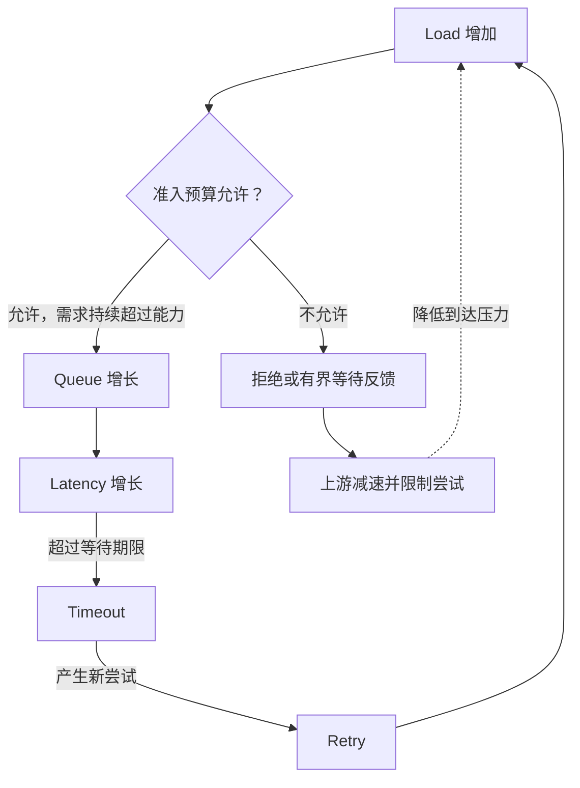

# Batching / Backpressure：摊薄成本，限制积压

[Cache / Prefetch](04-cache-prefetch.md) 减少或提前慢层访问，但不能消除所有工作。剩余请求怎样摊薄固定成本？系统变慢时怎样避免积压失控？这需要同时控制工作粒度、在途数量和准入，而不是只提高并发。

本文延续 [Latency / Throughput / Queueing](02-latency-throughput-queueing.md) 的通用模型。Batching 改变一次调度承担多少工作；Concurrency Control 限制同时推进多少工作；Backpressure 让上游感知容量边界。三者相关，但不是同一个开关。

## 1. Batching 能摊薄哪些成本，不能改变哪些语义

如果多个工作确实共享某项固定开销，合并处理可能减少协议包装、Syscall / RPC、固定 Metadata Work 或调度次数。例如将若干内部状态更新交给一次下游调用，能复用部分调用与调度成本；正文校验、每项权限检查或独立的数据写入却未必因此消失。

**Batching 的单位必须明确**：一批 API 请求、一个内部 RPC 中的若干操作、一组设备 I/O，可以发生在不同边界。把请求放进同一数组而下层仍逐项独立调用，未必摊薄预期成本。内部合批也不等于 [Multipart Part](../03-object-storage/04-multipart-upload.md)、[Storage Unit](../03-object-storage/06-object-layout.md) 或客户端的一次逻辑对象操作。

Batch 不是天然的多对象事务。每项工作仍应遵守自己的授权、Generation、提交与 Write ACK 条件；整体调用返回，也不自动表示所有成员成功。具体接口若提供原子批次，才按该契约理解，不能从“合并发送”推导 Atomicity。

## 2. Larger Batch 为什么不总是更好

Batch 需要收集工作。低到达率下，等待凑满批次可能比执行本身更长；大批次还能占用更多缓冲，延长一次不可中断工作的执行时间，使后来的小请求等待。

| 控制维度 | 带来的收益 | 需要承担的代价 |
| --- | --- | --- |
| Batch Item Count | 摊薄逐次调用或调度成本 | 不同大小成员的总工作量差异很大 |
| Batch Bytes / Work Budget | 避免一个批次无限占用缓冲或执行预算 | 必须选择与实际成本相关的估计口径 |
| Maximum Wait / Timer | 低负载下不必一直等凑满 | 小批次更频繁执行，固定开销摊薄较少 |

常见通用思路是“数量、字节或等待上限任一达到即发送”，但它不是所有系统的标准算法。最合适参数依赖到达模式、请求大小、下游能力和延迟目标，不存在无条件最佳 Batch Size。

**状态示意：**一个批次内 a / b / c 三项，a 与 b 已完成规定提交，c 因资格变化失败。应按接口允许的粒度记录结果；如果客户端只看到整体 Timeout，也不能推断 a / b 未执行。重试整批可能重新产生成功成员的工作，因此仍需原有的操作身份与结果语义。

另一个边界是 Response Head-of-line：若批次必须等最慢成员才返回，已经完成的小请求也被拖住；若允许逐项返回，协议和状态管理又更复杂。测试时应把凑批等待计入相应端到端延迟，不能仅报告 Batch 执行阶段变快。

## 3. Concurrency Control：限制的是在哪一层同时推进

提高并发可以填补等待空隙；接近 Saturation 后，新增在途请求更多变成 Queue，而不是完成能力。继续增加并发可能形成 Tail Latency → Timeout → Retry → Additional Load。指标关系及 Little’s Law 复用 [第一阶段第二篇](02-latency-throughput-queueing.md)，这里关注控制边界。

例如 Gateway 限制客户端请求数，但一个请求又向多个 Data Node 发 RPC；限制 100 个请求不代表只有 100 个下游工作。相反，多个上游都各自限并发，汇聚到一个 Metadata Partition 后仍可能超过其容量。限制需要放在实际受约束的资源边界，并考虑 Fan-out 和聚合需求。

**Concurrency Limit 与 Rate Limit 不可互换**：前者控制同时在途的数量，后者控制单位时间进入多少工作。较慢的工作在相同到达率下积累更多在途量；很短的工作则可能在低并发下频繁调用。请求大小不同，还需要字节、CPU 或 I/O 预算，不能仅以 requests/s 表达全部处理能力。

## 4. Backpressure 不是给无限队列多加一点等待

当 Arrival 所要求的资源持续超过 Processing Capacity，工作只能积压、被拒绝，或在上游减少产生。没有一种队列能够永久吸收这种差额。短暂突发可以用有限缓冲吸收，长期超载则必须有明确的边界。

| 控制方式 | 主要作用 | 单独使用的局限 |
| --- | --- | --- |
| Bounded Queue | 限制待处理工作占用；可同时约束数量、字节与等待时间 | 队列满后仍须决定如何反馈，不能静默无限转移到另一层 |
| Concurrency Limit | 约束执行中的工作和下游在途压力 | 等待准入的队列如果无界，问题仍在 |
| Admission Control | 在投入昂贵资源前判断是否接收 | 判断需要适当资源口径，拒绝也有处理成本 |
| Producer Slowdown | 将压力传到上游，减少产生或发送速度 | 上游必须理解信号；不能假设所有 Client 都配合 |
| Rate Limit | 限制单位时间进入的工作量 | 长耗时、突发和大小差异还需其他约束 |
| Reject / Retry-later | 不将超出预算的工作全部留在本层 | 若立即无条件重试，拒绝本身也可能制造额外压力 |

Backpressure 的目标是**将下游容量约束传递给上游，阻止无限积压**，不是单纯“让请求变慢”。同步等待也能传播压力，但必须确认等待中的连接、线程与 Buffer 有界；否则只是把队列挪到了 Client、Gateway 或其他 Worker。

不能控制上游时，服务端仍需自己的 Admission / Queue 边界，避免一个不配合的产生者耗尽资源。需要可区分的反馈和明确结果语义：只有契约明确说明“在执行前拒绝且未产生效果”，才能按未执行理解；普通 Timeout、连接断开或泛化错误没有这种证明。见 [Failure / Timeout](../06-distributed-systems/01-failure-model-timeout.md)。

## 5. Overload Feedback Loop 怎样被打断

下图是超载可能形成的正反馈，不表示每次等待都会 Timeout，也不表示所有错误都应 Retry。Admission Gate 表示通用准入边界，不要求系统拥有某个独立组件。

若没有准入边界，Timeout 后原工作仍可能继续执行，新尝试又占用资源。吞吐统计看似有很多“尝试”，真正完成的有效工作却下降。只扩大队列会延后拒绝，并不增加处理能力；只缩短 Timeout 也可能更早触发重复尝试。

可从两处打断：在服务端让待执行和在途工作有界；在上游减少新增负载并约束重试。重试的退避、预算、操作身份与幂等性复用 [Retry / Idempotency / Deduplication](../06-distributed-systems/03-retry-idempotency-deduplication.md)，不在本篇重新展开。多个层各自重试还会放大下游尝试数，必须看完整路径。

取消或超时不保证已经发出的设备操作、RPC 或提交立即停止。可以检查尚未执行工作的剩余有效时间，减少无收益执行，但不能将“客户端已放弃”等同于“服务端状态已回滚”。流控不替代正确性协议。

## 6. 怎样证明控制在改善有效服务

按 [Benchmark / Bottleneck Analysis](03-benchmark-bottleneck-analysis.md) 固定请求组成与其他条件，分别改变 Batch 或并发参数，记录：

- 有效完成吞吐与端到端 P50 / P95 / P99，包括凑批和准入等待。
- 实际 Arrival、Accepted、Rejected、Timeout 与 Retry，避免用成功子集掩盖拒绝代价。
- 队列数量、等待时间、Buffer 字节和下游在途工作，确认积压没有转移。
- 稳态与突发下的行为；低负载时 Batch 等待不能被高负载结果掩盖。

目标不是让拒绝率或设备利用率孤立地好看，而是在有限资源下维持可解释的有效服务，同时遵守原操作契约。下一篇讨论当 Repair、Rebalance 等共享这些资源时，如何控制 [前后台干扰](06-foreground-background-interference.md)。

## 适用边界与参考

Batch 条件、准入表与反馈图是通用工程模型，不规定固定阈值、接口错误码或事务保证。参考核对日期：**2026-10-02**。

[Google SRE：Addressing Cascading Failures](https://sre.google/sre-book/addressing-cascading-failures/) 的 Queue Management、Load Shedding 与 Retry 部分讨论队列、过载和重复尝试的反馈风险；本文只取这些问题作为存储流控的参考，不套用其服务实例、阈值或调度算法。

[上一篇：Cache / Prefetch](04-cache-prefetch.md) · [下一篇：Foreground / Background Interference](06-foreground-background-interference.md) · [返回章节入口](README.md)
