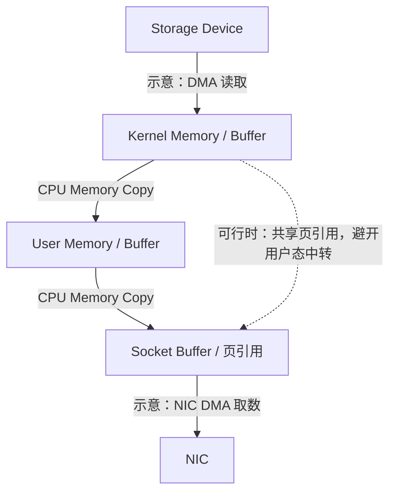

# Memory Copy / Zero-copy：少一次复制，不是少一次数据移动

[前后台资源控制](06-foreground-background-interference.md)限定了工作如何共享预算。本篇继续追问：同一份正文从 Storage 到 Network，为什么会多次读写内存？省掉某次 Copy 后，谁继续持有 Buffer，什么时候才能重用？

以下先建立通用的 Host-memory 数据路径，再用 Linux 公开机制说明边界。示意不规定 Linux 或所有系统的固定调用顺序，不进入 GPU 或特定用户态驱动框架。

## 1. 数据路径与控制动作先分开

假设一次读取需要从支持 DMA 的存储设备取得正文，再经应用发送到网络。缓存已命中、应用直接读取到自己的 Buffer、内核直接转发或设备能力不同，都会改变实际路径。

实线是一个普通正文中转示意，虚线表示一种 Copy Avoidance 思路，不是额外必经步骤。Socket Buffer 可能持有正文副本，也可能描述已有页；图中并非每个方框都一定对应一份不同的物理内存。

**Buffer** 是暂存内容、交接工作和管理在途数据的区域或抽象。**User Space / Kernel Space** 是地址空间与执行权限边界，不是两台存储设备；在适当映射与权限管理下，不同执行域也可能访问同一组物理页。因此，跨边界不必然需要复制，但共享不再像独立副本那样容易隔离修改。

正文移动之外，CPU 还可能解析请求、分配 Buffer、准备描述符、提交操作、处理完成并决定下一步。不能只数正文复制箭头，就说系统已经没有 CPU 工作。

## 2. Memory Copy、System Call、Context Switch、DMA 是四件事

| 概念 | 发生什么 | 不能推出什么 |
| --- | --- | --- |
| Memory Copy | 把字节复制到另一区域；常见 CPU Copy 使用处理器指令读写内容 | 不必调用内核，也不一定切换线程 |
| System Call | 应用请求内核提供服务，跨越执行权限边界 | 不保证正文发生复制，也不等于必然切换到另一个线程 |
| Context Switch | 调度切换执行上下文，例如从当前线程切到另一线程 | 不等于复制请求正文；不能按一次 Syscall 固定计一次线程切换 |
| DMA Transfer | 设备按已准备的访问描述与映射搬运数据，不由 CPU 逐字节执行 Copy | 不代表内存、总线、映射和完成处理免费，也不代表没有数据移动 |

本文用 Context Switch 指调度意义的上下文切换，避免把所有 User / Kernel 模式转换混成同一指标。调用内核可能因等待而发生线程切换，也可能在当前线程完成后返回。

CPU Copy 除执行指令外，还消耗内存层次的读写能力，可能影响 Cache 与其他工作。将一段正文多复制一次，逻辑上增加了读取源、写入目标的工作；实际 DRAM / 总线流量受缓存、写策略和实现影响，不能据此宣布固定流量倍数。

DMA 让设备负责搬运，不让 CPU 对每个字节执行复制循环。CPU / Driver 仍需要建立合格的访问、提交工作和检查结果；在本文模型中，字节仍沿 **Device ↔ Memory ↔ NIC** 移动。Linux 的 DMA 文档还区分 CPU Virtual Address 与设备使用的 DMA Address，映射可能涉及 IOMMU；不能把任意用户地址直接当作设备可访问地址。[Dynamic DMA Mapping Guide](https://docs.kernel.org/core-api/dma-api-howto.html)用于核对这一机制，不在这里展开驱动 API。

## 3. Zero-copy 应该声明省掉的是哪一段

**Zero-copy 是相对于指定数据路径、指定类型的 Copy 而言的 Copy Avoidance，不是“字节完全不移动”。** 文件到 Socket 的路径省去 User Buffer 中转，不等于 NIC 不再 DMA 读取；应用发送减少 User → Kernel 的正文复制，不等于远端读取、校验或返回也都没有复制。

判断一个声明至少要问：

- 起点和终点是哪一层？讨论的是正文、请求描述还是响应结构？
- 省掉 CPU Copy，还是减少 Syscall / 调度次数？
- 是否仍有其他 CPU Copy、设备 DMA、格式变换或 Fallback？
- 哪个事件允许原 Buffer 重用？谁承担在途数据的有效性？

公开机制提供的是不同局部路径，不是统一定义：

| 机制或思想 | 可能避开什么 | 适用边界 |
| --- | --- | --- |
| Linux `sendfile` | 由内核在文件描述符之间传递数据，避免通常 `read` / `write` 的用户态正文中转 | 不是保证所有内核内部 Copy 均消失；支持范围、短传输和错误仍需按接口处理 |
| Linux `splice` | 在包含 Pipe 的描述符路径中避免 Kernel / User 地址空间之间的正文复制 | 不表示任意两个端点都有相同能力，也不表示内部永远不复制 |
| Scatter / Gather | 用多个区域描述一份逻辑数据；设备支持时可避免先由 CPU 拼成连续副本 | 向量 I/O 接口本身不保证 Zero-copy；端点能力和描述项限制仍重要 |

前两项的 Linux 行为依据 [sendfile(2)](https://man7.org/linux/man-pages/man2/sendfile.2.html) 与 [splice(2)](https://man7.org/linux/man-pages/man2/splice.2.html)。Scatter / Gather 是更一般的表达方式：例如协议头与正文可以分别存放，再由合格的下层组合处理；准备列表、遍历区域和 DMA 并没有因此消失。

## 4. Copy 避免后，Buffer 的时间与修改权变得更重要

复制到独立区域后，原内容往往可以较早重用；共享原页则让后续工作依赖原 Buffer。**Memory Ownership** 在这里指谁有权修改、释放或重用区域，不是 Partition Owner。多个读者可以共享内容，不代表任何执行者都可以在在途传输中修改它。

**故障示意：**发送 g1 的 Buffer B 后，应用把 B 放回池中，再写入 g2。如果 NIC 或网络栈还引用 B，就可能取得新旧混合内容。避免一次 Copy 的代价，是必须保留 B 并等到正确的释放边界；仅“提交函数返回”未必足够。

Linux `MSG_ZEROCOPY` 是一个明确例子：Kernel 文档要求在通知允许重用前保留相应内容；该机制可能回退到 Copy，通知表达释放共享页的条件，**不等同于传输完成，更不是远端应用提交确认**。参见 [MSG_ZEROCOPY：Notifications / Deferred Copies](https://docs.kernel.org/networking/msg_zerocopy.html)。这一规则不能直接套到所有叫 Zero-copy 的接口。

Copy Avoidance 还可能把逐字节复制成本换成页管理、引用计数与完成通知成本。小请求中固定管理开销可能盖过收益；大量在途请求会延长 Buffer 驻留、占用内存。Buffer Pool、并发与释放边界要一起考虑，连接 [Batching / Backpressure](05-batching-backpressure.md)，不能为省 Copy 接受无限在途数据。

## 5. 哪些条件可能迫使路径处理或重新组织正文

| 条件 | 为什么影响 Copy Avoidance |
| --- | --- |
| Buffer Lifetime / Ownership | 尚在使用的内容不能提前修改、释放或交给下一项工作；共享要求额外协调 |
| Alignment / Mapping | 地址、长度或映射不符合端点要求时，可能需要中间 Buffer 或拒绝操作；并无统一对齐值 |
| Checksum | 校验仍需访问内容；是否能由设备处理、在哪个层计算，决定 CPU 工作是否减少 |
| Compression / Encryption / EC Encode | 输入必须被处理，输出可能有新长度、格式或分片布局，需要原地处理或新的输出区域 |
| Fragmentation / Scatter-Gather Limits | 虚拟连续不等于物理连续；过多小区域可能增加描述成本或超过下层能力 |
| Fallback Path | 下层或请求条件不支持时，需要退回复制路径或返回错误，不能假设名字相同就走同一快路径 |

Transformation 与 Memory Copy 也不能简单等同：原地加密仍有计算和内存访问，但未必多一次独立正文复制；生成压缩输出或 EC Fragments 则可能需要新 Buffer。CPU 或 Accelerator 接管处理，不意味着变换成本消失，也不保证结果可以原样沿旧布局发送。保护机制仅回链 [EC](../07-data-protection/02-erasure-coding.md)。

Linux `MSG_ZEROCOPY` 文档明确说明 Copy Avoidance 是提示而非保证；Scatter / Gather 或校验条件可能导致内部复制。工程上需要知道实际快路径比例，而不是只检查是否设置了某个 API 标志。

## 6. 怎么判断省 Copy 真的帮助了端到端请求

沿用 [Benchmark / Bottleneck Analysis](03-benchmark-bottleneck-analysis.md)，保持正文大小、协议处理、保护和成功确认条件一致，比较实际 CPU 时间、Memory / Buffer 占用、有效吞吐、P99，以及快路径与 Fallback 比例。

若原限制在 Device 或 Metadata，省去一次 Copy 可能降低 CPU，却不明显增加应用吞吐；若原来受内存搬运限制，收益又可能把瓶颈移到 Network。还要检查更长 Buffer 生命周期是否让可用并发减少。只看到调用次数下降，不能证明正文复制已减少；只看到 CPU 下降，也不能证明远端已更快持久化。

下一篇 [Direct / Async I/O & Device Path](08-direct-async-io-device-path.md)将“怎么搬字节”与“怎么提交、等待设备工作”分开；之后再看跨节点的 [RDMA](09-high-performance-networking-rdma.md)。

## 来源与适用边界

资料核对日期：**2026-10-02**。Linux 机制按所链接的当前 Kernel Documentation 与 Linux man-pages 说明，支持情况取决于内核、文件系统、协议与设备；图、Buffer 示例和成本判断是通用工程模型，不是固定实现或跑分。

- [Linux Kernel：Dynamic DMA Mapping Guide](https://docs.kernel.org/core-api/dma-api-howto.html)：DMA 地址、映射与合格 Buffer。
- [Linux man-pages：sendfile(2)](https://man7.org/linux/man-pages/man2/sendfile.2.html)、[splice(2)](https://man7.org/linux/man-pages/man2/splice.2.html)：各自传递路径与支持边界。
- [Linux Kernel：MSG_ZEROCOPY](https://docs.kernel.org/networking/msg_zerocopy.html)：Buffer 生命周期、通知与回退语义；不外推其性能阈值。

[上一篇：Foreground / Background Interference](06-foreground-background-interference.md) · [下一篇：Direct / Async I/O & Device Path](08-direct-async-io-device-path.md) · [返回章节入口](README.md)
