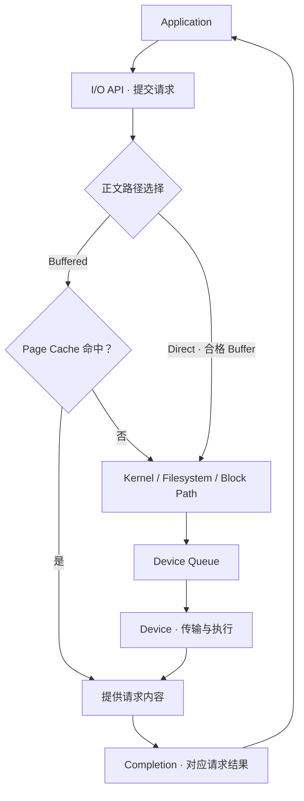

# Direct / Async I/O & Device Path：缓存选择与等待模型分开

[Memory Copy / Zero-copy](07-memory-copy-zero-copy.md)解释了字节搬运和 Buffer 责任。本篇转向 Application 到 Storage Device：数据经过哪层缓存，谁等待操作完成，能同时推进多少 I/O？“Direct”与“Async”分别改变不同问题，不能合并成一个快路径标签。

本文选择由 Kernel 管理设备 I/O 的逻辑模型，Linux 接口只作为公开例子。不同系统可合并职责、采用不同提交方式；不重新展开 HDD / SSD / NVMe、文件系统或 Block Layer 内部实现，介质与持久化前置仍见 [Storage Fundamentals](../02-storage-fundamentals/README.md)。

## 1. Buffered / Direct 与 Sync / Async 是两个维度

**Buffered I/O** 通常由操作系统 Page Cache 参与文件正文访问；**Direct I/O** 通常尝试绕过这层正文缓存，让应用 Buffer 更直接参与下层传输。这里讨论的是这层缓存选择，Direct 不等于全系统所有缓存都被关闭。

**Synchronous I/O** 在本篇指调用者等待本次操作结果再继续的模型；**Asynchronous I/O** 将提交与取得结果分开，允许在等待期间推进其他工作。两者不规定正文是否进入 Page Cache。

| 缓存路径 | 同步等待模型 | 异步提交 / 完成模型 |
| --- | --- | --- |
| Buffered | 调用等待本次缓存读取、写入接收或相应处理结果 | 提交后取得独立 Completion；命中缓存的操作也可能很快完成 |
| Direct | 调用等待 Direct 路径的本次结果 | 保留 Buffer，允许多个 Direct I/O 在途，之后处理 Completion |

表是逻辑组合，不保证任意 OS、接口和文件系统都支持每个组合。**Direct I/O ≠ 必须同步；Buffered I/O ≠ 必须异步。** Linux 的具体能力要按当前 API、内核与文件系统核对。

还要区分第三个维度：**Persistence / Durability Boundary**。本篇的同步等待不等于 Linux `O_SYNC` 等“同步持久化”保证；等待普通写操作返回，可能只等到某层接收结果，而非持久化。`O_DIRECT` 也不单独提供 `O_SYNC` 的数据与必要 Metadata 保证，依据 [open(2)](https://man7.org/linux/man-pages/man2/open.2.html)。

## 2. 一次读取如何进入 Device Path

下图是 Kernel-managed 读取的逻辑职责。缓存命中可以避免 Device 访问；Direct 绕过 Page Cache 不表示跳过所有文件系统、权限或布局处理。图并不规定所有查找都发生在分支之后，也不把 API Completion 当作持久化确认。

Device 与 Memory 之间可以使用 DMA。Buffered Miss 的目标可能是 Cache 页，Direct 路径的目标可能是映射合格的应用 Buffer；DMA 不表示正文绕过 Memory，也不自动保证整个路径无 CPU Copy。地址与生命周期边界复用 [上一篇](07-memory-copy-zero-copy.md)。

写入有不同边界：Buffered Write 可以先修改 Page Cache，并在之后 Write-back；接口返回不代表 Device 阶段都已完成。需要何种 Flush、写入顺序与确认，应由持久化契约定义，不能将读取图原样套作 PUT 的提交协议。

## 3. Direct I/O 为什么值得考虑，又为什么增加责任

若应用本来就维护自己的 Read Cache 或大型流式 Buffer，再通过 Page Cache 访问，可能出现重复缓存、额外正文复制或挤走其他热点。Direct 路径在支持条件满足时，可能减少这部分成本；一次性大范围传输因此有理由评估它，但不能据此宣布所有 Workload 都更快。

| 潜在收益 | 对应的工程责任 |
| --- | --- |
| 减少经 Page Cache 的正文中转 | 管理适合下层访问的应用 Buffer，并确认实际路径没有额外 Bounce / Copy |
| 减少应用缓存与 Page Cache 重复占用 | 应用自行承担相应复用策略；被绕过的缓存不能继续替它隐藏重复访问 |
| 减少扫描造成的 Cache Pollution | 仍需控制 Source Read、Queue 与前后台资源竞争，不是免限流通道 |

**Linux 具体边界：**`O_DIRECT` 可能约束 Buffer Address、I/O Length 与 File Offset 的 Alignment；要求随文件系统、文件、内核与下层条件变化。未对齐访问可能失败，也可能回退 Buffered 路径；不能统一写成“所有 Direct I/O 都要求某个固定字节数”。适用时可查询 `statx` 的 `STATX_DIOALIGN`，但支持也有条件。来源见 [open(2)：O_DIRECT Notes](https://man7.org/linux/man-pages/man2/open.2.html)。

Buffer 需要在实际访问结束前保持有效；异步写入的内容不能在设备尚未取完时被覆盖，读取区域也不能在结果尚未建立时被当作有效正文。Alignment 不满足时，即使实现使用中间 Buffer 保持接口可用，预期 Copy 成本也可能回来。因此 **Direct I/O ≠ Zero-copy**。

同一范围混用 Buffered、Direct 和映射访问，还会带来一致性及协调成本。Linux man-pages 建议避免这类混用，不能以“各自单独能工作”推定组合无代价。本篇只建立边界，不进入实现细节。

## 4. Async I/O 让工作重叠，不自动缩短每次服务时间

基本模型是 **Submission → Other Work → Completion**。提交成功只表示请求进入相应处理范围；Completion 才提供本次结果，结果也可能是失败或短读取 / 短写入。应关联请求身份、检查实际完成量，再决定后续处理，不能把“收到了一个完成项”当作所有数据有效。

**工程示意：**同步单 Worker 读取单元 a，等结果，再读取 b；异步模型可以提交 a 后准备 b，或者让两个独立读取同时在途。它能增加 Outstanding I/O，重叠准备、设备工作与结果消费，使 Pipeline 和 Device Queue 更充分利用。若 b 的内容依赖 a 的结果，则不能仅为了并发提前执行；依赖与写入顺序仍需表达。

Async 不减少设备执行同一项工作的必需成本，还增加请求关联、Buffer 持有、错误处理与 Completion 消费。一个完成后立即等待下一个、实际只维持一项在途的程序，即使用 Async API，也未必取得更多并行能力。

Linux `io_uring` 是公开例子：用共享 Submission / Completion 队列表达请求与结果；操作可以乱序完成，需要关联其身份。普通 Read / Write 在途使用的数据 Buffer 要保留到 Completion。这里不展开 SQE、Verbs 式编程或具体 API 调用；也不宣称共享描述符队列自动让正文 Zero-copy。依据 [io_uring(7)](https://man7.org/linux/man-pages/man7/io_uring.7.html)。

取消同样需要结果边界：提出取消不能单独证明原操作已经停止访问 Buffer；应按接口规定确认终止后再重用资源。异步错误不能因为提交早已返回就被忽略。

## 5. Device Queue Depth：填满流水线与制造排队只有一步之隔

Queue Depth 描述指定边界内的 I/O 数量，工具可能统计等待项或全部未完成项；应用请求并发、API 在途数量与设备队列并不必然相等。一次对象请求可能产生多个 I/O，也可能命中 Cache 而不访问 Device。

增加深度能在设备有余量时补足并行工作；接近服务能力之后，新增请求主要等待，吞吐增幅变小甚至下降，Tail Latency 上升。**Async ≠ 单请求 Latency 自动降低**，也不保证深度越大越好。完整指标关系回链 [Latency / Throughput / Queueing](02-latency-throughput-queueing.md)。

完成消费过慢也会形成压力：设备已经处理完，但应用还没取结果、验证或归还 Buffer，执行容量便被在途状态占住。Pipeline 的限制可以在提交侧、设备侧或完成侧；仅看设备利用率无法排除应用问题。控制边界连接 [Batching / Backpressure](05-batching-backpressure.md)。

实际可用深度取决于请求大小、访问模式、设备路径、Buffer 预算和前后台竞争，不使用某种 NVMe Queue 数量或厂商默认参数作为通用结论。

## 6. Completion 仍然要带上“完成了什么”

| 观察到的事件 | 可以据相应契约判断什么 | 不能自动判断什么 |
| --- | --- | --- |
| API 接收 Submission | 工作已被接收或排入处理 | 已执行、已成功、Buffer 已可重用 |
| Read / Write Completion | 对应操作的返回状态与实际完成量 | 任意上层事务或对象状态已经提交 |
| 所需持久化动作成功 | 在接口、设备及故障模型约束内达到了相应持久化条件 | Metadata 发布、分布式副本 ACK 与对象 PUT 全部成功 |

Linux `fsync` / `fdatasync` 等属于另一个明确边界，不是选择 Direct 或 Async 后自动得到的效果。文件、必要 Metadata、目录项也可能有不同要求，参见 [fsync(2)](https://man7.org/linux/man-pages/man2/fsync.2.html)。对象级提交继续复用 [Read / Write Path](../03-object-storage/03-read-write-path.md)，不能用单个设备事件代替它。

测试 Buffered / Direct 时应明确 Cold / Warm Cache 与应用缓存状态；测试 Sync / Async 时应记录实际 Outstanding 分布、完成消费与 Buffer 使用，而不只记录配置深度。比较端到端有效吞吐、P99、错误和 CPU / Memory 成本，沿用 [Benchmark](03-benchmark-bottleneck-analysis.md)，不通过改变持久化条件获得不可比的数字。

## 来源与适用边界

资料核对日期：**2026-10-02**。组合表、读取图和 Pipeline 例子为通用模型；Linux 特定行为按当前手册说明，不能外推成所有系统的标准 Device Path。

- [Linux man-pages：open(2)](https://man7.org/linux/man-pages/man2/open.2.html)：Direct 路径、Alignment、回退与 `O_SYNC` 边界。
- [io_uring 项目：io_uring(7)](https://man7.org/linux/man-pages/man7/io_uring.7.html)：提交 / 完成、乱序结果与数据 Buffer 生命周期；仅引用模型，不提供接口教程。
- [Linux man-pages：fsync(2)](https://man7.org/linux/man-pages/man2/fsync.2.html)：与缓存选择分离的持久化要求。

[上一篇：Memory Copy / Zero-copy](07-memory-copy-zero-copy.md) · [下一篇：High-performance Networking / RDMA](09-high-performance-networking-rdma.md) · [返回章节入口](README.md)
