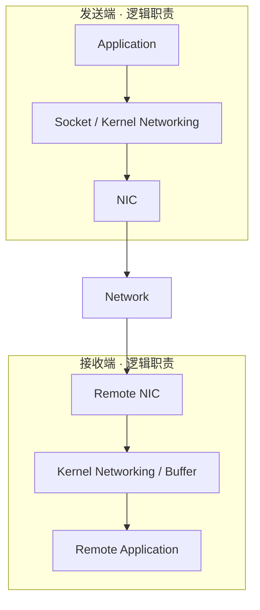
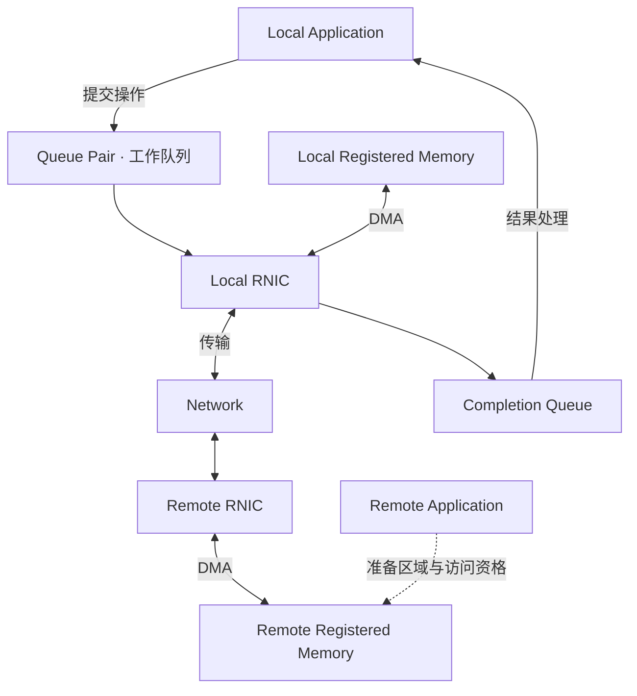

# High-performance Networking / RDMA：搬到远端内存，不等于提交存储状态

[Memory Copy / Zero-copy](07-memory-copy-zero-copy.md)与[Direct / Async I/O](08-direct-async-io-device-path.md)区分了字节搬运、提交模型和设备完成。本篇把这些边界延伸到跨节点通信：RDMA 改变哪些 Network Data Path 成本，哪些存储语义仍然需要上层协议？

本文建立通用 Host-memory 模型，用 Linux RDMA / rdma-core、标准和厂商一手资料核对具体机制。图不是所有 TCP 或 RDMA 实现的固定路径，不提供 Verbs 编程、交换机配置或某种厂商性能结论。

## 1. 传统 Socket 路径的成本不只在网络线上

一个普通发送路径可以表示为 **Application → Socket / Kernel Networking → NIC → Network → Remote NIC → Kernel / Application**。协议处理、缓冲交接、复制、调度与接收处理都可能发生在传输前后。

不能从这张图推定每一跳都发生一次 CPU Copy，也不能说所有 TCP 数据都必须经过完全相同的软件处理。上一节的 Copy Avoidance、设备 Offload 与不同缓冲方式都会改变实际成本。

传统路径可能由 CPU 处理连接、协议、系统调用、Buffer 复制与唤醒。大正文更容易受字节搬运与带宽限制；大量小消息更容易受固定处理与调用成本限制。RDMA 的意义是重新分配部分搬运与协议工作，不是仅把链路标称带宽换大；诊断仍从 [Cost Model](01-end-to-end-cost-model.md) 出发。

## 2. RDMA 的基本模型：合格内存、操作队列与 RNIC

**RDMA（Remote Direct Memory Access）**提供远端内存访问及消息传递能力；**RNIC** 是支持相应 RDMA 能力的网络适配器的通用称呼，InfiniBand 资料也常使用 HCA。下面选择硬件卸载、非 Inline 正文的通用模型，不声称软件 RDMA 或全部 Provider 都具有相同成本。

两张图均是逻辑模型。RDMA 图的 Remote Application 不必为每个 One-sided 数据操作执行接收与复制，但需要参与区域准备、协议状态及必要同步。双向箭头表示不同操作可有不同数据方向，不表示一次 WRITE 必须双向搬运全部正文。

| 组件 | 基本作用 | 边界 |
| --- | --- | --- |
| Memory Region（MR） | 描述注册区域的范围、访问权限及相应 Key，供合格的本地 / 远端操作引用 | 不是任意远端地址都可访问；Memory Key 不是 Bucket 权限或对象 Generation |
| Queue Pair（QP） | 为通信提供发送侧与接收侧工作队列及相关状态；发送侧也可提交 RDMA Read / Write | QP 类型与能力影响支持操作、可靠性和顺序，不能套用一种模式到全部 RDMA |
| Completion Queue（CQ） | 提供相应工作完成项及结果，应用据此推进状态和回收资源 | 完成项可能表示错误；不能把每次提交都固定理解为一条独立成功通知 |

具体组件依据 rdma-core 的 [ibv_reg_mr(3)](https://man7.org/linux/man-pages/man3/ibv_reg_mr.3.html)、[ibv_create_qp(3)](https://man7.org/linux/man-pages/man3/ibv_create_qp.3.html) 和 [ibv_poll_cq(3)](https://man7.org/linux/man-pages/man3/ibv_poll_cq.3.html)。本篇只解释职责，不展开结构体与接口调用。

### Registered Memory 与 Pinned Memory 不应完全画等号

常见预注册的 Host Memory 路径需要 Pin 住页，使其驻留并保持设备访问所需的映射；注册还建立范围、权限和访问 Key。Pinned 表达驻留 / 映射约束，Registered 表达设备可使用的访问资格，两者不是单一属性。

Pin 与注册占用资源、限制回收，并产生建立和管理成本。复用预注册池可能摊薄注册工作，但必须管理 Buffer 分配、在途引用与释放，不能在传输尚未结束时注销或复用区域。Linux 还支持有条件的 On-demand Paging MR，不能断言所有 RDMA 注册都预先锁定全部页；依据 [Linux Userspace Verbs](https://docs.kernel.org/infiniband/user_verbs.html) 与上面的 MR 手册，仅提示该边界，不展开另一套模式。

## 3. Send / Receive 与 One-sided Read / Write 分工不同

| 操作模型 | 谁准备目标、谁发起？ | 谁还需要做什么？ |
| --- | --- | --- |
| Send / Receive | 接收方准备合格 Receive Buffer，发送方发送消息，接收完成按相应语义报告 | 远端应用仍需消费消息、处理状态；接收 Buffer 不足或资格不对可能失败 |
| One-sided RDMA Read | 发起方引用获准的远端区域，将内容取到本地合格 Buffer | 远端需提供有效内容与访问资格；读取不自动建立应用快照或对象一致性 |
| One-sided RDMA Write | 发起方把内容写到获准的远端区域 | 远端仍需管理区域寿命、内容消费与上层提交；普通 WRITE 不自带应用处理确认 |

“One-sided”表示数据操作可以不要求远端 CPU 为每次操作执行应用接收处理，不表示远端从此完全不用 CPU。区域分配、资格交换、连接准备、并发协调和存储处理仍然存在。普通 RDMA WRITE 与带额外通知的变体也不同，不能把通知扩展的行为当作所有 WRITE 的默认保证。

这些操作区别参见 [NVIDIA RDMA-aware Networks Programming Guide：RDMA Operations](https://networking-docs.nvidia.com/doca/archive/3-5-0/rdma-aware-networks-programming-guide)。该指南用于核对公开机制，不采用其中的厂商性能比较；非 Inline 工作的 Buffer 生命周期也见 [ibv_post_send(3)](https://man7.org/linux/man-pages/man3/ibv_post_send.3.html)。

## 4. Kernel / CPU Bypass 改变了哪部分工作

对支持直接用户态访问的硬件路径，应用可在资源已建立后提交快路径工作，减少逐次进入 Kernel Networking 和部分正文 Copy。Linux 文档区分快路径与资源管理 Slow Path：创建、管理资源等仍通过内核，不能把 Bypass 理解为系统不再需要 Kernel。依据 [Userspace Verbs Access](https://docs.kernel.org/infiniband/user_verbs.html)。

**RDMA ≠ Zero Work，也不是“RDMA 没有 CPU 开销”。** 消耗仍包括 Memory Registration、QP / CQ 管理、描述符准备、NIC 执行、Network Transfer、Completion Handling，以及应用的校验、同步和协议状态管理。轮询 Completion 可以避免某些等待 / 唤醒，却持续消耗 CPU 时间；比较时要把这部分 CPU 分配算进去。

RNIC 将 Memory 与 Network 之间的 DMA 交给设备，但仍花费内存访问与网络资源。Compression、Encryption、EC Encode 或格式变换需要在适当位置处理内容；RDMA 不自动消除这些阶段。正如 [Zero-copy](07-memory-copy-zero-copy.md) 所述，省 CPU Copy 不等于所有字节不再移动。

## 5. 最重要的边界：RDMA Completion ≠ Remote Durability

先分清“提交被接受”和“对应操作成功完成”，再根据 Operation、Transport、QP 与 Completion 类型理解完成范围。不能用一次本地 CQ 成功项，推导远端应用已处理、Metadata 已提交、Device 已持久化或 Replication 已达标。

[RFC 5040 §2.4](https://www.rfc-editor.org/rfc/rfc5040.html#section-2.4)在其 RDMAP 范围内把 Completion 绑定到各操作规定的功能，并明确不同操作具有不同完成语义。这不等于所有 InfiniBand / RoCE / iWARP 的完成细节完全相同，更不包含上层存储事务的成功条件。

**工程时间线，非产品协议：**普通易失 Host Memory、非 Inline WRITE，假设选择的传输已成功完成相应数据操作。

| 时刻 | 事件 | 此时可以与不可以说什么 |
| --- | --- | --- |
| T1 | 发起方提交把正文搬到远端 Buffer 的 WRITE | 请求已提交，不代表完成或可重用原 Buffer |
| T2 | 发起方观察到对应成功 Completion | 只能按该操作 / Transport 契约认定传输完成范围；仍不能宣布对象成功 |
| T3 | 远端应用按协议获知并消费有效内容 | 还需验证请求资格、状态与所需持久化 / 保护条件 |
| T4 | 所需 Data / Metadata / Protection 提交条件满足，发出应用 ACK | ACK 的意义由存储 API 契约规定，不由 RDMA 名称规定 |

若在 T2 之后、所需持久化之前远端节点断电，易失 Buffer 中的正文可能丢失。若数据已落盘而 Metadata 未合法发布，对象状态也仍可能未提交。两种情况都不与“对应 RDMA 数据操作完成”矛盾。

通知、内存可见性、消息顺序和应用消费还要有明确协调；不能默认任意 QP、任意共享标志与任意并发访问都自动建立相同顺序或原子性。即使实现支持额外的可见性 / 持久化扩展，也需要显式规定完成边界，不能把普通 WRITE 当作通用 Flush。

因此 **RDMA Completion ≠ Remote Application Commit ≠ Remote Storage Durability**：这几个事件处于不同层次；经明确设计的应用协议可以将它们衔接起来，但不自动等价。更多提交状态回链 [Read / Write Path](../03-object-storage/03-read-write-path.md)与 [Metadata / Object Index](../08-consistency-metadata-partitioning/02-metadata-object-index.md)，不重新写存储提交教程。

## 6. RDMA 是 Transport，不是 S3 或 Remote Storage

RDMA Read / Write 面向合格区域的字节，不直接定义 Bucket、Key、Object Version、权限、覆盖、LIST、Consistency 或 Replica ACK。**RDMA ≠ Remote Storage；RDMA ≠ S3 Semantics。** 远端内存访问能力本身没有对象索引、持久化或恢复协议。

S3 / Object PUT / GET 属于上层请求语义；Replication、Metadata 和 Consistency 还具有自己的状态边界。“S3 over RDMA”需要具体实现说明请求与正文如何映射到传输、如何鉴权、怎样提交和报告失败，不能从这个名字推导标准方案。本轮仅建立层次边界，不展开该方案。

同样，One-sided 操作失败或完成结果未知，不能仅凭链路选择消除 [Timeout / Retry](../06-distributed-systems/03-retry-idempotency-deduplication.md) 问题。传输身份不自动替代业务 Operation ID，访问区域的 Key 也不自动替代应用 Ownership / Generation 检查。

## 7. InfiniBand、RoCE、iWARP：能力相近不等于部署相同

| 网络 / Transport 路径 | 基本定位 | 需要核对的部署条件 |
| --- | --- | --- |
| InfiniBand | 使用 InfiniBand Fabric 和相关链路 / 传输服务 | 相应适配器、交换 Fabric 与管理能力，不能仅以太网连通代替 |
| RoCE | 在 Ethernet 上承载相应 RDMA 能力；RoCEv2 支持跨 Layer 3 路由 | RNIC、驱动、网络连通及拥塞 / 丢包处理条件；可路由不代表任意负载下无代价 |
| iWARP | 以 RDMAP / DDP 等协议在 IP 网络上提供 RDMA，常见路径基于 TCP | 对应 RNIC / 协议支持；TCP 工作仍然存在，只是处理位置和上层数据放置方式不同 |

RoCEv2 的路由范围依据 [IBTA 官方规格发布说明](https://infinibandta.org/infiniband-trade-association-releases-updated-specification-for-remote-direct-memory-access-over-converged-ethernet-roce/)，iWARP 分层依据 [RFC 5041](https://www.rfc-editor.org/rfc/rfc5041.html)。表不承诺某个 Transport 永远更快，也不规定 PFC、ECN、交换机或 NIC 参数；可用操作与完成范围仍需结合对应实现核对。

## 8. 比较 TCP 与 RDMA，不能只比峰值 GB/s

沿用 [Benchmark / Bottleneck Analysis](03-benchmark-bottleneck-analysis.md)，至少让以下条件可复现、可解释：

- Request Size、访问组成、实际 Concurrency、Client / Server 数量及位置。
- 两端 CPU Allocation、Affinity / 使用范围、轮询与完成处理成本。
- Network Capability、共享流量与实际路径；不要将不同链路能力的差异全部归因于 RDMA。
- Memory Registration Strategy：一次性准备还是逐次注册，池大小、复用和计时边界。
- Application Protocol、校验 / 变换、ACK / Durability 条件与相同 Storage Backend。
- Cache 状态、Device 工作、Metadata 和后台流量，以及错误、Retry 与 Fallback。

Transport 微基准可以回答某类消息搬运的带宽与 CPU 成本；对象端到端测试才包含控制、存储和成功确认。不能拿内存传输 Completion 当 PUT 成功，或拿纯网络峰值直接宣布应用提升比例。省下 Copy 后若瓶颈移到 Device、Metadata 或共享 Queue，端到端收益可能远小于传输层变化。

本阶段连成 **Memory Movement → Device I/O → Cross-node Transport**，共同回到 **Analysis → Control → Low-level Data Path**。后续 [AI Storage Connections](../12-ai-storage-connections/README.md)可以复用这些边界，但 GPU、GDS、DataLoader 与 KV Cache 不在本文展开。

## 来源与适用边界

资料核对日期：**2026-10-02**。操作表、时间线与存储层次判断是机制边界上的通用工程推导，不是某产品协议；具体 Linux / RDMA 行为仅限所引接口与其支持条件。

- [Linux Kernel：Userspace Verbs Access](https://docs.kernel.org/infiniband/user_verbs.html)：快路径、资源管理与常见 Pinning 路径。
- rdma-core：[MR](https://man7.org/linux/man-pages/man3/ibv_reg_mr.3.html)、[QP](https://man7.org/linux/man-pages/man3/ibv_create_qp.3.html)、[CQ](https://man7.org/linux/man-pages/man3/ibv_poll_cq.3.html)、[Send Work / Buffer Lifecycle](https://man7.org/linux/man-pages/man3/ibv_post_send.3.html)：范围、权限、工作与结果。
- [NVIDIA RDMA-aware Networks Programming Guide，DOCA 3.5.0](https://networking-docs.nvidia.com/doca/archive/3-5-0/rdma-aware-networks-programming-guide)：RDMA Operations 与网络类别。旧 RDMA Aware Programming 手册已迁移，引用现行承接资料，不将厂商描述当普遍性能保证。
- [RFC 5040](https://www.rfc-editor.org/rfc/rfc5040.html)、[RFC 5041](https://www.rfc-editor.org/rfc/rfc5041.html)、上文 IBTA 发布说明：各自标准范围内的操作完成、协议分层与 RoCEv2 路由
