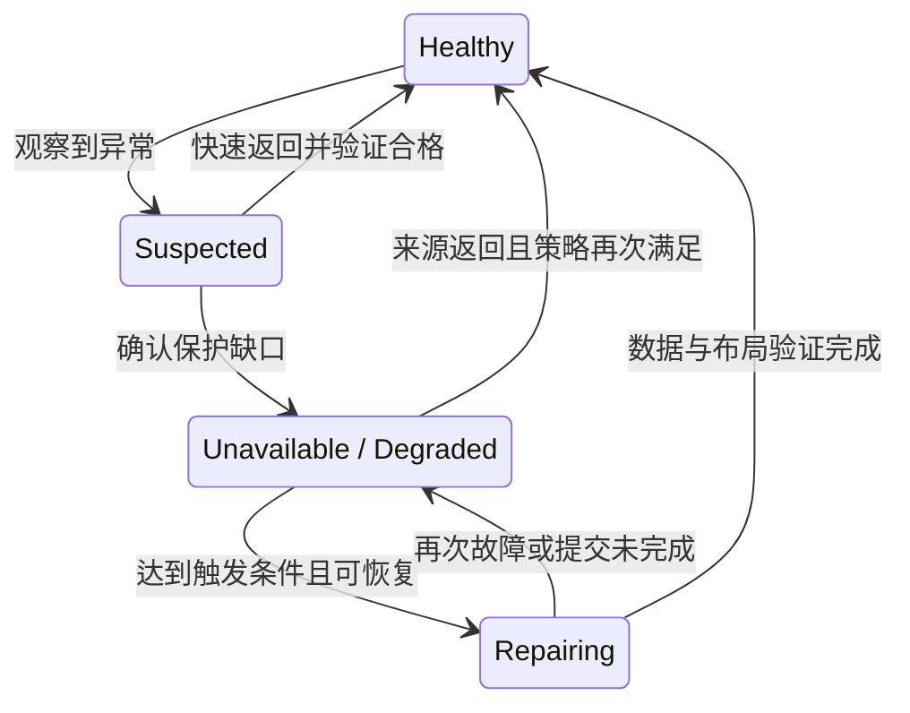
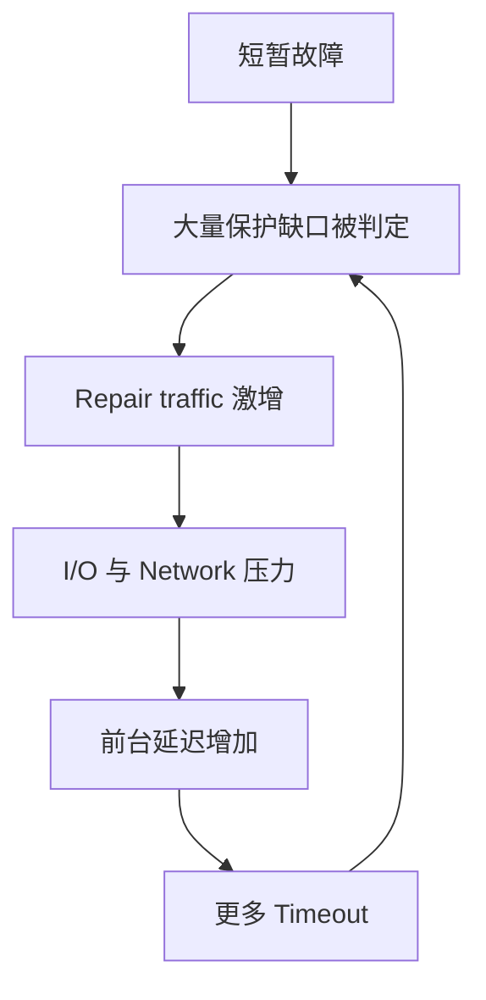

# Failure Detection / State Transition：什么时候开始恢复

某节点连续几次没有响应，系统可以先避开它，但是否应该立刻为它保存的全部数据创建 Repair Task？如果它很快回来，已经启动的修复是否仍然必要？本篇讨论从故障信号到**保护状态变化与恢复决策**，不重讲 [Failure Model / Timeout](../06-distributed-systems/01-failure-model-timeout.md) 中的检测不确定性。

以下状态、阈值与流程都是**通用示意和工程推导**，不要求所有存储系统采用同一状态机。节点、保护组与任务可以各有状态；恢复触发不能只看一张机器 alive / dead 表。

## 1. 先分开节点状态与数据保护状态

节点不可达，会影响位于它上面的多个 Replica / EC Fragment，但影响不一定相同：一些保护组仍有充足来源，一些接近恢复下限，一些需要等待未知来源重新可达。

| 描述 | 本篇采用的含义 | 不能直接推出什么 |
| --- | --- | --- |
| Healthy | 当前检查范围内，有效布局满足目标 Protection Policy | 所有设备永远不会失效，或任意 API 都可用 |
| Suspected | 观察到了异常，正在确认范围与持续性 | 数据已经永久丢失，或旧执行者已经停止 |
| Unavailable | 某节点、路径或所需数据目前无法按要求访问 | 底层字节一定不存在 |
| Degraded | 某个被保护状态的合格来源、可访问余量或域隔离不足目标 | 一定不可读，或一定还能继续写入 |
| Repairing | 正在尝试补齐保护缺口 | 新数据已经进入有效布局 |
| Recovered / Healthy | 所需验证完成，当前布局重新满足目标 | 永久不再降级，或每个历史任务都必须执行到末尾 |

Unavailable 与 Degraded 可以同时成立，也可以分开出现。一个节点不可达，某个不依赖它的保护组仍 Healthy；所有节点 alive，某组却可能因陈旧副本或错误放置而 Degraded。服务不可用还可能来自 Metadata，不能全部归因于正文缺副本。

**Unreachable、Degraded、Permanent Data Loss 是不同结论。** 当前取得的来源不够，只能先说明访问或恢复受阻；只有在所需状态确实没有足够有效、可恢复的持久来源时，才能判定相应范围的永久丢失。Repair 不能凭空制造已经丢失的信息，也不能把一次恢复失败当作丢失证明。

## 2. Missing、Stale 与 Invalid：缺的是哪份状态

修复对象应绑定被保护单元及其应有的状态，而不是只有一个节点名字。沿用 [Replication](../07-data-protection/01-replication.md) 的 U / generation g1：

- **Missing Replica / Fragment：**预期位置没有可用的合格来源。它可能暂时不可取得，也可能已确证丢失；“missing”需要带上这个证据范围。
- **Stale Replica / Fragment：**字节存在，却不属于需要保护的状态。例如 U 需要 g1，返回节点只持有 g0；EC 中旧校验也不能与新数据片拼成合格组。
- **Invalid Source：**身份、完整性或恢复条件未通过验证，不能作为当前恢复依据。更多在线设备不能修正一个无效来源。

对于多副本，数出几份文件不等于数出几份 g1；对于 EC，数出几个片名不等于有足够相容的分片。组身份、编码参数与 Generation 的相容要求见 [Erasure Coding](../07-data-protection/02-erasure-coding.md)。

Protection Level Degradation 应同时考虑数量与布局：剩余来源还有多少、是否足以恢复、还能承受哪些目标故障。如果新补的一份与现有来源处于同一个关键 Failure Domain，数量上看似齐全，仍可能不满足保护目标，参见 [Placement](../07-data-protection/03-failure-domain-placement.md)。

## 3. Transient 与 Permanent：等待的是返回机会，不是绝对证明

Transient Failure 可能来自短暂网络抖动、重启或资源拥塞；Permanent Failure 可能来自已确认不可恢复的介质损毁或资源退出。节点永久失效也不等于数据永久丢失：其他合格来源仍可补回它的保护份额。

在无法立即确定性质时，系统可采用 **Grace Period**：给短暂故障一个返回窗口，期间持续判断受影响范围与保护余量，而不是立刻全量重建。它不是“期间仍把不可达来源当作已经可用”，也不要求在缺口确认前保持 Healthy。

Grace Period 与请求 Timeout、故障检测阈值、Lease 有效期服务于不同目标。它影响修复启动时机，不能延长旧 Owner 的写入资格，也不能替代 [Fencing](../06-distributed-systems/02-quorum-leader-lease-fencing.md)。

| 当前证据与保护状态 | 通用决策方向 | 要支付的代价 |
| --- | --- | --- |
| 短暂异常，仍有足够合格来源与余量 | 持续确认，给快速返回机会，避免立即大批复制 | 等待期间缺口仍存在，需要观察风险是否变化 |
| 缺口持续超过容忍窗口 | 依据实际受影响单元建立恢复工作 | 产生 Source / Target I/O、网络与状态管理成本 |
| 已确认持久丢失，或余量已接近恢复下限 | 在来源仍足够时提高修复紧迫性，不机械等满窗口 | 可能需要更多资源，但仍不能取消资格与完整性检查 |
| 来源不足且部分来源仍未知 / 不可达 | 保持明确的受阻状态，继续判定来源 | 不能靠反复 Decode 或重复任务证明完成 |
| 来源确证不足以恢复所需范围 | 显式报告不可恢复状态，而非伪造 Repair 成功 | 超出本篇正常补齐闭环的能力边界 |

这些不是统一参数推荐。等待太短，会把维护和抖动变成大量重复工作；等待太长，会延长低余量窗口，给再次故障留下更大风险。额外故障到来时，应重新评估，不能让原有计时器阻止更紧急的保护决策。

## 4. 一个带快速返回路径的示意状态图

下图聚焦一个受影响保护组。`Unavailable / Degraded` 节点表示“某来源不可用并已识别保护缺口”的组合情况，并不把两种状态定义为同义词；其他故障范围需要另外判断。

D 可以在 Grace Period 内等待，保护状态与修复启动不必同一时刻变化。两条直接回到 H 的边，要求返回数据确实合格、布局重新满足策略，不是收到心跳就跳转。R 回到 D 则表示需要重新判定，具体重试由 [Recovery Task Coordination](03-recovery-task-coordination.md) 处理。

## 5. Node Return：重新上线只是开始核对

节点返回时需要对照有效 Metadata / Layout 判断：它持有哪些单元、对应哪个 Generation、是否完整持久、仍被哪份有效布局引用、是否满足当前 Placement。只有通过所需验证的来源，才能重新计入对应保护组。

例如节点离线期间 U 从 g0 演进为 g1，节点带回的 g0 不能补上 g1 的缺口；但 g0 若仍被保留的历史状态合法引用，可以有自己的保护要求，不能简单等同于无用字节。身份与引用边界见 [Metadata / Object Index](../08-consistency-metadata-partitioning/02-metadata-object-index.md)。

若 Repair 已经发布新位置，旧位置返回也不能无条件改变当前 Layout，或使两个独立执行者同时覆盖记录。应在有效修改资格下重新判断保护是否满足、哪些任务仍有必要；停止不再需要的工作，也需要确认其在途效果。这里不展开多余数据的物理回收。

## 6. Recovery Trigger 看保护缺口，不只看机器故障

一个最小触发判定应能回答：哪些状态受影响、缺少哪些合格来源、剩余来源是否足以恢复、缺口持续多久、目标策略是什么，以及当前是否已有相同目的的任务。

这解释了两个看似相反的例子：节点没有 down，但某 Fragment 验证失败，应排除它并判断是否需要补齐；节点已 down，但快速返回且全部受影响状态重新合格，就可能避免 Repair。对相同故障反复发出的检测信号，不应每次都创建一套新的任务。

触发不等于马上执行所有工作。它可以先记录需要恢复的保护状态，再由任务协调控制优先级和资源准入。故障检测也不能授予 Layout 修改资格；谁有权提交恢复结果仍以 [Ownership](../08-consistency-metadata-partitioning/03-partition-ownership-routing.md) 为准。

## 7. Recovery Storm：修复压力反过来制造更多故障信号

以下是通用的正反馈放大示意，而不是某产品的故障报告：

应对不能只有“加快修复”：状态确认与 Grace Period 减少不必要任务，稳定任务身份避免重复入队，分散启动和限流限制瞬时工作量，执行前重查保护缺口避免修复已恢复的数据。过载时也不能无限延长所有 Grace Period，掩盖真正接近恢复下限的组。

这是两个目标的共同约束：不把抖动放大成 Recovery Storm，也不让低保护状态无限持续。具体资源取舍交给 [任务协调](03-recovery-task-coordination.md)；下一篇先说明一份合格 Replica / Fragment 怎样重新进入持久布局。

## 来源与适用边界

- [GFS 原论文 §4.3、§4.5](https://research.google.com/archive/gfs-sosp2003.pdf)：用于核对保护缺口、有效副本与返回节点的陈旧状态问题，不照搬其版本协议或参数。
- [Google SRE：Handling Overload](https://sre.google/sre-book/handling-overload/)：用于核对过载与重试放大的工程边界；上面的 Recovery Storm 是本篇结合后台修复推导的场景。

核对日期：**2026-10-02**。Healthy 等名称、Grace Period 决策表与状态图均为通用模型，不是固定产品状态机，也不展开 Migration、Rebalance 或 Observability 指标体系
