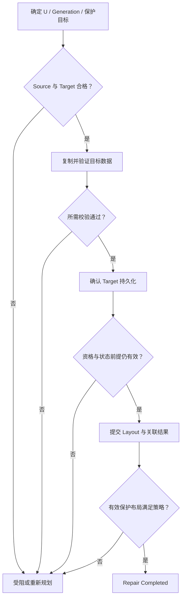

# Repair / Rebuild：补回字节，更要补回保护布局

[上一篇](01-failure-detection-state-transition.md) 判断何时值得启动恢复。本篇回答一个更具体的问题：**缺失或无效的 Replica / EC Fragment，如何重新成为可计入保护目标的持久来源？**

以下采用通用准备、验证、发布模型，不规定具体产品的 Repair 算法。Repair 指补齐保护缺口；Rebuild 常用于更大受影响范围的重建，但名称与粒度随系统而异。节点级 Rebuild 仍需要落实到可识别的保护单元，不是把整块设备盲目复制到另一台机器。

## 1. Degraded Read ≠ Repair

Degraded Read 的目标是满足当前读取：当某数据片不可用，临时从其他有效片恢复请求需要的字节并返回。它可以不留下新的持久分片。

Repair 的目标是恢复保护布局：把合格数据放到符合策略的位置，持久化并使 Layout / Protection State 正确反映它。GET 成功不证明目标布局已经补齐；后台修复也不要求一定由一次 GET 触发。

对于 Replication，改从另一份合格副本读，不需要 EC Decode，也可能没有创建任何新副本。对于 EC，仅缺 Parity Fragment 时，正常读可以照常完成，但仍有保护缺口。基础读取与编码关系见 [Replication](../07-data-protection/01-replication.md) 和 [Erasure Coding](../07-data-protection/02-erasure-coding.md)，这里不重复算法。

## 2. 首先确定恢复的是哪份逻辑状态

假设某对象状态 `Object Generation gB` 引用内部单元 `U / g1`。本次需要补齐 U 的 g1，而不是只拿一个 Key 和“最近的一份文件”作为输入。Object Generation 与内部单元 Generation 不要求数值相同或一一对应；任务应由有效引用确定二者的绑定。

EC 还需要绑定 Stripe 身份、缺失 Fragment 位置、相容的编码状态与参数。正确的片名加错误 Generation，仍然是错误输入。相关记录职责见 [Metadata / Object Index](../08-consistency-metadata-partitioning/02-metadata-object-index.md)。

Repair 应保持被保护状态的内容与身份，不因为新增物理来源就自动生成一个用户可见 Object Version。新的 Layout Revision 可以改变位置映射；Object Generation、Layout Revision、Ownership Epoch 分别描述内容状态、映射演进和修改资格，不能用同一个未定义的“版本号”替代。

如果当前 Key 已被覆盖，原 Generation 是否还需要保护，取决于历史引用、共享布局与保留范围。确认已不属于本次保护范围时，应让任务结束为“不再需要”或重新规划；不能用修复旧状态证明新状态已经受保护，也不能自动宣布旧字节可删除。

## 3. Replica Repair：有效来源复制到合格目标

基本链条是 **Missing / Invalid Replica → Select Valid Source → Select Valid Target → Copy → Verify → Update Protection State**。

Source 必须是需要保护的已提交状态，具备完整性和持久依据。复制期间也要保证读取绑定这份状态；若原位置可被更新，不能把前半段 g1 与后半段 g2 拼起来，再得到一份“复制成功”的文件。实现可采用稳定引用、快照或其他状态保护方式，本篇不指定机制。

Target 必须符合 [Placement Policy](../07-data-protection/03-failure-domain-placement.md)：包括剩余布局下的 Failure Domain 隔离、容量与接收资格。与 Source 在不同节点，不自动说明满足跨机架目标；Target 当下有空闲，也不说明整个写入所需容量已得到保障。

没有有效 Source 时，不应从 stale replica 挑一个“看起来最完整”的内容继续。先保留恢复受阻状态并判定来源；多个错误副本不会形成一份正确对象。

## 4. EC Reconstruction：相容分片共同重建缺片

本篇继续使用前置正文的 **systematic MDS k+m** 模型：取得至少 k 个有效、相容且属于同一编码组状态的分片，才能保证重构所需缺片。不是所有编码都具有“任意 k 个”性质。

基本链条是 **Missing Fragment → Select Compatible Survivors → Decode / Reconstruct → Write Target Fragment → Verify → Update Layout / Protection State**。缺 Data Fragment 时恢复所需数据区域；缺 Parity Fragment 时形成对应校验信息。重建某一片并不要求先把整个 Object 组装到一台节点上。

选择来源不只是“有 k 个地址”：它们要覆盖不同的有效分片位置，具有相容 Generation 与编码参数，并排除已识别的完整性失败。读取中新增故障或发现旧片时，先重新判断有效输入是否足够，再换来源或暂停；不能继续沿用原来的片数证明。

重建结果也需要绑定目标 Fragment 的身份、位置与状态。只有输出字节与持久布局都正确，才能将该片计入保护余量。基础 4+2 数字示例和可恢复门槛回看 [EC 正文](../07-data-protection/02-erasure-coding.md)，不在本篇重新计算。

## 5. 从准备到完成：九个必须兑现的检查点

以下是逻辑阶段，可以流水化、合并或重复，并非所有系统都要执行九次 RPC：

| 阶段 | 必须确定的事实 | 不能用什么替代 |
| --- | --- | --- |
| 1. 确定状态 | 目标单元、所需 Generation、引用与保护目标仍有效 | 只有节点名或 Key 名 |
| 2. 确认 Source | 完整副本有效，或有足够相容 EC 输入 | 节点 alive，或文件长度相同 |
| 3. 选择 Target | 新布局满足 Placement，资源可以承接 | 任意有空闲的设备 |
| 4. Transfer / Reconstruct | 得到属于该状态的完整目标数据 | 已发送完全部字节 |
| 5. Integrity Verification | 身份、范围、长度与所需校验通过 | Source 与 Target 都返回一个相同但无可信依据的摘要 |
| 6. 持久化新来源 | Target 达到约定的可恢复条件 | 内存接收完成或进度 100% |
| 7. 更新 Metadata / Layout | 在合法 Ownership 下，有条件地提交对应状态的映射 | 修改一个本地缓存，或覆盖期间已改变的记录 |
| 8. 再检查 Protection Level | 实际有效布局满足数量与 Failure Domain 目标 | 只数历史 ACK 或任务数量 |
| 9. 宣布完成 | 所需验证与可恢复完成记录成立 | Worker 函数正常退出 |

Integrity Verification 可以贯穿读取、传输与目标写入，并按实现要求增加持久化后的确认或校验。其粒度和依据应由数据格式与接口契约说明；Checksum 能发现约定范围内的错误，却不替代 Generation、来源合法性或提交判定。本轮不展开 Silent Corruption / Scrubbing 专题。

## 6. 一个 Replica Repair 的通用流程图

图中的每个动作仍可能失败或返回未知结果，不能因为没有画所有错误边就当作不会发生。`受阻或重新规划` 不表示盲目从头重做，更不表示删除候选数据；结果判定与阶段重试交给 [下一篇任务协调](03-recovery-task-coordination.md)。

## 7. Layout 提交不能覆盖新的状态或资格

设准备时映射为 `L10`，U 需要 g1，处理资格为 `e7`。复制期间可以发生两种变化：逻辑状态或 Layout 被其他合法操作更新；Ownership 转为 e8。前者改变提交前提，后者改变谁有权提交。

提交必须检查所保护状态及相应布局前提仍成立，或按明确规则把新增来源合并进当前布局；不能拿早先读到的整份 L10 无条件覆盖最新映射。Generation 未变时，其他 Repair 也可能已经改变 Layout，所以只检查数据 Generation 未必充分。

Ownership 变化同样不能靠本地 Lease 检查处理完毕。实际修改入口需要落实 [Fencing](../06-distributed-systems/02-quorum-leader-lease-fencing.md)，并使资格校验与效果提交协调；新 Owner 是否采纳已准备数据，应重新确认状态，而不是允许旧 Owner 绕过检查补写结果。归属关系回看 [Partition / Ownership / Routing](../08-consistency-metadata-partitioning/03-partition-ownership-routing.md)。

Repair 只调整物理保护布局，不改变用户对象内容，并不意味着它没有一致性要求。新 Layout 不应指向未就绪来源，也不应丢掉其他合法引用。若提交已生效但 Response 丢失，后续必须判定结果，而非把新副本当作未提交后再次分配。

## 8. 哪些“复制完成”仍然不是 Repair Completed

| 情况 | 为什么不能宣布完成 |
| --- | --- |
| Checksum / Integrity Verification 失败 | 字节数量正确不证明数据正确 |
| Source 属于过期或不相容状态 | 得到了错误 Generation，不能补齐所需状态 |
| Target 不满足 Failure Domain | 数量补齐，目标隔离仍未恢复 |
| Metadata / Layout 尚未生效或结果未知 | 正常读取与保护判断可能仍不引用该来源 |
| Ownership 已变化，旧执行者仍提交 | 即使字节正确，也不能接受失效资格的状态修改 |
| 修复期间 Source、Target 或其他来源再次失效 | 原来拟补齐的布局与保护余量已经变化，必须重评 |

某个 Target 合格并提交成功，只说明这项修复效果成立。若同一组又缺了另一份，组仍可能 Degraded；若受影响范围还有其他组，整体 Recovery 也尚未完成。完成声明必须带上范围和当前状态，不能由一个成功 Copy 推导整个节点 Rebuild 完成。

## 9. Replica Repair 与 EC Reconstruction 的资源代价

按补齐一个目标输出、有效输入且没有重试的口径比较：

| 资源 | Replica Repair | 传统 EC Reconstruction |
| --- | --- | --- |
| Source I/O | 从一个合格完整来源读取待复制范围 | 通常读取多个相容分片的编码范围；量取决于编码与重构粒度 |
| Network | 把复制范围送往 Target | 汇集重构输入，再把输出送往 Target；节点角色与拓扑改变链路流量 |
| CPU / Memory | 复制、校验与缓冲 | 增加解码或校验片生成及多输入缓冲 |
| Target Write | 写入新副本的目标范围 | 写入新 Fragment 的目标范围 |
| 故障时协调 | 选择替代有效 Source | 重新确认足够相容输入，单个慢来源也可能拖延重构 |

这不是“EC 永远更慢”的结论：编码优化、并行度、范围处理和一次补多片都会改变成本。关键是 Target 的输出吞吐不等于总资源消耗；只限制 Target Write，仍可能耗尽多个 Source 的磁盘与网络。如何兼顾前台与恢复窗口，进入 [Recovery Task Coordination](03-recovery-task-coordination.md)。

## 来源与适用边界

[GFS 原论文 §4.3、§4.5](https://research.google.com/archive/gfs-sosp2003.pdf) 提供有效副本克隆、位置约束和陈旧状态检查的历史案例，用于核对职责，不规定本篇九阶段或内部版本格式。EC 模型沿用 [Data Protection 的来源与限定](../07-data-protection/02-erasure-coding.md)。

核对日期：**2026-10-02**。gB / g1、L10 / e7、准备与发布图及成本表为通用示意和工程推导；不描述具体产品算法，也不扩展 Rebalance / Migration。
