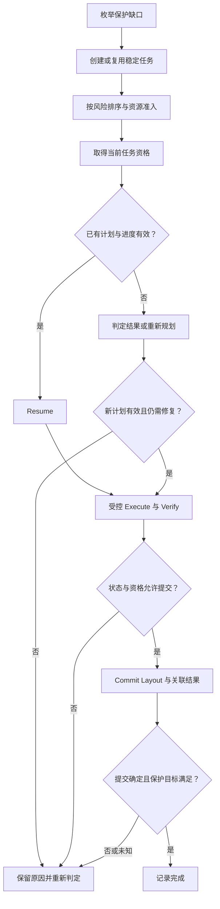

# Recovery Task Coordination：让大量修复工作可靠推进

一次 [Repair](02-repair-rebuild.md) 已经需要验证数据、资格和布局。一个节点或故障域异常时，受影响单元数量巨大：如何避免遗漏、重复分配、旧 Worker 提交，以及恢复流量压垮前台？

本文建立**通用任务与资源协调模型**。Coordinator、Task Store、Scheduler、Worker 表示职责，可以合并、分布式实现或由现有组件承担，不要求部署一套独立队列系统，也不展开调度算法或 Observability 平台。

## 1. Detect → Enumerate → Task：把保护缺口转为可恢复工作

Detect 提供受影响资源与信号；Enumerate affected units 将它映射为实际受影响的保护状态。需要结合有效 Layout / Index，而不是把节点盘上的所有文件都当作当前待修复对象。

枚举可能依赖反向位置索引、保护状态扫描或等价的可恢复事实，本篇不指定实现。扫描期间状态会变化，因此枚举结果是候选工作集，不是永远有效的快照证明；执行前与提交时仍需检查状态和保护目标。

大规模枚举本身也需要恢复边界：保存已覆盖的范围或游标，重启后允许安全地重复扫描，并确保未覆盖范围继续处理。若相关状态在扫描中变化，需要重查或补充枚举，使仍存在的缺口不会因一次扫描而永久遗漏。控制扫描成本属于恢复准入，不要求一次把所有任务装进内存。

基本流程为 **Detect → Enumerate → Create Tasks → Prioritize → Schedule → Execute → Verify → Commit Result → Complete**。任务身份与持久状态，使这一链条可以在任一执行者失败后继续，而不是只能依赖原进程中的循环。

## 2. Task Identity 应绑定恢复意图，而不是传输尝试

| 身份或前提信息 | 解决什么问题 |
| --- | --- |
| Affected Unit / Protection Group | 这项工作在恢复哪个内部单元或编码组，缺的是哪份保护角色 |
| Expected Generation / State Reference | 不把旧状态的结果发布给新状态；必要时包含 Layout 前提 |
| Recovery Reason | 记录缺失、无效或不可达等触发背景，帮助重新判断工作是否仍必要 |
| Target Protection Goal | 要补齐哪种数量和 Failure Domain 约束，而非只生成一个文件 |
| Stable Operation / Task ID | 跨 Worker、重启和重试识别同一个恢复意图 |

表格不是固定字段格式。Recovery Reason 有助于解释工作来源，却不宜仅因第二个检测器给出另一个 reason 字符串，就把相同目的变为新任务。去重应按稳定意图和状态范围定义；计划合法变化时，也需要能区分旧计划与新计划。

Task ID 跨执行尝试保持稳定，Attempt ID 可以每次变化。Expected Generation、当前执行资格和具体 Target 选择也各有职责：Worker 换了，不必改变恢复意图；恢复目标状态已经换了，则不能伪装成同一组参数的无条件重试。

## 3. Retry 不应每次重新分配一个 Target

假设任务 T 修复 U / g1，选定目标槽位并分配候选副本 C1，完成复制后 Worker 崩溃。接管者若看到“任务未完成”就分配 C2，下一次又分配 C3，会占用多份容量，且无法清楚判断哪份已进入 Layout。

一种通用方案是保存可恢复的任务计划与分配结果，将 T 或其稳定子操作身份绑定到目标槽位 / Unit ID；重试先判定 C1 的状态，符合续传与复用条件才继续。分配调用本身结果未知时，也需要查询或同一 Operation ID 重试，不能因为本地没收到 ID 就认为没有分配。

确需换 Target 时，例如 C1 的设备失效或已不符合 Placement，应在合法资格下记录新计划及其边界，防止旧尝试继续提交旧计划结果。这不是要求永远不能换位置，而是要求**重新选择有依据，重复执行不会暗中变成重复资源分配**。候选数据的回收不在本篇展开。

| 重复或失败情况 | 正确处理的基本边界 |
| --- | --- |
| 同一保护缺口被重复检测 | 创建去重或合并为已有意图，再判断是否仍有缺口 |
| 两个 Worker 同时获取同一任务 | 通过条件领取、有效 Lease 或等价机制限制执行资格；不能都查到空闲再各自宣布拥有 |
| Worker Crash | 持久状态保留意图、计划与阶段；接管后判定已有副作用，再安全重试 |
| Target 创建响应丢失 | 保留分配 Operation ID，判定原分配结果，而非直接创建另一个 |
| Layout 提交响应丢失 | 查可恢复提交事实；不能仅因任务未标完成就认定 Layout 未生效 |

这些是 [Retry / Idempotency / Deduplication](../06-distributed-systems/03-retry-idempotency-deduplication.md) 在 Recovery 中的应用，不重新定义 Exactly-once。入口任务创建去重，也不代表下游 Target 分配、复制和 Layout 更新都只形成一次效果。

## 4. Worker Lease、Epoch 与 Fencing

Worker Lease 用于限时持有任务执行资格；续期失败或资格未知时，Worker 应停止受保护操作。但旧进程可能暂停、网络隔离或已经发出了延迟请求，新 Worker 接管后，仅把任务记录的 owner 字段改掉仍不够。

复用 [Fencing](../06-distributed-systems/02-quorum-leader-lease-fencing.md) 的门槛安装示意：T 原由 Worker A 持有 task epoch t7，新 Worker B 获得 t8，在相应修改入口确认新门槛生效后接续工作。A 恢复后携带 t7 的受保护修改或结果提交，应被拒绝；资格检查还需与实际效果提交协调。

**Task Epoch 与 Partition Ownership Epoch 不一定是同一个序号。** Worker 拥有 T 的 Lease，不自动使它成为 Layout 所属 Partition 的 Owner。任务领取、目标资源操作和 Layout 提交可能有不同授权范围，必须由实际入口执行相应检查，参见 [Ownership / Routing](../08-consistency-metadata-partitioning/03-partition-ownership-routing.md)。

Fencing 防止失效执行者继续产生不合法效果，不替代 Task Deduplication。同一有效 Epoch 下的重复请求仍需稳定操作身份或幂等处理。已在切换点前合法提交的效果也不会自动撤销，新 Worker 应识别并接续，而不是重做一遍来“覆盖旧 Worker”。

## 5. Checkpoint / Resume：进度不是正确性证明

Checkpoint 可以记录已覆盖的枚举范围、已确定的计划、Target 身份、已验证写入区间，以及尚未完成的提交阶段。它需要可恢复，并绑定相应状态；一个只在 Worker 内存中的百分比，不能支持 Worker Crash 后接续。

| Retry Boundary | Resume 前要确认什么 |
| --- | --- |
| 枚举与任务创建 | 已覆盖范围与稳定任务身份有效；允许重复，不漏掉仍有缺口的状态 |
| Target 分配 | 原分配是否已形成、是否仍符合计划与 Placement |
| Transfer / Reconstruct | 已记录范围实际存在并满足续传条件，输入与输出仍绑定所需 Generation |
| Verify / Persist | 所需验证及 Target 持久化是否已完成，缺证据时按契约重新确认 |
| Commit Result | Layout 或关联结果是否已生效，处理明确拒绝与 Unknown Result 的区别 |

不能把“已发送到偏移 80%”记录成“目标 80% 已验证持久”。粒度过粗会导致重做大量 I/O；粒度过细会增加记录更新和查询成本。实际选择要结合可重复的工作边界，而不是单纯追求进度显示平滑。

Checkpoint 只缩小需重新执行的范围，不证明 Source 没有变、Target 没有失效、Epoch 仍有效或保护已恢复。接续时仍应重查适用前提，不能靠保存一个 `Verified=true` 绕过随后发生的新故障。

## 6. Verify → Commit Result → Complete

以下流程图强调任务领取、受控执行与结果判定的分支，正常路径中的 Verify 采用 [Repair 九阶段](02-repair-rebuild.md) 的要求：

图中“重新规划”也允许任务受阻或已经不再需要，此时不应继续 Execute。资格与数据验证失败不是无限快速 Retry 的许可；未知结果则需要判定已发生的效果。

Layout 提交和 Task Completion 可能不在同一持久事务中。若 Layout 已生效、任务尚未标 DONE 就崩溃，接管者需要能从提交事实确认结果并补齐记录；不能仅按任务状态重新分配。反过来，不能先标 DONE，再寄望 Layout 更新最终成功。

实现可以原子关联这些事实，或使用可恢复的结果判定协议，本篇不规定具体协议。至少要使任务记录、Layout 状态与完成声明在故障后能重新核对。此边界沿用 [Metadata / Data 提交基础](../08-consistency-metadata-partitioning/02-metadata-object-index.md)。

## 7. Priority / Throttling：修复最快不等于风险最低

Priority 决定先恢复什么，Throttling / Admission Control 决定同时做多少。按风险排序可以优先处理接近恢复下限、影响前台进展或长期未修复的状态；仍需防止低优先级工作无限饥饿。当前来源不足的任务不能因高优先级就跳过有效输入条件。

| 共享资源 | 后台 Recovery 消耗 | 为什么只限一个总带宽值不够 |
| --- | --- | --- |
| Source Disk I/O | 复制读取、多个 EC 输入读取 | 热点 Source 的 IOPS 或队列先被占满，其他节点仍可能空闲 |
| Target Disk I/O / Capacity | 新副本 / 分片写入与持久化 | 写入和空间占用会与前台竞争，候选资源也不能无限增加 |
| Network | 输入汇集、跨域传输与输出 | 跨机架共享链路可能成为瓶颈，Target 字节数不代表总链路流量 |
| CPU / Memory | 校验、Decode / Reconstruct 与缓冲 | EC 与大量并发校验可能先受 CPU 或内存约束 |
| Concurrency / Control Path | 活跃任务、Metadata 查询与提交 | 小任务即使吞吐不高，也能放大 RPC 和控制面压力 |

因此可在集群、节点、故障域或共享资源范围内约束修复带宽、I/O 与并发，避免每个 Worker 都觉得自己只开了少量任务、总和却压垮系统。重试同样消耗预算，应使用退避、随机分散和重复任务控制，而不是只限制首次执行。

过于激进会拉高前台延迟与 Timeout，并沿 [Recovery Storm](01-failure-detection-state-transition.md) 再次扩大恢复压力。过于保守会延长 Degraded 时间，增加下一次故障到来时失去最后来源或不足 EC 输入的风险。这是 Recovery 的核心工程取舍，不是“后台永远最低优先级”或“故障后抢占所有资源”二选一。

故障窗口内应根据当前保护风险、前台压力和瓶颈资源调整准入，明确受阻原因；不能靠低吞吐隐藏来源不足或容量不足。这里仅说明控制依据，不展开指标体系、自动调参或 SLI / SLO 专题。

## 8. 三个完成边界，必须带上范围

**Task execution finished ≠ Recovery complete ≠ Protection restored。** 执行结束可能是成功、失败、受阻或不再需要；任务数归零也可能只是漏掉了受影响单元。

| 完成声明 | 至少要核对什么 |
| --- | --- |
| 某 Task 成功 | Target 数据正确且持久、所需 Generation 正确、合法提交已生效、相应保护目标满足、必要 Verification 与完成记录成立 |
| 某保护组 Protection restored | 当前有效 Layout 满足数量与 Failure Domain 策略，不能只加总旧 Task 的成功结果 |
| 本次受影响范围 Recovery complete | 枚举与后续状态核对覆盖该范围，必需恢复目标已满足，未知提交或遗漏缺口已处理 |

一个 Task 可以合法结束为 Superseded / No Longer Needed，但这不等于它通过修复恢复了保护。若其他任务已经补齐缺口，可以核对当前策略后结束重复工作；若逻辑状态已不再需要保护，则按范围变化记录原因，不能把它计成复制成功。

完成判定也是一个时点与范围内的事实。新故障发生后应重新进入检测与恢复链，不因任务历史上 DONE 就永远认为 Healthy。三篇至此闭合：检测识别保护缺口，Repair 补齐并验证持久布局，任务协调让大量工作可重试、可接管、可限流并可判定结果。

## 来源与适用边界

- [Amazon Builders' Library：Making retries safe with idempotent APIs](https://aws.amazon.com/builders-library/making-retries-safe-with-idempotent-APIs/)：核对稳定身份、资源分配与可恢复结果的工程边界，不照搬具体 API。
- [GFS 原论文 §4.3](https://research.google.com/archive/gfs-sosp2003.pdf)：提供恢复优先级、并发与带宽约束的历史案例，不采用论文参数作为建议配置。
- [Google SRE：Handling Overload](https://sre.google/sre-book/handling-overload/)：核对过载时重复尝试的负载放大与准入问题，本篇不引入其具体服务重试策略。

核对日期：**2026-10-02**。T / C1 / t7 / t8、Checkpoint 表与提交图均为通用模型和工程推导；不实现 Recovery Scheduler，也不扩展 Rebalance、Data Migration 或 Observability 第二阶段。

[上一篇：Repair / Rebuild](02-repair-rebuild.md) · [返回章节入口](README.md) · [回看：Failure Detection / State Transition](01-failure-detection-state-transition.md)
