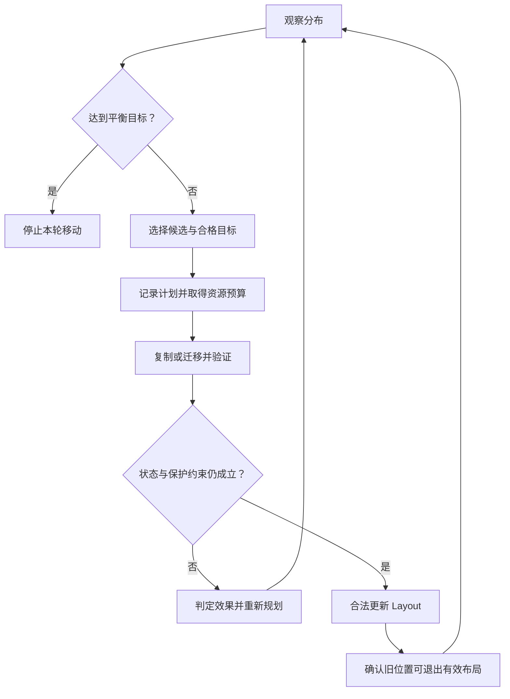

# Rebalance：改善分布，保持保护边界

新节点加入后，旧节点上的数据不会因为集群总容量增加就自动减少；两个节点存了同样多的字节，也可能只有其中一个承担大量请求。什么时候需要搬数据，搬哪些数据，怎样知道搬迁确实改善了分布？

本文讨论 **Rebalance 的通用工程模型**：在有效数据仍可服务的情况下，调整数据、容量、负载或 Placement 分布。它承接 [Repair / Rebuild](02-repair-rebuild.md)，但触发条件和完成目标不同；不指定平衡算法或某个产品的 Scheduler。

## 1. Repair 修补保护缺口，Rebalance 改善分布

Repair 的问题是“当前有效布局缺少所需保护”；Rebalance 的问题是“当前布局仍然有效，但分布已经不合适”。两者都可能复制相同内部单元，不能靠是否出现 Copy RPC 区分。

例如，三份有效副本已满足故障域要求，但集中在集群中容量紧张的一组节点：可以搬动其中一份改善容量分布。若三份副本都在同一故障域、已经违反保护策略，则即使字节都可读，仍有 Protection Gap。此时 Placement Correction 同时承担保护恢复，不能仅当作低风险的普通 Balance。

四种数据移动方式可以共享 Copy、Verification、任务协调和限流，但应分别保留以下判定：

| 机制 | 主要触发原因 | 完成标准 | 优先级依据与失败处理 |
| --- | --- | --- | --- |
| Repair / Rebuild | 故障或无效布局造成保护缺口 | 当前有效布局重新满足保护目标 | 根据剩余保护风险安排；来源失效时重新确认可恢复输入 |
| Rebalance | 容量、数据、请求负载或布局失衡 | 在保护仍满足的前提下，达到声明的分布目标 | 根据失衡程度和资源压力安排；候选失效时重查是否仍值得移动 |
| [Data Migration](05-data-migration.md) | 主动改变数据位置或所用资源 | 新位置承接所需状态，合法切换与必要收尾成立 | 根据迁移目标和窗口安排；切换前后采用不同失败处理 |
| [Node Evacuation](06-node-evacuation.md) | 节点需要计划退出 | 必需责任已转移，拓扑中可安全移除节点 | 根据退出期限及保护风险安排；Source 故障可能转入 Repair |

Rebalance 可以通过 Migration 执行单次移动，Evacuation 也可以创建多项迁移任务。共享执行能力不意味着四种任务具有相同 Trigger、Priority 或 Completion Criteria。

## 2. Capacity、Data 与 Load 是三个目标

| 目标 | 观察什么 | 只优化这一项的盲点 |
| --- | --- | --- |
| Capacity Balance | 可用空间、容量占用比例及所需余量 | 字节分布合理，仍可能有热点或大量小单元造成开销 |
| Data Balance | 字节量、单元数量或特定数据类别的分布；应说明采用哪个维度 | 数量相同不代表字节相同，也不代表请求相同 |
| Request / Load Balance | 请求率、服务时间、读写比例与实际资源压力 | 热点缓解后，目标节点仍可能容量不足或不满足 Placement |

示意：A 有 2 TB 容量、使用 1.6 TB，B 有 10 TB、使用 5 TB。B 的数据更多，A 的占用比例却更高；不能仅按已用字节数决定从 B 搬到 A。再假设 A 多为冷数据，而 B 持有热点数据，则 A 更接近空间边界，B 更可能受请求压力限制。这些是示意数值，不是建议阈值。

**Capacity Balance ≠ Data Balance ≠ Request / Load Balance。** 改善哪个目标，应在计划中明确。混用“更满”和“更热”，容易搬走大量冷数据却不降低延迟，或者把热点搬到空间不足的节点。

## 3. 为什么现有分布会变差？

- **Cluster Expansion**：新增资源先是空的；仅把新写入导向新节点，可能需要很长时间才能改变历史数据分布。
- **Capacity Imbalance / Data Skew**：节点容量不同、对象大小不均、历史写入偏斜或单元数量分布不均，都可能使部分节点提前耗尽余量。
- **Load Skew / Hotspot**：数据访问热度会变。搬动冷数据能释放空间，却不一定改变热点请求；搬一个 Hot Key 也可能只是把热点转移给另一个节点。
- **Placement Correction**：拓扑或策略变化后，需要重新判断既有布局是否符合约束。违反保护目标的部分应按风险处理，其余优化可以渐进完成。

Partition 的逻辑划分和保护单元的物理放置各有职责，参见 [Partitioning / Placement / Routing](../08-consistency-metadata-partitioning/03-partition-ownership-routing.md)。改变副本位置，不要求同时更改 Namespace 分片；物理搬迁也不自动解决逻辑 Hot Partition。本文只说明边界，不展开 Hotspot Mitigation。

## 4. Watermark 与候选选择：避免一触发就搬遍集群

High / Low Watermark 的通用思想是设置不同的进入和退出条件，形成 Hysteresis。例如，超过示意 High Watermark 85% 后开始疏解，降到 Low Watermark 75% 附近后停止；而不是在同一个阈值附近反复启动和停止。这不是所有系统必须提供的配置，也不能替代对请求负载、保护风险和目标空间的判断。

Source / Target Selection 至少需要协调三个方面：

| 判断 | 应解决的问题 |
| --- | --- |
| Source 与候选单元 | 哪些有效单元的移动能改善声明的目标？来源是否有效，读取是否会进一步压垮热点？ |
| Target 资格 | 是否满足 [Placement Policy / Failure Domain](../07-data-protection/03-failure-domain-placement.md)，有空间与 I/O 余量，且允许接收新工作？ |
| 移动收益与成本 | 收益是否足以承担复制、校验、跨域网络和 Metadata 更新成本？移动后是否只是制造新的失衡？ |

目标空间不能只看计划创建时的空闲值。并发移动和前台写入都会占用空间；旧数据在合法切换前通常还要保留，新旧位置暂时共存也需要预算。若每项任务都独立判断“Target 还有空间”，总体计划仍可能超配。

候选依据需要在执行与提交时再次核对。Source Generation 过期、Target 进入 Draining、保护布局改变，都可能使原计划失效。复用 [Recovery Task Coordination](03-recovery-task-coordination.md) 的稳定任务身份、可恢复计划和重复分配控制，不把每次 Retry 当成新的随机搬迁。

## 5. Background Movement 是带反馈的过程

**Observe imbalance → Select candidates → Plan movement → Move → Verify → Update layout → Repeat until convergence** 是逻辑流程，不规定独立组件、扫描周期或调度算法。

图中 Update Layout 不只是修改一个地址：需要确认 Target 有效且持久、当前逻辑状态匹配、提交资格有效，以及新布局仍满足保护策略。只有切换及相关使用边界得到确认后，才能让旧位置退出所需布局；不能先减掉 Source 再希望 Target 最终复制成功。更复杂的并发更新与 Cutover 在 [下一篇](05-data-migration.md) 展开。

Convergence 是达到定义的容差或运行目标，而不是每个节点字节数完全相同。前台新写入、删除、访问热度变化和新故障持续影响分布，可能使上一轮的“最优目标”不再合适。系统通常需要重观测、抑制反复搬动，并在收益不足或资源受限时暂停，而不是承诺一次扫描后永久平衡。

## 6. 为什么不能一次搬太多？

Source 读取、Target 写入、校验 CPU、跨节点网络、Layout 提交，都与前台 I/O 及 Repair 共享资源。大量小单元移动可能先耗尽 IOPS / RPC 并发，大单元移动可能先占满带宽；一个总 MB/s 限制无法覆盖这些差异。

因此 Background Movement 应结合 Bandwidth、IOPS 与 Concurrency Throttling，并考虑 Source、Target 和共享链路的局部预算。多个 Worker 的局部限额还需放入总体约束，否则每个任务都“很克制”，集群仍可能过载。退避和重试也消耗预算，具体控制基础回看 [Recovery 资源取舍](03-recovery-task-coordination.md)。

Repair 通常比普通 Balance 更紧迫，因为 Protection Gap 会扩大再次故障时的风险。但这不是绝对排序：某个节点即将耗尽空间、已经阻碍安全写入或 Repair Target 分配时，疏解容量可能是恢复进展的前提。合理策略要同时看保护风险、前台压力、退出期限和资源瓶颈，避免普通 Balance 抢光恢复预算，也避免任何 Balance 都永久饥饿。

Rebalance 完成声明应带上范围和目标，例如“在本次成员集合及容量目标下，候选范围已达到容差，所有生效移动满足保护策略”。任务队列为空可能只是没有可用 Target，不能当作已平衡。

## 来源与适用边界

- [GFS 原论文 §4.3](https://research.google.com/archive/gfs-sosp2003.pdf)：公开历史案例分别讨论重新复制与 Rebalancing，以及渐进使用新节点、限制复制并发和带宽。本篇不采用其具体算法或参数。
- Generation、Layout、Placement 和任务提交边界复用上述仓库正文；Watermark 数值、候选表和流程图为通用工程示意，不代表产品行为。

公开资料核对日期：**2026-10-02**。本篇止于平衡目标与安全移动边界，不展开 Capacity Management 或具体平衡算法。
