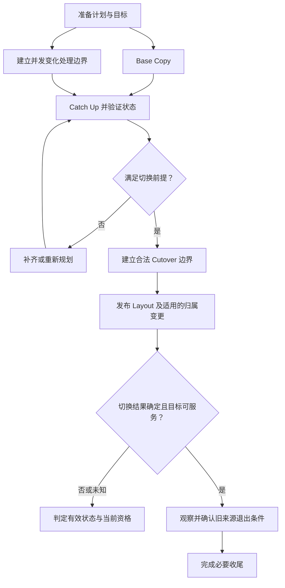

# Online Data Migration：并发更新与安全切换

Source 上已经复制过的数据，为什么仍不能直接切换到 Target？因为复制期间，客户端可能继续更新逻辑状态；即使目标字节完整，也可能只是完整保存了一个过时状态。

本文建立 **Online Data Migration 的通用逻辑模型**，关注并发变化、Cutover 和失败处理。Plan、Base Copy、Catch-up 等表示职责与阶段，可以组合、重叠或采用其他等价设计，不要求所有系统使用 Journal、Dual Write 或同一迁移服务。

## 1. 先明确移动的是什么

[Object Layout](../03-object-storage/06-object-layout.md) 已区分逻辑 Object 与内部 Storage Unit。迁移不可变单元 U / g1，可以固定输入、验证目标并切换其位置引用；用户覆盖写可能产生新的单元，而不修改 U / g1 的字节。此类移动不必天然携带整套变更日志。

迁移仍在更新的逻辑状态则不同：例如 Object 当前状态、Index 范围或 Partition 的服务责任。需要覆盖有效版本、删除和相关 Metadata 变化，保证迁移范围在切换时达到应有状态，不能只搬某次扫描到的数据文件。

下文 g1 / g2 / g3 是示意 Generation，表示逻辑状态推进，不是 S3 Version ID；Ownership Epoch 表示修改资格，二者也不是同一计数器。

| 时间 | Source / 当前合法状态 | Target | 含义 |
| --- | --- | --- | --- |
| t0 | g1 | 未准备 | 开始迁移 |
| t1 | g1 | 正在复制 g1 | Base Copy 绑定某个输入状态 |
| t2 | g2，更新已合法提交并返回成功 | 仍只有 g1 或其部分数据 | Source 继续服务，复制产生落后窗口 |
| t3 | g2 | g1 已完整复制 | Copy finished，却尚未追平 |
| t4，错误切换 | 请求被路由到 Target | 读取返回 g1 | 已提交 g2 被回退；迁移破坏可观察状态 |

因此，Online 不只是“复制时允许读写”，还必须保证切换后的状态符合原有 [一致性契约](../08-consistency-metadata-partitioning/01-consistency-observable-state.md)。有些设计在最终切换时短暂停写；Online 不自动意味着所有操作全程零停顿。

## 2. Plan 与 Migration Identity

**Plan → Prepare Target → Base Copy → Handle Concurrent Changes → Catch Up → Verify → Cutover → Observe → Cleanup Source** 是通用逻辑链。Immutable Unit 的变更处理可以简化为确认输入未变；可变状态则必须定义其同步边界。

迁移计划应绑定以下信息，但不规定字段格式：

| 身份或前提 | 作用 |
| --- | --- |
| Logical State / Partition / Unit | 明确迁移范围，避免“复制了一个目录”被误认为整个状态已覆盖 |
| Expected Generation / State Reference | 固定 Base Copy 输入及验证前提，防止旧数据发布为新状态 |
| Source / Target | 记录来源资格、目标分配与两者的资源条件 |
| Migration Operation Identity | 跨重试与接管识别同一迁移意图；避免重复创建多个 Target |
| Plan Revision / Cutover Preconditions | 合法变更计划时识别旧尝试，记录切换所需状态边界 |

可变范围的 Generation 会推进。Expected Generation 不是要求最终永远停在 g1，而是要求 Base Copy、增量应用及最终切换分别知道自己绑定哪个状态。计划改变时保留可恢复记录，不能让旧 Worker 继续用最初前提提交。

资源分配与提交结果未知时，按稳定 Operation ID 查询或安全重试。执行进度、目标身份和任务资格沿用 [Recovery Task Coordination](03-recovery-task-coordination.md)，不另建一套“迁移就是每次重做 Copy”的规则。

## 3. Concurrent Changes：几种思想解决不同问题

| 思想 | 解决什么问题 | 工程代价与边界 |
| --- | --- | --- |
| Quiesce / Freeze | 限制范围内的新修改，使已有写入排空后形成稳定状态 | 停写窗口与请求处理代价；仍需处理已发出、未决或延迟到达的操作，不能只设置一个布尔值 |
| Snapshot-based Copy | 给 Base Copy 一个一致的起点，避免读取过程中混合不同时间的状态 | 需要可用的 Snapshot 边界及保留成本；Snapshot 本身不包含之后的变化 |
| Change Log / Journal Replay | 记录起点之后的修改，按所需顺序应用到 Target | 日志覆盖范围、保留、重复应用和追平压力；删除与 Metadata 变化同样需要覆盖 |
| Incremental Catch-up | 多轮比较并补齐变化的单元或状态，缩小差距 | 重查与重复传输成本；若变化太快或无法识别遗漏，可能无法收敛 |
| Dual Write | 迁移窗口内将新修改送往两个位置，减少 Target 落后 | 双路径延迟、部分成功、顺序与重试复杂度；须定义 ACK 规则和哪边有权判定提交 |

这些可以组合。例如 Snapshot 提供基线，Replay 处理之后的变化，最终短暂排空写入建立切换边界；也可以针对不可变单元采用固定 Generation Copy 与条件更新 Layout。没有一种组合是所有分布式存储的标准实现。

若使用 Log，Snapshot 起点与变更覆盖必须衔接，不能在“开始复制”和“开始记录变化”之间留下空白。Replay 还需避免重复增量产生重复效果，参见 [Retry / Idempotency](../06-distributed-systems/03-retry-idempotency-deduplication.md)。

Dual Write 也不自动解决一致性：Source 成功、Target 失败后能否返回成功？如何补齐？如果新 g2 先到 Target，晚到的 Base Copy g1 是否会覆盖它？需要提交规则、Generation / 顺序校验和失败收敛；“两边都发了一次”不是完成证明。

Catch-up 能否持续缩小落后范围，还受变更产生速度与目标应用能力影响。即使观察到一次 lag 为零，也不能直接证明下一刻 Source 没有新提交；最终仍要建立权威的 Cutover 边界。

## 4. Copy 与 Cutover 是不同提交边界

图中最终切换前提至少包含：Target 数据有效，Concurrent Changes 已覆盖切换边界，所需持久化与保护条件成立，Metadata / Layout 可以合法发布，以及适用的 Ownership / Routing 已能安全切换。

可以把切换点示意为状态边界 c：Target 必须包含范围内所有应纳入切换、已合法提交到 c 的修改；旧资格不能在边界之后继续产生漏到 Target 之外的新提交；之后的新请求由当前合法路径处理。这是工程条件，不是规定日志序号或多对象原子事务。

**Copy finished ≠ Migration completed。** 若 Metadata 发布尚未生效，客户端仍可能使用旧位置；若 Target 尚未满足保护要求，切换可能缩小故障容忍；若旧修改者还能提交，新旧状态会再次分叉。[Metadata / Data 提交边界](../08-consistency-metadata-partitioning/02-metadata-object-index.md) 同样适用。

## 5. Ownership / Epoch / Fencing：迟到写入不能绕过切换

迁移 Physical Unit 不一定改变 Partition Owner。此时可以只变更合法 Layout，由现有 Owner 校验并提交。迁移服务责任或 Partition 状态时，才需要处理相应 Ownership / Routing 转移；Source 与 Owner 不必是同一个实体。

对于需要转移 Ownership 的场景，可以示意为 **Old Owner / e7 → Ownership Transition → New Owner / e8**。新 Owner 开始受保护修改前，相应资源或提交入口需要建立有效的 Fencing 门槛；旧 Owner 的 e7 写入和迟到提交不能仅因缓存路由仍指向它就被接受。

Lease 约束持有资格的时间，Epoch 区分不同资格，Fencing 由实际效果入口拒绝失效资格；完整基础回链 [Lease / Fencing](../06-distributed-systems/02-quorum-leader-lease-fencing.md)。仅通知客户端改路由，或等待旧 Lease 在本地“应该已过期”，都不能代替提交边界的保护。

切换前已经合法提交的效果也不能被 Fencing 当作不存在。必须把这些效果纳入 Target 状态，再接续新资格；Task Epoch 与 Partition Ownership Epoch 的适用范围分别检查，不能拿 Worker 接管资格代替 Partition 修改资格。

## 6. Verification / Rollback：先判定权威状态

| 阶段 | 应验证什么 | 失败处理边界 |
| --- | --- | --- |
| Cutover 前 | 输入状态覆盖、Target 校验及持久性、所需保护、提交前提 | Source 仍是合法权威时，可暂停或放弃候选；不能破坏 Source 的现有服务状态 |
| Cutover 结果未知 | 当前 Metadata / Layout、Ownership 与可恢复提交事实 | [Timeout](../06-distributed-systems/01-failure-model-timeout.md) 不能证明切换失败；先确认结果，不让两边自行恢复写权限 |
| Cutover 后 | 当前路由可服务、新提交受保护、旧资格被拒绝、布局仍有效 | 按新权威状态处理，不能仅把地址改回去 |
| Source 或 Target 故障 | 哪些有效来源和状态仍可获得，当前保护是否有缺口 | 重新确认计划；必要时进入 Repair，不能忽略并发提交继续原 Copy |

示意：Target 已接管并接受 g3，旧 Source 只到 g2。此时“回滚到 Source”会丢失合法 g3。若需要反向迁移，必须同步新状态、重新验证并在当前资格下建立新的切换；不能复活旧 Epoch。

Checksum 可以确认某个固定输入的字节完整性，但拿 g1 的正确校验不能证明 Target 已包含 g2；不同时间点的 Source / Target 也不能直接比较后就宣布一致。验证必须绑定明确的状态范围、Generation 或变化边界，并覆盖 Metadata 与实际所需布局。

Source 在复制期间不可达时，应确认是否有其他有效副本、兼容 EC 输入或等价来源，复用 [Repair / Rebuild](02-repair-rebuild.md) 的来源资格判断。若所需最新状态无法获得，应停止切换并保留受阻事实，而不是把已复制的旧状态发布为成功目标。

## 7. Cleanup Source 不能先于安全确认

Source Cleanup 应在新状态和引用得到充分确认之后：当前 Layout 已合法生效，Target 满足保护目标，旧 Owner 不再能提交，必要的在途操作已经完成、接管或失效，而且 Source 不再承担必须保留的引用。

历史状态、共享单元或尚未结束的合法读取，可能仍依赖旧位置。操作范围内“当前读已切换”不等于所有旧资源都能删除；逻辑退出与物理回收的基础参见 [Object Layout](../03-object-storage/06-object-layout.md)，本篇不展开 Lifecycle / GC。

服务 Cutover 和物理收尾可以有不同完成记录，但声明必须明确范围。若源清理仍是本次迁移的必要目标，就不能把 Copy 成功标成整项迁移完成；若任务只负责安全切换，也不能据此宣布旧节点已可下线。下一篇将这一边界扩展为 [Node Evacuation](06-node-evacuation.md)。

## 来源与适用边界

- [AWS DMS：Components](https://docs.aws.amazon.com/dms/latest/userguide/CHAP_Introduction.Components.html)：当前官方资料以数据库迁移说明 Full Load 与 CDC 结合、复制期间收集变化、最终处理余下变化再切换应用。这里仅作为“Base Copy 不包含全部后续变化”的公开案例，不把 DMS 工作流当作对象存储契约。
- 状态、提交资格和失败处理复用仓库已有 Metadata、Fencing、Retry 与 Repair 正文；g1 / g2 / g3、e7 / e8、边界 c 及流程图均为通用工程示意。

产品资料核对日期：**2026-10-02**。本文不规定 Journal、Dual Write 或某种切换协议，也不展开具体产品迁移命令。

[上一篇：Rebalance](04-rebalance.md) · [下一篇：Node Evacuation](06-node-evacuation.md) · [返回章节入口](README.md)
