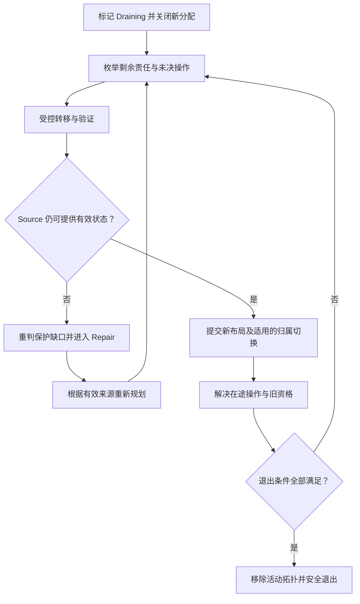

# Node Evacuation：计划退出前清空责任

计划更换或下线一个仍然健康的节点，为什么不能把盘上的文件搬完就关机？因为节点承担的责任不仅是字节，还可能包括有效布局引用、Metadata / Partition Ownership，以及尚未结束的修改或后台任务。

本文建立 **计划性 Node Evacuation 的通用模型**，复用 [Rebalance](04-rebalance.md) 的受控移动和 [Online Data Migration](05-data-migration.md) 的安全切换边界。不规定产品命令、固定组件或拓扑成员变更协议。

## 1. Node Failure、Drain 与 Evacuation

| 概念 | 当前状态与目的 | 能否说明节点已可退出？ |
| --- | --- | --- |
| Node Failure | 节点已经不可用，需要确认受影响保护状态，并从剩余有效来源恢复 | 不能；不可达不代表它原先承担的责任已安全转移 |
| Node Drain | 开始退出准备，收紧新工作准入并处理已有工作 | 不能；Draining 是政策或过渡状态，不是完成证明 |
| Node Evacuation | 节点通常仍健康，主动转移必须保留的数据与服务责任，直到满足退出条件 | 只有责任和保护等条件验证通过，才能宣布安全退出 |

Failure 属于被动恢复，Evacuation 属于 Planned Movement。一个健康节点可作为 Copy Source；一个失效节点通常只能依赖其他有效来源。两条路径可能共享任务能力，但最初的前提不同。

## 2. Stop New Work First：先关闭持续流入

如果一边 Evacuate，一边允许新的 Replica、Fragment、Ownership 或任务分配到该节点，剩余责任会持续增加，枚举可能永远追不上。Mark Node Draining 应让相关分配入口停止把它当作新的合格 Target / Owner。

这需要影响前台新 Placement、后台 Repair / Rebalance Target Selection，以及适用的 Ownership 和任务分配路径。早先创建的计划或缓存视图可能仍把它当作可用目标，因此执行和提交时也要确认当前准入资格；只改一个调度列表不足以限制迟到分配。

**停止新 Placement 不等于立即拒绝所有读取或现有任务。** 节点可以继续提供有效 Source 读取、完成被允许的在途操作，或在合法旧 Ownership 下服务切换前的修改。已有工作如何排空、接管或失效，需要明确边界，不能把“Draining”解释成瞬间撤销所有权限。

准入关闭后，已经发出的请求仍可能完成。停止流入应配合未决工作记录与结果判定；取消 RPC 或客户端 Timeout 不证明服务端没有执行，相关基础回看 [Failure / Timeout](../06-distributed-systems/01-failure-model-timeout.md)。

## 3. Enumerate Responsibilities：枚举责任，不只统计文件

| 必须考虑的范围 | 应查明什么 | 典型转移边界 |
| --- | --- | --- |
| Replica / EC Fragment | 哪些当前所需保护单元放在节点上，属于哪个有效 Generation / 编码组 | 转移有效副本或分片；必要时从兼容输入重建，保证新布局满足保护 |
| Metadata / Partition Ownership | 节点是否有权修改或服务某个状态范围 | 按适用的 Ownership、Epoch 和 Routing 边界切换 |
| Active Task / Migration State | 是否仍持有执行资格、计划、进度或待判定提交 | 可恢复接管，拒绝旧 Worker 后续不合法提交 |
| Currently Referenced Layout | 当前、保留历史状态或其他必需引用是否仍依赖节点 | 引用必须在有效状态中转移或合法结束，不能只查最新文件目录 |
| In-flight Operations | 尚未结束的读写或分配是否可能再产生必需引用 | 等待完成、确认接管，或在实际效果入口使旧资格失效 |

这些是逻辑责任，可以由同一组件承担，不能据此推断系统有五个独立服务。枚举可依赖 Index、反向位置映射、任务记录或等价事实；职责依据参见 [Metadata / Object Index](../08-consistency-metadata-partitioning/02-metadata-object-index.md)。

一次扫描得到零候选不是最终证明：扫描期间，先前已获准的操作可能提交新引用，任务也可能改变状态。需要可恢复的扫描进度、状态变化覆盖与最后核对，避免节点重启或扫描中断后遗漏责任。关闭新流入使范围能够收敛，但不能代替对已有未决工作及其提交结果的检查。

## 4. 转移流程：健康 Source 不必一律 Reconstruction

逻辑流程为 **Mark Draining → Stop New Assignment → Enumerate → Move / Replicate / Reconstruct → Verify Layout → Resolve In-flight Operations → Verify No Required References → Remove From Active Topology → Safe Shutdown / Replacement**。实现可以并行处理不同责任，不要求严格串行完成整个节点。

Replica 可从有效来源复制；健康的 EC Fragment 也可以直接转移其所需字节，不一定要先 Decode 再 Encode。若来源失效或分片无效，才根据剩余兼容输入决定 Reconstruction。新 Target 仍须满足 [Failure Domain / Placement Policy](../07-data-protection/03-failure-domain-placement.md)，不能为了清空 Source 把保护单元挤到同一故障域。

对不可变单元，固定 Generation 并确认新 Layout；对仍在更新的逻辑范围，复用 [Migration 的并发变化与 Cutover](05-data-migration.md)。每项任务传输成功，也要等合法发布和相应保护成立后，才能解除原节点的该项责任。

Drain 期间同时维持旧 Source 与新 Target，通常增加临时空间与 I/O 成本。退出期限不能绕过预算和保护条件；否则“尽快清空”可能使前台 Timeout 增多，或让目标资源耗尽后无法继续 Repair。

## 5. Safe Completion：文件数为零不等于可关机

**Node 上文件数为 0 ≠ Node 可以安全退出。** Metadata 仍可能指向它，Partition Ownership 仍可能属于它，迟到任务也可能继续发布引用。反过来，保留无必需引用的旧文件，也不自动意味着节点不能退出；物理文件计数不替代责任判断。

安全退出至少应核对：

| 完成条件 | 防止什么问题 |
| --- | --- |
| 当前有效 Layout 及其他必需引用不再依赖节点 | 关机后才发现还有合法读取、保留状态或保护输入需要它 |
| 移除该节点后 Protection Policy 仍满足 | 临时新增副本看似足够，但有效 Generation、数量或故障域不合格 |
| 当前 Metadata / Partition Ownership 已转移或合法终止 | 数据已搬走，服务资格仍留在即将退出的节点 |
| Routing / Topology 已完成相应更新 | 新请求和新任务仍把退出节点当作当前处理者或合格目标 |
| In-flight 操作已完成、接管或失效 | 最后扫描以后又出现未纳入的合法效果或未决提交 |
| Stale Worker / Old Owner 无法继续提交不合法结果 | 节点恢复、进程暂停结束或迟到请求重新写入旧布局 |

Routing Cache 可以仍残留旧地址，但不能继续使旧资格的修改成功；需要刷新、转发或拒绝等合法路径处理迟到请求，不要求所有缓存瞬间同步。Ownership 转移应复用 [Epoch / Fencing](../06-distributed-systems/02-quorum-leader-lease-fencing.md)，由实际提交入口检查；任务的去重与重试沿用 [Recovery Task Coordination](03-recovery-task-coordination.md)。

移除活动拓扑不能抹掉有效资格的安全边界。旧节点重新出现，或替换节点复用同一个地址时，也不能因为地址相同就恢复旧 Owner / Worker 的提交权限。本篇只强调身份与资格边界，不展开 Membership Change Protocol。

最终检查应围绕同一退出范围核对上述事实，确保关闭的新分配不会被未决效果重新打开。若无法证明还有哪些必需引用，或某项 Ownership 切换结果未知，应保持受阻状态，而不是按“任务完成率 100%”宣布 Safe Shutdown。

## 6. Evacuation 途中 Source 真正故障

Source 突然不可达时，首先重判已完成与未完成责任，区分短暂不可达和失去有效来源；检测基础沿用 [Failure Detection / State Transition](01-failure-detection-state-transition.md)，不重复写一套 alive / dead 理论。

若原 Source 永久不可用，部分 Planned Movement 会转为 Recovery / Repair：

1. 根据当前有效 Metadata / Layout，确认哪些保护目标已满足、哪些出现 Protection Gap。
2. 检查 Target 上已有结果是否属于所需 Generation、是否有效且持久、是否已合法发布；Checkpoint 百分比不足以确认这些条件。
3. 从剩余有效副本或兼容 EC 输入重新规划，必要时提升保护恢复优先级；不能继续依赖原 Source 的续传地址。
4. 来源不足时记录受阻或可能的数据损失范围，继续判定，而不是把“撤离 Source 不再存在”记为退出成功。

其余责任仍可继续计划性转移，不要求整项 Evacuation 只有一种任务类型。共享协调器需要更新计划和资格，旧迁移尝试不能在 Source 返回后自行提交已经过期的 Layout；未知提交按 [Retry / Deduplication](../06-distributed-systems/03-retry-idempotency-deduplication.md) 判定。

## 7. 完成目标比移动速度更重要

Evacuation 的进度应体现剩余责任及验证结果，而不只体现已复制字节。大量字节可能早已搬完，最后一个 Ownership 或未决提交仍阻止安全退出；也可能某个保护组没有合格 Target，继续加并发只会增加压力。

后台移动与前台 I/O、Repair 竞争相同的 Disk、Network、CPU 和控制面预算。退出时间紧迫可以改变排序，却不能跳过有效来源、Generation、Placement 或 Fencing；必要时延长退出窗口、暂停普通 Balance，或保留受阻节点，而不是用不合格布局换取更快关机。

本章第二阶段至此闭合：Rebalance 定义为何改善分布，Migration 定义如何在变化中安全切换，Evacuation 将多项转移汇总为节点责任的退出证明。主动移动复用第一阶段的执行能力，但以各自目标判定完成。

## 适用边界

本文的 Draining 流程、责任表与完成检查均为通用架构模型及工程推导；概念依据通过相对链接复用已有保护、元数据、协调与迁移正文，不映射为某个产品的固定组件或操作命令。

本篇不展开 Capacity Management、Tech Refresh、成员变更算法或物理回收机制；不因节点退出涉及后台复制就扩写 Cross-region Replication / DR。

[回看：Repair / Rebuild](02-repair-rebuild.md)
