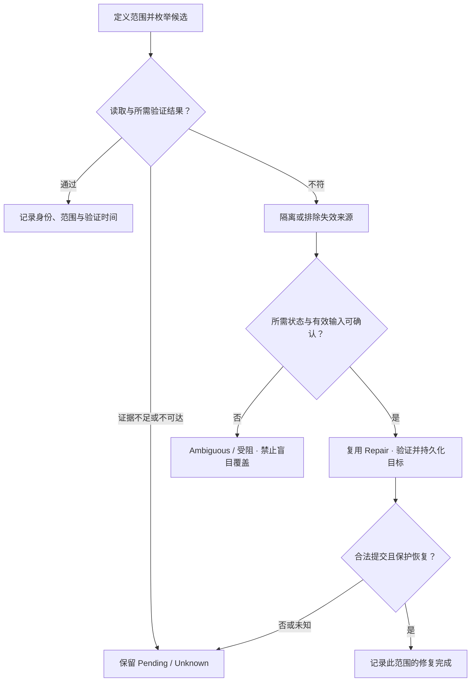

# Scrubbing / Integrity Repair：主动验证，不把扫描结束当作健康证明

故障 Recovery 能补回已识别的缺口，但 Cold Data 上的错误可能长期没有被读取。系统怎样主动发现它，又怎样避免把不确定内容“修成”另一份错误副本？

[Checksum / Data Integrity](../07-data-protection/04-checksum-data-integrity.md)与 [Silent Corruption Detection](../07-data-protection/05-silent-corruption-detection.md) 已说明验证基准、粒度与来源判定。本篇属于 Operations / Recovery，只讨论**主动验证 → 发现 → Integrity Repair**，复用现有 Repair 与任务协调，不重复校验机制，也不规定独立的 scrubber 服务。

## 1. Scrubbing 为什么是后台工作，而不是一次普通 GET

**Scrubbing** 是主动枚举、读取并验证存储状态的一类工作。它可以由既有 Worker、设备或多个层次协作，不要求每个系统都有相同组件。目的在于发现潜伏问题，不是为客户端访问一个 Key。

| 验证方式 | 收益 | 覆盖与成本边界 |
| --- | --- | --- |
| Foreground Read Verification | 在实际访问时验证需要的范围，及时阻止错误继续交付 | 未被读取的 Cold Data 可能长期不检查；Range Read 也未必覆盖整份对象 |
| Background Scrubbing | 主动覆盖长期未访问的数据，有机会在恢复余量耗尽前发现错误 | 额外读取、校验与记录占用 Device、Network、CPU、Metadata / Control Path 和 Cache |

“读的时候检查”与“主动让所有所需范围获得检查机会”是不同覆盖策略。两者可以共用验证代码，但不能把近期很多 GET 成功当作全集验证证据。

验证还应声明到达了哪层。只读到缓存中的正确副本，不证明对应设备上的当前持久副本无损；反过来，底层块校验通过，也不证明对象引用和 Generation 正确。若目标是验证某份 At-rest 来源，需要按实现确保实际触及该来源；本篇不规定绕缓存 API 或 Direct I/O 路径。

## 2. 先定义 Scope，再枚举 Coverage

通用流程为 **Enumerate → Read / Verify → Detect Invalid Source → Determine Required State → Select Valid Recovery Source → Repair → Verify → Update Protection State**。枚举的是所需保护状态及其来源，不是只数设备文件，也不是执行完读取就直接覆盖不符内容。

| 扫描事实 | 为什么必须说明 |
| --- | --- |
| Scan Scope | 哪些逻辑引用、Unit / Generation、编码组和来源在本轮范围内；是正文、Metadata 还是编码关系检查 |
| Verification Scope | 全范围还是抽样，验证到哪层，用哪种可信依据；下层扫描不自动覆盖上层身份关联 |
| Coverage | 按单元数、字节或范围统计哪些已经实际验证，不能混用分母 |
| Last Verified Time / State | 结果适用于哪份状态与何时读取的内容，不是永久 Healthy 标志 |
| Skipped / Unavailable Range | 没有执行、缺依据、不可达或因预算暂停的区域，都不能算作通过 |
| Verification Result | 分开通过、失败、未知及后续修复结果；不得由任务退出码替代 |

**工程示例：**本轮固定范围有 1,000 个待验证单元，其中 950 个验证通过，50 个因来源不可达尚未验证。按单元数 Coverage 为 95%；不能报告 “All data verified healthy”，也不能未经大小核对把它当作 95% 的字节覆盖。

范围还会变化。扫描 U / g1 期间，当前引用可能变为 g2，Layout 可能换到新来源；旧结果仍可描述 g1 的相应范围，却不能自动为 g2 或新位置盖章。枚举应具有可恢复的范围与进度，状态变化后按规则补查或重新规划，避免“游标已走过”造成永久遗漏。

一次全集扫描通常也不是全局原子快照：不同单元在不同时刻验证，通过后仍可能发生新损坏。Coverage 完整只说明声明范围完成了所需检查，不证明全部数据在此后同一时刻都健康。

## 3. 有三条结果路径，不应全部汇入自动 Repair

Quarantine / Exclude 在此指限制已发现不合格来源参与相应读取或恢复，并保留诊断事实，不意味着立即删除正文、整台节点下线或永久排除所有范围。隔离粒度应对应失败证据，并在状态修改入口保持合法资格。

多个来源相互不符，而系统缺少足够可信的基准、身份或提交依据，应保留 **Unknown / Ambiguous**。不能猜一个、按字节多数无条件覆盖，也不能修改预期摘要来让任务结束为健康。必要时上升为不能自动修复的故障，等待进一步证据或处理；这不等同于已经证明全部数据永久丢失。

## 4. Integrity Repair：多的是输入可信性，不是另一套复制教程

[Repair / Rebuild](02-repair-rebuild.md) 已定义从状态确认到持久 Layout 的九阶段。本篇只补完整性失败带来的检查差异：

| 检查点 | Integrity-specific 要求 |
| --- | --- |
| 确定要保护什么 | 从有效引用确认所需 Unit / Generation、范围或 Stripe / Fragment，不用失败副本自带标签独自决定 |
| 确认来源 | 排除已失效来源；对候选的身份、范围和校验依据进行验证，不复制任意“还能读”的 Replica |
| 选择 Replica / EC 输入 | 完整副本需符合可信基准；EC 输入还需足够、相容且属于正确编码状态，不能把未知坏片当有效片 |
| 选择 Target | 按当前 [Placement Policy](../07-data-protection/03-failure-domain-placement.md) 判断容量与 Failure Domain，不能覆盖一份错误就算隔离恢复 |
| 验证新来源 | 对修复结果重新检查所需身份与 Checksum；仅现算一个新摘要并保存它，不足以证明复原了预期内容 |
| 提交与保护判定 | 所需持久化、合法 Layout 更新及 Protection Policy 满足后，才计入保护；失败或未知结果仍需判定 |

**Detect corrupt source → Quarantine / Exclude → Select verified source → Repair → Verify repaired copy** 是本篇增量。Checksum Mismatch 不等于必须立刻原地改写失败来源；目标与发布方式由合格布局和故障处理规则决定。

修复期间 Current State 或 Ownership 可以改变。结果仍须检查 Generation、Layout 前提与 [Epoch / Fencing](../06-distributed-systems/02-quorum-leader-lease-fencing.md)，不能因为任务来自 Scrub 就绕过资格。并发更新或重复 Repair 已解决缺口时，要判定旧工作是否仍必要，不允许旧计划覆盖新状态。

Candidate Source 再次失败、EC 输入出现新增 Mismatch，或可信 Metadata 不可用时，应重新评估或暂停。没有可靠输入，不得为维持吞吐而使用可疑内容；有合法历史来源，也不能无条件把当前状态回退到它。

## 5. Scan Progress 与 Repair Progress 分开恢复

Scrub 可以记录已枚举范围、已验证身份与时间、未验证原因以及发现的缺口。扫描 Checkpoint 与 Repair Task Identity 服务不同目的：前者防止遗漏覆盖，后者标识待恢复状态并去重，不能只有一个“整体 90%”数字。

若扫描 Worker 验证失败后崩溃，Resume 需要能重新发现或接续对应缺口；不能先把游标越过，尚未保存结果和恢复意图就永久忘记失败。实现可用可靠记录、可重扫流程或等价机制，本篇不指定跨系统事务格式。

重复检测同一 Unit / Generation 不应创建无限 Repair；任务接管也不能每次分配新 Target。稳定身份、Retry、Lease、Fencing 与提交结果判定直接复用 [Recovery Task Coordination](03-recovery-task-coordination.md)。Checkpoint 证明执行进度，不证明所扫描内容此后没有变化，也不代替 Target 校验。

## 6. Scrub Scheduling：发现得早，也要付出资源

可按 Data Age、Last Verification Time、Media / Node Risk、Protection Level、Hot / Cold、资源压力和 Repair Backlog 选择顺序与预算。这些依据回答不同问题：很旧的数据可能从未验证；很热的数据已有频繁检查，却可能与前台重叠最重；接近恢复下限的组值得更紧急地判断来源，但不允许省略验证。

提高扫描频率或速度，可能缩短 Detection Latency，却增加读取、校验和控制工作；过于保守则延长 Latent Corruption Window，让再次故障更可能发生在错误尚未发现时。效果取决于实际覆盖和资源预算，没有通用的“每 N 天 Scrub”配置。

已识别缺口的紧急 Repair 与尚未发现问题的例行扫描可以有不同优先级，但不能绝对规定所有 Scrub 永远最低优先级；来源资格不清的关键组，验证本身可能是恢复的必要前提。长期暂停扫描也必须保留未覆盖范围，不能继续报告周期验证达标。

## 7. Background I/O 会影响 Foreground P99

Scrub 未必在 GET 的直接调用链里，却会竞争相同资源，连接 [Foreground / Background Interference](../09-data-path-performance/06-foreground-background-interference.md)：

| 资源 | 扫描与修复可能产生什么 | 控制方向 |
| --- | --- | --- |
| Device / Network | 大范围读取、跨节点验证与修复流量 | Rate Limit、IOPS / 字节预算；分别确认 Source 与 Target 压力 |
| CPU / Memory | 校验、EC 检查、Buffer 与在途工作 | Concurrency Limit、内存预算，不只限制 MB/s |
| Metadata / Control Path | 枚举、读取状态、记录结果与提交修复 | 准入、并发及 Priority，避免小单元高 RPC 压力 |
| Cache Capacity | 扫描填充可能挤走前台热点 | 按验证目标管理缓存影响，不能把扫描读取全当有价值的热点 |

过于激进会形成 **Scrub → Device / Network Pressure → Foreground P99 Increase**，并可能进一步造成 Timeout / Retry 压力；过于保守会留下更长的潜伏窗口。可根据前台表现、队列、覆盖落后和保护风险调整预算，配合 Priority、Pause / Resume。暂停需要安全保留在途结果与进度，不是丢掉失败证据。

这里只给通用控制依据，不设计 Scheduler、完整指标平台或固定阈值。验证不能为了前台平稳永久停滞，也不能为提高后台吞吐牺牲来源正确性。

## 8. Scrub Completed ≠ All Data Is Healthy

| 完成声明 | 合法范围 |
| --- | --- |
| 一项扫描执行结束 | 可以是通过、失败、暂停或受阻，必须保留结果 |
| 声明范围的验证完成 | 所需 Coverage 与验证类型满足；Skipped / Unknown 不能算通过 |
| 某项 Integrity Repair 完成 | 新来源正确、持久、合法发布且相应保护恢复，不只是复制结束 |
| 当前范围 Protection Restored | 用当前有效布局重新核对策略，不靠历史扫描通过数推导 |

扫描发现问题但尚未修复，不等于健康；修复成功但其他范围未覆盖，也不等于全集验证完成。即使全部范围都曾通过，结果仍带状态与时间，后续故障会改变结论。

至此形成 **Integrity Model → Silent Corruption Detection → Scrubbing / Integrity Repair**：07 定义可信判断与恢复材料的边界，10 让这些检查持续覆盖数据，并将有证据的缺口送入既有 Repair 闭环。本篇止于完整性运维，不展开 Capacity、Observability、DR 或 AI Storage。

## 来源与适用边界

核对日期：**2026-10-02**。1,000 单元、Coverage 示例、分支图和调度取舍是通用工程模型，不是产品服务、固定扫描周期或健康 SLA。

[FAST 2008 原论文 §2.2.2](https://www.usenix.org/legacy/events/fast08/tech/full_papers/bairavasundaram/bairavasundaram.pdf)提供主动读取校验及验证重构输入的公开历史案例，也说明底层 Scrub 有其不能覆盖的身份信息。这里只核对“主动验证需要覆盖范围和有效来源”这一边界，不照搬其 RAID 流程、扫描频率或实现组件。

[机制前置：Silent Corruption Detection](../07-data-protection/05-silent-corruption-detection.md) · [复用：Repair / Rebuild](02-repair-rebuild.md)
