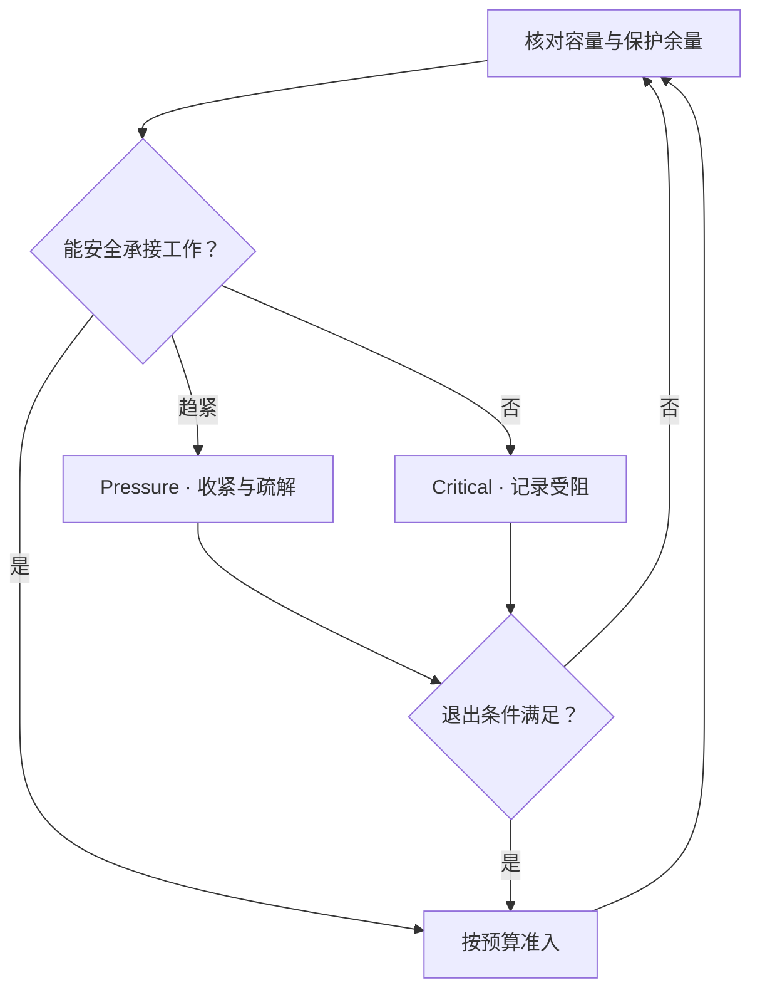

# Capacity Management：空闲字节不等于安全写入余量

集群还有空闲空间，为什么 PUT 已经无法分配目标？数据仍能读，为什么一个节点故障以后 Repair 却无法推进？这两个问题都不能只用磁盘 free bytes 回答。

本文讨论 **Distributed Cluster Operational Capacity**：在当前保护策略、拓扑与运行状态下，还能安全接收多少工作，并为故障和主动移动留下什么余量。以下术语和状态是通用工程模型，不规定产品计费口径、统一容量公式或固定水位，也不重复单机介质与文件系统基础。

## 1. 先问容量在哪一层、包含哪些状态

同一个集群可以同时报告 Raw、Logical 和 Physical 数值。它们不是三个可互换的“已用 / 可用空间”，相减前必须对齐范围、单位与记账规则。

| 口径 | 本文中的含义 | 使用时要保留的边界 |
| --- | --- | --- |
| Raw Capacity | 纳入统计的设备或资源的原始容量 | 标称容量不代表资源在线、合格或可分配；排除故障资源后分母会改变 |
| Usable Capacity | 在声明的保护与内部开销假设下，可承载的有效数据容量估计 | 不是 Raw 的固定折扣；对象大小、编码布局、压缩与拓扑会改变估计 |
| Logical Data Size | 某个逻辑范围的数据大小 | 需说明只计 Current State，还是包含保留版本；不重复计 Replica，但不等于物理占用 |
| Physical Used Capacity | 实际已占用或已分配的物理空间 | 可能包含冗余、Metadata、分配粒度损耗、临时副本和仍未回收的旧状态 |
| Free Capacity | 对应层尚未使用的空间 | 设备可用块、系统可分配池和逻辑剩余额度可以不同，不能混算 |
| Reserved Capacity | 按政策或计划保留、不供普通新工作使用的容量 | 可能是逻辑预算而非已经分配的字节；需说明谁能消费、是否已从 Free 中扣除 |
| Operational Headroom | 为故障、临时并存、突发和执行不确定性留下的运行余量 | 可以含 Reserve，但还受位置和可用性约束；不能再无条件重复扣一遍 |

**Raw Free Space ≠ Safe Writable Capacity。** 还需要考虑 Replication / EC overhead、Placement、局部占用、Repair 余量、迁移并存、Metadata / 内部开销、后台工作与安全预留。不能把所有因素各写一个常数，再宣称得到所有系统通用的可用容量公式。

对大块理想数据，三副本或 k+m 可以提供冗余字节的基准估计；但小单元、分配粒度、未满 Stripe、历史状态和实际提交布局都会改变物理账。保护机制回看 [Replication](../07-data-protection/01-replication.md)与 [EC](../07-data-protection/02-erasure-coding.md)，本篇不把理论倍率写成实际容量保证。

Logical Delete 也不等于空间马上释放；逻辑计数下降，Physical Used 可能暂时不变。需要分开观察已释放的物理空间与预期回收量，不能用“刚删除了一批对象”承诺新目标一定可分配；这里仅回链 [Object Layout](../03-object-storage/06-object-layout.md)，不展开 Lifecycle / GC。

## 2. 总体空闲，为什么没有合格 Target？

**工程示例：**三个等容量 Rack 的占用为 A 100%、B 70%、C 70%，集群总体还有 20% 空闲。当前策略要求某单元的三份 Replica 分别位于三个 Rack。创建新的完整保护布局仍然需要 A 中的合格位置，不能把第三份挤到 B 来“利用空闲”。

这只说明该请求在该拓扑和策略下受阻，不表示全系统所有工作都不能做。另一种布局、已有合格位置或允许的运行契约可能有不同结果；不得偷偷降低保护条件来把指标显示为正常。

**Global Free Capacity 不能替代 Placement-aware Capacity。** 要判断目标域内有没有足够且可分配的资源，设备是否在线、节点是否 Draining、候选是否已经被并发计划预占。Fault Domain 约束沿用 [Failure Domain & Placement](../07-data-protection/03-failure-domain-placement.md)，不是本篇重新定义的放置算法。

容量检查还要对应故障场景：某域失效后，它里面的 Free 不再是当前 Repair 能消费的余量。若剩余资源无法形成策略允许的布局，即使有字节空间，也不能按原目标宣告保护恢复。保护数量、故障域与容量必须一起判定。

## 3. Average Utilization 会掩盖局部风险

示意：等容量 Node A 使用 95%，B 55%，C 50%，平均约 66.7%。A 仍可能先撞到准入边界，且其剩余空间不足以接收某个大单元或同时完成在途工作。数字只用于解释平均值，不是建议阈值。节点容量不同时，还要明确是按容量加权的集群占用，还是节点比例的算术平均。

| 观察范围 | 要问的问题 |
| --- | --- |
| Cluster | 总体物理占用、有效容量估计和增长如何变化？统计是否包含离线资源？ |
| Node / Resource Pool | 哪些资源先耗尽？可分配粒度、Metadata 或其他局部限制是否先达到边界？ |
| Failure Domain | 当前及目标故障场景下，还能形成哪些合格布局？ |
| Partition / Tenant / Workload | 哪类状态增长、配额或访问分布制造局部压力？归属范围与物理位置是否一致？ |

Capacity Skew 不只来自“Rebalance 没开”：异构容量、历史写入、对象大小、租户增长、策略约束和 Draining 都可能影响分布。Hot Partition 还可能只造成 CPU / IOPS 压力，不一定占用很多字节。逻辑划分、物理放置与路由的区别复用 [Partition / Ownership / Routing](../08-consistency-metadata-partitioning/03-partition-ownership-routing.md)。

发现失衡后可以评估 [Rebalance](04-rebalance.md)，但先确认目标真的合格、有余量，移动收益足以覆盖成本。没有合格 Target 时，继续创建移动任务不会凭空解决容量问题。

## 4. Headroom 保留的是恢复与变化的能力

**100% Used 不是 Capacity Incident 的起点。** 系统可能仍可读取全部当前数据，却已经没有空间补齐一份失效 Replica；此时 Available，但恢复能力受限，是需要处理的 Operational Risk。

| 需要余量的工作 | 为什么不能只预算最终净占用？ |
| --- | --- |
| Repair / EC Reconstruction | 新保护来源需先写入、验证并合法发布；丢失资源上的空间不可当成可用目标 |
| Rebalance / Migration | 新旧位置可能并存，切换和必要引用未确认前不能提前删除 Source |
| Node Evacuation | 退出节点中的 Free 不能继续充当新 Placement；剩余拓扑必须接住它的责任 |
| Burst Writes / Internal Work | 在途分配、Buffer 后续落盘、Metadata 与临时状态会继续消费空间 |

同一份 Reserve 若同时被三个计划当作“我的应急容量”，就不是可靠余量。计划准入应协调已有占用、已承诺分配与潜在新增消费，重试还需复用稳定分配身份；边界沿用 [Recovery Task Coordination](03-recovery-task-coordination.md)。

Headroom 不是只要留出一个总 TB 数就完成设计。需要声明希望覆盖哪种故障或运行窗口、资源在哪些域、同时允许哪些工作，以及资源不足时优先保证什么。容量够也不表示 Recovery 足够快：Source / Target I/O、网络和 CPU 仍需预算，参见 [前后台干扰](../09-data-path-performance/06-foreground-background-interference.md)。

## 5. Watermark 是状态与行动边界，不是最佳百分比

Low / Normal 可以表示压力低或处于正常范围；High 表示应收紧新增工作并疏解，Critical / Emergency 表示安全进展即将或已经受阻。这些是示意名称，各系统可以采用其他状态与条件，也可以结合局部容量、预测时间及保护缺口，而非只用一个占用比例。

**Hysteresis** 是进入和退出压力状态使用不同边界。若都使用同一条示意 80% 线，占用在 80.0% → 79.9% → 80.0% 波动就会反复启停。退出条件可以要求更充足余量和稳定观察期；这里不规定数值、周期或自动控制算法。已有 Rebalance 的 High / Low 思想，在本篇用于集群运行状态而非候选选择。

图是带反馈的通用决策示意，不代表所有系统固定状态机。新容量加入或旧文件减少，也要重新核对当前布局和预算，不是只看到平均值下降就立即解除全部限制。

## 6. Admission Control 要分清被限制的工作

容量压力下可以限制新写入、新 Placement、普通 Rebalance Target、后台复制和低优先级操作。但 **拒绝业务写入与阻止 Repair 的风险不同**：前者影响当前服务，后者可能使已存数据长时间失去保护。不能用 “Disk Full → Reject Everything” 代替分类准入。

普通新写入可能不能消费应急 Reserve，合格 Repair 却可以；这并非允许 Repair 超过物理边界或绕过 Placement。Migration 有时可以释放局部空间，有时需要先增加临时占用，应确认哪种计划真正能改善当前风险。撤离一个满节点之前也要检查剩余资源，复用 [Migration](05-data-migration.md)和 [Evacuation](06-node-evacuation.md)。

准入决定是否接收新工作，不撤销已有合法提交，也不会使在途写入瞬间消失。执行与提交需重查资源条件，显式记录 Capacity / Placement Blocked；反复快速 Retry 无合格目标的任务，只会增加控制面压力。

## 7. Forecasting：预测先撞到哪个运行边界

可以用 **当前 Used Capacity + 观察到的净增长速率 → 到声明容量边界的估计时间** 建立基础预测。边界应是运行所需 Headroom 或局部准入限制，而不是必然用物理 100%；速率为零或负数时，简单线性外推也不能证明未来不会耗尽。

线性模型只适用于当前范围、口径和趋势：业务增长会变化，删除与实际回收有时差，Migration 产生临时峰值，Expansion 改变容量分母，局部 Skew 又可能早于全局边界爆发。占用比例下降可能只是扩容，不是已用字节减少；后台临时副本增长也不等于业务长期净增长。

因此 Planning 应同时看**消耗速度、Headroom、Failure Domain 与 Recovery Requirement**，并给预测保留条件与不确定性。没有固定“还剩 N 天就扩容”的通用结论。下一篇把这些状态转成可以持续观察、追溯和关联的 [Operational Evidence](09-observability-signals.md)。

## 适用边界

容量口径、Rack / Node 数值、水位分支与预测讨论均为通用模型及工程推导；示意百分比不代表最佳实践。保护倍率、提交、Placement 与移动条件通过上述链接复用已有正文，不映射为某个产品的容量算法或命令。

本篇止于运行余量与准入基础，不展开设备内部、回收机制、完整容量调度器或 Cross-region / DR。

[前置：Scrubbing / Integrity Repair](07-scrubbing-integrity-repair.md)
