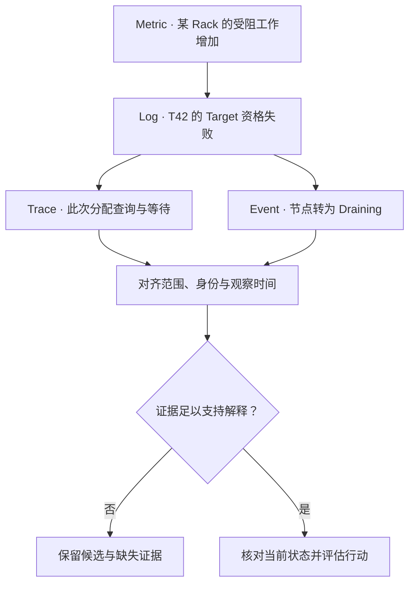

# Operational Observability：用互补信号建立运行证据

GET 变慢、Repair 不再推进、某个 Rack 空间越来越紧：系统发生了什么，哪些证据支持这个判断？一个利用率数字或一次成功请求，都不能回答整个系统为什么处于当前状态。

本文承接 [Capacity State](08-capacity-management.md)，建立长期运行中的 **Metrics / Logs / Traces / Events** 证据模型。它们是观察职责，不要求部署四套独立平台；尤其 Events / State Transitions 可以记录在日志、任务记录或其他可靠历史中，不规定独立 Event Store，也不提供监控工具配置教程。

## 1. 四类信号回答不同尺度的问题

| 信号 | 更适合回答什么 | 独自不能证明什么 |
| --- | --- | --- |
| Metrics | 某范围的 Rate、Count、Distribution、Capacity、Queue / Backlog 与健康汇总如何变化？ | 单个 Task 的失败原因、一次请求的完整路径 |
| Logs | 某次离散事件、错误、状态变化在什么上下文发生，原因是什么？ | 未经稳定统计就得出全集错误率或覆盖率 |
| Traces | 一次 Request / Operation 跨职责的执行、等待与依赖路径是什么？ | 全集保护状态、全部后台积压或未采到的请求表现 |
| Events / State Transitions | 哪个实体从什么状态到什么状态，为何转变？ | 所有连续资源压力；历史事件也不自动等于当前权威状态 |

**Metric ≠ Log ≠ Trace ≠ Event** 是职责边界，不是说它们绝不重叠。State Transition 可以形成结构化 Log，并增加一个 Metric Counter；Trace 的 Span 也可带事件。重要的是保留每类证据的范围、时间和含义，而不是给四个名字分别找一个工具。

## 2. Metrics：持续观察聚合状态

Rate 和 Count 回答变化或发生次数，Gauge 表达某时点的状态，Latency Distribution 表达体验差异。后台吞吐很高而保护缺口不减少，也可能是重复尝试或等待 Layout Commit；仅统计发送字节无法代表实际完成。

| 存储观察维度 | 可以保留的聚合证据 | 需要明确的口径 |
| --- | --- | --- |
| Frontend / API | Request Rate、Success / Error、Latency Percentile、Timeout / Retry | GET / PUT / LIST 分开；Attempt 与业务 Operation、首字节与完整响应分开 |
| Control / Metadata | Lookup Latency、Ownership / Routing Failure、Queue、State Transition Count | 哪个服务或 Partition 范围，失败是明确拒绝、过期资格还是未知结果 |
| Data Path | Network、Device I/O、CPU、Memory、Queue Depth | 采集在哪层、哪节点或共享资源；内部流量不等于有效应用吞吐 |
| Protection / Recovery | Degraded Units、Repair Backlog、Oldest Task Age、Rebuild Throughput、Failed / Blocked Work | 当前保护缺口、排队与执行受阻分开；任务完成不替代保护恢复 |
| Capacity | Used / Free / Headroom、Node / Failure-domain Skew | 是否包含离线资源、Reserve 和临时占用；聚合不能隐藏局部 Full |
| Integrity | Scrub Coverage、Mismatch Count、Unknown / Skipped Verification、Integrity Repair Backlog | 单元还是字节分母、验证时间及范围；Unknown 不能算 Healthy |

这是观察维度，不要求系统提供同名指标。Backlog 数量、大小、最老未解决工作年龄和风险等级应互补：17 个小任务与一个长期受阻的关键保护组，不具有同等含义。Oldest Age 应保留稳定工作起点，不能每次 Retry 重置成零，否则最难恢复的状态会看起来一直很新。

指标语义还要区分“目前受阻数量”和“累计出现过几次受阻”。累计 Counter 可以用于事件 Rate，不能直接代表当前存量；进程重启或计数重置也不能被误读为故障消失。采样周期内没有数据，不等于值为零。

P99 必须带时间窗口、样本范围和数量；不能平均各节点 P99 得到集群 P99。聚合要基于可合并的分布或相应原始样本，并保留低流量和 Timeout 的统计边界。Queue、Saturation 与 Tail 的基础回链 [Latency / Throughput / Queueing](../09-data-path-performance/02-latency-throughput-queueing.md)，这里不重复排队模型。

## 3. Logs：从“多少个受阻”找到“为何受阻”

示意 Metric `blocked_tasks = 17` 说明有一批工作受阻，却无法说明 T42 为什么不能继续。对应离散记录可以表达：

| 示例字段 | 示例内容与用途 |
| --- | --- |
| Operation / Task / Attempt | T42，第三次尝试；关联同一意图及不同执行 |
| State Transition | RUNNING → BLOCKED |
| Affected State | U / g1，当前 Layout 前提；定位所需保护状态 |
| Reason / Evidence | 没有满足 Rack 隔离和空间预算的 Target；不是 Source Checksum 失败 |
| Execution Context | Worker、Node、适用 Epoch、事件时间与记录时间 |

字段是工程示意，不规定日志格式。离散错误应保留原因与实际提交边界，不能只记录 “repair failed”。Layout Commit Timeout 与明确拒绝需要不同后续判定；基础复用 [Recovery Task Coordination](03-recovery-task-coordination.md)。

日志记录的“准备提交”不等于已经提交，“Worker 退出”也不等于任务完成。缺失日志可能来自进程崩溃、采样或采集故障；日志通常是运行证据，不应在没有相应可靠性设计时被当作唯一的可恢复 Commit Record。

## 4. Traces：看一次路径的执行与等待

通用请求职责可以是 **Client → Gateway → Metadata → Data Node → Storage**，实际组件可合并，GET / PUT 也可能并行访问多个来源。Trace 用相关 Span 表达这些工作与依赖；路径模型回链 [Object Read / Write Path](../03-object-storage/03-read-write-path.md)，不重复其提交语义。

一次 GET 在 Gateway 花了很多时间，可能是入口队列、下游等待或本地处理。需要把 Queue Waiting 和执行区间适当纳入测量，而不是只对真正开始执行的 RPC 计时。并行 Span 的 Duration 不能简单相加为端到端延迟；父子区间会重叠，未埋点阶段又会留下空白。

**Trace 不是整个系统状态数据库。** 一次请求正常不排除大量 Repair Backlog；采样只留下成功请求，也可能看不到真实尾部。后台 Operation 可以有自己的 Trace，并通过 Operation / Task ID 关联发起背景，不要求把几天的恢复强行塞进一次前台请求的 Span。

Context Propagation 用于跨组件关联，不自动证明全局时钟严格一致。跨节点时间戳比较需考虑时钟误差、观察延迟及因果身份；不能按几毫秒的墙钟先后推断 Ownership 提交顺序。必要的权威状态仍以相应系统事实判定。

## 5. Events：解释“现在为什么是这个状态”

长期存储中的重要变化包括 Healthy → Degraded、Owner e7 → e8、Node Active → Draining、Repair → Blocked、Scrub → Corrupt Detected。除了当前 Gauge，还需要能追溯哪些变化把系统带到了现在。

状态记录应关联实体、前后状态、原因、适用 Generation / Epoch 以及观察时间。任务因 Capacity Blocked 暂停，随后 Rack 扩容并恢复，与“Worker 一直 Crash”会产生相似的低吞吐，却需要完全不同的解释。

事件可以重复送达、延迟或缺失；按稳定身份和状态范围解释，不能把重复通知算成多个新的 Protection Gap，也不能让迟到的 e7 事件覆盖当前 e8。**事件历史帮助解释状态，但在可靠性与完整性未得到保证时，不能仅靠重放观测事件重建权威 Layout。**

## 6. Correlation：稳定身份，不是把所有字段塞进 Metric Label

关联可以使用 Request ID、Operation ID、Task ID、Partition ID、Unit / Generation、Node 与 Failure Domain，但它们粒度不同。Request / Trace ID 可以对应一次 Attempt；稳定 Operation / Task ID 可以横跨 Retry。Generation 识别数据状态，Epoch 识别资格；都不能用一个“请求编号”替代。

图表示证据关联，不是每个诊断都要依次查询四个后端，也不是以相关性证明因果。Draining 可能是候选原因，还要核对是否确实使该任务没有合格 Target。

**High Cardinality** 关注大量不同属性组合。Object Key、Request ID、每次 Generation 都作为全部 Metrics 的 Label，可能让时序与聚合状态随对象和请求数膨胀；只限制单个字段的值数，也未必控制多个维度的组合数量。

聚合指标可优先使用有解释价值且有界的操作类别、结果类别、资源范围；具体身份放在 Logs / Trace 或按需详细证据中。Node、Partition、Tenant 也不天然低基数，规模增长后仍需要预算。对 Object Key 做 Hash 不会降低不同值的数量，还可能失去可读性。也应避免无必要采集完整正文、敏感 Key 或凭据。

## 7. Observability 本身也消耗运行预算

采集、序列化与聚合消耗 CPU / Memory，输出占 Network，存储与索引占容量，Retention 增加长期成本。故障时每次 Retry 都输出大量详细记录，可能让观测流量也加入过载循环。

可以组合 Aggregation、Sampling、Retention Policy、Cardinality Control 和详细级别限制，但需保留方法与损失边界：聚合可能隐藏局部问题；Trace Sampling 影响覆盖；日志采样不能无条件用于精确错误分母；缩短 Retention 可能丢掉长期受阻任务的起因。关键完整性失败、资格变化等证据可按风险采用不同保留策略，而不是全量或全丢二选一。

采集路径自身的延迟、丢弃和停更也需要可观察。没有收到 Checksum Mismatch，不证明没有损坏；可能尚未扫描，也可能信号没送达。Health 显示应区分已确认正常与证据缺失，不能因监控静默自动涂绿。

[Benchmark](../09-data-path-performance/03-benchmark-bottleneck-analysis.md) 用 Controlled Experiment 检验限制；本篇用 Continuous Production Evidence 发现变化、保留上下文并形成候选解释。完整 Troubleshooting 留待后续。下一篇讨论如何把证据转成 [Health Objective / Alerting](10-sli-slo-alerting.md)。

## 来源与适用边界

核对日期：**2026-10-02**。

- [OpenTelemetry：Metrics](https://opentelemetry.io/docs/concepts/signals/metrics/)：核对聚合指标、属性组合基数及内存成本；不采用 SDK 默认上限作为通用配置。
- [OpenTelemetry：Traces](https://opentelemetry.io/docs/concepts/signals/traces/)与 [Logs](https://opentelemetry.io/docs/concepts/signals/logs/)：核对 Span / Context 关联与日志上下文；这里只使用概念边界，不提供 SDK 教程。
- [Google SRE：Monitoring Distributed Systems](https://sre.google/sre-book/monitoring-distributed-systems/)：核对观测服务症状与内部原因的区别。

存储观察表、T42、关联图与状态资格讨论为通用工程推导，复用仓库已有提交和恢复模型，不是特定监控平台的保证。Events 是本文采用的状态历史职责分类，不声称它必须是独立于 Logs / Traces 的标准信号协议
