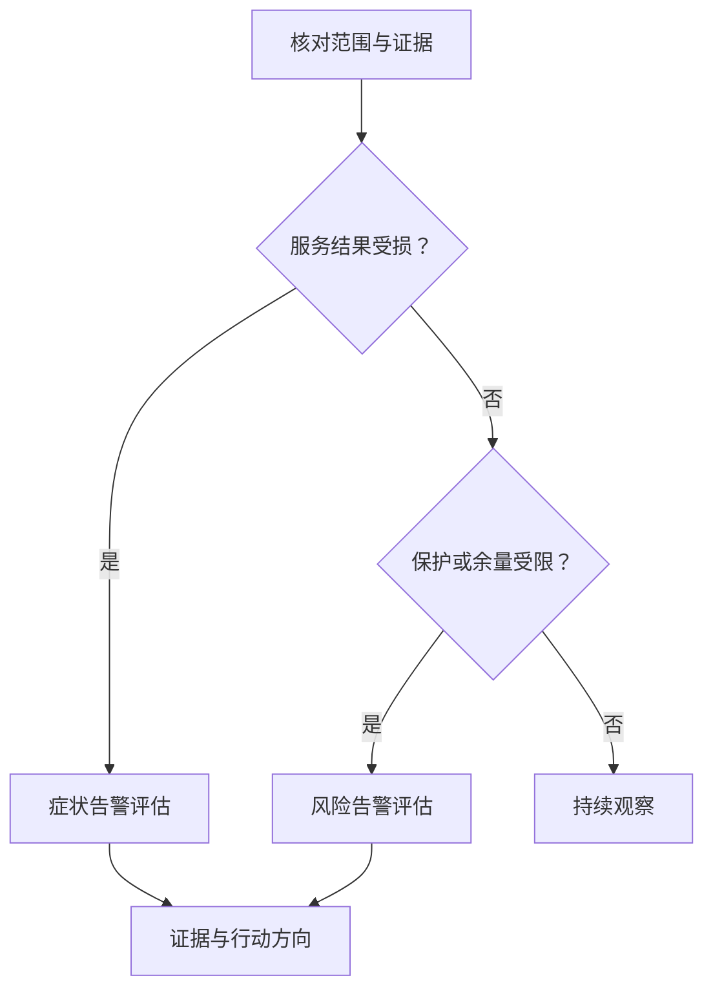

# SLI / SLO / Alerting：可用、达标与低风险不是同一件事

有了 P99、Free Capacity、Repair Backlog 和 Checksum Mismatch，怎样判断系统健康？GET 全部成功，却有一批数据长期缺少保护；CPU 很忙，用户体验却没有变化。前者需要关注风险，后者不能只凭数字认定已经 Outage。

本文承接 [Observability Signals](09-observability-signals.md)，建立 **Health Objective 与可行动 Alerting** 的最小模型。不规定行业统一百分比、Pager 配置或完整 SRE 流程；用户服务结果与内部风险分别评估，不能让一个仪表覆盖全部健康含义。

## 1. Metric、SLI、SLO 与 Alert Threshold 各做什么

| 层次 | 作用 | 存储示意 |
| --- | --- | --- |
| Metric | 一项观测量，提供运行证据 | 某范围 GET 时长分布、错误计数、Device Queue |
| SLI | 对某个服务结果、在明确边界内的可测量表示 | 合格 GET 中，正确完成且完整响应不超过 T 的比例 |
| SLO | 在指定范围与窗口内，对 SLI 的目标 | 在窗口 W 内，上述比例达到 X% |
| Alert Condition / Threshold | 根据服务影响或风险决定何时通知、如何分级 | 超标事件持续消耗预算，或保护缺口已无法按预期推进 |

**Metric ≠ SLI ≠ SLO ≠ Alert Threshold。** Metric 可以成为 SLI 的输入，但 CPU 利用率不是自动定义好的用户服务结果。SLO 的目标也不应该原样复制为单点告警线：窗口长度、样本数、持续性和处理时效都会改变告警意义。

T、W、X 在本文都是待服务定义的示意参数，不是推荐值。同一个 P99 名称，若只统计成功请求或只统计 Server 处理时间，不能直接代表包含 Timeout / Retry 的客户端体验。

## 2. SLI 要先定义“什么结果算好”

| 可讨论的维度 | 测量思路 | 不能省略的边界 |
| --- | --- | --- |
| Availability / Request Success | 合格操作中，服务可用或成功完成的比例 | 合格请求与成功语义；快返错误不算服务变快 |
| Latency | 指定请求满足时长条件的比例，或声明范围的分布 | Client / Server、首字节 / 完整响应、Retry、Timeout 与未完成工作 |
| Correctness / Integrity | 在有可信依据且实际验证的交付范围中，满足预期状态的结果 | 检测覆盖与 Unknown；Checksum 正确不替代所需 Generation / 一致性 |
| Recovery Service Outcome | 所需保护组在声明时间边界内恢复的比例，或风险状态持续时间 | 当前布局满足策略，不仅是 Worker 执行结束；受阻与未解决范围不能丢弃 |

Recovery 可以有内部服务目标，但不能把后台 Task 成功率与前台 GET 成功率混成一个数字。Correctness 也不应只数 HTTP Success；机制回链 [Checksum / Data Integrity](../07-data-protection/04-checksum-data-integrity.md)。若只能检查抽样交付，就声明抽样与验证层，不能由“没有检测到错误”推导全部对象正确。

测量位置决定能看到什么。服务端没有收到某次因入口故障而失败的请求，Server Success Ratio 就可能高估客户端可用性；可用客户端证据或探测补充，但探测不自动代表所有真实 Workload。缺失数据应标明 Unknown / 测量故障，不默认算作好事件或偷偷移出分母。

### Unknown Result 与成功定义

PUT Timeout 可能已经在服务器提交，对客户端却是 Unknown Result。在客户端结果 SLI 中，它仍可能不满足“在期限内得到确定成功”的目标；系统状态判定则继续核对真实 Commit，不能为了统计失败去撤销合法写入。Request Attempt、稳定 Operation 与 Retry 的口径复用 [Retry / Idempotency](../06-distributed-systems/03-retry-idempotency-deduplication.md)。

## 3. SLO 是带范围、窗口和契约的目标

一个可解释的示意目标是：“在窗口 W 内，某类 GET 的合格操作中，至少 X% 正确完成且完整响应时长不超过 T。”比“GET P99 要好”更明确，但仍需要补充以下条件：

| 定义项 | 必须回答的问题 |
| --- | --- |
| Operation Scope | GET、PUT 还是 LIST？哪个服务、区域、租户或数据类别？ |
| Workload | 大小范围、Range / Full Read、缓存和允许的负载范围是什么？ |
| Time Window | 滚动还是固定窗口？事件以开始、完成还是其他规则归属？ |
| Success / Latency Boundary | 哪种成功承诺？计到首字节还是完成？是否包含 Retry？ |
| Included / Excluded Failures | 服务错误、Timeout、准入拒绝、认证失败或客户端错误怎样处理？ |
| Measurement / Unknown | 数据来源与分母是否完整，未完成或观测缺失怎样报告？ |

合理排除不属于契约的无效请求可以避免统计失真，但必须预先定义，而不是为了达标事后排除所有失败。Capacity Admission 拒绝合法写入时，不能因为它保护了集群就无条件从用户可用性中消失；是否纳入、属于哪种服务目标，取决于明确契约。

GET / PUT / LIST 与 Recovery 的等待和成功边界不同，应分别建模。即使全局目标达标，某个局部范围仍可能长期很差；需要与 [节点 / 故障域容量](08-capacity-management.md)一样保留有意义的拆分，避免大流量健康业务掩盖小范围失败。

## 4. Operational Risk Indicator 不是测出的 Durability Probability

Durability 关心已承诺状态能否在长期故障模型下保留。短时间内 API 没有失败，或者未发现丢失对象，不能直接测得若干个“9”的持久性概率；极少见事件、相关故障、检测遗漏和未来恢复窗口都不在一次短期成功率里。

可观察的风险代理包括 Degraded Protection Duration、确认不可恢复单元数量、Scrub Lag / Coverage、Oldest Repair Backlog Age 和受阻原因。这些可以揭示保护余量耗尽、错误发现太晚或恢复停滞，却没有自动换算为持久性概率的通用公式。

例如 Degraded Units 下降，可能是 Repair 已合法恢复，也可能是枚举范围变了或数据已不再需要；Backlog 归零也可能来自漏扫。必须结合当前 Layout、范围与完成条件，复用 [Recovery Task Coordination](03-recovery-task-coordination.md)和 [Scrub Coverage](07-scrubbing-integrity-repair.md)。确认不可恢复状态的计数提供损失证据，但不可达 / Unknown 不应直接计成永久丢失。

**Operational Risk Indicator ≠ Measured Durability Probability。** 可以建立内部保护恢复与验证时效目标，同时保留实际故障模型和证据边界；不能把代理目标达标写成证明所有数据永久安全。

## 5. Error Budget：服务取舍，不是数据正确性的豁免

对“好事件比例”形式的 SLO，若目标为 X%，未达标事件的允许比例为 100%−X%。将这部分范围作为 Error Budget，可以讨论变化、运行工作与服务可靠性之间的取舍。Budget 的具体计算仍受分母和窗口约束；不能随意把请求预算换成相同百分比的停机分钟。

存储例子是前台 Latency SLO 与 Repair aggressiveness：更多 Repair 预算可能缩短保护缺口，却抬高前台排队；减少后台工作可能改善当前时长，却积累数据风险。应同时观察服务预算消耗和保护状态，而不是为了漂亮的 P99 长期停止 Repair。

Error Budget 不授权返回错误字节、发布旧 Generation 或跳过合法布局验证。也不能因为 GET 的时长目标还有预算，就推导允许损失相同比例的数据。不同结果与风险不能直接共用一份预算，边界复用 [Foreground / Background Interference](../09-data-path-performance/06-foreground-background-interference.md)。

## 6. Alerting 分开 Symptom 与 Internal Risk

P99 GET Latency High 是服务症状；Device Queue、Metadata Hotspot、Repair Traffic 和 Network Congestion 是候选原因或中间症状，具体层次取决于观察者。Disk Utilization 的一个高值，不证明所有前台时长都由 Disk 导致。

存储不能只等 API 失败。少一份合格 Replica 时，GET 可能依然成功，但再次故障的余量已经缩小：**Available but At Risk**。Capacity Headroom 过低、恢复长期受阻、Scrub 覆盖过期、Ownership 不稳定，都可以需要行动，而不意味着用户已经遭遇 Outage。

图中的分类不互斥：服务已受损时仍要并行检查保护风险。证据缺失还可能需要观测能力受损的通知，不能一律归入正常。图不是产品规则，也没有规定 Risk Alert 的严重性一定低于 API 告警。

### 从信号到通知，避免每次 Retry 都 Pager

单次 Timeout、Disk Error 或 Worker Retry 可以形成 Log / Event / Metric，再结合持续影响、保护风险和处理时效决定是否升级。一个已确认的严重完整性故障也可能需要立即行动，不能为了“聚合”强制等待更多错误。

| 告警质量 | 应提供什么 |
| --- | --- |
| Actionability | 为什么需要人处理，有什么可检查或调整的方向；纯信息事件不默认打断值班 |
| Clear Scope | 受影响服务、操作、节点 / 域或保护范围，以及开始和观察时间 |
| Severity / Urgency | 用户影响、剩余保护能力和预计处理窗口，而非只按错误日志级别 |
| Supporting Evidence | 对应 SLI / 风险趋势、相关任务原因、事件或 Trace 入口；保留不确定性 |

SLO-based Alert 可以考虑预算消耗速度和不同观察窗口，避免长期窗口太迟发现快速恶化，也避免一次短暂波动反复通知。风险告警则还需保护缺口与剩余处理窗口，不能全套照搬请求 Error Budget；本文不提供 Burn Rate 参数或完整告警算法。低流量时单次失败占比可能很大，必须关注样本数及服务意义，不能机械套用大流量规则。

## 7. Multi-signal Diagnosis：候选解释，不是机械判定表

| 场景 | 可以提出的候选解释 | 仍需核对什么 |
| --- | --- | --- |
| A：P99 ↑、Queue ↑、Device Latency ↑ | Device Path 等待可能贡献前台时长 | 请求确实经过该设备吗？时间窗口是否一致，是否另有上游限制？ |
| B：P99 ↑、Repair Throughput ↑、Network 饱和 | 前后台共享链路竞争可能加剧 | 是否同一路径，内部 / 前台流量如何分开，其他工作是否也在变化？ |
| C：API 正常、Protection Degraded ↑、Backlog Age ↑ | 服务暂时可用，风险却在积累 | 缺口范围、可信来源、Target / Capacity Blocked 与实际恢复能力 |

Correlation ≠ Causation。先用 [信号关联](09-observability-signals.md)对齐身份、范围与时间，再核对当前状态；必要时用 [Benchmark 的受控实验](../09-data-path-performance/03-benchmark-bottleneck-analysis.md)检验性能候选，不能未经安全评估在生产随意停 Repair 来“证明原因”。完整 Troubleshooting 与 Incident Response 不在本篇展开。

至此形成 **Capacity State → Operational Evidence → Health Objective / Alerting**：知道余量和风险，知道证据来自哪里，再判断服务是否达标、风险是否需要行动。健康不是一个永久布尔值，而是带范围、时间和不同保证边界的运行判断。

## 来源与适用边界

核对日期：**2026-10-02**。

- [Google SRE：Service Level Objectives](https://sre.google/sre-book/service-level-objectives/)：核对 SLI / SLO、测量位置及聚合边界；本篇的存储风险代理不替代持久性模型。
- [Google SRE Workbook：Implementing SLOs](https://sre.google/workbook/implementing-slos/)：核对 Good / Total 事件比例与 Error Budget 思想，不照搬例子目标。
- [Google SRE：Monitoring Distributed Systems](https://sre.google/sre-book/monitoring-distributed-systems/)：核对症状与原因的区分、通知应有实际处理价值。
- [Google SRE Workbook：Alerting on SLOs](https://sre.google/workbook/alerting-on-slos/)：核对预算消耗速度、观察窗口与低流量限制，只采用思想，不引用其配置阈值为存储标准。

T / W / X、告警分支和 A / B / C 场景是通用工程示意，不代表服务 SLA、真实监测结果或产品实现。本文止于健康目标与告警基础，不展开工具部署、Failure Drill、Postmortem 或下一阶段 DR / AI。

[回看：Capacity Management](08-capacity-management.md)
