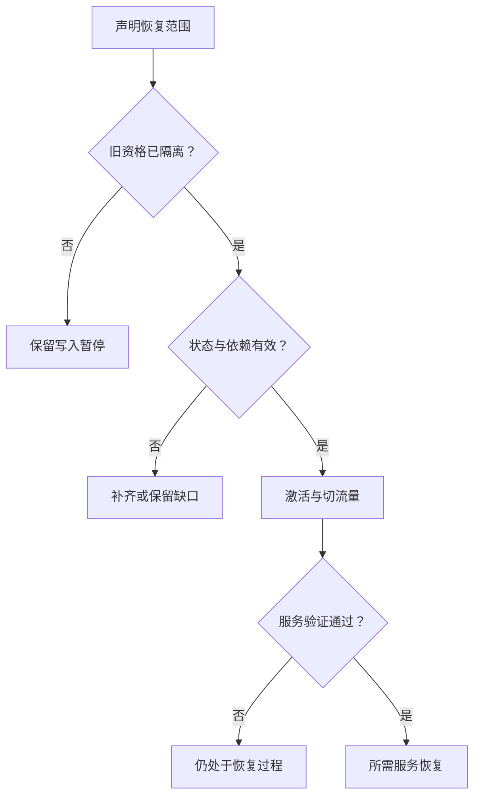

# Disaster Recovery / RPO / RTO：从恢复材料到业务重新可服务

先阅读 [Cross-region Protection](../07-data-protection/06-cross-region-protection.md) 与 [Backup / Restore](../07-data-protection/07-backup-restore.md)：前者保留更大故障域之外的当前保护状态，后者保留历史 Recovery Point。本篇回答：**灾难真正发生以后，如何把这些材料转化为合法、可验证的服务，以及怎样描述数据与时间目标？**

**适用范围：**通用 Recovery / Operations 模型，不提供云服务、DNS 或备份软件配置。流程是逻辑责任，允许在明确依赖条件下并行，不规定统一 DR Scheduler。RPO / RTO 定义参照文末官方资料；时间线和 Epoch 均为示意。

## 1. Disaster Recovery 与 Local Repair 的边界

[Repair / Rebuild](02-repair-rebuild.md)通常在系统仍能提供整体服务时，补回单元、节点或局部故障导致的保护缺口。Disaster Recovery 面向整个服务域、Region 或关键依赖不可用，需要从另一组资源及保护来源重新建立业务服务能力。

不是每次 Node Failure 都是 Disaster。反过来，正文完全未丢失也可能需要 DR：Metadata、Control Plane 或密钥依赖不可用，仍会让用户无法访问状态。**Cross-region Copy ≠ Disaster Recovery**，因为拷贝没有自动决定 Authority、恢复范围、依赖和服务激活条件。

## 2. RPO：目标与实际 Recovery Point 分开

Recovery Point Objective 表示灾难后可接受恢复到多旧的数据状态，通常以最大可接受数据损失时间窗口描述。它是事先确定的目标，不是灾难发生后的复制读数。

| 示意时刻 | 状态 |
| --- | --- |
| T0 | 较早有效恢复点 |
| T1 | 灾难时仍可获得并验证的恢复点 |
| T2 | 服务中断 / 灾难发生 |

如果只能恢复到 T1，则 T1 → T2 之间所需但未恢复的更新形成缺口。应把实际可恢复点及缺失范围与 RPO 目标比较。不能只选一个最新时间戳就宣称范围完整：不同 Partition 可能进度不同，材料也可能缺少关联状态；有效恢复点需要符合声明的完整性和一致范围。

**Replication Lag ≠ RPO。** Lag 是当前传播状态；若相关未保护进度的 Lag 已超过目标 X，说明目标存在风险，但不是已经发生永久损失的证明。某次 Lag 很低，也不证明所有故障和依赖失效下都满足 RPO。Backup Interval 同样影响恢复点，但失败备份、不可验证材料或已传播的逻辑错误，可能让最新有效点比计划间隔更旧。

若灾难包含逻辑损坏，最新状态未必可用，可能需要选择损坏之前的历史点。数据越新与数据越正确不是同一个判断。

## 3. RTO：何时恢复了哪些服务能力？

Recovery Time Objective 表示从服务中断到恢复指定服务能力的最大可接受目标时间。需要明确计时起点、操作范围、容量或性能要求以及完成验证条件；“节点启动”或“能收到一个 GET”未必就是业务所需终点。

实际恢复时间可能包含：故障判断与灾难声明、决策协调、恢复环境准备、Metadata 恢复、数据可用、Credentials / Key 依赖、Routing / Traffic 切换、服务验证与应用状态验证。这些阶段可能重叠，不能机械相加任务耗时；但也不能只计数据拷贝而漏掉前后的等待。

**Repair Duration ≠ RTO。** 即使没有字节需要重建，恢复服务仍可能耗时很久。RTO 是目标，实际完成耗时是验证目标的证据；单次局部恢复的平均时间不能自动替代灾难场景的目标。

## 4. Failover 先解决 Authority / State，再切流量

通用逻辑为 Detect / Declare Disaster → Fence Old Authority → Select Valid Recovery State → Activate Recovery Site → Restore / Catch Up if Needed → Switch Routing → Validate Service → Resume Operations。以下把关键门槛画成分支，避免把切换视为总会成功的复制流程。

旧 Region 不可达不证明它不能继续写。若新站点也接受写入，而旧侧仍有客户端、缓存或在途消息，就可能形成 Split Brain。复用 [Lease / Epoch / Fencing](../06-distributed-systems/02-quorum-leader-lease-fencing.md)：新资格必须由合法转移产生，并在相关提交入口真正拒绝旧资格。

**只在 B 生成更高 Epoch，不会自动让隔离的 A 拒绝旧写入。** 需要实际生效的 Fencing、隔离措施或协议提供的排他条件；不能用“大家认为 A 已坏”替代。若无法证明写入排他，应保留不可安全转移的状态，暂停相关写入或采用明确受限的服务范围，而不是无条件开放两个 Writer。本篇不设计 Global Consensus 或 Active-Active Protocol。

旧请求的未知结果和迟到重试也需要遵守切换后的资格与操作身份，参见 [Retry / Idempotency](../06-distributed-systems/03-retry-idempotency-deduplication.md)。改 DNS 或 Routing 不能自行消除旧消息的提交效果。

## 5. Remote Replica Available 不等于 Application Recoverable

| 切换前问题 | 若未满足，会有什么风险？ |
| --- | --- |
| 哪个 Recovery Point 有效，范围是否完整？ | 以最新时间戳掩盖缺失更新或错误状态 |
| Remote Replica 是否已持久化并验证，Backup 是否需 Restore？ | 把接收进度或备份存在当作可读服务 |
| Metadata / Namespace / Catalog 是否恢复？ | 正文存在却无法定位或解释 |
| Credentials、Key 与必要配置是否可用？ | 数据不能解密、授权或对应用提供服务 |
| 新站点是否有足够 Capacity / Protection / Headroom？ | 切换后立即饱和，或无法承担恢复与新写入 |
| 旧 Writer 是否已经隔离？ | 两侧同时产生不兼容提交 |

如果原站点永久不可用，就不能把“从原站点追齐所有缺口”当作必然可完成阶段。应选取实际可获得的有效恢复点，明确缺失状态和服务范围；不能把未获得的数据标成已恢复。新站点 Capacity 条件见 [Capacity Management](08-capacity-management.md)。

Routing 已切换后仍需要验证预期操作、权限、恢复点和应用可观察状态。后台恢复任务执行完毕也不等于用户所需服务全部恢复，继承 [SLI / SLO](10-sli-slo-alerting.md) 的操作范围与成功定义。

## 6. Failback 不是把地址改回去

假设 A 在灾难前停留于 g2，B 接管后提交了 g3。A 恢复网络时，g2 即使 Checksum 正确，也不是当前 Authority 应使用的状态。不能因为原站点变为 alive，就让它重新以旧资格写入。

Failback 需要确定当前权威状态、同步接管期间的变化、验证数据及 Metadata、重新建立保护条件，再完成 Ownership 转移与 Fencing，最后切换并验证流量。这里复用 [Online Data Migration](05-data-migration.md) 的并发更新和 Cutover 边界，不重复搬迁算法。

Failover 后的新写入可能让原状态不再适合作为直接回退点。提前清理恢复材料或旧环境，会缩小后续处理选择；回退是否可行应依据真实状态与依赖判断，而不是认为两次切流量互为逆操作。

## 7. 四种目标不能互相代替

| 概念 | 回答什么 | 不自动保证什么 |
| --- | --- | --- |
| Durability | 已承诺状态能否在声明故障模型下保留 | 服务能迅速恢复 |
| Availability | 当前请求能否得到符合契约的服务 | 所有保护材料都充分，或无可靠性风险 |
| RPO | 灾难后允许恢复到多旧的数据状态 | 当前 Lag 必定满足目标 |
| RTO | 灾难后允许多久恢复指定服务能力 | 恢复点没有任何数据缺口 |

**High Durability ≠ Low RTO**：字节完全保留，Metadata、Routing 或密钥恢复仍可能很慢。**Low RTO ≠ RPO = 0**：迅速激活一个旧恢复点可以恢复服务，却仍丢失部分较新状态。目标通常影响 WAN 等待、待机资源、历史保留、恢复流程与运维成本，应围绕业务范围权衡，不提供统一固定数字。

## 8. 用验证记录建立信心

没有验证过 Restore / Failover 的 DR Plan，只说明设计意图，未证明依赖、能力与目标成立。基础验证可以覆盖 Restore Test、有限范围的 Failover Rehearsal 与 Dependency Validation，并记录恢复点、服务范围、缺口及耗时。

一次验证成功的结论仅适用于相应规模、版本、配置与故障条件。验证数据可用不自动证明任意应用都恢复；依赖和容量变化以后也需要重新判断。本篇止于验证原则，不展开 Failure Drill、Incident Response 或 Postmortem。

## 9. 一手资料与适用范围

- [AWS Well-Architected：Disaster Recovery objectives](https://docs.aws.amazon.com/wellarchitected/latest/reliability-pillar/disaster-recovery-dr-objectives.html)：核对 RPO / RTO 定义及其与 Availability 的区别，仅引用目标概念。
- [AWS Well-Architected REL09-BP04：Periodic recovery testing](https://docs.aws.amazon.com/wellarchitected/latest/reliability-pillar/rel_backing_up_data_periodic_recovery_testing_data.html)：核对恢复内容与时间需要验证，不引入云服务配置。

核对日期：**2026-10-02**。Failover / Failback、切换门槛和 g2 / g3 为通用架构模型与工程推导，不描述具体产品的灾备协议。

[保护材料：Cross-region Protection](../07-data-protection/06-cross-region-protection.md) · [历史恢复点：Backup / Restore](../07-data-protection/07-backup-restore.md)
