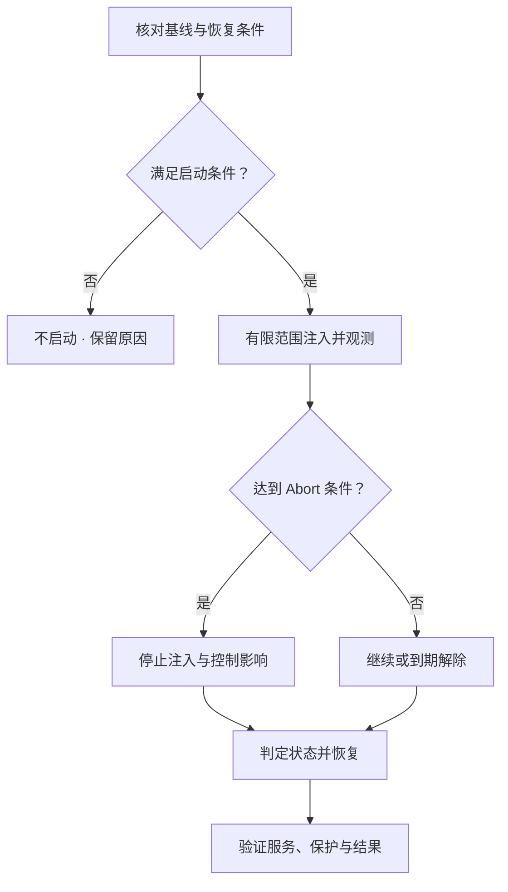

# Failure Drill：把故障假设变成可验证的运行证据

设计上能容忍某个 Failure，不等于当前部署已经证明检测、服务和恢复链都能兑现。本篇将既有 **Failure Model → Recovery → Observability → SLI / Alert** 连接为受控验证方法，不提供故障注入工具、生产破坏命令或 Vendor Runbook。

前置：[Failure Detection](01-failure-detection-state-transition.md)、[Repair / Rebuild](02-repair-rebuild.md)、[Task Coordination](03-recovery-task-coordination.md)、[Observability Signals](09-observability-signals.md)、[SLI / SLO](10-sli-slo-alerting.md)。下文表格、状态与时间点是通用工程示意，不是统一产品流程，也不是已运行的实验报告。

## 1. Test、Injection、Drill 与 Incident 各自回答什么

| 概念 | 主要目的 | 不能据此宣布什么 |
| --- | --- | --- |
| Normal Test | 在确定输入与前提下验证功能和预期结果 | 所有故障条件与运行规模已经覆盖 |
| Failure Injection | 主动制造指定失败条件，是一种实验手段 | 注入成功就等于系统正确处理了失败 |
| Failure Drill | 围绕假设验证 Detection → State Transition → Service Behavior → Recovery → Convergence → Verification | 一次执行结束就证明所有部署都安全 |
| Production Incident | 处理非计划故障，优先降低影响、保护数据并恢复服务 | 必须为了证实某个假设继续制造影响 |

这些范围可以重叠：普通测试也可以包含注入，但 Drill 还要有运行基线、安全边界、证据和收敛判定。Chaos Engineering 是更宽的实践类别；本章只讨论存储系统的受控故障验证，不把两者简单画等号。若演练已产生超出计划的影响，应先停止扩张并恢复安全状态，而不是为了完成实验继续注入。

## 2. Hypothesis：先写下怎样才算成立

不要从“随机杀几个组件”开始。一个可检验假设至少把以下五项绑定到同一范围：

| 项目 | 通用 Node Unreachable 示例 |
| --- | --- |
| Fault | 从声明的观察侧，目标 Node 的指定接口在窗口内不可达；不冒充永久介质丢失 |
| Expected System State | 受影响保护组从 Healthy 进入 Degraded；其他组不应被无条件一起标坏 |
| Expected Client Behavior | 在仍有合格来源、路由与依赖可用的前提下，声明的 GET 可服务；PUT 依 ACK / 保护契约记录成功、拒绝或未知结果 |
| Expected Recovery | 持续缺口达到约定触发条件后，Detect → Enumerate → Repair → Protection Restored；短暂故障可走验证返回路径 |
| Evidence | 客户端结果、状态事件、当前有效布局、Task / Attempt 记录和资源指标能相互关联 |

因此核心关系是 **Fault → Expected State Transition → Evidence → Verification**。写明触发窗口、允许影响、完成条件与观察范围；不能故障只持续在 Grace Period 内，却以“没有全量 Repair”断言机制失效。若要验证 Task 创建，实验前提必须真的要求它启动。

也要验证注入本身确实发生在预期接口和范围：心跳路径失败不等于正文路径失败，单向网络异常不等于所有节点都失联。注入调用 Timeout 时保留未知结果，不盲目叠加第二次故障；复用 [Failure Model / Timeout](../06-distributed-systems/01-failure-model-timeout.md)。

## 3. Steady State 与 Safety Invariant 先于注入

**Baseline Known ≠ Assume Healthy。** 注入前固定观察窗口、统计口径与当前状态，至少核对：

| 基线 | 必须知道什么 |
| --- | --- |
| Protection | 声明范围是否满足有效 Generation、数量和 Failure Domain 策略；已有 Degraded / Failed Node 是哪些 |
| Capacity Headroom | 故障后的剩余合格位置能否接收 Repair，是否已有临时移动占用或预留冲突 |
| Recovery Backlog | 现有任务数量、最老年龄、受阻原因和实际推进能力 |
| Scrub / Integrity | 是否存在未处理 Mismatch、Unknown / Skipped 范围；检查到哪份状态、哪层 |
| Request Health | GET / PUT 的结果、延迟、Retry、负载和样本口径是否已知 |

已经 Degraded 的环境再失去一个来源，会改变恢复输入与容忍余量。若它不是本次明确设计且已评估的前提，应不启动本轮；不能把原有缺口和新故障混为同一实验结果。Steady State 指可测的已知运行基线，不是所有指标完全不变。

Safety Invariant 描述整个实验必须守住的条件，例如不能接受失效资格的写入、不能用无效来源覆盖正确状态、不能越过声明的最低保护与容量边界。它与“允许短时延迟升高”的服务预期不同。基线及边界复用 [Capacity](08-capacity-management.md)、[Scrub](07-scrubbing-integrity-repair.md) 和 [Fencing](../06-distributed-systems/02-quorum-leader-lease-fencing.md)，不在本篇重写机制。

## 4. Fault Model、Failure Domain 与 Blast Radius 分开

实验计划应记录 Fault Type、Affected Component、Failure Domain、Duration、Expected Blast Radius 和 Recovery Source。Node Unreachable、Device Unavailable、Network Partition / High Loss、Device Latency 增加、Capacity Pressure、Corrupt Source 检测或后台恢复竞争，验证的是不同条件。

Failure Domain 描述真实的相关故障范围；Drill Blast Radius 描述这次允许影响多少 Cluster、Node、Tenant / Test Data、请求及时间窗口。二者不是同一个概念。某 Rack 是真实故障域，不意味着本轮应该让整个 Rack 失效；测试数据限定在一个 Tenant，也不意味着共享 Metadata、设备或网络只影响它。

从可控的小范围验证开始，明确注入对象、观察者、持续上限、解除方式与恢复材料。Corruption 场景只在可隔离、可重建的测试材料及受控验证路径上设计，不能为“更真实”破坏唯一有效来源。本文不提供具体实施命令。

## 5. Abort Condition：安全退出也是需要验证的能力

在开始前就明确停止条件、执行责任与解除后验证方法，不能等指标恶化再临时决定。条件可以包括：出现预期外完整性风险、保护低于安全边界、合格 Headroom 不足、无关 Tenant 受影响、Backlog 无法受控收敛、客户端错误超出允许范围，或关键观测失效而无法确认安全边界。

Abort 不是一个可直接等同于 Drill Failure 的结论，它首先表示 Safety Boundary 被触发。但也不能把成功停止当作故障假设通过：分别记录 **假设成立 / 被反驳 / 证据不足或提前中止**，以及 **Guardrail 是否正确生效**。实际异常仍可能反驳假设。

解除故障不等于系统已经恢复；取消注入也不自动撤销已发生的任务、写入或布局切换。按当前 Authority、Generation 与提交事实处理，不把旧 Snapshot / Layout 无条件覆盖回来。安全中止和正常结束都必须有后续状态核对。

## 6. 演练同时验证四类结果

| 结果 | 应观察什么 |
| --- | --- |
| User-visible State | API 成功 / 错误 / Unknown、延迟、Retry 与请求范围 |
| Internal Protection State | 当前有效副本 / 分片、域隔离、Degraded / At Risk 范围 |
| Recovery State | 应有任务是否被枚举、创建、领取、推进；受阻原因是否准确 |
| Completion | 当前有效保护恢复，所需完整性验证、路由与资格条件成立 |

示意：目标为三副本的测试组失去一份合格来源，GET 仍全部成功，但有效副本从 3 变为 2；持续缺口已达到预定触发条件，Repair 却始终未启动。客户端没有报错不能判定整个 Drill 通过，这正是 [Available but At Risk](10-sli-slo-alerting.md)。三副本数字仅用于这个例子，不是通用保护建议。

**Worker Finished ≠ Recovery Complete；Recovery Task Complete ≠ Protection Restored；Protection Restored ≠ Integrity Automatically Proven。** 依 [Repair 验证边界](02-repair-rebuild.md)核对 Expected Generation、Layout、Placement、合格 Replica / Fragment、可信 Checksum / Integrity、Routing / Ownership 和旧 Source 资格。节点返回不能凭心跳就重新计入当前保护；旧 Worker 的迟到提交仍要受 Fencing 约束。

验证结论带范围与时间：修复输出校验通过，不是所有 Cold Data 的完整性证明；全局 Backlog 归零，也可能漏枚举。需要与 [Task Coordination](03-recovery-task-coordination.md) 的受影响范围核对、[Scrub Coverage](07-scrubbing-integrity-repair.md) 的验证范围对应。

## 7. Failure Drill Matrix：按机制填写预期，不照搬参数

| Fault | Expected Signal | Expected State | Recovery | Final Verification |
| --- | --- | --- | --- | --- |
| Node unreachable | 指定观察侧超时、节点状态事件 | 受影响组缺少可用合格来源，按策略 Degraded | 到触发条件后 Repair，或节点返回并重新验证 | 当前 Generation / Placement 满足；旧资格不得继续提交 |
| Device unavailable | 对应设备错误与关联请求 / 单元失败 | 相关来源不可用；不把整集群等同失效 | 从有效 Source 补齐到合格 Target | 布局引用有效持久来源，来源范围与缺口覆盖完整 |
| Network degradation | 路径延迟、Loss / Retry、Queue 增长 | 可疑 / 受限；不直接判永久丢失 | 控制重试与负载，恢复路径并重判缺口 | 请求、队列和任务收敛；无错误资格切换或重复效果 |
| Capacity pressure | 局部 Headroom、分配受阻与准入事件 | 对应工作受限，可能 Available but At Risk | 安全准入、资源补充或合格移动 | 可形成目标布局；临时占用与保护恢复预算可解释 |
| Corrupt source | 声明验证范围内 Mismatch 与排除事件 | 该来源无效或状态歧义，不自动宣布永久丢失 | 从可信来源 Repair；歧义时保持受阻 | 输出身份与完整性正确，坏来源未被错误用于修复 |
| Background contention | 前台尾延迟与共享资源等待变化 | 服务压力、恢复进度与风险共同变化 | 调整允许的后台预算，保留保护边界 | 前台改善且必要恢复仍推进，没有隐藏长期降级 |

这些是通用候选预期，不要求所有故障都立即重建。每一行应补上实际部署的契约、触发窗口、合法来源和安全退出条件；没有观测到 Mismatch 也可能只是尚未触及该来源，不能算检测通过。

## 8. Time Matters：记录里程碑，不假装全局时钟

| 标记 | 本篇示意含义 |
| --- | --- |
| T0 | 预期故障条件实际生效，区别于仅提交注入请求 |
| T1 | 检测器识别异常 |
| T2 | 相关 Degraded 状态可观察；记录权威状态时间与展示延迟 |
| T3 | 对应恢复工作开始，区别于只进入队列 |
| T4 | 声明的服务指标恢复稳定 |
| T5 | 当前受影响范围保护恢复并验证 |

标号是里程碑，不保证所有实现都有这个严格顺序。服务可能始终正常，或在 Repair 开始前已稳定；任务也可能走来源返回路径。可分析 Detection Latency、Detection → Recovery Start Delay、Recovery Duration 和 User Impact Window，并分别声明起止点、是否含等待及无影响 / 未完成的情况。

不同机器墙钟有 Clock Skew，日志可能延迟、批量送达；不能拿毫秒 Timestamp 排序证明因果，也不能不加说明地相减得到精确跨节点耗时。同观察者的 elapsed time 可帮助计量，但不能自行校准其他节点。结合 Drill ID、Task / Attempt ID、Generation / Epoch、状态序列和请求关系保留先后依据及时间误差；更完整的 Incident Timeline 暂留后续。

## 9. Repeatability 与记录：结论只覆盖已验证条件

至少保留 Topology / Failure Domain、软件版本、Workload、Protection Config、初始状态、注入及实际生效范围、预期 / 实际状态、观测方法、恢复时间、Abort / 异常、最终验证和残留风险。每条完成声明要能回到相应证据；观测缺失记录为 Unknown，不当作通过。

一次成功不保证其他 Scale、Load、版本、容量或故障域条件安全。重复验证时保留可比较的基线和主要变量，复用 [Benchmark 方法](../09-data-path-performance/03-benchmark-bottleneck-analysis.md)。如果演练发现恢复停滞或结果不符，下一篇用 [Troubleshooting Method](13-troubleshooting-method.md)建立可反驳的解释，而不是继续随机扩大故障。

## 来源与适用边界

核对日期：**2026-10-03**。

- [AWS Well-Architected REL12-BP04](https://docs.aws.amazon.com/wellarchitected/latest/reliability-pillar/rel_testing_resiliency_failure_injection_resiliency.html)：核对已知基线、假设、受控范围、Stop Condition、恢复与结果记录的原则；不引用其工具接口、产品参数或例子性能为存储标准。
- 本篇的四类验证、Matrix、T0–T5 和完成门槛是结合仓库已有 Failure / Recovery / Integrity / Observability 正文的通用推导，没有实际注入或产品验证结果。
