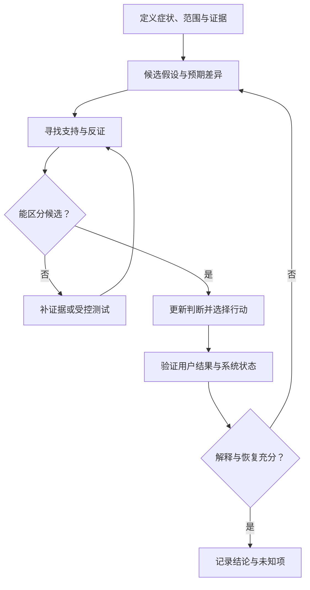

# Troubleshooting Method：从症状到可反驳的故障假设

Metrics、Logs、Events、Traces 已经齐备，为什么仍可能越查越乱？因为信号只有进入明确的症状、范围和假设，才支持解释与行动。本篇连接 [Observability Signals](09-observability-signals.md)、[SLI / Alerting](10-sli-slo-alerting.md) 与 [Failure Drill](12-failure-drill.md)，不重写观测平台、Repair 或排队理论，不提供产品排障命令大全。

通用排障链为 **Symptom → Scope → Timeline → Candidate Layers → Hypotheses → Evidence → Controlled Test / Mitigation → Verify**。实际情况可以并行或回到前一步；不是“看到 Error Message → 搜答案”的固定流水线，也不要求在降低严重影响之前完成根因分析。

## 1. Symptom：先描述用户与系统真正看到什么

GET P99 突然升高、PUT Timeout 增加、Recovery Backlog 增长、容量不均、对象间歇不可用、Checksum Mismatch、Node 反复进出 Degraded，都是可记录的症状。“Disk slow”已经是原因候选，不能作为尚未检验的起点结论。

把预期和实际行为、首次观察窗口、操作类型、影响和样本边界写清。GET 是首字节慢还是完整响应慢？PUT 是明确拒绝还是 Unknown Result？客户端多次 Retry 是一个业务操作还是多个新操作？复用 [Timeout](../06-distributed-systems/01-failure-model-timeout.md)与 [SLI 定义](10-sli-slo-alerting.md)。**Symptom ≠ Root Cause**。

## 2. Scope：缩小范围通常比先读海量日志有效

先区分 One Request、Object / Version、Partition / Shard、Node / Device、Rack、Tenant、Operation Type 或 Whole Cluster。还要找正常对照：同一时段，哪些相似请求不受影响？它们经过哪些不同路径？

| 观察范围 | 下一步更值得检查的区别 |
| --- | --- |
| 一个 Object / Version 间歇失败 | 实际 Generation、Layout、特定来源与请求重试路径 |
| 某 Partition GET 慢 | Ownership / Routing、热点、共享下游与局部队列 |
| 同 Node / Device 的多类请求慢 | 请求是否确实依赖它，资源压力还是上游等待 |
| 某 Tenant / 操作类异常 | 负载、配额 / Admission、Client 路径与数据分布 |
| Cluster 范围扩大 | 公共依赖、共享链路、变更与 Retry 放大；仍要查局部起点 |

表格是候选坐标，不是从 Scope 自动推导根因。总体平均正常不能排除局部异常；“某 Node 有错误”也不能证明整个 Cluster 的尾部都由它造成。

## 3. Timeline：组织证据，但不以时间先后证明因果

收集 First Symptom、Alert、Deployment / Config / Topology Change、Node State Transition、Repair / Rebalance / Migration / Scrub 开始、Capacity 变化与 Client Retry 增长。分开事件发生时间、记录时间和采集到达时间，并说明信息缺口。

Clock Skew、Delayed Delivery、Batching、Async Event Reporting 会改变排序。不同 Node 的 `10:00:01.100` 与 `10:00:01.120` 不能自动建立严格因果；一个更早显示的事件也未必真正更早发生。**Timeline ≠ Causality**。

更可信的关联可能来自 Request ID、稳定 Operation ID、Object / Version / Generation、Partition / Shard、Node / Device、Task ID / Attempt ID、Ownership Epoch、状态序列和 Trace 依赖。Generation 表示数据状态，Epoch 表示资格，Task / Attempt 表示意图与尝试，不是同一序号。它们建立相关范围或协议顺序，不自动补齐所有因果；权威提交仍需由相应状态事实确认。

把这些身份用于 Logs / Trace / 按需证据连接，不要求全部成为 Metrics 的高基数 Label，继续遵守 [Observability Cardinality](09-observability-signals.md)。本节只提供当前排障所需排序边界，不展开 Clock / Ordering 新教程或完整 Incident Timeline。

## 4. Candidate Layers：定位等待什么，而不是固定查盘第一

| Layer | 可以提出的候选问题 |
| --- | --- |
| Client / Request | Workload、Concurrency 或请求大小变了吗？Retry 是否放大？发送端是否自己受限？ |
| Frontend / Gateway | Request Queue、CPU、Connection / Admission 是否造成等待或拒绝？ |
| Metadata / Routing | Lookup、Ownership、Hotspot、Stale Routing 是否让请求走错路或无法推进？ |
| Data Path | Network、Memory Copy、Device、EC / Checksum 哪项位于相关请求依赖中？ |
| Protection / Recovery | 是否 Degraded、正在 Repair / Rebuild，或验证发现无效来源？ |
| Capacity | 是否局部 Full、Failure-domain Headroom 不足或 Skew 阻止合格 Target？ |
| Background Work | Rebalance、Migration、Scrub、Backup 是否竞争同一个资源或资格？ |

这是观察坐标，不是固定顺序，也不是互斥原因。优先选择能区分候选、成本较低且安全的证据。路径与等待复用 [Queueing](../09-data-path-performance/02-latency-throughput-queueing.md)；数据移动复用 [Rebalance](04-rebalance.md)、[Migration](05-data-migration.md)、[Evacuation](06-node-evacuation.md)，不把所有后台流量都叫 Repair。

## 5. Hypothesis → Prediction → Evidence → Falsification

每个候选都应回答：“如果它是真的，应该观察到什么？什么结果会降低它的可信度？”例如 **Device Latency 增加贡献了 GET P99**：受影响请求应映射到该 Device，相应 I/O 等待或 Queue 同时变化，正常对照路径应有可解释差异。

不能只找支持第一直觉的图。如果相关 Device 的同窗口延迟、队列与 Trace 等待均正常，应降低这个假设优先级；但先确认测量覆盖了正确路径和慢请求，避免用粗粒度平均或缺失采样“排除”真正限制。

假设不必等到绝对证明才能作有边界的 Mitigation；行动理由和确定程度应分开记录。也不要认为必须只有一个原因：设备变慢、Client Retry 与后台争用可能形成放大链，修复其中一处未必解决整个链。

## 6. 四类信号如何服务同一个判断

| 信号 | 本轮排障中的职责 | 单独使用的限制 |
| --- | --- | --- |
| Metrics | 找范围、趋势、队列、错误 / Retry 和风险变化 | Aggregate / Percentile 不能给出某次提交的真实结果 |
| Logs | 找具体失败上下文、资格、状态与 Attempt | “准备提交”不是已提交；没有记录可能是采集缺失 |
| Traces | 找相关请求在哪层执行、等待及依赖哪条路径 | 采样与埋点空白限制覆盖，不能相加重叠 Span 推算总延迟 |
| Events / State History | 解释 Node、Partition 或 Task 如何进入当前状态 | 迟到 / 重复事件不能覆盖当前权威状态 |

一种信号很少能单独证明 Root Cause。组合时对齐范围、身份和统计窗口，再确认当前事实；本篇复用 Observability 正文，不另建采集体系。

## 7. Correlation ≠ Causation：干预也要保留保护边界

Repair Throughput 上升且 GET P99 上升，只说明相关。先确认它们是否共享 Device、Network、CPU 或执行 Queue，是否另有负载 / 缓存 / 拓扑变化。对未共享的路径造成的异常，单纯降低 Repair 很难解释。

若有安全余量，可在有限范围改变一个主要预算，记录其他条件，再比较请求等待、资源队列和恢复推进量；先在可控环境验证，生产严重影响下以保护数据和降低影响为先。降低后台预算后 GET 改善是支持证据，但若同时前台负载下降，还不能把收益全归给这个改动。

复用 [Benchmark / Bottleneck Analysis](../09-data-path-performance/03-benchmark-bottleneck-analysis.md) 的可反驳实验方法和 [Foreground / Background Interference](../09-data-path-performance/06-foreground-background-interference.md) 的共享资源边界。不能为了“证明因果”长期关闭必要 Repair 或 Scrub，也不能因为 Mitigation 有效就宣布根因已完全确定。

## 8. 三个通用场景：把下一步写成可检验问题

| 场景 | 初步证据与候选 | 进一步证据 / 反证 | 受控行动与验证 |
| --- | --- | --- | --- |
| A：P99 上升 | P99、Queue、Device Latency 同升，候选为 Device Path 等待 | 请求是否映射到同设备？未受影响路径如何？若设备正常、Trace 等待在 Metadata，则降低原假设优先级 | 在安全范围调整相关并发 / 后台预算；检查同口径尾部、队列、错误与负载是否按预测变化 |
| B：API 正常但风险积累 | GET 正常，Protection Degraded 与 Oldest Backlog Age 上升 | 当前有效布局确有缺口吗？Task 是否漏枚举、Capacity / Placement Blocked、来源不可信或反复重试？ | 处理真正的受阻前提，核对缺口和最老工作收敛；不能因 API 正常结束排查 |
| C：Repair 越来越慢 | 已验证保护推进量下降，不只观察发送 bytes/s | Source 不可用、Target Capacity、网络竞争、Recovery Concurrency、重复 Retry 或前台限流，哪项与 Task / Attempt 对应？ | 调整有依据的资源或计划，验证有效提交与保护恢复；低吞吐不直接证明 Disk 瓶颈 |

这些是工程示意，不是实测或产品判定规则。Backlog 降低还应确认不是统计范围变化、漏扫或每次 Retry 重置 Age。状态和完成事实回链 [Task Coordination](03-recovery-task-coordination.md)、[Capacity](08-capacity-management.md) 与 [Integrity Repair](07-scrubbing-integrity-repair.md)。

## 9. Mitigation、Recovery 与 Root Cause Resolution 分开

| 行动 | 主要目标 | 不能证明什么 |
| --- | --- | --- |
| Mitigation | 降低当前用户影响或风险，例如限制可延后后台工作 | 根本原因已经消除，或保护已经恢复 |
| Recovery | 恢复服务及所需保护 / 布局状态 | 导致问题的软件、配置或设计缺陷不会再触发 |
| Root Cause Resolution | 修复经证据支持的原因，并验证复发条件 | 只改代码或配置就等于全部存量状态已恢复 |

Restart 可能暂时清空队列或恢复请求，却没有解释队列为什么形成，也可能丢失现场。若当前影响要求立即动作，可先保留可得的关键证据，再记录干预及其副作用，不要求为了完整取证延长严重影响。这是行动边界，不是完整 Incident Response 流程。

## 10. 常见排障动作的代价

| 模式 | 为什么结果容易误读 | 更可解释的做法 |
| --- | --- | --- |
| Restart First | 清除现场、重置 Counter 或暂时隐藏等待 | 尽可能先保存状态与身份，记录重启前后差异；仍继续查复发条件 |
| Increase Timeout | 可能把快失败变成长等待、更大 Queue 与慢失败 | 核对 Deadline / 等待位置及实际 Completion，不拿错误减少替代健康 |
| Unlimited Retry | 多层 Retry 消耗更多资源，未知结果也可能产生重复效果 | 用稳定意图与受支持的幂等契约、预算和退避，复用 [Retry](../06-distributed-systems/03-retry-idempotency-deduplication.md) |
| Disable Repair / Scrub | 短期 P99 改善，却延长保护缺口或完整性未知窗口 | 区分可延后工作与必要恢复，明确限时预算及风险，保留恢复安排 |
| Change Multiple Variables | 无法识别哪个改动有效，或只是负载变轻 | 尽量改变一个主要变量；紧急组合动作时完整记录，收窄归因结论 |

这些模式不说明每种动作永远不能用，而是动作有效性、短期恢复和原因解释需要分别验证。Lease / Ownership 问题也不能靠反复重启或任意增大 Epoch 解决，资格与提交入口继续遵守 [Fencing](../06-distributed-systems/02-quorum-leader-lease-fencing.md)。

## 11. Verify：Symptom Gone ≠ System Healthy

至少核对用户症状恢复到声明目标，Error / Retry 回到可解释基线，Backlog 收敛，当前 Protection 恢复，Capacity / Headroom 可承接后续工作；没有隐蔽的 Degraded、受阻任务或未决提交。完整性结论还要带检查范围，不从副本数量齐全直接推导所有字节正确。

观察窗口应覆盖相关负载与原触发条件，不能只看一个成功 GET 或低流量短窗口。临时 Mitigation 已撤除，或明确记录负责人、保留原因、退出条件与残余风险；长期关闭后台工作不是完成证明。最终结论必须区分“服务已恢复”“保护仍待补齐”“原因已验证”与“仍有未知”。

## 12. 排障输出：让下一次判断可以接续

保留 **Symptom、Scope、Timeline、Evidence、Hypotheses Tested、Mitigation、Recovery State、Remaining Unknowns**。Evidence 写明身份、来源、口径与观察限制；假设注明支持 / 反驳 / 尚无法区分，动作注明时点、范围、预期、实际和回退边界。未解释的异常不能因症状消失而删除。

这些材料可供后续 Incident Timeline / Postmortem 使用，本轮不创建完整 Postmortem 正文。至此闭合 **Observe → Validate Failure Behavior → Diagnose Real Problems**：Failure Drill 检验设计假设，Troubleshooting 对实际不符建立解释，二者共同回到服务、保护与恢复事实。

## 来源与适用边界

核对日期：**2026-10-03**。

- [Google SRE：Effective Troubleshooting](https://sre.google/sre-book/effective-troubleshooting/)：核对假设、支持与反证、受控干预、混杂因素，以及降低影响与根因分析分开的方法；不照搬其系统案例或工具。
- Timeline / 身份、七层候选、A / B / C 场景和存储完成检查是结合已有 Failure、Metadata、Recovery、Queueing 与 Observability 正文的通用工程推导，不是产品保证或真实 Incident 分析。

[回看：Observability Signals](09-observability-signals.md)
