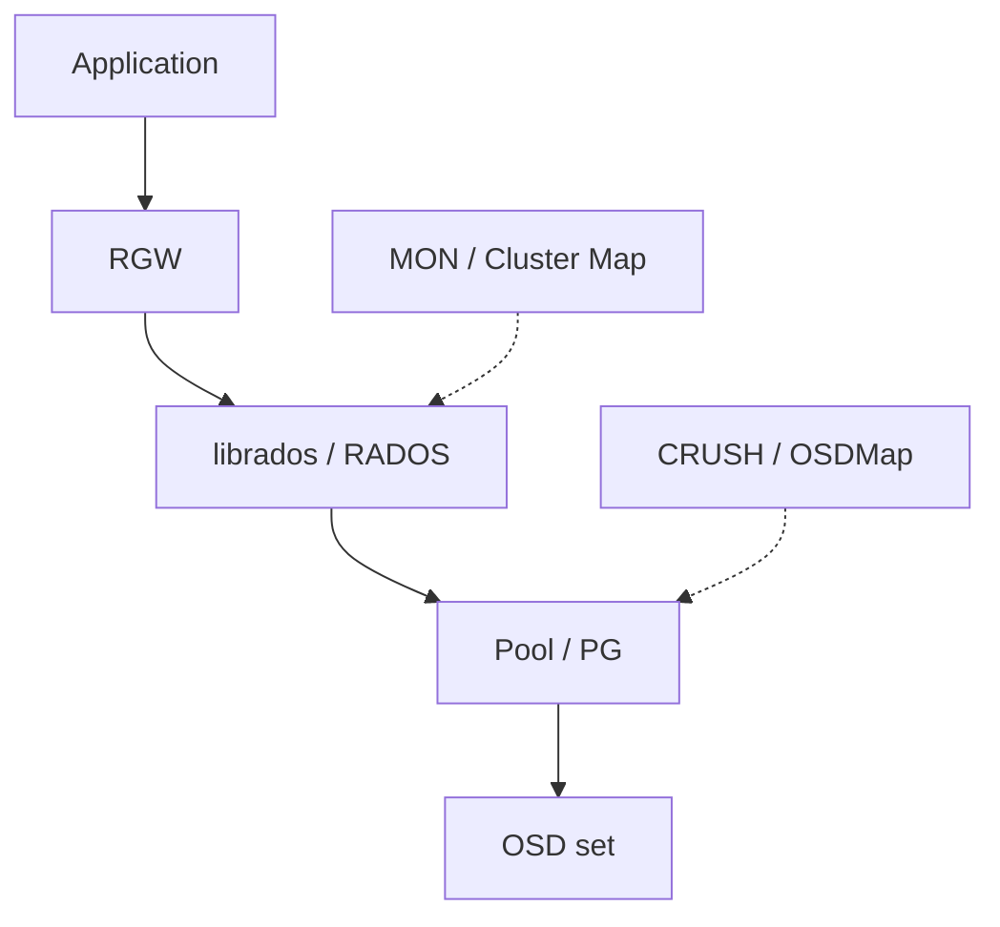

# Ceph RGW：从对象接口映射到 RADOS 保护与放置

## 页面定位与资料范围

按 [Comparison Framework](01-comparison-framework.md) 检查 RGW 如何使用 Ceph 底层机制。本篇关注普通单站点对象路径，不展开部署、命令或 Multisite 协议。

**资料范围：Ceph Tentacle（20.2.x）稳定文档分支，核对日期 2026-10-02。** 官方 [Release Index](https://docs.ceph.com/en/latest/releases/) 的 `latest` 页面标为 Development，因此产品行为以 `/en/tentacle/` 为依据。其中 `/dev/radosgw/` 是该稳定分支的开发者架构文档路径，不表示改用 Development release。具体部署仍应核对实际补丁版本与 Pool 配置。

以下用 **产品事实 / 通用映射 / 工程分析** 区分证据层次，最后一种不构成官方性能承诺。

## 1. System Position

**产品事实：** [RGW 官方概述](https://docs.ceph.com/en/tentacle/radosgw/) 将它定义为基于 librados 的 HTTP 对象接口；[Ceph Architecture](https://docs.ceph.com/en/tentacle/architecture/) 描述 RADOS、OSD 与 Cluster Map 的职责。MON 维护集群映射等协调信息；它不是每次对象正文传输的代理。RGW 不使用 Ceph MDS，后者服务于 CephFS。

这是职责关系图，虚线表示定位依据，不是固定 RPC 时序，也不表示每次 GET 都查询 MON。

**通用映射：** RGW 对应 Object API / Frontend，RADOS 是底层 Distributed Object Store。**工程分析：** 对象接口与共享存储后端的边界让故障和性能分析需要分层；RGW 健康不能单独证明底层 PG 正常。

## 2. Access Model

**产品事实：** RGW 提供 S3-compatible 与 Swift-compatible 接口，共享 Namespace；“兼容”需要按具体 API 范围核对，并不等于 AWS 全部功能契约。Ceph 同时提供块和文件接口，但 RGW 不是 RBD / CephFS 的别名。[来源：RGW 概述](https://docs.ceph.com/en/tentacle/radosgw/)。

**通用映射：** [Object Model](../03-object-storage/01-object-model.md) 描述客户端对象身份；[RGW Layout](https://docs.ceph.com/en/tentacle/radosgw/layout/) 则说明一个 RGW Object 可以占用一个或多个 RADOS Objects。**S3 Object ≠ RADOS Object**，更不等于一份 Replica 或 EC Fragment。

**工程分析：** 用 API 对象数估计底层对象数、Metadata 成本或修复任务数，必须先了解布局，不能直接一比一换算。

## 3. Metadata

**产品事实：** RGW 的用户 / Bucket 相关 Metadata、Bucket Index 和正文都由 RADOS 承载。对象 Head 的属性记录 ACL、对象 Metadata 和 Manifest 等；Tail 承载后续数据。Bucket Index 使用 RADOS omap，可分成多个 Index Shards。[来源：RGW Layout](https://docs.ceph.com/en/tentacle/radosgw/layout/)。

**通用映射：** Bucket Index 对应 [Namespace / Object Index](../08-consistency-metadata-partitioning/02-metadata-object-index.md) 的一部分，Manifest 对应 Layout Reference；Index Shard 是索引划分，PG 是底层放置与保护分组。没有独立 RGW Metadata Server 不意味着没有 Metadata。

**工程分析：** 正文吞吐与 Namespace 查询可能受不同 Pool、Index Shard 或 OSD 资源限制。LIST 变慢不能只看正文设备带宽。本篇不固定内部命名格式、每种对象的精确数量或所有记录之间的 schema；公开布局说明不足以替代具体版本的完整实现审计。

## 4. Partition / Placement

**产品事实：** 在已选定的 Pool 内，RADOS Object 映射到 PG；CRUSH 结合规则与拓扑计算 OSD 放置。实际服务成员还需看 OSDMap 和 PG 的 Acting Set，不能只取抽象 CRUSH 结果。[来源：Placement Groups](https://docs.ceph.com/en/tentacle/rados/operations/placement-groups/)、[PG Concepts](https://docs.ceph.com/en/tentacle/rados/operations/pg-concepts/)、[CRUSH Map](https://docs.ceph.com/en/tentacle/rados/operations/crush-map/)。

| 层次 | 职责 | 不等价于什么 |
| --- | --- | --- |
| Bucket / Index Shard | API Namespace 与索引拆分 | Bucket 不是 PG |
| Pool / PG | 后端策略范围与对象分组 | PG 不是一个 API Object |
| CRUSH Rule / Map | 物理资源选择与故障域约束 | CRUSH 不是全部 Request Routing |
| OSDMap / Acting Set | 当前服务布局信息 | 不代表客户端对象版本 |

**通用映射：** 分别对应 [Partitioning / Placement / Routing](../08-consistency-metadata-partitioning/03-partition-ownership-routing.md)。**工程分析：** 路由信息与实际布局在拓扑变化期间需要协调；仅知道 Key Hash 或 CRUSH Rule 不能证明某节点现在有资格提供最新状态。

## 5. Data Protection

**产品事实：** Ceph 的 replicated pools 和 erasure-coded pools 在 RADOS 层提供不同保护方式；EC 编码的输入是底层 RADOS 对象相关数据。CRUSH Rule 可以按 Host / Rack 等 Failure Domain 选择成员。EC Pool 不支持 omap，因此 RGW Bucket Index 需要 replicated pool；正文采用 EC 不代表全套 Metadata 也采用同一策略。[来源：Erasure Code](https://docs.ceph.com/en/tentacle/rados/operations/erasure-code/)、[RGW Layout](https://docs.ceph.com/en/tentacle/radosgw/layout/)、[CRUSH Map](https://docs.ceph.com/en/tentacle/rados/operations/crush-map/)。

**通用映射：** 对照 [Replication](../07-data-protection/01-replication.md)、[EC](../07-data-protection/02-erasure-coding.md)、[Failure Domain](../07-data-protection/03-failure-domain-placement.md)。**工程分析：** 不能从“启用 EC”推出任意节点或 Rack 故障都可承受：要结合分片布局、故障域、Pool 可服务条件与有效来源判断。

## 6. Read Path

**产品事实：** RGW 经 librados 访问 RADOS；对象布局包含 Head / Manifest 和必要的 Tail。RADOS Client 使用 Map 与放置计算定位相关 PG / OSD。[来源：RGW Layout](https://docs.ceph.com/en/tentacle/radosgw/layout/)、[Architecture](https://docs.ceph.com/en/tentacle/architecture/)。

高层逻辑为：客户端请求 → RGW 解析身份与对象状态 → 解析布局 → RADOS 读取相关单元 → RGW 返回正文。这个描述不规定每次读取涉及几个 RPC、全部缓存位置，或所有读取都采用同一 Replica 选择。官方 PG 文档中的 Primary 职责不能扩展成“任何模式下所有读都只能由 Primary 提供”。

**通用映射：** 复用 [Read / Write Path](../03-object-storage/03-read-write-path.md) 与 [Object Layout](../03-object-storage/06-object-layout.md)。**工程分析：** 一个大 API Object 可涉及多个后端单元；小对象可能更受 Head / Metadata 和请求固定成本影响。具体 Fan-out 与校验覆盖必须按实际布局、保护策略和缓存条件观察。

## 7. Write Path

**产品事实：** RADOS 架构文档描述 replicated 写入由 PG Primary 协调其他 OSD；RGW Bucket Index 文档则描述对象 Head 最后写入，作为对象写入的原子提交点，并通过 Index Transaction 协调索引更新。[来源：Architecture](https://docs.ceph.com/en/tentacle/architecture/)、[Bucket Index](https://docs.ceph.com/en/tentacle/dev/radosgw/bucket_index/)。

这至少存在两个观察层：后端单元写入与对象 / Namespace 状态发布。不能把某次 RADOS 写完成直接视为完整 S3 PUT 的全部步骤完成，也不能把正常 replicated 路径的成员确认推广为 EC 或故障降级情况下的统一 ACK 数量。

**通用映射：** 对应数据准备、保护和 Metadata Commit。**工程分析：** Tail 已落盘而 Head / Index 尚未合法提交，与对象成功可见是不同状态。关于所有配置下 RGW HTTP 成功对应的设备持久化细节、故障降级确认集合及跨站点完成条件，本文所核对的公开资料不足以得出更精确结论。

## 8. Consistency Boundary

**产品事实：** Tentacle 的 Bucket Index 文档明确说明 RGW 提供对象写入后的 Read-after-write，包含 GET / HEAD 与 LIST 可见性；它通过 Head 与 Index 的提交协调解释这一边界。[来源：Bucket Index](https://docs.ceph.com/en/tentacle/dev/radosgw/bucket_index/)。

**通用映射：** 对照 [Observable State](../08-consistency-metadata-partitioning/01-consistency-observable-state.md)，关注对象状态与 Namespace 可见性。**工程分析：** 这不能推出多 Key 原子事务、分页 LIST 跨并发修改的固定快照，也不能推出远端站点在本地 PUT ACK 时已经拥有相同状态。本篇不把单站点说明扩展成全部 Multisite 模式的 Linearizability 承诺。

## 9. Failure Recovery

**产品事实：** Peering 使相关 OSD 就 PG 历史与状态达成一致，并不等于已经补齐所有字节；Recovery 根据所需状态补回缺失内容。PG 状态包括 Degraded、Peering、Recovering 等，可能组合出现。[来源：PG Concepts](https://docs.ceph.com/en/tentacle/rados/operations/pg-concepts/)、[PG States](https://docs.ceph.com/en/tentacle/rados/operations/pg-states/)。

**通用映射：** Peering 主要对应确定恢复依据与服务资格，Recovery 对应 [Repair / Rebuild](../10-recovery-operations-observability/02-repair-rebuild.md)。**工程分析：** 一个 OSD 再次可达不证明它持有合格的当前来源；“PG 可服务”与“保护已完整恢复”也不能混用。观察恢复应同时检查状态、缺口与进度，而非只看进程存活。

## 10. Rebalance / Expansion

**产品事实：** 加入 OSD 或改变 CRUSH 布局会使部分 PG 重映射；Backfill 在后台补齐新成员的内容。Balancer 可以调整 PG 分布，分阶段推进；该模块在集群 Degraded 时不调整 PG 分布。[来源：Monitoring OSDs and PGs](https://docs.ceph.com/en/tentacle/rados/operations/monitoring-osd-pg/)、[Balancer](https://docs.ceph.com/en/tentacle/rados/operations/balancer/)。

**通用映射：** Backfill 是布局变化后的数据补齐机制之一，Rebalance 是改善分布的目标，两者不完全等价。**工程分析：** Map 改变不等于搬迁完成；PG 分布更均匀也不证明容量、对象数和请求负载都均匀。资源竞争和收敛问题回看 [Rebalance](../10-recovery-operations-observability/04-rebalance.md)。这里不把特定 Balancer 行为写成所有 Recovery Scheduler 的通用优先规则。

## 11. Integrity

**产品事实：** OSD 文档区分普通 Scrub 对对象大小、属性等的检查，与 Deep Scrub 读取数据、检查 Checksum 的更深验证。[来源：OSD Configuration Reference](https://docs.ceph.com/en/tentacle/rados/configuration/osd-config-ref/)。

**通用映射：** 对应 [Checksum / Integrity](../07-data-protection/04-checksum-data-integrity.md) 和 [Scrubbing / Integrity Repair](../10-recovery-operations-observability/07-scrubbing-integrity-repair.md)。**工程分析：** 校验作用于其后端数据范围，不自动证明应用原始字节、RGW 对象组装和全部 Namespace 状态都正确；发现不一致也不等于已经找到可信来源并完成修复。Deep Scrub 增加读取与计算，覆盖和资源预算需要一起观察。

## 12. Operations / Observability

**产品事实：** Ceph 提供集群健康、PG 状态、容量与 Recovery / Backfill 信息；MGR Prometheus 模块与 ceph-exporter 的职责需按当前配置区分，不能假定所有 Daemon Counters 默认都由 MGR 导出。[来源：Monitoring OSDs and PGs](https://docs.ceph.com/en/tentacle/rados/operations/monitoring-osd-pg/)、[Prometheus Module](https://docs.ceph.com/en/tentacle/mgr/prometheus/)。

**通用映射：** 对应 [Observability Signals](../10-recovery-operations-observability/09-observability-signals.md) 的聚合、状态与具体证据。**工程分析：** 对象 API、RGW 请求、Pool / PG 和 OSD 需要关联观察。API 成功而 PG Degraded，是可用但有风险的状态；只看一个层次不能解释全路径健康。本篇不提供命令或 Dashboard 清单。

## 13. Performance Implications

以下全部为**工程分析**，不是 Ceph 的性能承诺。

| 架构决策 | 可能的成本位置 | 需要验证的条件 |
| --- | --- | --- |
| RGW 参与正文路径 | 入口 CPU、网络、连接与 Buffer | 客户端数、RGW 数、对象大小、实际瓶颈 |
| Head / Tail 与 Bucket Index | 固定请求成本、索引 I/O、布局读取 | 小对象 / LIST 比例、Index Shard 与 Pool 分布 |
| PG / OSD 保护组 | 下游 Fan-out、等待与后台补齐 | Replication / EC、Degraded 状态、ACK 边界 |
| EC 与 Deep Scrub / Recovery | CPU、网络、设备共享资源 | 正常读与重建读、后台预算、P99 |

路径成本使用 [Cost Model](../09-data-path-performance/01-end-to-end-cost-model.md) 拆解，结论使用 [Benchmark](../09-data-path-performance/03-benchmark-bottleneck-analysis.md) 验证。多层架构提供共享后端能力，也增加分层诊断边界；是否适合 Workload 不能用层数直接判定。

## 14. Mapping Back to Generic Model

| 通用模型 | Ceph RGW / RADOS 对应概念 | 是否完全等价 |
| --- | --- | --- |
| Object | RGW API Object；底层 RADOS Object | 否，两个粒度必须分开 |
| Metadata | Head Attributes / Manifest、Bucket Index、其他 RADOS-backed Records | 部分对应，不是单个 Metadata Server |
| Partition | Index Shard；后端 PG 分组 | 部分对应，两种分组职责不同 |
| Placement | Pool、CRUSH Rule、OSDMap | 部分对应，还需实际成员状态 |
| Failure Domain | CRUSH 拓扑中的 Host / Rack 等 | 对应故障域思想，保障依赖规则与真实拓扑 |
| Replication / EC | Replicated / Erasure-coded Pool | 对应机制，保护输入不是完整 S3 Object 的同义词 |
| Routing | RGW 状态解析与 librados Map / PG 定位 | 部分对应，不能只写 CRUSH |
| Repair | Peering 后的 Recovery / 必要 Backfill | 部分对应，Peering 本身不是复制完成 |
| Rebalance | 布局重映射、Balancer、后台 Backfill | 部分对应，目标、规划和执行分开 |
| Integrity | Scrub / Deep Scrub、后端校验 | 部分对应，不涵盖所有应用端完整性 |
| Observability | Health、PG States、容量、Exporter / Counters | 对应观察维度，不等于一个端到端 SLO |

## 官方资料与核对记录

资料核对日期：**2026-10-02**。行为依据：**Ceph Tentacle `/en/tentacle/` 文档分支**；正文各节链接是对应证据。Release Index 的 `latest` 仅用于版本分支选择。没有使用旧博客或无 Workload 的营销性能数字；未明确公开的 ACK 与扩大的一致性保证保留为证据边界。

下一篇：[MinIO](03-minio.md)。[比较框架](01-comparison-framework.md) · [返回专题入口](README.md)。
