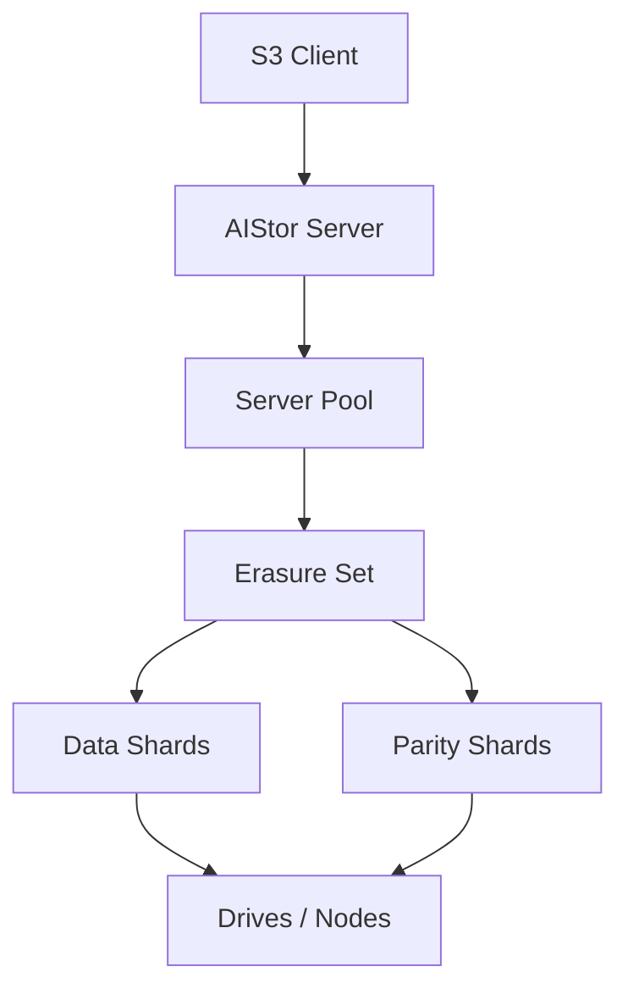

# MinIO：以当前 AIStor 文档检验对象原生路径

## 页面定位与资料范围

本篇沿用 [Comparison Framework](01-comparison-framework.md)，与 [Ceph RGW](02-ceph-rgw.md) 保持相同十四个主标题。比较架构决策与边界，不评选 Winner。

**资料核对日期：2026-10-02。产品范围：MinIO AIStor Server；文档范围：当前官方 `/aistor/` 滚动文档。** 该站点没有为本文全部资料提供统一、固定的 release 分支，因此不能宣称所有结论已在某个单独二进制 release 上验证。部署时应结合实际 Release 与文档中的 Version Added 条件复核；本文避开不必要的默认 Parity、Drive 数量和版本限定配置值。

文件名保留 MinIO，当前产品行为明确使用 **AIStor** 名称；不把历史开源 MinIO 的旧资料无条件当作当前契约。产品名称不改变本篇范围：只研究通用对象存储，不展开 AI / GPU 功能。

## 1. System Position

**产品事实：** [Core Concepts](https://docs.min.io/aistor/operations/core-concepts/) 描述 Server Pool、Erasure Set 与节点拓扑：客户端可接入任一节点，节点处理必要的内部通信。当前对象路径不需要套用 RGW → RADOS 的独立接口层 / 后端层分解。

图表示请求处理、拓扑与保护关系，不是每次操作固定的 RPC 序列；Pool / Set 也不是额外独立服务。

**通用映射：** Server 同时承担 S3 处理与存储集群职责，Erasure Set 是保护组。**工程分析：** 入口可选择不代表入口节点能只凭本地数据完成全部请求；内部分片访问仍会使用网络、CPU 和设备资源。外部 Load Balancer 可以分配请求，但不能替代集群内部放置与定位。

## 2. Access Model

**产品事实：** AIStor 提供 S3 接口；具体操作与限制以 [S3 API Compatibility](https://docs.min.io/aistor/developers/s3-api-compatibility/) 为准。不能因 API 名称相同，就继承 AWS 全部行为或认定后端架构相同。

**通用映射：** 客户端看到 [Bucket / Key / Object](../03-object-storage/01-object-model.md)，底层使用编码数据表示。**工程分析：** API Object、内部数据范围、EC Shard 和 Multipart Part 属于不同层次。Healing 文档中对磁盘 Shard 使用的 “parts” 表述，也不能直接翻译成客户端 Multipart Upload Part。

## 3. Metadata

**产品事实：** 当前官方 [Object Storage Product Brief](https://www.min.io/product/product-brief/object-storage) 描述 Metadata 与数据共置、没有独立集中 Metadata Database；[Debugging and Troubleshooting](https://docs.min.io/aistor/operations/debugging-and-troubleshooting/) 则明确对象 Metadata 使用 `xl.meta` 二进制文件。这是“Metadata 如何组织”，不是“没有 Metadata”。

**通用映射：** 对应 [Metadata / Object Index](../08-consistency-metadata-partitioning/02-metadata-object-index.md) 中身份、状态、布局与恢复依据。Bucket 配置、权限、版本和 Namespace 同样是系统状态；上述来源不足以为它们所有记录给出统一的精确磁盘 schema，因此本文不虚构一个“所有 Bucket 都只有某个文件”的模型。

**工程分析：** 共置减少某些独立服务边界，但不消除 Metadata 读取、更新、校验、保护或 LIST 的成本。官方产品材料的 “stateless” 描述不能理解为没有持久状态；更不能据此断言没有任何后台任务，操作文档明确描述 Scanner 和 Rebalance。

## 4. Partition / Placement

**产品事实：** Pool 包含 Erasure Sets，Set 成员在初始化后固定；官方架构材料说明对象路径 Hash 用于选择 Erasure Set，Core Concepts 描述接收节点根据集群拓扑定位对象所属 Pool / Set。[来源：Core Concepts](https://docs.min.io/aistor/operations/core-concepts/)、[Erasure Coding](https://docs.min.io/aistor/operations/core-concepts/erasure-coding/)、[Product Brief](https://www.min.io/product/product-brief/object-storage)。

这里应分开两层：多 Pool 中对象所在 Pool 的选择 / 查找，与 Pool 内的 Set 定位。不能把 Hash 规则概括为“一个 Key 永远属于全集群同一组资源”，忽略扩容与显式数据移动。

**通用映射：** Erasure Set 与保护 / 放置组部分对应；它不是 Ceph PG，也不是一个 Bucket 或独立 Namespace Partition。参照 [Partition / Placement / Routing](../08-consistency-metadata-partitioning/03-partition-ownership-routing.md)。**工程分析：** Hash 有助于可计算定位，却不自动保证容量与请求负载均匀；热门 Key 和不同对象大小仍可能形成偏斜。

## 5. Data Protection

**产品事实：** 当前 AIStor 使用 Reed-Solomon EC，在 Set 的 N 个 Drives 上保存 K 个 Data Shards 与 M 个 Parity Shards。当前文档描述读取需要至少 K 个完整可用分片；写入阈值通常为 K，Parity 恰占一半时为 K+1。[来源：Erasure Coding](https://docs.min.io/aistor/operations/core-concepts/erasure-coding/)。这里的 K / M 是符号，不是推荐配置。

**通用映射：** 对应 [EC](../07-data-protection/02-erasure-coding.md) 的已知缺失 / 无效分片恢复模型；这组阈值不是通用 Replication Quorum 的完整替代，也不能证明所有状态都经过 Consensus。

**工程分析：** 可恢复的分片缺失数量不等于任意节点、Rack 故障数量。必须检查各故障域承担多少分片，以及剩余来源是否相容。机制坐标见 [Failure Domain & Placement](../07-data-protection/03-failure-domain-placement.md)。多个 Pool 也不是同一对象自动获得多 Pool 冗余。

## 6. Read Path

**产品事实：** 接入节点定位对象所在 Pool / Set，从 Drives 取得分片。Healing 文档说明 GET / HEAD 检查对象 Data Shards；若数据片有效，可直接服务而不检查对应 Parity；必要时使用足够的完整分片重建。[来源：Core Concepts](https://docs.min.io/aistor/operations/core-concepts/)、[Healing](https://docs.min.io/aistor/operations/core-concepts/healing/)。

**通用映射：** 对应身份解析、布局定位、正常读 / Degraded Read 与校验，回链 [Read / Write Path](../03-object-storage/03-read-write-path.md)、[Object Layout](../03-object-storage/06-object-layout.md)。**工程分析：** 一次成功 GET 不证明所有 Parity 都刚刚验证过；重建读取增加来源 I/O 与 CPU，不能将正常读成本直接用于估计故障读。本文不指定每次操作的精确 RPC 数量或 Buffer 实现。

## 7. Write Path

**产品事实：** 当前 EC 文档说明写入生成 N 个分片并并行提交，**等待所有 N 个 Drives 的结果，包括失败或 Timeout，再判断成功数是否满足 Write Quorum**。不能简化成“第 K 份写成功就立即返回”。[来源：Erasure Coding](https://docs.min.io/aistor/operations/core-concepts/erasure-coding/)。

高层路径是 S3 处理 → Pool / Set 选择 → 编码与分片写入 → 判断对象写入条件 → Response。该逻辑不意味着每个阶段必须串行。Metadata 共置也不允许忽略合法状态与正文的提交关系。

**通用映射：** Quorum 是成功条件，等待策略是路径行为，两者应分开观察。**工程分析：** 慢 Drive 的返回或 Timeout 会影响这一等待边界；实际影响需要结合工作负载、超时和故障状态测量。本文来源没有完整公开所有路径下 HTTP ACK 与设备 Flush / 持久化细节的对应关系，公开资料不足以得出更精确结论；更不能推导 ACK 表示异地复制完成。

## 8. Consistency Boundary

**产品事实：** 当前官方 [Expansion](https://docs.min.io/aistor/operations/scaling/expansion/) 页面将 AIStor operations 描述为 atomic、strictly consistent；S3 Compatibility 页面列出 API 范围。文档的这一概括应保留其产品语境，不由 EC Quorum 单独“证明”。

**通用映射：** 参照 [Observable State](../08-consistency-metadata-partitioning/01-consistency-observable-state.md)，分开单对象状态、Namespace / LIST、版本请求和远端复制。**工程分析：** 所核对资料没有为所有并发操作、跨对象事务或跨分页 LIST 快照给出完整形式化契约，公开资料不足以得出更精确结论。“Atomic” 不能扩展为任意多个对象一起提交；单集群一致性也不能直接扩展到异地复制状态。本文不借历史开源版的旧说明补齐当前 AIStor 未明确写出的保证。

## 9. Failure Recovery

**产品事实：** Healing 可以处理缺失或损坏的分片；拥有足够完整来源才可重建。官方文档还区分请求触发的检查与 Object Scanner 触发的工作，并根据离线期间是否仍有写入等条件处理返回 Drive。[来源：Healing](https://docs.min.io/aistor/operations/core-concepts/healing/)。

**通用映射：** Heal 对应 [Repair / Rebuild](../10-recovery-operations-observability/02-repair-rebuild.md) 的一组产品行为，不能等同某个固定步骤。**工程分析：** Drive Alive 不证明内容当前有效；来源资格、版本状态和持久保护恢复必须分开。请求可以服务与所有片已恢复也是不同状态，本篇不将同一次读取中的修复方式推广到全部后台恢复情形。

## 10. Rebalance / Expansion

**产品事实：** 扩容通过增加 Server Pool；不能简单向现有节点添加 Drives 来扩展已有 Pool。新增 Pool 不自动搬平旧对象，新对象放置考虑 Pool 相对空闲容量；显式 Rebalance 扫描并移动已有对象。[来源：Expansion](https://docs.min.io/aistor/operations/scaling/expansion/)、[Rebalance Reference](https://docs.min.io/aistor/reference/cli/admin/mc-admin-rebalance/)。

**通用映射：** 资源扩张、新写入分配和 [Rebalance](../10-recovery-operations-observability/04-rebalance.md) 是三个不同过程。**工程分析：** 扩容后新容量可以被使用，不代表旧 Pool 压力立即下降；容量更均衡也不保证请求负载均衡。Pool 是容量拓扑单位，不能直接当成独立灾备副本。部署平台的重载 / 重启流程不是本篇研究范围，不能从某篇扩容指南推广到所有版本和平台。

## 11. Integrity

**产品事实：** Healing 文档描述 HighwayHash 的 Bitrot 检测，以及 Scanner 的检查路径；默认 Scanner 不执行昂贵的 Bitrot 检查，不能把扫描本身当作全部数据逐字节校验。请求检查也不总会读取全部 Parity。[来源：Healing](https://docs.min.io/aistor/operations/core-concepts/healing/)。

**通用映射：** 对应 [Checksum / Integrity](../07-data-protection/04-checksum-data-integrity.md)、[Silent Corruption](../07-data-protection/05-silent-corruption-detection.md)、[Scrubbing / Integrity Repair](../10-recovery-operations-observability/07-scrubbing-integrity-repair.md)。**工程分析：** 检测范围、扫描覆盖、有效来源和修复完成要分别记录。内部校验并不证明应用写入前内容正确，也不替代 Freshness；“自动 Heal” 有来源与检查条件，不能理解为任何损坏都可恢复或零成本。

## 12. Operations / Observability

**产品事实：** AIStor 提供 Prometheus-compatible Metrics、Server / Audit Logs、Healthcheck Endpoints 和请求 Tracing；Rebalance 有进度与状态输出。[来源：Metrics and Logging](https://docs.min.io/aistor/operations/monitoring/)、[Rebalance Reference](https://docs.min.io/aistor/reference/cli/admin/mc-admin-rebalance/)。

**通用映射：** 对照 [Observability Signals](../10-recovery-operations-observability/09-observability-signals.md)，Metrics 看聚合，日志与 Trace 解释具体操作。**工程分析：** 节点在线、Cluster Quorum、对象来源完整与后台任务完成是不同范围；健康探测的 HTTP 状态不能独立证明所有对象都健康。诊断需关联 Pool / Set / Drive、请求与 Healing / Rebalance 状态，不展开工具配置。

## 13. Performance Implications

以下全部为**工程分析**，不引用营销峰值，也不继承产品材料关于“始终满速”或“无性能拐点”的表述。

| 架构决策 | 可能的成本位置 | 需要验证的条件 |
| --- | --- | --- |
| 节点对称接入并内部路由 | 入口处理、跨节点网络与下游等待 | 接入分布、对象落点、客户端并发 |
| Metadata 与数据共置 | Metadata I/O、LIST、对象状态管理 | 小对象数、Namespace 请求比例、缓存状态 |
| EC Set 分片写入 | Encode、Fan-out、全部写结果等待 | Parity、Drive 状态、Timeout、对象大小 |
| Healing / Scanner / Rebalance | 设备、网络、CPU 与队列竞争 | 背景并发、扫描范围、前台 P99 |

对称节点不自动意味着负载均匀；没有独立 Metadata Database 不自动意味着 Metadata 不会限制吞吐。使用 [Cost Model](../09-data-path-performance/01-end-to-end-cost-model.md) 提出假设，再按 [Benchmark](../09-data-path-performance/03-benchmark-bottleneck-analysis.md) 的 Workload 与测量边界验证。

## 14. Mapping Back to Generic Model

| 通用模型 | 当前 MinIO AIStor 对应概念 | 是否完全等价 |
| --- | --- | --- |
| Object | S3 Object；内部编码表示 | 否，Object 与 Shard / Multipart Part 不同层 |
| Metadata | 共置对象 Metadata、`xl.meta` 等状态 | 部分对应，没有独立集中数据库不等于无 Metadata |
| Partition | Pool 内对象到 Set 的分组 | 近似对应，不是通用 Namespace Shard 的完整同义词 |
| Placement | Pool 选择、Set 定位、Drive 布局 | 部分对应，需要分开拓扑与对象位置 |
| Failure Domain | Drives / Nodes 与部署拓扑 | 对应故障域思想，不自动提供任意 Rack 容错 |
| Replication / EC | 本文研究的本地 EC Shards | 对应 EC；不能替代跨站点复制语义 |
| Routing | 接入 Server 的 Pool / Set 定位与内部通信 | 部分对应，不是 Ceph 的 RGW → RADOS 层次 |
| Repair | 请求与后台 Healing | 部分对应，触发与执行范围不同 |
| Rebalance | 显式 Pool 间对象移动 | 对应一种平衡方式，不是扩容自动搬迁 |
| Integrity | Bitrot 校验、请求检查与 Scanner | 部分对应，覆盖受检查方式和配置限制 |
| Observability | Metrics、Logs、Trace、Health / Task State | 对应观察维度，不等于单个完整健康证明 |

## 官方资料与核对记录

资料核对日期：**2026-10-02**。依据：**MinIO AIStor Server 当前 `/aistor/` 滚动文档**，正文各节链接对应具体行为；Product Brief 仅用于 Metadata 共置与可计算定位的架构说明，不采纳其泛化性能比较。没有用历史开源 MinIO 博客证明当前功能，没有给未核实的 release 默认数值。

下一阶段保留 OpenStack Swift，再进行三系统统一对照；本篇不提前展开。[Ceph RGW](02-ceph-rgw.md) · [比较框架](01-comparison-framework.md)
