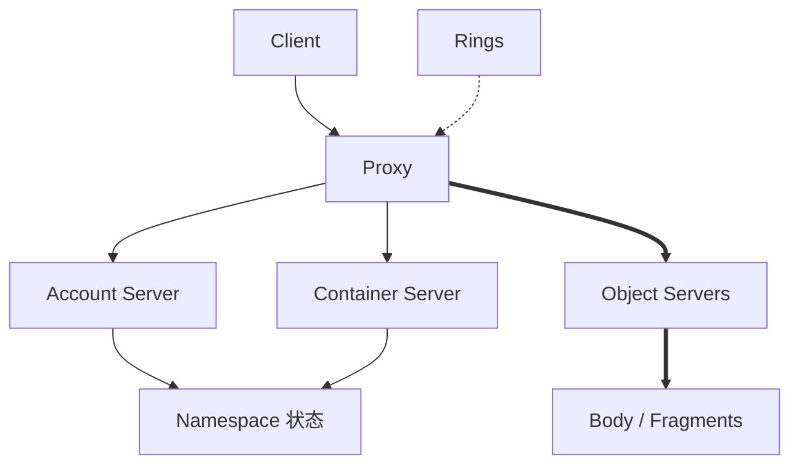
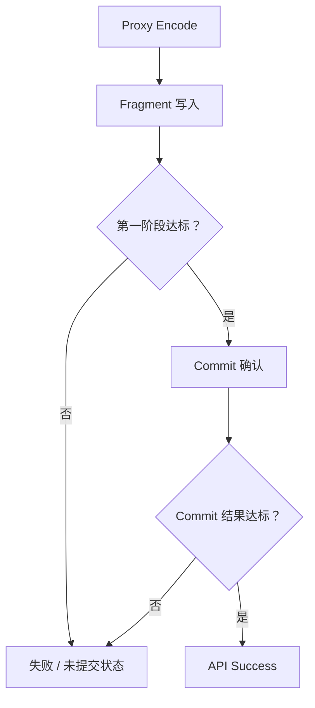

# OpenStack Swift：分开的 Namespace 职责与 Ring 驱动的收敛

## 页面定位与资料范围

沿用 [Comparison Framework](01-comparison-framework.md) 的三层证据与 [Ceph RGW](02-ceph-rgw.md)、[MinIO / AIStor](03-minio.md) 的十四节结构，检查 Swift 如何实现同一组对象存储问题。本篇研究原生 Object Storage v1 API、Replication / EC Policy 和常规磁盘后端，不讨论安装、特殊 Middleware 的完整契约或跨 Region 灾备方案。

**资料核对日期：2026-10-02。产品范围：OpenStack Swift 2.38.2；稳定系列：2026.2 Hibiscus；分支：`stable/2026.2`。** [官方发行索引](https://releases.openstack.org/hibiscus/index.html#swift) 列出这一稳定系列与发布版本。当前 [2026.2 文档](https://docs.openstack.org/swift/2026.2/) 显示 `2.38.3.dev1`，是稳定分支继续演进的文档构建，不表示 2.38.3 已正式发布；[latest](https://docs.openstack.org/swift/latest/) 显示 `2.39.0.dev76`，不作为本文稳定行为依据。

Architecture / Ring / EC 文档包含面向开发者的机制描述；关键布局、EC 提交和读取条件另与官方仓库 **2.38.2 tag** 的文档及少量对应源码核对。页面保留旧的 last-updated 日期，不意味着本篇用旧论文证明当前行为；同时也不将稳定分支上的新功能直接归到已发布 tag。来源性质和边界随节注明。

## 1. System Position

**产品事实：** Proxy 暴露 API，使用对应 Ring 定位资源并转发请求；对象正文经过 Proxy 流式传输。Account、Container、Object Server 分别承担不同持久状态职责。EC 的前台 Encode / Decode 在 Proxy 执行。[来源：Architectural Overview](https://docs.openstack.org/swift/2026.2/overview_architecture.html)、[2.38.2 同名文档](https://github.com/openstack/swift/blob/2.38.2/doc/source/overview_architecture.rst)。

图表示逻辑职责，粗线标出正文路径；不表示每次请求必须依次调用全部服务，也不规定它们部署在不同物理机器。

**通用映射：** Proxy 对应 Frontend / Data Proxy，Namespace 与正文有不同服务职责。**工程分析：** Swift Proxy 与 RGW 都是入口，并不使其后端同构：Swift 直接组合专门的 Account / Container / Object 服务，RGW 使用 RADOS 后端。诊断入口正常与数据完整需要不同证据。

## 2. Access Model

**产品事实：** 原生接口的 Namespace 为 Account → Container → Object；Account 定义 Container 范围，Container 定义 Object 名称范围，Object 包含正文和自定义 Metadata。[来源：Object Storage API Overview](https://docs.openstack.org/swift/2026.2/api/object_api_v1_overview.html)。S3 API 属于额外兼容接口层，不能把原生 Swift Account / Container 行为直接替换为 AWS Bucket 契约。

**通用映射：** 与 [Object Model](../03-object-storage/01-object-model.md) 的“命名范围 + 对象身份 + 正文 / Metadata”对应，不是文件目录或块地址。**工程分析：** 相似 Namespace 职责不表示权限、版本、条件请求和删除规则完全相同。本篇的读取与提交描述限定原生对象操作，不从接口名字反推所有兼容 Middleware 的行为。

## 3. Metadata

**产品事实：** Container Server 保存对象列表与统计，Account Server 保存 Container 列表；这些数据库按相应 Ring 分布和复制。常规 Object 后端保存正文文件及 xattrs 中的对象 Metadata；EC 还保存分片身份等系统信息。[来源：Architectural Overview](https://docs.openstack.org/swift/2026.2/overview_architecture.html)、[EC Metadata](https://docs.openstack.org/swift/2026.2/overview_erasure_code.html#metadata)。

| 状态范围 | 主要职责 | 不能推导的结论 |
| --- | --- | --- |
| Account Metadata / Container 列表 | Account Server、分布式数据库副本 | 不是全局单一 Metadata Database |
| Container Metadata / Object 列表 | Container Server、SQLite 数据库及其副本 | 列表记录不负责给出每份正文的物理位置 |
| Object Metadata / Body | Object Server、常规后端文件与 xattrs | Metadata 共置不等于列表同步提交 |

**通用映射：** 对应 [Namespace Metadata 与 Object Layout Reference](../08-consistency-metadata-partitioning/02-metadata-object-index.md) 的不同职责；Swift 使用 Ring 进行位置解析，而非让 Container Database 成为每份对象字节的位置目录。SQLite 是分散持久表示，不等于集中式数据库服务。

**工程分析：** LIST、统计与正文读取可能有不同热点和收敛窗口。对象文件存在不证明 Namespace 已更新，列表存在也不能独立证明正文来源有效。本篇不展开数据库 schema；Container Sharding 等扩展不应与后面的 Ring Partition 混为一层。

## 4. Partition / Placement

**产品事实：** Swift 对资源路径 Hash 取 Partition Index，再查 Ring 保存的 Partition → Devices 分配。Account、Container 和每个 Object Storage Policy 有各自 Ring；构建器输入包含 Device Weight 以及 Region / Zone / Server 故障域。运行中的 Server 加载分发后的 Ring，而不自行修改分配。[来源：The Rings](https://docs.openstack.org/swift/2026.2/overview_ring.html)、[2.38.2 Ring 文档](https://github.com/openstack/swift/blob/2.38.2/doc/source/overview_ring.rst)。

**Partition ≠ Object ≠ Replica ≠ Physical Device。** Partition 是 Keyspace 分组，一个 Device 承接多个 Partition 的成员位置；Replication Policy 的成员是副本，EC Policy 则须按分片位置解释，不能把 Ring 中“replica”用语都理解为完整正文副本。

**通用映射：** 参照 [Partition / Ownership / Routing](../08-consistency-metadata-partitioning/03-partition-ownership-routing.md) 与 [Placement](../07-data-protection/03-failure-domain-placement.md)。Ring 同时为运行时定位提供布局依据，但 Partitioning、Placement 和 Routing 仍是不同职责。

**工程分析：** Ring 与 CRUSH 都参与位置选择，前者使用构建并分发的分配结构，后者在 Ceph Map / Rule 基础上计算并结合实际成员状态。相似目标不等于相同算法、更新方式或协调协议；详细对照见 [综合比较](05-object-storage-cross-system-comparison.md)。故障域标签也只有与真实拓扑相符才有保护意义。

## 5. Data Protection

**产品事实：** Storage Policy 在 Container 创建时选择，对象使用该 Policy 的 Object Ring；Policy 类型包括 Replication 和 EC，也可以表达不同资源集合或服务配置。Account / Container 数据库使用自己的复制机制，不因正文 Policy 为 EC 就自动变成 EC。[来源：Storage Policies](https://docs.openstack.org/swift/2026.2/overview_policies.html)、[2.38.2 Policy 文档](https://github.com/openstack/swift/blob/2.38.2/doc/source/overview_policies.rst)。

**通用映射：** Storage Policy 是策略与资源范围的组合，**Storage Policy ≠ EC**。对照 [Replication](../07-data-protection/01-replication.md)、[EC](../07-data-protection/02-erasure-coding.md)、[Failure Domain](../07-data-protection/03-failure-domain-placement.md)。

**工程分析：** 同一服务内不同 Container 可以有不同保护输入和成本；不能用一个副本数描述全部 Metadata 与正文。Ring Builder 尝试在故障域分散成员，但权重、容量和拓扑可能使 Balance 与 Dispersion 冲突；不能因出现 Region / Zone 标签就断言所有区域故障均可承受。

## 6. Read Path

**产品事实：** 普通 replicated 对象 GET 由 Proxy 根据 Object Ring 和节点状态选择来源；2.38.2 的读取实现支持不同并发与来源选择条件，不能把 GET 写成永远向所有副本多数投票。EC GET 需要同一 Timestamp、不同 Fragment Index 的足够来源，并检查所需 durable 状态，再由 Proxy Decode 和返回。[来源：2.38.2 Object Controller](https://github.com/openstack/swift/blob/2.38.2/swift/proxy/controllers/obj.py)、[EC GET](https://docs.openstack.org/swift/2026.2/overview_erasure_code.html#get)。

高层路径为：Client → Proxy 身份 / Policy 解析 → Ring 定位 → Object Servers → 选择有效副本或组装 EC 输入 → Response。缓存、故障重试和请求参数会改变具体 RPC；这不是固定的每请求完整服务链。

**通用映射：** 复用 [Read / Write Path](../03-object-storage/03-read-write-path.md) 与 [Object Layout](../03-object-storage/06-object-layout.md)。**工程分析：** 分片数够用仍需确认属于同一对象状态，不能混合 g1 / g2 的编码输入。Proxy 是正文与 EC 计算成本的观察位置；某次读取成功不证明所有冗余成员均已修复。

## 7. Write Path

**产品事实：** Replication 文档描述多数结果条件；2.38.2 普通 replicated PUT 的 Controller 收集后端响应并经 Quorum / Response 逻辑决定结果，也会检查返回 ETag 是否相容。这不是仅从 Replica 数量推算出的 API 规则。[来源：Replication](https://docs.openstack.org/swift/2026.2/overview_replication.html)、[Object Controller](https://github.com/openstack/swift/blob/2.38.2/swift/proxy/controllers/obj.py)、[Response 逻辑](https://github.com/openstack/swift/blob/2.38.2/swift/proxy/controllers/base.py)。

普通 EC Policy 的开发者说明采用两阶段：先取得 `ec_ndata + 1` 份写入结果，再发 Commit，并等待相应成功 Commit 响应。这里限定不额外复制 EC Fragments 的普通配置；不能将该符号条件当作所有 EC 扩展配置的固定阈值。[来源：EC Multi-phase Conversation](https://docs.openstack.org/swift/2026.2/overview_erasure_code.html#multi-phase-conversation)、[2.38.2 EC 文档](https://github.com/openstack/swift/blob/2.38.2/doc/source/overview_erasure_code.rst)。

这是普通 EC 提交依赖示意，不是 Consensus 算法或后台修复状态机。图中的 durable 是 Swift 分片提交资格，不能直接翻译成任意硬件故障下的绝对持久保证。

**通用映射：** 写入分片、提交状态和成功响应是不同边界；失败或响应丢失仍可能留下部分效果。**工程分析：** 本文材料明确了应用层结果与 EC 状态条件，但没有完整覆盖所有设备缓存、Flush、后端插件和断电条件，**公开资料不足以得出更精确 Durability Commit 结论。** 也不能把 PUT 成功解释为所有 Container / Account 记录和异地状态已同步完成。

## 8. Consistency Boundary

**产品事实：** Architecture 的 Updater 示例明确区分 PUT 成功后对象可读，与未能及时完成的 Container Listing 更新；失败更新会排队等待处理。Replication 文档说明故障可使独立副本分歧，后台再收敛。对象覆盖与删除使用 Timestamp / Tombstone 表达状态。[来源：Architectural Overview](https://docs.openstack.org/swift/2026.2/overview_architecture.html#updaters)、[Replication](https://docs.openstack.org/swift/2026.2/overview_replication.html)。

| 观察范围 | 本篇能支持的边界 | 不应扩大成什么 |
| --- | --- | --- |
| 正常 PUT 后按名称读对象 | 官方示例说明成功后可读 | 任意失败、分区与并发条件下均 Linearizable |
| Container Listing | 更新失败 / 高负载时可能滞后 | 与对象正文一个原子事务 |
| Account / Container 列表与统计 | 独立副本及更新 / 复制路径 | 全系统固定时间内同步 |
| 并发覆盖 / DELETE | Timestamp 判定与 Tombstone 传播 | 按客户端 ACK 到达顺序建立全局共识 |

**通用映射：** [Observable State](../08-consistency-metadata-partitioning/01-consistency-observable-state.md) 要按操作看状态。**工程分析：** “Swift eventually consistent” 是系统概括，不能替代以上具体边界；同样，正常路径可读也不能覆盖所有异常。Last-write-wins 应在产品 Timestamp 规则中理解，而非“谁的响应最后到客户端谁赢”。删除标记用于防止旧状态复活，不是永久保留的 API Version ID。

## 9. Failure Recovery

**产品事实：** Replicator 对比并同步副本；EC Reconstructor 从足够存活输入重建缺失 Fragment；Updater 补做失败的 Namespace 更新；Auditor 检查本地状态并隔离损坏。[来源：Replication](https://docs.openstack.org/swift/2026.2/overview_replication.html)、[EC Reconstruction](https://docs.openstack.org/swift/2026.2/overview_erasure_code.html#reconstruction)、[Architecture](https://docs.openstack.org/swift/2026.2/overview_architecture.html)。

| 恢复问题 | 对应职责 | 完成边界 |
| --- | --- | --- |
| 副本内容 / 删除状态分歧 | Replicator 比较、传递合格状态 | 同步一次不证明全集群无缺口 |
| EC Fragment 缺失或无效 | Reconstructor 重建并送达 | 重建输入必须相容，字节搬完仍需合法状态 |
| Namespace 更新失败 | Updater 推进待处理记录 | 正文恢复不能替代列表收敛 |
| 来源损坏 | Auditor 检测 / 隔离，保护路径补回 | Detection ≠ Repair |

**通用映射：** 对应 Detect → Compare State → [Repair / Rebuild](../10-recovery-operations-observability/02-repair-rebuild.md) → Verify / Converge。**工程分析：** 这些职责协作，不是一个统一的“修复对象服务”；EC Reconstruction 与普通 Replica Copy 的来源 I/O、CPU 和资格判断不同。本篇不规定所有失败都立即大规模重建。

## 10. Rebalance / Expansion

**产品事实：** 加入 Device、调整 Weight 后，Ring Builder 可产生新的 Partition Assignments；Ring 分发后被服务加载。副本同步和 EC 重建 / Handoff Reversion 根据目标布局推进内容收敛。[来源：The Rings](https://docs.openstack.org/swift/2026.2/overview_ring.html)、[Replication](https://docs.openstack.org/swift/2026.2/overview_replication.html)、[EC Reconstruction](https://docs.openstack.org/swift/2026.2/overview_erasure_code.html#reconstruction)。

**通用映射：** Ring Rebalance 是布局规划，Actual Data Movement 是后续执行；关联 [Rebalance](../10-recovery-operations-observability/04-rebalance.md) 与 [Online Data Migration](../10-recovery-operations-observability/05-data-migration.md)。**工程分析：** Placement Map Updated ≠ All Data Already Moved。短期内旧位置、目标位置与 Handoff 来源可能共存，应检查收敛与容量，而非只看 Ring 文件已更新。权重平衡的是分配目标，不直接证明请求负载或字节使用量均匀。

## 11. Integrity

**产品事实：** Auditor 检查本地对象 / 数据库状态并 Quarantine 损坏；2.38.2 常规 DiskFile 的完整读取检查长度与 MD5 / ETag 对应关系。EC 必须区分原始对象摘要与 Fragment Archive 的校验范围。[来源：2.38.2 Auditor](https://github.com/openstack/swift/blob/2.38.2/swift/obj/auditor.py)、[DiskFile](https://github.com/openstack/swift/blob/2.38.2/swift/obj/diskfile.py)、[EC Metadata](https://docs.openstack.org/swift/2026.2/overview_erasure_code.html#metadata)。

**通用映射：** 对应 [Checksum Scope](../07-data-protection/04-checksum-data-integrity.md) 与 [Scrubbing / Integrity Repair](../10-recovery-operations-observability/07-scrubbing-integrity-repair.md)。这是特定后端的 MD5 使用事实，不是把任意产品 ETag 定义成通用 Checksum。

**工程分析：** Quarantine 排除不合格来源，Replicator / Reconstructor 才参与补回保护；Auditor 不负责独立完成全部恢复。局部扫描、Range 读取或某类轻量检查，不能当作整对象与所有 Namespace 的完整证明。没有可信其他来源时，也不能靠“自动修复”创造正确字节。

## 12. Operations / Observability

**产品事实：** Recon 可提供磁盘使用、Ring 校验值、Quarantine、Replication / Reconstruction 与 Updater / Auditor 信息；Swift 还提供运行 Metrics 和带 Transaction ID 的请求日志。[来源：Administrator Guide](https://docs.openstack.org/swift/2026.2/admin_guide.html#cluster-telemetry-and-monitoring)、[Logs](https://docs.openstack.org/swift/2026.2/logs.html)。具体采集取决于启用的 Middleware 与配置。

**通用映射：** 对照 [Observability Signals](../10-recovery-operations-observability/09-observability-signals.md)，关联请求证据与后台状态。**工程分析：** Ring 校验值一致能证明加载材料一致，不证明搬迁已完；Updater backlog 与正文 Repair backlog 也不是同一个风险。Operator 需要同时观察容量、更新积压、复制 / 重建、校验结果和 API 表现，而非期待单一健康数字涵盖全部状态。

## 13. Performance Implications

以下全部为**工程分析**，不构成官方性能结论。

| 架构决策 | 潜在成本位置 | 需要验证的条件 |
| --- | --- | --- |
| Proxy 流式代理正文 | CPU、网络、连接与 Buffer | 请求大小、入口并发、节点分布 |
| 分开的 Namespace 服务 | 数据库 I/O、Metadata 请求与热点 | LIST 比例、Container 分布、缓存与更新积压 |
| Ring 本地布局查找 | Hash / Map 成本及布局材料维护 | Ring 规模、更新与实际请求拓扑 |
| Replication / EC | 网络 Fan-out、EC Encode / Decode 与等待 | Policy、失败成员、相容来源 |
| Replication / Reconstruction / Audit | 设备、网络和 CPU 共享资源 | 后台预算、保护缺口、前台 P99 |

不同职责可以形成不同扩展边界，也增加状态关联与运维责任。按 [End-to-End Cost Model](../09-data-path-performance/01-end-to-end-cost-model.md) 定位，再用 [Benchmark 方法](../09-data-path-performance/03-benchmark-bottleneck-analysis.md) 验证，不能由 Proxy Hop 或服务数量直接决定谁快。

## 14. Mapping Back to Generic Model

| 通用模型 | OpenStack Swift 对应概念 | 是否完全等价 |
| --- | --- | --- |
| Object | Account / Container 下的 API Object、后端文件 / Archives | 否，API Object 与 Fragment 不同粒度 |
| Metadata | Account / Container DB、Object Metadata / xattrs | 部分对应，分散职责不是单一集中数据库 |
| Partition | Ring 的 Keyspace Partition | 对应分组，不等于 Object 或 Container Shard |
| Placement | Ring Builder 分配与 Ring 布局 | 部分对应，不等于 CRUSH / PG / Erasure Set |
| Routing | Proxy 用相应 Ring 定位并选择节点 | 对应请求职责，不等于后台布局规划 |
| Failure Domain | Ring 的 Region / Zone / Server / Device | 对应思想，保障受拓扑与容量条件限制 |
| Replication | Object / DB 副本与同步 | 对应机制，不代表所有副本同步 ACK |
| EC | EC Policy、Segments / Fragments / Archives | 对应机制，编码粒度不等于 Multipart Part |
| Repair | Replicator / Reconstructor 与资格检查 | 部分对应，Updater 还处理不同状态缺口 |
| Rebalance | Ring 重分配与后续数据收敛 | 部分对应，更新 Map 不是搬完数据 |
| Integrity | Auditor / DiskFile 校验 / Quarantine | 部分对应，Detection 不等于已 Repair |
| Observability | Recon、Metrics、Transaction Logs、后台状态 | 对应证据维度，不是完整 SLO 的同义词 |

## 官方资料与核对记录

资料核对日期：**2026-10-02**。基准：**2026.2 Hibiscus、Swift 2.38.2 tag**；可读资料使用 `/swift/2026.2/` 稳定系列文档。其 `2.38.3.dev1` 构建号和 `latest` 的开发号均不当作已发布版本。源码仅用于核对普通 PUT 的结果条件、读取与校验范围，不展开实现教程；EC 开发者说明用于解释分片提交状态，不等于承诺所有后端与设备的精确断电行为。

下一篇：[Object Storage Cross-system Comparison](05-object-storage-cross-system-comparison.md)。[MinIO](03-minio.md) · [比较框架](01-comparison-framework.md) · [返回专题入口](README.md)。
