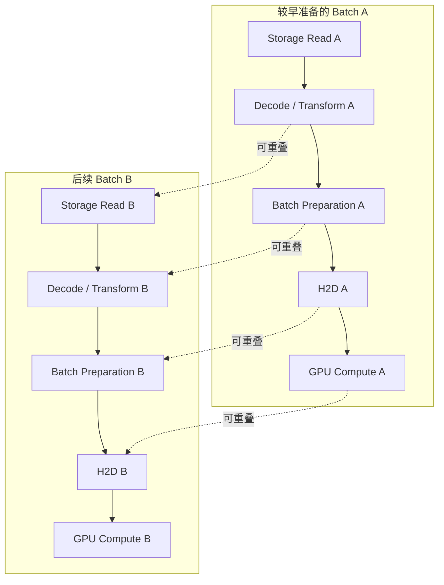

# Training Data Path：存储字节怎样成为 GPU 可消费的 Batch

[Workload Model](01-ai-storage-workload-model.md) 区分了 Dataset、Weight 和 Training State。本篇只追踪训练输入：**数据从长期存储出来以后，还要经过哪些准备与传输，GPU 才能执行下一步？** 对象 GET 快，并不证明 batch 能及时就绪。

## 1. 先画逻辑链，不指定唯一架构

一种常见的 Host-mediated 输入逻辑链是：

1. Object / Distributed Storage：保存源数据与版本。
2. Dataset Representation：按样本、文件或 shard 组织并解释数据。
3. File / Streaming Access Layer：提供路径、范围读取、流或对象客户端访问。
4. Cache / Local Storage：可选的复用与暂存层。
5. Dataset / DataLoader Workers：选择并获取当前需要的样本。
6. Decode / Transform / Collate：解码、变换并组织 batch。
7. Host Memory：容纳准备过程的输入与输出。
8. Pinned Host Memory：适用时作为更适合 H2D 的主机缓冲。
9. Host-to-Device Transfer：将 batch 送入 GPU Memory。
10. GPU Training：消费 batch 并执行计算。

这是职责链，不是所有框架必经的十个独立服务或严格调用顺序。Decode 常与 Host Memory 分配交错，Representation 也可能由 Dataset 代码解释；直接流式读取可以不经过本地磁盘，分布式文件系统可以承担读取层，对象 Connector 可以由应用直接调用。分析时应补上实际经过的 Cache、Copy 和等待边界，复用 [End-to-End Cost Model](../09-data-path-performance/01-end-to-end-cost-model.md)。

## 2. Dataset Sample ≠ Object / File

Sample 是应用逻辑单位，Object / File 是存储访问单位。一个对象可以保存一个 sample、多个 samples，或作为一个 shard；一个 sample 也可能依赖多个对象，例如图片和标注。Dataset Shard 不是对象存储内部 Unit、Multipart Part 或 EC Fragment，内部布局见 [Object Layout](../03-object-storage/06-object-layout.md)。

| 表示选择 | 可能减少什么成本 | 新增或保留什么代价 |
| --- | --- | --- |
| Many Small Objects / Files | 可精细选择样本，读取和重试范围较小 | Metadata / request overhead、高请求率、难摊薄固定成本；依发现方式产生 LIST / namespace 压力 |
| Large Shard | 顺序传输与批量读取更容易摊薄请求成本 | 随机定位依赖索引；可能 over-read，失败重试粒度更大，shuffle 更复杂 |
| 带索引的 shard / Range Access | 可以只取得相应样本范围 | 索引要与正文版本相容；压缩格式、请求范围和内部粒度仍会影响实际读取 |

**通用示意：**若每个 batch 要读取许多独立小对象，即使总正文不大，仍可能等待多次索引和请求调度。把样本打包能减少请求数，但随机挑选分散样本时，客户端若必须下载完整 shard，又会搬运大量不用的字节。选择取决于访问局部性、格式与索引、缓存、重试范围和 shuffle 要求，没有固定最佳 Shard Size。

LIST 压力也不是每次 batch 的必然成本：预先形成的 Dataset Manifest 可以限定集合与版本，避免每个 Worker 重复扫描命名空间。但 Manifest 自身要有效，不能把旧索引与新正文混用；对象身份复用 [Object Model](../03-object-storage/01-object-model.md)。

## 3. File-like Access Layer 是语义转换与数据路径的一部分

AI Framework 常期待 file-like / dataset-like access，源却可能是 Object Storage。中间层可以提供 filesystem interface、FUSE、CSI-mounted access、local cache、dataset runtime，或者直接使用 application object client。CSI 主要连接卷的提供与挂载，不代表它本身实现逐次数据读取或缓存。

这些形态解决的是“上层怎样找到、读取并复用样本”，可能承担范围读取、缓存身份、访问并发与错误映射。挂载出来像文件，不自动把底层对象协议变成完整文件系统事务，也不保证降低复制次数。直接调用对象客户端则把格式解释、读取范围和重试责任更多交给应用。应检查实际契约与路径，不按产品名称推断性能。

## 4. DataLoader：公开框架实例与通用存储推导分开

**资料范围：核对日期 2026-10-03（Asia/Shanghai）；PyTorch stable 文档入口在核对时指向 2.14。** 以下参数事实来自 [PyTorch 2.14：torch.utils.data / DataLoader](https://docs.pytorch.org/docs/2.14/data.html)，不是所有加载框架的统一接口。

DataLoader 提供 Dataset iteration、batching、multi-process loading、memory pinning 与预取控制；支持 map-style 和 iterable-style Dataset。`num_workers=0` 在主进程加载，正值指定加载子进程数；`prefetch_factor` 表示每个 Worker 提前加载的 batch 数，正 Worker 数时默认 2，零 Worker 时默认 None。`pin_memory=True` 对识别的 tensor batch 做主机内存 pinning；自定义 batch 类型需要相应支持。多进程 iterable Dataset 的各 Worker 副本需要正确划分输入，避免重复数据。

以上只说明读取组织边界，不提供 API 手册。参数如何改变资源消耗，属于下面的通用工程推导：

| 参数 | 对输入路径可能有帮助的原因 | 需要观察的限制 |
| --- | --- | --- |
| num_workers | 让 Storage Read、Decode / Transform 等准备工作有更多并行执行机会 | Storage、CPU 或 Metadata 饱和；进程开销、内存压力、重复缓存及连接数量 |
| prefetch_factor | 提前准备后续 batch，尝试隐藏 I/O / preparation latency | 预取占用、实际在途工作、浪费和有效等待；不能按参数推定底层请求数 |
| pin_memory | 为 Host → GPU Transfer 提供适用的 pinned buffer | pinning 的时间和容量、H2D 是否真在关键路径；不加速源存储读取 |

More Workers ≠ Always Faster。Worker 增加后，数据源若已到上限，更多并发可能只增加排队；CPU decode 已饱和时，多进程也可能扩大调度竞争。内存中的 Dataset 描述与每个 Worker 的运行状态还会消耗预算，不能把所有内存都算作有效缓存。

Prefetch 的定义与取舍复用 [Cache / Prefetch](../09-data-path-performance/04-cache-prefetch.md)。DataLoader 提前准备 batch 不等于对象层自动采用同样预取策略；对象 Connector、文件层和设备层若分别预取，应将额外字节与缓冲一起计入。并发与有界积压复用 [Batching / Backpressure](../09-data-path-performance/05-batching-backpressure.md)。

## 5. Pinned Memory ≠ GPUDirect Storage

在本篇 Host-mediated 模型中，普通 Host Memory 中的 batch 可复制到 Pinned Host Memory，再通过 H2D DMA 到 GPU Memory；实现也可以直接在合适缓冲中准备数据，未必总要单独做这一复制。

Pinned 指主机页锁定，不是 GPU Memory。它可以帮助 Host → GPU Transfer，但数据仍可能沿 **Storage → CPU / Host Memory → GPU Memory** 移动。DMA 不由 CPU 逐字节复制，不代表没有数据传输、映射或完成处理，复用 [Memory Copy / Zero-copy](../09-data-path-performance/07-memory-copy-zero-copy.md)。

内存 pinning 本身不保证 Copy 与 Compute 重叠：还需要异步提交、正确的执行依赖、硬件能力和缓冲生命周期。GPU 尚未取完时不能覆盖源 batch。缓存路径、提交 / 完成与持久化是不同维度，回看 [Direct / Async I/O](../09-data-path-performance/08-direct-async-io-device-path.md)。

后续 GPU Data Path 阶段再评估更直接面向 GPU 的存储路径；本轮不展开 GDS 实现、接口或 benchmark，也不把 pin_memory 当作其替代证明。

## 6. Pipeline Overlap：不同 Batch 重叠，而非一个 Batch 取消依赖

训练输入应该按 **Storage Read ∥ Decode / Transform ∥ Batch Preparation ∥ H2D ∥ GPU Compute** 的流水线理解。下图是无真实时间刻度的调度示意，同一列方向表达 batch 自身依赖；虚线连接在依赖、资源和缓冲允许时可尝试同时执行的工作：

虚线表示重叠候选关系，不是数据或调用依赖；实际运行不必严格按图对齐。理想目标是下一 batch 在 GPU 需要时已经准备好，减少 GPU waiting for data。只让某一层瞬时最快，若下层消费不足或缓冲无界，可能增加驻留与竞争而没有进度收益。

**瓶颈算术示意，非实测：**将处理能力统一换算为相同有效源数据口径，Storage 能持续提供 5 GB/s，CPU Decode 只有等价 2 GB/s，且不受其他资源限制。Storage 提升至 10 GB/s 仍不会让 GPU 数据供给翻倍；限制在 Decode。压缩源字节与解码 tensor 字节不能直接按这一比值比较。

在稳定、阶段可重叠且有足够缓冲的简化模型中，持续 batch 供给受最慢阶段能力约束；单 batch 首次完成仍要经过其依赖链。若 H2D 或 GPU Compute 已是限制，继续提高对象读取能力收益可能很小；Decode 优化后，瓶颈又可能转到网络或 H2D。这是 Bottleneck Shift，应按 [Benchmark](../09-data-path-performance/03-benchmark-bottleneck-analysis.md) 重新验证，而不是沿用旧诊断。

## 7. Distributed Training：只看读取分工与共享资源

多个 Rank / GPU 可以读同一逻辑 Dataset、不同 shards 或重叠热数据。相应问题是 fan-out、cache duplication、Metadata Pressure 与 Network Contention；全局 shuffle 不保证每节点具有良好本地复用。

Sampler / Sharding 在这里用于解释数据范围如何分配给 Rank / Worker，不展开训练通信算法。逻辑分工不等于底层请求完全不重叠：即使 samples 不重复，多个 Rank 仍可能读取同一 shard 的不同范围，或同时重填相同节点缓存。

一种架构可以让节点内共享有效 cache；另一种可以按数据范围安排消费者。前者需要共享与版本约束，后者需要考虑 shuffle 和任务调度。两者都不自动消除 Cold Start fan-out，也不能为了提高 Cache Hit 改变应用所要求的数据集合和消费语义。

## 8. Benchmark：对象服务与训练端到端回答不同问题

| 证据 | 测量边界与解释 |
| --- | --- |
| DataLoader wait time | 训练循环等待取得下一 batch 的时间；与 GPU 是否同时做其他工作一起判断 |
| Batch preparation latency | 样本取得、Decode / Transform / Collate 的范围与分布；区分 queue 和执行 |
| GPU idle due to input | 通过时间线将空闲归因于输入依赖；不能用所有 GPU idle 代替 |
| Effective samples / tokens per second、step time | 记录实际完成进度、有效 token 口径和 step 范围；保持工作负载相同 |
| Cache Hit | 标明层级、request / byte 口径和版本；记录预取有用量与浪费 |
| Storage throughput / request rate | 成功有效读取与实际内部字节分开；同时记录 Retry、错误与 Metadata |
| CPU utilization / memory | Worker、Decode 热点、进程和 pinned buffer 压力，不只看节点平均 |
| Network / H2D transfer | 分别记录节点链路与 Host → Device 时间、字节和重叠情况 |

Object Storage Benchmark 能隔离对象接口的请求处理与读取能力；Training End-to-End Benchmark 才能验证输入路径改善是否缩短 step、提高有效供给。两者应相互解释，不能互相替代。

固定 Dataset 版本与 representation、batch、Rank / Worker 数、变换流程、模型和硬件，再分开测 Cold / Warm、启动 / 稳态与有无 Checkpoint 干扰。一次主要改变一个因素并对齐窗口，避免把更少训练工作、更多无效预取或不同缓存状态误称存储优化。

## 来源与适用边界

- [PyTorch stable：torch.utils.data](https://docs.pytorch.org/docs/stable/data.html)：核对时重定向到 **2.14**；版本固定来源见 [2.14 DataLoader / 数据加载文档](https://docs.pytorch.org/docs/2.14/data.html)。核对日期：**2026-10-03**。
- 参数事实来自该官方文档；流水线、瓶颈算术、共享资源与测量表是通用存储工程推导，不是 PyTorch 性能承诺
