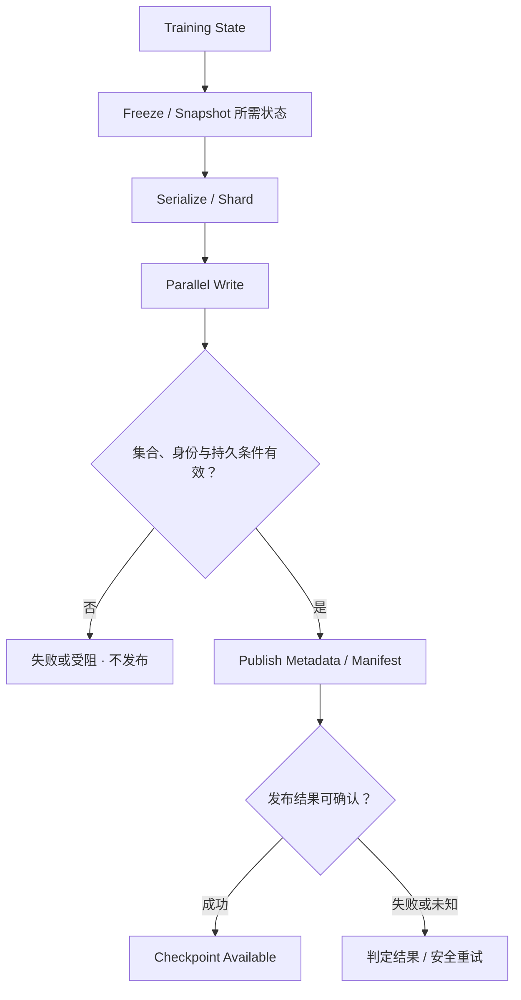

# Model Weights / Checkpoints：加载模型与恢复训练是两种路径

[Training Data Path](02-training-data-path.md) 讨论持续输入。Model Weights 在启动和扩容时集中读取，Checkpoint 在训练中形成恢复点、失败后重建运行状态。它们可能共享存储，却有不同访问模式、完成条件和验证目标。

## 1. Weight Loading 不等于 Dataset Streaming

已发布 Model Weights 通常是部署需要的持久状态：Read-mostly、可能大范围读取、多消费者，访问集中在 Model Load、启动和 Scale-out。Dataset Streaming 关注长期供给 batch；Weight Loading 更关心实例什么时候真正 Ready。Steady-state request path 与 model loading path 应分别测量。

一种可能路径是 **Object / Shared Storage → Node Cache → Process / GPU**；也可直接加载共享存储、使用本地预置材料，或按需取得相关 shard。Process 阶段可能包含格式解释、反序列化、内存分配和 GPU 加载，源端下载结束并不代表实例已经可服务。

多个新 Worker 同时下载相同权重可能形成 Thundering Herd / Fan-out，使模型扩容成为 Storage / Network problem。按每个 Worker 单独测得的加载速度，不能预测共享源、链路和 Metadata 同时承载全部实例的能力。

Node Cache 可以复用已有版本，减少重复远端字节；但应绑定正确模型身份、版本与格式，检查可用容量，并协调同一内容的并发填充。冷节点和缓存失效仍会重新访问主来源。预热、请求合并和限并发各有资源与启动时间代价，复用 [Cache / Prefetch](../09-data-path-performance/04-cache-prefetch.md) 与 [Batching / Backpressure](../09-data-path-performance/05-batching-backpressure.md)，不指定唯一加载架构。

## 2. Logical Model ≠ Single File ≠ Single Object

大型逻辑模型可以由多个 weight shards 组成，不同 Rank 可能读取不同部分，也可能存在共享部分。元数据或 Manifest 需要说明哪些 shards 共同构成哪个已发布模型，以及其状态身份、格式与重建关系；不要求每个格式都使用一个名为 manifest 的独立文件。

**通用示意：**模型 M1 的目录引用 shards a1、b1。发布 M2 时，如果只覆盖 a 为 a2，却让加载者沿旧目录读取 b1，文件都能打开也不证明组合是合法模型。应通过稳定版本引用及正确发布边界选择相容集合，沿用 [Object Model](../03-object-storage/01-object-model.md) 和 [Read / Write Path](../03-object-storage/03-read-write-path.md)。

Storage Shard、模型参数分布和底层对象单元不是同一个边界。本篇仅解释多部分读取与 Metadata 责任，不展开 Tensor / Pipeline Parallel 算法。

## 3. Checkpoint 回答“恢复到哪个 Training State”

Checkpoint 通常可能包含 model state、optimizer state、scheduler / training progress 和 distributed metadata。按恢复语义，还可能需要随机状态、数据读取进度、Dataset 版本与运行配置等依赖。具体内容取决于 Framework 与应用保存范围，不声称所有格式相同，也不声称每次恢复都能位级复现。

只保存 weights 可以支持某些部署或重新开始训练；若目标是延续原训练进度，仅有 weights 未必够。恢复点应声明“保存了哪个进度、哪些状态、接受什么缺口”，与 [Backup / Restore](../07-data-protection/07-backup-restore.md) 的恢复材料范围一致。

## 4. PyTorch Distributed Checkpoint：框架事实的限定范围

**资料范围：核对日期 2026-10-03（Asia/Shanghai）；PyTorch stable 入口在核对时指向 2.14。** [PyTorch 2.14：torch.distributed.checkpoint](https://docs.pytorch.org/docs/2.14/distributed.checkpoint.html) 官方文档说明 DCP 支持多 Rank 并行 save / load、加载时 resharding，可从一种集群拓扑保存后在另一种拓扑加载。它生成多个文件，并使用预先分配的目标状态存储；跨 PyTorch 版本的保存状态不保证向后兼容。具体格式、planner 与 storage backend 仍有适用条件。

该文档的 async_save / staging 说明区分状态暂存与保存：默认暂存到 CPU Memory，再在独立线程保存；staging 需要形成不被后续训练修改的表示。文档也分别描述 staging completion 和 upload completion。实际等待接口须按所用版本与配置核对，不把函数开始执行当作保存完成。

这些产品事实映射到以下通用 Storage 问题，而不是 DCP API 教程：

| Framework 能力 | 对应存储问题 |
| --- | --- |
| 多 Rank 保存本地状态部分 | Sharded State、Parallel Write、总并发与共享资源预算 |
| 多文件共同表达恢复状态 | Metadata Coordination、身份相容与完整集合判断 |
| 加载时改变分布 | Metadata 与读取计划必须足以重建逻辑状态；旧 Rank 文件名不应是唯一语义 |
| Staging 与后台保存分离 | Buffer Lifetime、状态稳定性、完成与远端保护边界 |

后文的 Verify / Manifest / Publish 模型是通用设计约束，不声称 PyTorch 对任意对象存储自动提供多对象原子事务、统一校验或跨区域 Durability。

## 5. Checkpoint Write Path：Bytes Written ≠ Checkpoint Committed

一种逻辑模型如下；实现可以合并、流水化或采用等价协议，不要求每个框对应独立服务：

Freeze / Snapshot 的目标是得到声明训练边界的稳定状态，不要求整个训练必须一直停机。分布式状态要按 Framework / 应用的合法边界相容，不能让某 Rank 保存一步之前的 optimizer，而另一个保存不相容的新 model state。保持各缓冲不受后续修改，复用 [Memory Copy / Buffer Lifetime](../09-data-path-performance/07-memory-copy-zero-copy.md)。

Parallel Write 把各部分写到相应存储。Verify 至少需要判断材料集合、身份与格式相容、必要完整性及约定持久条件；具体校验范围取决于实现，不宣称任何 Framework 都自动提供端到端 Checksum。**Data Ready ≠ Metadata Published**，且 Metadata 本身也必须可恢复。

发布步骤使读者能选择一个完整恢复点。可以用独立 checkpoint 身份写候选材料，再发布相容 Manifest / Catalog；底层单对象成功不自动提供跨对象事务。不能靠 LIST 中“看到了很多文件”替代完成依据，也不能无条件用目录 rename 推定对象存储具有原子目录切换。

## 6. 部分 Rank 成功、部分失败时怎样解释

设 checkpoint C1 已完成，候选 C2 包含 Rank A / B 的状态。这是通用故障示意，不是实际格式：

| C2 所处位置 | 恢复选择与责任 |
| --- | --- |
| A 写完，B 尚未成功 | C2 不是完整恢复点；保留 C1；不得将 A 的新状态与 C1 的 B 状态拼接 |
| 全部候选字节写完，校验或持久条件未满足 | 仍不能发布；传输进度不证明可恢复 |
| 候选材料有效，Manifest 尚未发布 | Data Ready，但读者尚无已完成恢复点依据 |
| Publish 已成功，响应丢失 | 结果未知需要按 checkpoint 身份判定，不能仅凭超时删除可能已提交材料 |
| C2 已有效发布并满足所选故障域目标 | 可以选择 C2；旧点的清理另按保留和依赖要求处理 |

重试应沿用明确的候选身份，并避免残留文件被另一保存尝试错误采纳；旧执行者也不能覆盖较新合法完成状态。任务协调与修改资格复用 [Retry / Idempotency](../06-distributed-systems/03-retry-idempotency-deduplication.md) 和 [Repair / Rebuild 的准备、验证、发布边界](../10-recovery-operations-observability/02-repair-rebuild.md)。Checkpoint Restore 是恢复某个训练进度，不是 Repair 当前存储副本。

## 7. Periodic Burst 与 Training Interference

Checkpoint 保存可能与 GPU compute、输入读取同时进行，产生 CPU 序列化、Device → Host staging、网络、Storage Write 与 Metadata 竞争。同步保存也可能直接暂停应用。它属于训练主流程的一部分，不能只因远端写发生在独立线程，就认定可以无限降低其优先级。

| 可考虑的方向 | 需要承担的边界 |
| --- | --- |
| Rate / Concurrency Control | 减轻共享路径突发，但延长保存完成滞后；字节限速不覆盖全部 Metadata / CPU 成本 |
| Async Checkpoint | Compute 可以较早继续；后台工作仍竞争资源并可能失败 |
| Staging / Local Buffer | 稳定状态并吸收突发；消耗 CPU / 内存 / 本地容量且需管理生命周期 |
| Local Durable Stage 后 Remote Write | 可分层完成，但只覆盖本地故障承诺；节点丢失可能连同暂存材料一起丢失 |
| 直接 Remote Write | 减少本地驻留层，仍受共享源、目标、网络和写入完成条件限制 |

这些是可组合的设计方向，不是唯一最佳架构。按 [Foreground / Background Interference](../09-data-path-performance/06-foreground-background-interference.md) 同时观察输入等待、step time、保存暂停及真正完成滞后。异步队列必须有界；新 checkpoint 生成快于写出能力时，堆积不会因为应用恢复 compute 而消失。

## 8. Async Started ≠ New Durable Recovery Point Available

**Application resumes compute ≠ Checkpoint already durable remotely。** 节点内 staging 完成后继续训练，远端写入、验证与发布仍可能未完成。若目标是应对整个 Job / 节点丢失，此时最近可用点可能仍为上一次完成的 C1，而不是已经开始的 C2。

**时间线示意：**C1 已远端完成；训练推进并开始 C2；C2 本地暂存结束、compute 继续；远端保存尚未完成时节点失败。恢复能否使用 C2，取决于 surviving material 与可判定的提交状态；不能从“异步调用已返回”推断它可恢复。若它不满足目标，回到 C1 并重算后续进度。

这与 [Local Commit ≠ Remote Protection Complete](../07-data-protection/06-cross-region-protection.md) 相似。保存到指定 backend 的完成事件，也不能凭名字推出跨 Region 保护已完成；可用恢复点必须带上故障域与保护范围。保留旧点时，不应仅因新点开始就删除最后一个有效点。

## 9. Checkpoint Frequency：Recovery Cost 与 Runtime Cost

更频繁保存，通常减少从最近完成点之后丢失的 Training Progress，却增加 I/O、Network、Capacity 和训练干扰。实际进度损失应从**最近有效完成点**计算，不是从最近一次开始保存计算。

保存过密而完成太慢时，积压、staging 驻留和竞争可能让最新有效点更落后。减少频率可以释放资源，却增加失败后的重算成本。选择应考虑故障风险、每步训练成本、保存与 Restore 耗时、保留依赖和容量目标，不给“每 N 分钟”的通用建议。

## 10. Restore Path：Checkpoint Exists ≠ Restart Is Fast

Restore 的逻辑链是 **Select Valid Checkpoint → Read Manifest / Metadata → Load Shards → Verify → Reshard if Needed → Reconstruct Runtime State → Resume Training**。阶段可以交错或并行；目标是恢复声明的可用状态，不只把文件下载到节点。

| 阶段 | 主要限制与必须证明的事情 |
| --- | --- |
| Select / Metadata | 完成依据、版本、所需依赖与权限有效；不选择半成品 |
| Load Shards | 相容材料可读，fan-out、Storage / Network 与 Metadata 能承载集中恢复 |
| Verify | 格式、身份与所需完整性有效；文件存在和长度相同不够 |
| Reshard if Needed | 逻辑状态能映射到当前 Rank 分布；读取与协调成本取决于拓扑及格式 |
| Reconstruct Runtime State | 反序列化、CPU / GPU 内存与加载，以及 optimizer / progress 等依赖有效 |
| Resume / Validate | 能继续所选训练进度；记录接受的缺口与实际恢复耗时 |

并行 Restore 可以提速，也可能同时耗尽源存储和共享网络；一个慢必要 shard 可能阻塞全部 Rank 就绪。所有 shards 下载结束后仍可能等待反序列化、重分片或 GPU Loading，因此 Checkpoint exists ≠ Fast Restore。

按 [Benchmark / Bottleneck Analysis](../09-data-path-performance/03-benchmark-bottleneck-analysis.md) 分开记录 Save Pause、Staging Time、Durable Completion Lag、Restore Time 与 Lost Progress，在声明环境和恢复目标下验证实际可用性。复用 [Backup / Restore](../07-data-protection/07-backup-restore.md) 的恢复测试原则，不把 save 成功替代恢复证据；本轮不新增 Failure Drill 实现。

## 来源与第一阶段边界

- [PyTorch stable：Distributed Checkpoint](https://docs.pytorch.org/docs/stable/distributed.checkpoint.html)：核对时指向 **2.14**；固定版本来源为 [PyTorch 2.14 DCP](https://docs.pytorch.org/docs/2.14/distributed.checkpoint.html)，包括多 Rank、load-time resharding、async_save 与 staging。核对日期：**2026-10-03**。
- 仅第 4 节是上述 Framework Fact；权重加载模型、Manifest / Commit、故障表、资源取舍与 Restore 阶段是通用工程推导，不描述具体产品内部协议。

第一阶段形成 **Workload → Data Supply → Durable Training State**。GPU Direct Path 和 Inference KV Cache 只保留后续规划，不在本篇展开。

[AI Storage Workload Model](01-ai-storage-workload-model.md)
