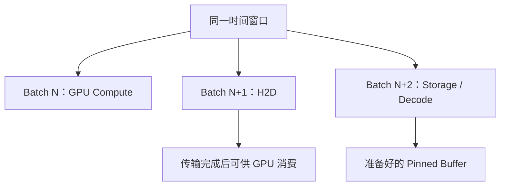

# Host / GPU Memory Data Path：跨过内存边界，而不只提高存储吞吐

[Training Data Path](02-training-data-path.md) 已经把输入拆为读取、准备、传输与计算。本篇追问：**字节在哪种内存中，谁能访问，什么时候可以消费或重用？** 这些边界决定 Host Staging 的成本，也决定下一篇 GDS 能省掉哪一段。

## 1. 传统路径是职责链，不是固定 Copy 次数

一种常见逻辑链为：Storage → Kernel / Filesystem / Storage Client → Host Memory → Pinned Host Memory → PCIe / DMA → GPU Memory → GPU Compute。

这里把内存位置和处理职责放在同一条链上，并不表示每个箭头都是一次复制。Cache Hit 可以避开远端读取；Direct I/O 可以改变内核缓冲路径；远程文件系统、对象客户端和 Dataset Cache 的路径也不同。准备过程可以直接使用合格的 pinned buffer，或者先在 pageable buffer 中 decode，再复制到 pinned buffer。必须画出实际实现，才能统计 Copy、Memory Traffic 和等待。

| 边界 | 应查明什么 | 容易遗漏的成本 |
| --- | --- | --- |
| Storage → Host | 谁发请求，正文落在哪个 buffer，是否命中缓存 | 内核 / 客户端缓冲、网络接收、读取排队 |
| Host 准备 → Pinned Buffer | 原地准备、注册已有内存，还是另行复制 | Decode、collate、分配 / 注册与额外内存流量 |
| Pinned Host → GPU | DMA 路径、队列、完成与依赖 | PCIe 流量、在途 buffer、GPU 等待 |
| GPU Memory → Compute | 输入是否完整、GPU 是否已取得可见的结果 | 同步、运行时调度与计算自身的瓶颈 |

基础定义复用 [Memory Copy / Zero-copy](../09-data-path-performance/07-memory-copy-zero-copy.md) 与 [Direct / Async I/O](../09-data-path-performance/08-direct-async-io-device-path.md)：Zero-copy ≠ 字节完全不移动；Direct I/O ≠ Zero-copy；DMA ≠ 没有 Memory Traffic。

## 2. Pageable、Pinned 与 GPU Memory 是不同概念

**官方资料范围：核对日期 2026-10-03（Asia/Shanghai）；CUDA C++ Best Practices Guide 与 Runtime API 的当前文档标为 13.4。** 本篇只引用主机内存与异步传输语义，不提供 CUDA 编程或安装教程。

| 内存 | 本篇关注的性质 | 不能由名称推出什么 |
| --- | --- | --- |
| Pageable Host Memory | 普通主机内存，由 OS 按相应机制管理；物理页可被换出或迁移，虚拟地址与访问语义仍须保持有效 | 不代表 OS 可以任意释放应用仍在使用的有效分配 |
| Pinned / Page-locked Host Memory | 在相应生命周期内锁定主机页，为设备访问提供必要的物理访问稳定性 | 仍是 Host Memory，不是 GPU Memory |
| GPU Memory | 位于设备侧，由相应运行时管理并供 GPU 使用 | 不代表任何 NIC / Storage 都能直接访问 |

[CUDA Best Practices §10.1](https://docs.nvidia.com/cuda/cuda-c-best-practices-guide/index.html#data-transfer-between-host-and-device) 将 pinned memory 用于高效 Host / Device 传输，也描述注册已有主机分配的方式。因此不应规定“先分配 pageable，再额外复制到 pinned”是唯一流程。

Pinned Memory ≠ Zero-copy。CUDA 另有 mapped host memory 等访问形态，但普通 pinned H2D 场景依然搬运字节；本篇不以那些形态替代训练输入模型。**Pinned Memory ≠ GPU Memory ≠ GPUDirect Storage；Pinned H2D ≠ Storage → GPU Direct Path。**

## 3. Pinned Memory 的预算不只是一块 Batch

Pinning 可能改善 H2D，但资源代价必须纳入 [End-to-End Cost Model](../09-data-path-performance/01-end-to-end-cost-model.md)。上述 CUDA Best Practices 明确提醒：pinning 开销较重，过量使用可能损害系统性能。

| 成本 | 与训练路径的关系 |
| --- | --- |
| Physical Memory Pressure | 锁定页减少主机可灵活分页的空间，挤占其他 Worker、缓存和任务的资源 |
| Allocation / Registration | 每个 batch 反复分配、注册与释放可能把准备时间变成瓶颈；复用需要正确完成边界 |
| Buffer Lifetime | DMA 尚未完成时不能覆写源数据；在途时间越长，持续占用越多 |
| Concurrency | Worker、预取批次与传输队列共同扩大占用，不能只按一个 batch 估算 |
| NUMA Locality | buffer 所在内存节点与 GPU / NIC 所在路径可能不同，产生跨节点访问 |

More Pinned Memory ≠ Always Better。增加预取深度后若 H2D 或计算仍受限，多出来的 buffer 可能只延长数据停留时间。复用 [Cache / Prefetch](../09-data-path-performance/04-cache-prefetch.md) 和 [Queueing](../09-data-path-performance/02-latency-throughput-queueing.md)，把有效等待、在途字节和内存峰值一起观察。

## 4. H2D DMA 仍然是真实移动

在这里讨论的离散 GPU 路径中，Pinned Host Buffer → DMA → GPU Memory 会消耗主机内存读流量和 PCIe / 互连资源。CPU 不逐字节 Copy，不等于数据没有经过 Host Memory；DMA ≠ No Data Movement。集成式平台可能有不同物理布局，不能把该图当成所有 GPU 平台的固定硬件拓扑。

减少这次搬运、隐藏其等待、让源读取更快，是三种不同目标。即使存储读取没有额外用户态复制，只要输入仍落在 Host Buffer 再 H2D，就不能宣称已经走 GDS。

## 5. Async Submission、完成与消费分开

[CUDA Runtime API：Synchronization Behavior](https://docs.nvidia.com/cuda/cuda-runtime-api/api-sync-behavior.html) 区分内存类型与传输方向；名字带 Async 的操作也可能因 pageable staging 或其他资源条件阻塞主机。Best Practices 描述 stream 中的有序执行以及满足设备能力、内存与依赖条件时的 Copy / Compute overlap。

这里需要的工程边界是：

- **Async Copy Submitted ≠ Copy Completed。** Host API 返回与传输完成是不同事件。
- H2D 未完成前，源 Host Buffer 不能被错误重用；GPU 也不能提前消费尚未就绪的目标范围。
- 完成后能否立即回收 buffer，还要检查其他消费者与引用，不能只看一个队列。
- 不同 stream 不自动消除数据依赖；同一 batch 的准备、传输和消费仍要按正确顺序衔接。

这是 [Direct / Async I/O](../09-data-path-performance/08-direct-async-io-device-path.md) 中 Submit / Complete / Buffer Lifetime 边界在 GPU 输入端的对应，不展开事件 API 或 CUDA Kernel。

## 6. 用不同 Batch 重叠，而不是抢跑同一份数据

下面是**通用流水线示意**，表示某个时间窗口内不同 batch 的阶段；不是固定 stream 数量或框架调度保证。

Storage Read → Decode / Transform → Pinned Buffer → H2D → GPU Compute 仍是每个 batch 的依赖链。流水线通过不同 batch 的工作重叠减少 GPU waiting，而非让 GPU 读取未完成的数据。

如果 decode 是最慢阶段，扩大存储带宽不能修复准备延迟；如果 H2D 占主导，继续增加加载 Worker 可能只堆积 pinned buffer；如果 GPU 已受计算限制，消除更多输入等待也未必提升 samples / tokens per second。复用 [Benchmark / Bottleneck Analysis](../09-data-path-performance/03-benchmark-bottleneck-analysis.md) 的 Bottleneck Shift：GPU Utilization Low ≠ Storage 一定是 Bottleneck。

## 7. Data Path Location Matters

CPU Socket / NUMA Node、GPU、NIC 和 NVMe 的位置会影响 Host Memory 访问、PCIe 路径以及 peer access 是否可用。**通用示意：**准备 Worker 在一个 NUMA Node，而 pinned buffer 或目标 GPU 靠近另一个节点，传输可能跨越额外互连；NIC 能否直接到达 GPU，还取决于平台与软件支持，不能只看设备型号。

应记录实际拓扑与 buffer 归属，比较内存 / 互连流量和等待，不给固定 PCIe 带宽或硬件选型结论。下一篇的 [GDS Best Practices](https://docs.nvidia.com/gpudirect-storage/best-practices-guide/) 也把设备拓扑作为路径与性能条件，不能从“有 GPU + NVMe / RDMA NIC”推出已具备直接路径。

## 8. 用应用 Outcome 验证 Host 路径

对照实验至少记录：读取与 decode 时间、batch-ready latency、pinning 时间与内存峰值、H2D 耗时和实际 overlap、CPU / NUMA / 网络流量、GPU input idle、step time 与有效 samples / tokens per second。区分冷 / 热缓存，保留相同样本与变换语义。

若 pinned H2D 加快但 step time 不变，应检查瓶颈是否已转移；若内存峰值上升、尾部等待更差，也不能只凭峰值 H2D GB/s 判断收益。下一篇讨论怎样减少 Host Staging，但同一套完成、资源与测量边界仍然成立
