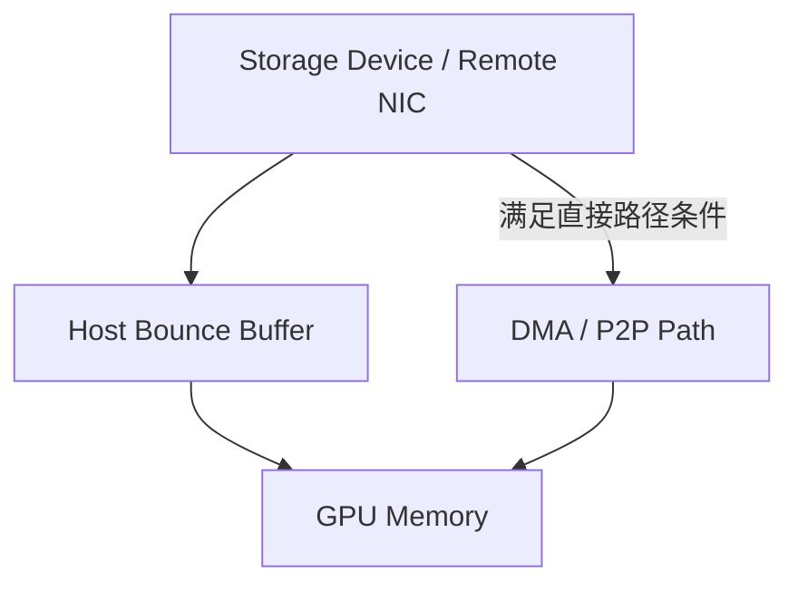

# GPUDirect Storage / cuFile：直接数据路径与文件语义分开

[Host / GPU Memory Data Path](04-host-gpu-memory-data-path.md) 解释了 pinned H2D 仍经过主机内存。本篇关注：**文件存储怎样减少 CPU bounce buffer，以及怎样证明实际 I/O 使用了这条路径？** GDS 改变正文移动方式，不替应用完成文件与恢复点语义。

## 1. 官方范围与版本边界

**核对日期：2026-10-03（Asia/Shanghai）。** 核对时 [GDS Release Notes](https://docs.nvidia.com/gpudirect-storage/release-notes/index.html) 最新条目为 **1.19.1**。以下使用同一当前文档站的 Overview、cuFile API、O_DIRECT Requirements、Best Practices 与 Configuration Guide；这些滚动入口不意味着各页面内容都在同一发布日更新。相邻 CUDA 文档当前标为 **13.4**，不把该标号推断为所有 GDS 包的精确版本配对。

| 官方资料 | 本篇使用范围 |
| --- | --- |
| [Overview Guide](https://docs.nvidia.com/gpudirect-storage/overview-guide/) | Direct DMA、传统 bounce path、cuFile 路径 |
| [cuFile API Reference](https://docs.nvidia.com/gpudirect-storage/api-reference-guide/) | Handle / Buffer、注册、同步与异步操作、写入完成边界 |
| [O_DIRECT Requirements Guide](https://docs.nvidia.com/gpudirect-storage/o-direct-guide/) | non-O_DIRECT 版本演进、CPU transformation、文件系统条件 |
| [Best Practices](https://docs.nvidia.com/gpudirect-storage/best-practices-guide/) | 拓扑、请求与缓冲条件 |
| [Configuration Guide](https://docs.nvidia.com/gpudirect-storage/configuration-guide/) | compatibility 配置、统计与实际路径观察 |

具体部署仍须核对对应版本、文件系统支持与配置；下面的简化图不代替支持矩阵。

## 2. 减少 Host Staging，不消灭数据移动

传统路径的正文可能经过 Storage → Host Memory → GPU Memory。GDS 的逻辑直接路径为 Storage Device / Remote Storage NIC → DMA / P2P-capable Path → GPU Memory，核心是避开传统 CPU bounce buffer。数据依然经过存储设备、PCIe / 网络与 GPU 内存，**GPUDirect ≠ No Data Movement**。

这是正文路径对照，不表示一个请求同时走两个分支，也不把控制请求、Metadata 和完成处理从系统中删除。[Memory Copy / Zero-copy](../09-data-path-performance/07-memory-copy-zero-copy.md) 的成本模型仍适用：减少一次 staging 不等于网络、设备和内存流量都归零。

## 3. GDS 与 GPUDirect RDMA 的抽象不同

| 技术 | 关注的边界 | 在远程存储中的联系 |
| --- | --- | --- |
| GPUDirect Storage | Storage ↔ GPU Memory 的存储 I/O 路径 | 文件系统路径可以利用 NIC 与 GPU 间的直接传输 |
| GPUDirect RDMA | Third-party Peer Device / NIC ↔ GPU Memory | 可以成为远程存储的网络数据面能力 |

两者属于 GPUDirect 技术家族，但不是同一 API 或同一存储抽象。NIC 可访问 GPU 不会自动提供文件 offset、对象 Key 或持久提交；相关基础复用 [RDMA](../09-data-path-performance/09-high-performance-networking-rdma.md)。[NVIDIA GPUDirect RDMA 文档](https://docs.nvidia.com/cuda/gpudirect-rdma/) 描述 peer device 与 GPU 的直接访问，本篇不重写网络原理。

## 4. cuFile 是 File-system-oriented Interface

[NVIDIA GDS 文档入口](https://docs.nvidia.com/gpudirect-storage/) 区分 cuFile 文件系统接口与下一篇 cuObject 对象接口。本篇 cuFile 的逻辑职责是：Application → cuFile → File / Filesystem → Storage Path ↔ GPU Buffer。

| 概念位置 | 存储工程问题 |
| --- | --- |
| File Handle | 关联已打开文件及其访问条件；文件身份、权限和生命周期仍存在 |
| GPU Buffer / Registration | 让路径识别可访问内存；注册不等于分配，也不替应用管理全部引用 |
| Read / Write | 按文件范围移动字节；错误、短传输与数据解释仍需处理 |
| Async / Batch | 组织提交与完成；不是消除依赖或保证每个请求直接传输 |

API 文档提供 handle 与 buffer 注册及同步、stream-ordered async、batch 操作。显式预注册可用于缓冲复用，但不应写成“每个 buffer 都必须先手工注册才可能使用 cuFile”；具体支持与路径按 API 条件判断。注册生命周期与 [Direct / Async I/O](../09-data-path-performance/08-direct-async-io-device-path.md) 的 buffer lifetime 相接，未完成或仍被使用的内存不能提前注销或释放。

## 5. O_DIRECT：保留条件，修正旧绝对结论

O_DIRECT Requirements Guide 明确：**CUDA 12.2 / GDS 1.7 起支持 non-O_DIRECT 文件描述符**，不能再声称 GDS 永远只能 O_DIRECT。请求可以在满足条件时利用直接路径，也可能经 Page Cache / compatibility；配置与支持条件不满足时也可能失败。

| 实际路径类别 | 简化正文模型 | 需要核对什么 |
| --- | --- | --- |
| Direct GDS | Storage → GPU Memory | 文件系统 / 设备支持、buffer、offset / size / alignment 与实际拓扑 |
| GPU-side Staging | Storage → GPU 中间缓冲 → 目标 GPU Buffer | 某些对齐或路径条件产生的中间搬运；不能等同 CPU bounce |
| Compatibility / Host Bounce | Storage → Host Memory → GPU Memory | compatibility 是否允许、触发原因与额外成本 |
| Buffered / Page Cache 或失败 | 依 non-O_DIRECT、配置与实现处理 | 不把任一回退结果视为所有版本、文件系统的保证 |

**cuFile API Used ≠ Every I/O Used Direct Path。** 同一任务中大块正文与小 Metadata I/O 可能使用不同路径。Direct I/O 的通用语义见已有章节；这里关注实际 GDS 条件，不重新定义它，也不给固定请求大小作为最佳值。

## 6. 处理位置影响能否保持 Direct Path

O_DIRECT Guide 讨论 CPU-side examination / transformation 和文件系统特性对直接路径的影响。通用推导如下：若正文必须落到客户端 Host Memory，才能做 decode、compression、encryption 或 checksum，这一段就不能被“Storage 直接到 GPU”覆盖。把原始字节直接读到 GPU 后处理，是不同架构，但还须满足格式、GPU处理能力和支持条件。

不能据此断言“所有 Encryption 都禁止 GDS”。处理在客户端 CPU、GPU、存储服务器或设备内部，对客户端正文路径的影响不同。官方指南也给出 GPU checksum 的可能形态。服务器仍做 EC / checksum，不自动证明客户端用了 Host Staging。

还要区分 Metadata work 与 payload work：文件长度、分配、权限与映射可能需要 CPU 处理，但不一定要求正文进入 CPU buffer；某些 inline data、buffered feature、allocation / alignment 条件则会影响正文路径。应检查具体文件系统实现，而非把特性名称当成统一禁用清单。

## 7. 完成传输，不等于完成持久恢复点

GDS 没有删除 file identity、offset、permission、storage errors、durability、metadata、retry 与 application state。[cuFile API](https://docs.nvidia.com/gpudirect-storage/api-reference-guide/) 对同步写说明：I/O 完成并不自行承担所有 Metadata 的持久回写责任；崩溃持久性仍需相应文件系统同步语义，不能仅凭 write 返回推断。

更不能把 cuFile Completion 扩展为 Distributed Checkpoint Committed。多个 shard 是否齐全、校验是否完成、Manifest 是否有效发布，以及远端保护目标是否满足，是 [Weights / Checkpoints](03-model-weights-checkpoints.md) 的另一层边界。Async I/O 提交成功之后，buffer 仍需等待实际完成；应用继续 compute 时，最新可恢复点也可能仍是上一个已发布版本。

**通用故障示意：**一个 rank 的文件正文写完，另一个 rank 失败。前者即使用了完整 Direct Path，也不能让缺少 shard 的 checkpoint 自动变为可恢复。优化传输不能代替协调与恢复验证。

## 8. 受控比较：证明路径，也证明 Outcome

Baseline 为 Storage → Host → GPU，候选为满足条件的 GDS Storage → GPU。对照保留相同 dataset / file layout、请求范围与大小、并发、GPU、存储后端、网络、冷 / 热缓存，以及 decode / transform 的结果语义。若处理移到 GPU，要把新增 compute 与资源竞争一起计入，不能只比较搬运阶段。

| 观察层 | 指标与证据 |
| --- | --- |
| 路径 | 实际 direct / Host fallback / GPU staging；按字节与操作数分别归类，无法判明的保留未知 |
| I/O | Effective throughput、P99、batch-ready latency、错误与重试 |
| 资源 | CPU utilization、Host Memory Traffic、网络 / 设备利用率、GPU Memory 占用 |
| 重叠 | I/O / H2D 与 Compute 的实际重叠，GPU input idle |
| 应用 | step time、samples / tokens per second、checkpoint pause / restore time，按目标工作负载选择 |

Configuration Guide 的统计和跟踪可为路径判别提供证据；“Direct-path ratio”是测试中按明确分类得到的量，不假设所有版本都有同名内置指标，也不凭 API 名称认定路径。

**GDS throughput ↑ ≠ Training throughput 一定同比 ↑。** Decode、GPU Compute 或同步若成为限制，减少 Host Staging 可能降低 CPU 消耗，却不改变 step time。复用 [Benchmark / Bottleneck Analysis](../09-data-path-performance/03-benchmark-bottleneck-analysis.md)，解释收益发生在哪一层及瓶颈如何转移。
