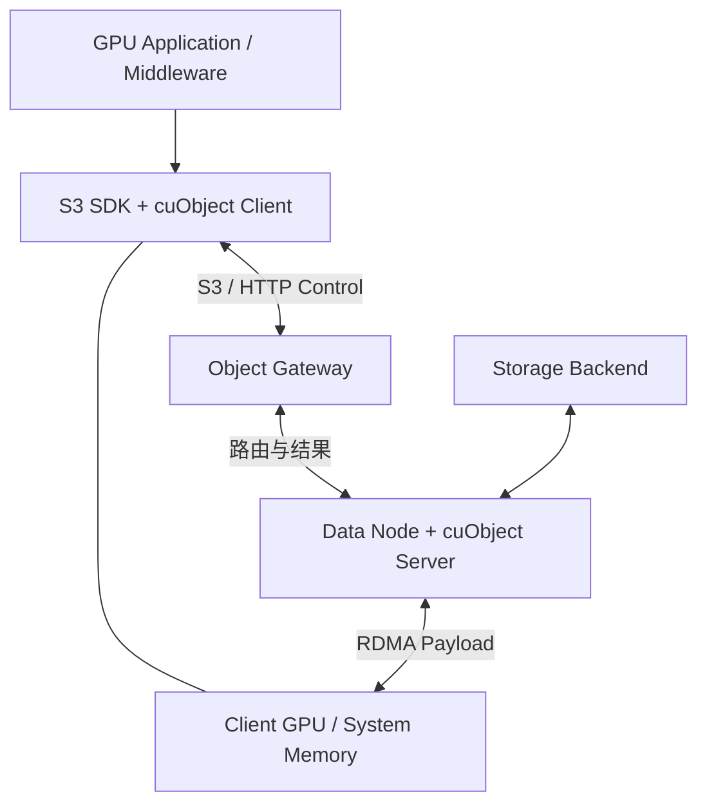

# Object Storage / cuObject / RDMA：对象控制语义与 GPU 数据面分开

[cuFile](05-gpudirect-storage-cufile.md) 从文件身份与 offset 进入存储。本篇转向 Bucket / Key：**对象请求怎样保留 S3 控制语义，同时让 payload 通过 RDMA 到达 GPU？** cuObject 是当前公开实现案例，不是所有对象存储的统一内部路径。

## 1. 当前官方范围：Client 与 Server 分别记录

**核对日期：2026-10-03（Asia/Shanghai）。** 本篇使用 NVIDIA 当前官方资料，不用博客代替产品行为依据。

| 官方入口 | 核对时范围 | 本篇引用内容 |
| --- | --- | --- |
| [cuObject Documentation](https://docs.nvidia.com/gpudirect-storage/cuobject/) | 当前 Overview，页面更新于 2026-10-02 | SDK / Client / Gateway / Server 集成、控制与正文流程 |
| [Client Release Notes](https://docs.nvidia.com/gpudirect-storage/cuobject/cuobject-client-release-notes/index.html) | 最新 **1.3.1**，2026-09-16；列为 CUDA **13.4.1** 配套 | 当前传输条件、缓冲限制与生命周期风险 |
| [Server Release Notes](https://docs.nvidia.com/gpudirect-storage/cuobject/cuobject-server-release-notes/index.html) | 最新 **2.0.0**，2026-08-18；列为 CUDA **13.4** 配套 | Server 架构、完成与当前版本限制 |
| [GPUDirect RDMA](https://docs.nvidia.com/cuda/gpudirect-rdma/) | 当前 CUDA **13.4** 文档 | NIC / GPU 直接访问、注册与可见性 |

Client 1.3.1 与 Server 2.0.0 是不同组件的版本，不能混用成一个 cuObject 版本号。滚动文档入口未来可能改变，具体部署仍需对应发布范围与合作方集成契约。

## 2. cuFile ≠ cuObject；RDMA ≠ S3

| 接口 | 上层访问身份 | 主要连接 |
| --- | --- | --- |
| cuFile | File / Filesystem Namespace、Handle、Offset | 文件 I/O ↔ Storage Path ↔ GPU Memory |
| cuObject | Object / S3-compatible Request、Bucket / Key | S3 / HTTP Control + RDMA Payload ↔ GPU / System Memory |

cuObject 不宜简写成“cuFile for S3”：它需要对象 SDK 与服务端的集成、传输协商和结果处理。RDMA 能搬运已授权内存范围的字节，不提供 Bucket / Key、对象版本、认证或 PUT 提交语义。对象模型与准备 / 发布边界复用 [Object Model](../03-object-storage/01-object-model.md) 和 [Read / Write Path](../03-object-storage/03-read-write-path.md)。

“S3 over RDMA”也不会因两个名称组合而成为统一标准协议。实现仍需定义请求与认证、对象身份、transfer negotiation、memory registration、错误、retry、completion 与 object commit。当前 cuObject 是一种具体实现，不能据此规定所有 S3 / RDMA 系统都使用相同 header、transport 或调用顺序。

## 3. 当前架构：S3 Control 与 RDMA Payload 分离

官方 Overview 描述：Client library 集成于 GPU Application / Middleware，经修改的 S3 SDK callback 组织传输；Server library 集成于对象存储数据节点。Gateway 解析带传输信息的请求并定位节点，节点通过 Server API 搬运正文。**仅有兼容 S3 的普通 endpoint，并不自动获得这一集成能力。**

下图根据官方角色画出逻辑职责；SDK 与 Client library 可在同一进程，Gateway 与数据节点也不必对应独立硬件。

S3 Control Path 负责 object identity、operation、authorization / request semantics 与 result reporting；RDMA Data Path 负责 payload movement。当前集成使用请求中的 `x-amz-rdma-token` 与响应中的 `x-amz-rdma-reply` 传递相应信息，这些是本实现机制，不是 S3 通用字段。

官方列出的操作包括 GET / GETFILE、PUT / PUTFILE、UPLOAD_PART 与 RANGE_GET；不据此宣称所有 S3 操作都以 RDMA 传输。当前 cuObject 使用 **DC Transport，并要求 InfiniBand 或 RoCEv2**；这是当前实现约束，不是“S3 over RDMA”的通用要求。相应版本提供 multipath / failover 能力，也不等于自动切换 TCP。

## 4. GET：节点推动正文，客户端还要确认可消费

下面概括官方 Overview 的 GET 角色顺序，并把后端读取作为对象服务职责补入，**不是所有对象存储的标准流程**：

1. 应用 / Middleware 通过 SDK 发起 GET；SDK 与 Client 检查缓冲、选择可用设备并准备 RDMA 信息。
2. SDK 在 HTTP 请求中携带传输 token；Gateway 解析后路由到持有数据的节点。
3. 节点取得对象正文并准备本地传输 buffer，结合 Server library 的注册与操作。
4. Server 通过 **RDMA_WRITE** 将正文推送至客户端 GPU / System Memory。
5. Gateway 返回操作结果与 RDMA 状态；应用按集成约定检查错误、有效范围与消费顺序。

Backend 怎样读取、是否需要 EC reconstruction 或版本检查，属于对象系统实现；传输库不替它定义这些语义。正文已到达目标范围，也不能让正在读取同一范围的 GPU kernel 自动获得正确同步。

## 5. PUT：拉取完成与对象提交分开

PUT 在传输方向上不同：客户端准备源 buffer 与请求信息，Gateway 路由，Server 通过 **RDMA_READ** 拉取客户端正文。官方 Overview 描述 Gateway 在 RDMA transfer 完成后返回 200，并用响应信息报告 RDMA 状态。

**这段公开传输流程不足以建立“RDMA 完成即对象持久提交”的保证。** Backend 接收与持久化、Replication / EC、Metadata 更新、Object Publish 与 API 成功条件，必须由具体对象存储集成契约定义；不能从 RDMA 或 cuObject API 自行推导。以下是存储语义检查链，不宣称官方 Server library 内部严格执行这些步骤：

PUT 请求 / 协商 → Server RDMA_READ → 后端接收与保护 → 对象状态处理 / Publish → 按集成契约报告结果。

如果接口把 PUT 成功定义为满足某个持久保护目标，就必须证明 API 成功与该目标如何衔接。单独看到 transport success 或一个示意图中的 200 不足以替代验证。**RDMA Completion ≠ Object Durable Commit**，更不等于多个 checkpoint shard 已组成完整恢复点，见 [Weights / Checkpoints](03-model-weights-checkpoints.md)。

## 6. Storage Server 的成本仍然存在

客户端减少 TCP payload 与 Host Staging，不会让后端读取消失。服务端可能仍有 device read / write、EC reconstruction、checksum、local buffer、memory registration、CPU 调度、Metadata 与 Placement 工作。

**通用示意：**一个 GET 的 NIC → GPU 很快，但后端正为缺失 fragment 重建对象，客户端仍需等待正文准备。另一请求虽命中服务器内存，仍会消耗 Server Memory Traffic 和注册 / 传输资源。不能把网络带宽直接当作对象供给率。

GPU-direct Data Plane ≠ End-to-End Object Request Zero CPU。应同时记录 Client 与 Server 的资源成本；如果只测客户端 CPU 下降，就没有回答存储节点是否已成为新瓶颈。基础仍是 [End-to-End Cost Model](../09-data-path-performance/01-end-to-end-cost-model.md)。

## 7. GPUDirect RDMA：直接访问保留内存所有权

[NVIDIA GPUDirect RDMA](https://docs.nvidia.com/cuda/gpudirect-rdma/) 将第三方设备访问 GPU Memory 连接到 DMA / peer 路径。在本篇，它使 RNIC ↔ GPU Memory 成为对象正文数据面的一部分，从而减少 Host Staging；它不替代对象协议。QP、CQ、MR 与一般完成边界复用 [RDMA 基础](../09-data-path-performance/09-high-performance-networking-rdma.md)，不展开 Verbs。

| 边界 | 必须保留的责任 |
| --- | --- |
| Registration / Access Permission | 只允许对应设备访问有效范围；RDMA 内存权限不等于 Bucket 授权 |
| Buffer Lifetime | 在实际操作完成、API 释放传输引用以前，不能释放、注销或覆写在途区域 |
| Application Ownership | 传输引用释放后若应用仍消费该 buffer，还须保留应用生命周期；持久提交是另一条件 |
| GPU Visibility | NIC 完成与 GPU 正确消费之间要有相应 CUDA ordering / synchronization，不能与同一区域的计算竞态 |

Client Release Notes 还记录：同一 RDMA buffer 的并发 GET / PUT 不受支持；Host unregistered buffer 不受支持；GPU unregistered buffer 的支持受 bounce-buffer cache 限制。不能把“GPU buffer”推断为每次都直接传入目标区，也不能把 bounce 当成 TCP fallback。

该版本资料也指出注销 / 重新注册可能复用 memory key，旧的服务端 I/O 需要正确排空或拒绝。**GPU Memory Direct Access ≠ Memory Ownership 不再重要。** Buffer 可以重用的时机取决于 API 完成与引用释放，而不是一概必须等对象远端持久提交；把传输、消费与提交分别记录才不会误用内存。

## 8. 故障仍有 Unknown Result 与 Retry

| 场景 | 已知事实 | 不能宣布什么；下一步检查 |
| --- | --- | --- |
| Control Request 已发送，RDMA 失败 | 请求可能已到 Gateway，正文可能不完整 | 不能宣布 GET / PUT 成功；检查传输与对象结果，清理在途引用 |
| RDMA 完成，后端 Commit 失败 | 正文搬运完成 | 不能宣布 Object PUT 持久成功；按对象契约处理失败 |
| Client Timeout，Server 可能已提交 | 客户端没有最终确认 | 结果未知；检查身份 / 版本 / 状态，按幂等与重试契约协调 |
| 目标范围写入中，GPU 提前读取 | 控制面尚不能证明输入可消费 | 可能读取不完整 / 不一致结果；修正 ordering 与 buffer 生命周期 |

这是通用故障分析，不声称 cuObject 为各情形提供统一错误码或自动重试策略。复用 [故障模型](../06-distributed-systems/01-failure-model-timeout.md) 与 [幂等与重试](../06-distributed-systems/03-retry-idempotency-deduplication.md) 时，应把实际对象身份、版本、重复操作和覆盖风险带入，不能因为换成 RDMA 就删除 Unknown Result。

## 9. Fallback 只能按公开契约写

上述 Overview 与 Client / Server Release Notes **不足以建立统一的自动 non-RDMA / TCP fallback 结论**。不支持的路径、未注册缓冲与 RDMA 故障，应按版本限制、SDK callback 行为和合作方集成契约检查。应用可自行设计传统 S3 路径，但那是另一层策略，不能当成库默认保证。

Multipath / failover 保持 RDMA 路径可用与切换 TCP payload 是不同动作。若测试不能证明确切路径，应记录“未知”，而不是把成功请求全部算作 GPU-direct。

## 10. Benchmark：分解传输，再回到对象与训练

比较 Traditional S3 的 S3 Control + TCP Payload → Host → GPU，与 cuObject-style 的 S3 Control + RDMA Payload → GPU。控制对象内容 / 版本、request size、range / shard、并发、缓存、网络与存储后端，保留相同 decode / transform 与结果语义。

| 观察点 | 至少记录什么 |
| --- | --- |
| Payload / Path | 有效吞吐、实际 direct / staging 比例、网络使用；分别说明按操作还是按字节统计 |
| Object Request | S3 request latency / P99、transfer failure / retry、最终成功与提交条件 |
| Client / Server | 两侧 CPU、Memory Traffic、buffer / registration 占用，服务端后端吞吐与 EC / checksum 成本 |
| GPU 输入 | GPU idle、batch-ready latency、传输与 compute 重叠 |
| 应用结果 | End-to-End samples / tokens per second、step time；Weights / Checkpoint 使用对应 load / restore 指标 |

Pure RDMA Bandwidth ≠ Object Storage End-to-End Performance。更高 GDS / RDMA bandwidth 也不保证训练吞吐同比增加：后端、Metadata、decode、GPU compute 或同步都可能限速。复用 [Benchmark / Bottleneck Analysis](../09-data-path-performance/03-benchmark-bottleneck-analysis.md)，先证明路径，再解释资源与应用收益。

本阶段到此形成 Host Staging → File-oriented Direct GPU Storage → Object-oriented RDMA GPU Data Path。三者保留各自控制语义、完成边界与恢复责任；KV Cache 仅留在专题后续规划。

[上一篇：GDS / cuFile](05-gpudirect-storage-cufile.md) · [返回专题](README.md) · [对象读写路径](../03-object-storage/03-read-write-path.md)
