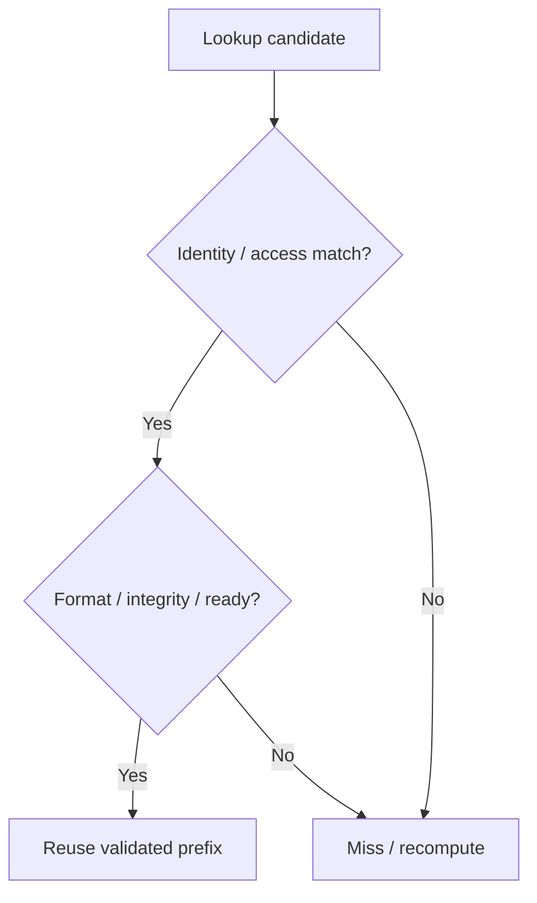

# KV Cache State Model：可重建状态，也需要精确身份

## 本篇解决什么问题

KV Cache 为什么值得保存，却通常不是 Primary Durable Data？为什么“找到同一段文字”还不足以安全复用？本篇只建立理解存储所需的状态模型，不推导 Attention 公式，也不讲 Serving Engine 实现。

前置：[AI Storage Workload Model](01-ai-storage-workload-model.md)、[Cache / Prefetch](../09-data-path-performance/04-cache-prefetch.md)、[Object Model](../03-object-storage/01-object-model.md)。复用已有 Cache Identity、Hit / Miss、Working Set 和持久化分类，不重新定义缓存机制。

## 1. 最小背景：保存已经计算出的历史状态

在典型因果 Transformer 推理中，已处理的 Token 会在各 Attention Layer 产生 Key / Value 状态。后续 Decode 读取这些历史 KV，并为新 Token 增加状态，避免每一步重新计算全部历史 Prefix。这里的“增长”指保留完整上下文的常见路径；Sliding Window、压缩或混合结构可能具有不同保留范围，不能把无限线性增长当作所有模型的契约。[Transformers 官方 Cache 说明](https://huggingface.co/docs/transformers/v5.17.0/cache_explanation)提供了这一背景，本文不展开其 API。

从资源视角区分两个阶段：

| 阶段 | 与存储相关的工作 | 常见资源压力 |
| --- | --- | --- |
| Prefill | 消费 Prompt Token，计算并集中生成 KV | 计算需求与状态生成突发；具体瓶颈取决于模型、长度及 Batch |
| Decode | 逐步生成 Token，反复访问历史 KV 并扩展序列 | 活跃内存容量、访问带宽与单步延迟；不能据此断言所有 Decode 都只受内存限制 |

KV Cache 是由 **Model / Weight + Model Configuration + Input Token Prefix + 相关执行状态** 得出的 Derived State。它不是用户原始 Prompt，也不是 Model Weight，更不是天然的 Primary Durable Business Data。

## 2. Rebuildable but Expensive

若准确的输入 Token 历史、相应 Model / Weight 和必要执行条件仍在，可以重新 Prefill 构造可继续推理的 KV。这里要求语义兼容，不承诺不同硬件或实现重算得到逐字节相同结果。

因此它通常属于 [Workload Model 的 Can Rebuild but Expensive](01-ai-storage-workload-model.md)：丢失缓存更常造成 TTFT 上升、GPU 重算与成本增加，而不是业务 Primary Data 永久丢失。长上下文的重算代价可能很高，**Rebuildable ≠ Cheap**，这才是把 KV 扩展为存储层的动机。

恢复前提不能省略：若系统把 KV 当作唯一保留的执行状态，或业务 Resume 依赖它，而输入历史已经丢弃，Cache Loss 就可能改变恢复语义。必须先确定保留材料和失败边界，不能用“它叫 Cache”代替恢复设计。Model / Prompt 的持久保护与 KV Availability 是两项责任。

## 3. Logical Identity：命中首先要在语义上成立

不能只用 Prompt String 作为 Key。下面是通用身份检查维度，不是一套统一的 KV Key 标准；字段可以编码到 Key、Manifest、Namespace 或部署隔离中。

| 维度 | 为什么影响复用 |
| --- | --- |
| Model identity / version / Weight revision | 名称相同不保证权重相同；旧版本状态不能默认为新版本可用 |
| Tokenizer、预处理与准确 Token Sequence | Chat Template、特殊 Token 或多模态输入处理可能改变实际输入；仅文本相同不够 |
| Prefix length / token boundary / position context | 必须知道完整前置上下文和准确复用范围，不是任意相同子串 |
| Layer、KV layout、dtype / quantization | 内容所在层和表示必须能被消费者解释；语义匹配不等于字节表示兼容 |
| Parallelism / shard layout | 分片覆盖、归属和重组方式须兼容；一个 Shard 不等于完整逻辑状态 |
| Attention-related execution configuration | 会改变状态含义的配置必须纳入兼容性判断 |
| Adapter / LoRA 等模型有效状态 | 同一基础模型、不同 Adapter 可能产生不同 KV |
| Implementation-specific format version | 相同逻辑 KV 不保证可跨 Engine / 版本直接安装 |
| Tenant / security domain | 内容匹配不代表有权读取；隔离与授权还需要独立保证 |

**Text Prefix ≠ Token Prefix**：相似文字不保证 Tokenized Prefix 相同；相同文字也可能因上下文模板不同而产生不同 Token。一个后续 Block 的 KV 通常依赖前面的因果上下文，不能只凭该 Block 自身 Token 相同就替换。Shared Text ≠ Reusable KV State。

格式不兼容时，系统可能选择经过验证的转换或重分片；“需要相同布局”是直接复用的条件，不是所有逻辑状态永远不能转换的结论。

## 4. 定位、验证与复用是不同职责

下面是通用逻辑模型，不规定每次 Hit 都执行昂贵的全量校验；可信 Namespace、不可变版本、发布协议和完整性机制可以提前建立部分保证。

Hash / Key 是定位机制，不是所有正确性条件的证明。**Hash Match ≠ Semantic Identity Proven**：还要防止遗漏模型版本、错误 Adapter、错误 Prefix Boundary、无法解释的 dtype / layout、传输损坏和未完成状态。Hash 算法也不能补救身份字段本身缺失。

当前 [vLLM Prefix Caching Design](https://docs.vllm.ai/en/v0.30.0/design/prefix_caching/) 是公开实例：其 Block 身份结合前序 Hash、Block Token 与额外身份信息，后者包括 LoRA、多模态输入及 Cache Salt 等。这个设计说明“内容还依赖上下文”，不代表所有 Engine 必须采用同一个 Hash 或 Key Schema。Salt 可划分复用域，但不能代替授权。

## 5. Logical Sequence 与管理单元分开

Logical KV Sequence 可以拆成 Block、Page 或 Chunk，以支持 allocation、reuse、eviction、transfer 和 scheduling。它们是管理粒度，不是跨产品统一的存储格式：vLLM Block、其他 Engine 的树节点、远端缓存 Chunk 未必一一对应。

至少区分：完整逻辑 Prefix、各 Layer / Rank 所需片段、单个传输单元、消费者可安装的集合。收到一个完整 Chunk 不自动意味着整个请求需要的 KV 已齐。正在使用或尚在传输的 Buffer 不能直接回收；共享已完成 Prefix 与扩展活跃序列也要保持所有权边界，不能让一个请求的追加破坏另一个请求的状态。复用 [Memory Copy / Buffer Lifetime](../09-data-path-performance/07-memory-copy-zero-copy.md)，不在此展开 allocator 实现。

## 6. Capacity：看表示与工作集，不给统一每 Token 数字

对未压缩、保留完整上下文的常见 KV 表示，可用一个量纲模型估计逻辑 Payload：对各 Layer 求和，乘入该层保留 Token 数、KV Head 数、Head Dimension，以及 K / V 各元素字节数。若 K / V 尺寸相同，就是两份状态；量化、压缩、滑动窗口或其他结构需修改这个模型。

容量还受并发请求、共享 Prefix、Shard 分布、分配碎片、元数据和在途副本影响。不能简单把所有请求长度相加作为物理占用：共享会减少重复存储，Offload / Transfer 也可能暂时增加副本。GPU 总内存还要容纳 Weight 与运行时其他状态。没有适用于所有模型的“每 Token = X KB”。

## 7. 本篇边界与下一步

KV Cache ≠ Weight ≠ Prompt；KV Cache 通常不是 Primary Durable Data；可重建不等于便宜；Text Prefix ≠ Token Prefix；Hash Match ≠ 身份已证明；Block / Page / Chunk ≠ 统一标准；Cache Loss 通常不等于 Primary Data Loss。

下一篇讨论 [Hierarchy / Prefix Reuse](08-kv-cache-hierarchy-prefix-reuse.md)：在身份正确的前提下，怎样选择保存位置、复用范围与淘汰对象。

## 官方资料范围

核对日期：**2026-10-03**。

- Hugging Face Transformers **v5.17.0**：[Cache explanation](https://huggingface.co/docs/transformers/v5.17.0/cache_explanation)，只用于最小 KV 背景。
- vLLM **v0.30.0**，当日 `stable` 指向该版本：[官方 Release](https://github.com/vllm-project/vllm/releases/tag/v0.30.0)、[版本化 Prefix Caching Design](https://docs.vllm.ai/en/v0.30.0/design/prefix_caching/)。身份表及验证图是通用存储模型，不伪装成 vLLM 完整兼容契约
