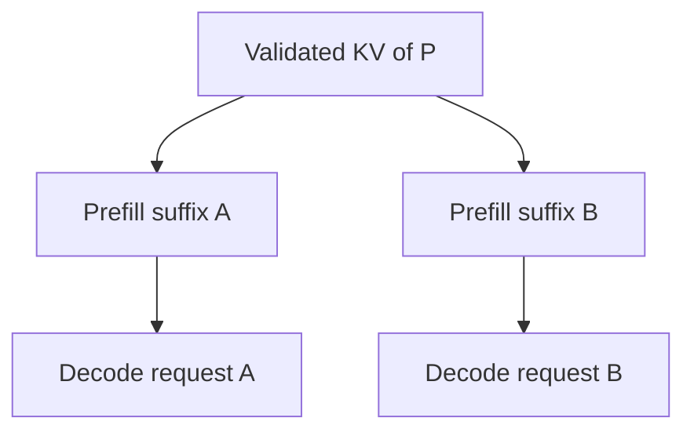

# KV Cache Hierarchy / Prefix Reuse：保存位置与复用价值分开

## 本篇解决什么问题

GPU KV Memory 不够时，哪些状态值得下沉、共享或直接丢弃？为什么 Prefix Hit 不等于 Decode 更快？前置：[KV State Model](07-kv-cache-state-model.md)、[Cache / Prefetch](../09-data-path-performance/04-cache-prefetch.md)、[Batching / Backpressure](../09-data-path-performance/05-batching-backpressure.md)。本篇把已有缓存决策映射到 KV，不提供 Serving 产品配置教程。

## 1. Hierarchy 是选择，不是必经链

一个可能的分层方向是 **GPU HBM → Host Memory → Local NVMe / SSD → Remote Memory / KV Store → Persistent / Object Storage**。具体系统可以跳过某层、并行使用多层，或完全只保留 GPU KV。

| 层 | 可能提供的价值 | 需要付出的成本 / 条件 |
| --- | --- | --- |
| GPU HBM | 活跃 Decode 就近读取，已安装状态可直接消费 | 容量有限，与 Weight / Runtime 争用；需要保护正在使用的单元 |
| Host / CPU Memory | 扩大本机保留范围，作为加载或下沉缓冲 | H2D / D2H、Host 容量、Pinned Buffer 与 NUMA 成本 |
| Local NVMe / SSD | 较大本地容量，可能跨进程或更长时间保留 | I/O、格式处理、粒度和本地故障域 |
| Remote Memory / KV Store | 扩大容量与跨节点共享范围 | Lookup、网络、排队、安装及目录生命周期 |
| Persistent / Object Storage | 可选择长期保留派生状态，扩大集群共享 | 请求 / 元数据成本、粒度匹配、保留策略与实际持久化契约 |

越靠近 GPU，通常访问成本更低但容量更受限；更远的层可能扩大共享范围，也会增加 Transfer / Format Cost。这只是工程方向，不是固定性能排名：快速远端内存不一定比本地介质慢，具体路径必须测量。更大容量也可能引入更多冷数据、元数据和在途资源，**More Cache Capacity ≠ Always Better**。

## 2. Evict 与 Offload 不是同一个动作

Evict 是从当前层删除状态，可能完全丢弃；Offload 是移动或复制到其他层，保留未来复用机会。GPU Eviction ≠ KV State Gone，只要下层仍有可用且兼容的副本。

但 GPU Free ≠ 远端 Entry 已安全保存。通用 Offload 顺序应在确认下层所需 Payload 完整、可被查找和复用后，才能按策略回收源副本；如果只是提交异步搬运，还要保护源 Buffer 到实际完成。所谓“确认”必须匹配目的层契约：暂存内存可用、缓存发布、跨节点持久化并不是同一级保证。

复用 [Host / GPU Data Path](04-host-gpu-memory-data-path.md) 的 Buffer Lifetime：活跃消费者、在途 DMA 和共享引用未结束时，不能只因淘汰策略选中就回收。Offload 也可能临时产生双份占用，并与前台 Decode 争用内存带宽和网络。

## 3. Prefix Reuse：省的是重复 Prefill

通用例子：Request A 输入 `P + A`，Request B 输入 `P + B`。A 已经生成的 `KV(P)` 可在身份兼容时用于 B，B 只需处理新增后缀。`KV(A | P)` 与 `KV(B | P)` 依赖各自上下文，不因为共享 P 就可相互替换。

当前 [vLLM Automatic Prefix Caching](https://docs.vllm.ai/en/v0.30.0/features/automatic_prefix_caching/) 明确以已有查询 KV 复用跳过共享 Prefix 的计算；其主要收益是减少 Prefill，文档也明确不直接加速新 Token 的 Decode。于是 TTFT、GPU Compute、吞吐或可承载并发可能改善，但 **Prefix Cache Hit ≠ TPOT 一定下降**；Decode 仍要访问所需 KV 并执行自己的计算与调度。

该版本 [Block / Hash Design](https://docs.vllm.ai/en/v0.30.0/design/prefix_caching/) 的经典 Attention Block 路径以完整 Block 为缓存单元，并结合前序上下文、Token 及额外身份信息。它不是“任意文本片段均可命中”，也不是所有模型 / Engine 的统一粒度规则。Model Version、Tokenizer / Token Prefix、Adapter、Cache Format、Block Boundary 都会影响安全复用。先满足上一篇的 Identity / Format / Access 条件，再谈命中收益。

## 4. Hit Ratio 不能代表 Compute Saved

沿用已有 Cache 篇的观测分层：

| 指标 | 能回答什么；必须说明的口径 |
| --- | --- |
| Request hit ratio | 请求是否有可复用部分；区分“任意部分命中”与“所需 Prefix 全命中” |
| Token hit ratio | 可复用 Prefix Token 占比；说明有效边界及分母 |
| Byte hit ratio | 命中字节占比；表示、分片和重复副本可能影响计数 |
| Avoided prefill tokens / compute | 实际避免了多少重新 Prefill 工作；Token 比例不能机械换算成计算比例 |
| Transferred KV bytes | 为复用付出多少搬运；本地 Hit 与远端 Hit 成本不同 |

许多短 Prompt 全命中，与一个很长的 Prefix 命中，对计算节省和传输压力可能很不一样。还要测 TTFT、TPOT、排队和端到端吞吐；一个“命中”如果需要昂贵的远端加载，可能比直接重算更差。

## 5. Admission / Eviction：缓存可重建成本，而不只是最近访问

Admission 可以考虑复用概率、重建成本、KV Size、Recency / Frequency、Tenant / Priority 以及未来 Transfer Cost。一次性巨大 Prefix 不一定值得长期保存；小且频繁复用的 Prefix 也不自动最优，仍要比较计算节省与占用、查找和搬运成本。

LRU-like、Reuse-aware、Cost-aware 都是可采用的策略思想，没有统一最优算法。Eviction 应综合 **Size + Recompute Cost + Expected Reuse**，并排除正在使用的状态；某个高价值共享 Prefix 的淘汰会影响多个请求，不只是一个 Entry 的最后访问时间。

Working Set 还包括活跃请求所需 KV，而不只是未来可能复用的冷 Prefix。要为前台保留内存和队列预算，限制后台 Offload / Prefetch 的并发、在途字节和队列深度。复用 [Foreground / Background Interference](../09-data-path-performance/06-foreground-background-interference.md)：缓存扩容不能靠无界异步队列，把当前 Decode 的尾延迟转移成未来资源耗尽。

## 6. Sharing Scope 越大，协调责任越多

| 范围 | 复用机会 | 新增责任 |
| --- | --- | --- |
| 一个 Request 内 | 避免重复历史计算 | 活跃 Buffer 与追加范围 |
| Engine / GPU Worker 内 | 多请求共享 Prefix | 身份索引、引用和淘汰 |
| 同 Node 的多个进程 / Engine | 共享 Host / Local Tier | IPC、格式兼容、共享资源配额 |
| 多 Serving Instance / 集群 | 扩大 Prefix 命中范围 | 目录、Placement、网络、授权、失效与生命周期 |

“同一个 Prefix Hash”不能默认跨 Security Domain 共享。需要 Tenant / Request Context、授权以及模型 / Adapter 身份边界；Cache Salt 或 Namespace 可帮助隔离，但不等于鉴权已经成立。共享策略也要考虑容量配额和清理责任。More Sharing ≠ Always Better：热点、跨域限制及协调成本可能抵消复用机会。

## 7. 当前案例：LMCache 的分层不等于旧 In-process 架构

当前 [LMCache MP Overview](https://docs.lmcache.ai/mp/index.html) 描述独立 Cache Server 与 Serving Worker Connector 分离。它可让同节点多个实例共享 L1，并通过适配器连接 L2；Lookup 可触发后台 L2 → L1 Prefetch，所以 Lookup 已找到记录不等于数据已安装到 GPU。

MP 文档的 L1 不应简单等同于永远只有 CPU DRAM：当前材料也涵盖其他本地存储形态。[MP Supported Storages](https://docs.lmcache.ai/mp/l2_storage/supported_storages.html) 列出本地文件、S3、Mooncake Store 等后端，说明可以向本地 / 远端存储扩展；支持某个后端不代表所有 Engine、格式和数据路径都自动互通。

[旧 In-process 文档](https://docs.lmcache.ai/legacy/index.html)已明确标为 deprecated，当前 MP 文档同时提示并非所有旧模式功能都已覆盖。这里仅借用 **Hierarchy + Sharing + Connector** 的架构例子，不把旧配置作为推荐路径，不提供部署指导，也不把滚动 MP 文档的全部功能反推给每一个旧 Release。

## 8. 本篇边界与下一步

GPU Full ≠ KV 必须全丢；Evict ≠ Offload；Prefix Match ≠ Safe Reuse；Hit Ratio ≠ Compute Saved Ratio；Prefix Hit ≠ Decode Latency 必降；容量或共享范围增加 ≠ 收益必增。

下一篇 [Remote / Disaggregated KV Cache](09-remote-disaggregated-kv-cache.md)把 Lookup、Transfer、Metadata 与 Failure 放进分布式模型。

## 官方资料范围

核对日期：**2026-10-03**。

- vLLM **v0.30.0**，当日 stable 指向版本：[Release](https://github.com/vllm-project/vllm/releases/tag/v0.30.0)、[Automatic Prefix Caching](https://docs.vllm.ai/en/v0.30.0/features/automatic_prefix_caching/)、[Prefix Caching Design](https://docs.vllm.ai/en/v0.30.0/design/prefix_caching/)。
- LMCache：当前 **MP 滚动文档**，[MP Overview](https://docs.lmcache.ai/mp/index.html)、[Supported Storages](https://docs.lmcache.ai/mp/l2_storage/supported_storages.html)、[Legacy deprecated notice](https://docs.lmcache.ai/legacy/index.html)；当日最新发布单独核对为 [v0.5.5](https://github.com/LMCache/LMCache/releases/tag/v0.5.5)。Release 与滚动文档范围分开，不承诺滚动页面每项行为均属于该 Release。

[上一篇：KV State Model](07-kv-cache-state-model.md) · [返回 AI Storage Connections](README.md) · [下一篇：Remote / Disaggregated KV](09-remote-disaggregated-kv-cache.md)
