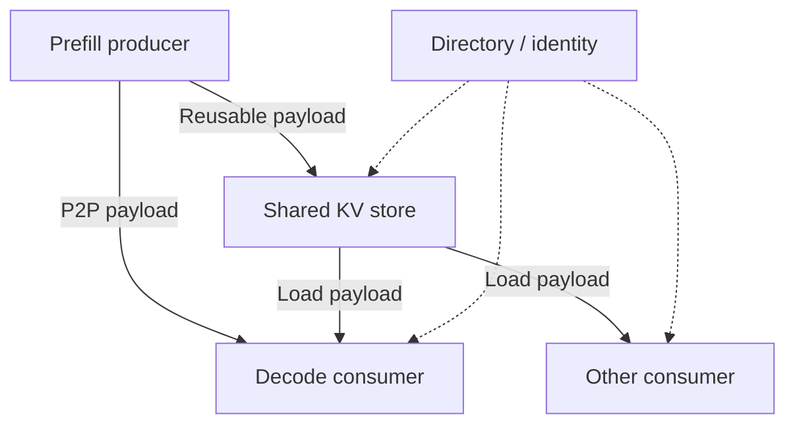
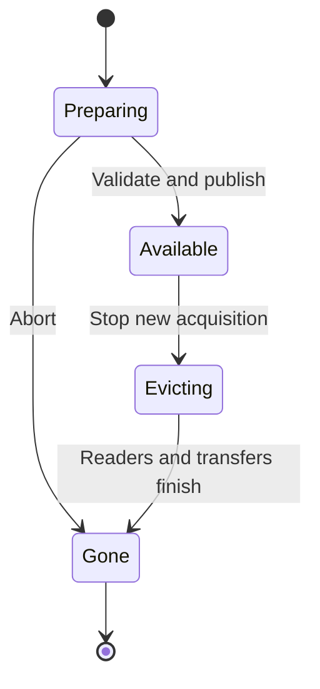

# Remote / Disaggregated KV Cache：搬运状态，也管理分布式生命周期

## 本篇解决什么问题

KV 跨进程、GPU、Node 或独立 Cache Store 后，哪些问题从本地内存管理变成 Metadata、Routing、Transfer 与 Failure？前置：[KV State Model](07-kv-cache-state-model.md)、[Hierarchy / Prefix Reuse](08-kv-cache-hierarchy-prefix-reuse.md)、[RDMA](../09-data-path-performance/09-high-performance-networking-rdma.md)、[Metadata / Object Index](../08-consistency-metadata-partitioning/02-metadata-object-index.md)。产品只提供架构实例，不作横评或部署教程。

## 1. 先区分三个问题

| 模式 | 回答的问题 | 不自动意味着什么 |
| --- | --- | --- |
| Remote KV Cache | 状态保存在别的 Memory / Node / Store，未来怎样复用？ | 不要求 Prefill / Decode 必须分离 |
| Prefill / Decode Disaggregation | 哪个 Engine 生成 KV，哪个 Engine 继续 Decode？ | 不要求长期保存 KV，也不要求共享 Store |
| KV-aware Routing | 此请求去哪个 Worker 更划算？ | 不等于拆分 Prefill / Decode 两种计算角色 |

这些模式可以组合，但各自解决不同问题。Prefill 与 Decode 的计算、内存及扩展压力不同，可以独立 Scale / Schedule / Place；代价是额外 Transfer、池间容量分配和协调。Disaggregation ≠ Automatically Faster。

当前 [vLLM Disaggregated Prefilling](https://docs.vllm.ai/en/v0.30.0/features/disagg_prefill/) 仍标为 experimental，采用不同实例承担两个阶段，Connector 协调 KV 传输；该文档明确不把吞吐提升作为该功能收益。当前 [Dynamo Disaggregated Serving](https://docs.nvidia.com/dynamo/knowledge-base/concepts/system-architecture/disaggregated-serving) 则讨论按工作负载权衡：低并发可能不值得付出搬运与资源池拆分成本，持续混合负载下可能改善阶段隔离与延迟。不能把某实现或负载的收益推广为通用性能保证。

## 2. P2P Transfer 与 Shared Store 分开

通用 Producer → Consumer 路径是 **Producer GPU → 合格 GPU / Host / NIC Buffer → Interconnect / Network → Consumer GPU**；可能使用 NVLink、PCIe、RDMA、NIXL 支持的传输或 Host Staging，具体拓扑与实现不同。NIXL 位于传输抽象层，不是统一 KV 格式、Cache Identity 或持久化协议。

这是组合职责图，不规定实际服务数量或调用顺序。P2P 可以只服务一次请求的短期搬运；Shared Store 还承担容量、目录、保留、淘汰和未来复用。**Transfer ≠ Storage**。

当前 [vLLM MooncakeStoreConnector](https://docs.vllm.ai/en/v0.30.0/features/mooncake_store_connector_usage/) 区分 P2P MooncakeConnector 与共享池 MooncakeStoreConnector，并可通过 MultiConnector 组合。当前 [Mooncake Store 设计](https://kvcache-ai.github.io/Mooncake/design/store/mooncake-store.html)区分 Metadata / 分配协调的 Master 与实际数据传输；Payload 不必经过 Master。Transfer Engine 提供搬运，Store 增加对象、目录和管理职责。它是该实现的架构，不是所有远端 KV 必须经过同一协议。

## 3. Remote Lookup 与 Routing 都不等于完成复用

对可复用 Cache 的通用读链是 **Lookup → Transfer → Validate → Install into local KV → Consume**。命中目录只找到候选位置；格式兼容、所需 Layer / Shard 完整、访问权限、Buffer 安装和实际可读还需成立。

当前 [LMCache MP](https://docs.lmcache.ai/mp/index.html)通过独立进程、Serving Connector 与本地 / 远端适配器扩展 Cache；[MP Storage Backends](https://docs.lmcache.ai/mp/l2_storage/supported_storages.html)说明远端 Store 的选择。跨 Engine / Node 复用仍取决于身份和格式兼容，不能因为 Connector 已接入就宣称任意状态互通，也不能假设每条后端路径都直接进入 GPU。

当前 [Dynamo KV-aware Routing](https://docs.nvidia.com/dynamo/knowledge-base/concepts/system-architecture/kv-aware-routing)结合 KV Overlap / Locality 与负载选择 Worker。高命中的热 Worker 若排队过长，未必比较冷但空闲的 Worker 更好。Routing 决定 Where；Disaggregation 决定两个阶段由哪些 Engine 承担；二者可以组合。

## 4. Directory 与 Lifecycle：轻量缓存也需要正确发布

远端目录至少要能回答：什么 Model / Prefix 存在、Token Range 与格式是什么、位于哪个 Node / Tier / Replica、谁有权使用、是否完整且仍有效、是否正被回收。Placement / Partition / Routing 可以复用现有元数据章节，KV 的可重建性不取消这些职责。

通用示意生命周期如下，状态名不是任何产品统一标准：

**Metadata Published ≠ Payload Ready** 是必须避免的错误状态：Writer 宣布可用前，要建立数据完整性和读端可消费条件。Reader 找到目录后，还要防止查找与 Eviction 之间的竞态，例如获取有效引用 / Lease 或验证 Entry Generation；具体机制由实现决定。旧目录指向已删除 Entry 时应成为 Miss / Fallback，不能返回半成品。

## 5. 故障、重试与所有权仍在

| 情况 | 通用处理边界 |
| --- | --- |
| Transfer failure | 不宣布完整 Hit；可在输入与模型仍可用时重算，支付 TTFT / Compute 代价 |
| Stale directory | 重新验证或转 Miss；避免反复访问同一个失效位置 |
| Partial transfer | 不能把半份状态安装为完整 KV；若协议支持，可仅复用已完整验证的 Prefix 单元 |
| Producer failure | 是否可从共享 Store 继续，取决于是否已有完整可用副本及消费者所需状态 |
| Format / model mismatch | 拒绝直接复用，选择有契约的转换或重新 Prefill |
| Timeout / unknown result | Store 可能已接收而 Client 不知；查询 / 重试要绑定稳定身份和尝试生命周期 |

复用 [Retry / Idempotency / Deduplication](../06-distributed-systems/03-retry-idempotency-deduplication.md)：对同一准确身份写入兼容的不可变派生状态，重复操作通常不同于重复执行 Primary Business Mutation，但并非无风险。身份字段遗漏、并发覆盖、旧完成通知复活已淘汰 Entry、重复容量占用都可能出错。应区分逻辑身份与物理位置 / Generation，不能用同一个 Key 掩盖版本差异。

Timeout 不等于传输已终止；源 / 目标 Buffer 在真实 Completion 或安全取消前不能随意复用。RDMA Completion 也不自动证明 Directory 发布、完整 KV 可安装或远端持久化。连接 [cuObject / RDMA](06-object-storage-cuobject-rdma.md)，但不重写网络教程。

Recompute Fallback 也需要预算：如果大量 Worker 同时失去远端缓存，重算可能制造 GPU 压力和 TTFT 尾部放大。限制 Retry、在途字节与重算并发，按 Deadline / Admission 做选择，复用 [Queueing](../09-data-path-performance/02-latency-throughput-queueing.md)与 [Backpressure](../09-data-path-performance/05-batching-backpressure.md)，不能用无限重试掩盖失败。

## 6. Persistence Boundary：保存派生状态，不等于保存业务事实

| 层级 | 保存目的 | 失败后的典型处理 |
| --- | --- | --- |
| Ephemeral transfer buffer | 本次 Prefill → Decode 交接 | 重新生成或重新传输，取决于源状态是否还在 |
| Reusable cache | 为未来 Prefix Reuse 保留 | Miss / Recompute，可能付出昂贵成本 |
| Persisted KV state | 跨明确的时间或故障边界保留派生状态 | 按实际保护 / 格式 / 保留契约恢复；失效时仍可能重算 |

Persisted ≠ Primary Durable Data。持久化 KV 的目的通常仍是节省 Prefill、改善 TTFT 与资源效率；Model / Prompt / 业务记录的保护责任不会转移给缓存。写入本地 NVMe、复制到另一个 Node、写入 Object Store 的 ACK 也具有不同失败边界，不能统一称作“永久可恢复”。若 KV 是业务唯一 Resume 材料，必须另行定义恢复契约。

## 7. Remote Tier 与 Object Storage：容量之外看访问粒度

| 候选层 | 比较重点，不作绝对排名 |
| --- | --- |
| Distributed Memory | Lookup、网络、注册 / 拷贝、容量成本、节点失效与 Eviction |
| Local / Remote NVMe | I/O 粒度、并发、排队、格式、容量与设备 / Node 故障域 |
| KV Store | Key / Metadata 请求成本、Payload 粒度、TTL / Eviction 与实际保护契约 |
| Object Store | 请求延迟、对象粒度、Manifest / Index、容量、共享与持久化责任 |

Object Storage 可能适合大容量、集群共享、较长时间保留的 Derived State，但请求 / Metadata Overhead、Latency 与 KV Chunk 粒度可能不匹配。需要评估 Chunking、Batching、Prefetch、Local Cache 和 Network Path，不是“能 PUT / GET”就适合当前 TTFT 目标。对象身份与 KV 语义身份也不是同一个抽象。

RDMA / NIXL 可以改善搬运、减少某些 Host Staging，但不能消除 Lookup、低命中率、Backend I/O 或安装成本。即使采用前篇 cuObject 式数据面，也不能自动获得正确 KV Key、Routing 和发布语义。**Fast Transfer ≠ Fast Lookup ≠ High Hit Rate ≠ Low TTFT**。

## 8. Measurement：命中只有比重算划算才有意义

概念判断是：**Reuse Benefit ≈ 避免的 Recompute Cost − Lookup / Transfer / Install Cost − 新增竞争成本**。这不是固定预测公式：阶段可能重叠，必须看 Critical Path；Offload 写入成本也应按实际复用摊销。若远端读取比重算还贵，即使命中也可能不值得加载。这个判断反过来影响 Admission、Eviction 和 Routing。

| 观测层 | 至少记录 |
| --- | --- |
| 用户 Outcome | TTFT 分布、TPOT / Decode Latency、Request Throughput、Tokens / s、失败率 |
| 复用收益 | Prefix / Token Hit、Avoided Prefill Tokens、Recompute Rate；区分部分 / 完整命中 |
| 远端路径 | Lookup / Transfer / Install Latency、Transferred Bytes、Retry / Partial Failure |
| 资源与生命周期 | GPU / CPU Memory Occupancy、Remote Capacity、Eviction Rate、Network Utilization、排队与在途字节 |

TTFT 是从约定请求起点到首个输出 Token 的时间，受排队、Prefill 和加载影响；TPOT 是后续输出 Token 的时间口径，要说明平均值 / 分布及测量边界，不能混同首 Token 时间。Prefix Reuse 通常主要减少 Prefill，对 TPOT 的效果还取决于 Decode Compute、Local KV Access 与调度。

比较无缓存、本地复用和远端复用时，保持 Model、Prompt / Prefix 分布、输出长度、并发与 Batch 策略可解释；区分 Cold / Warm、热目录 / 热 Payload，并测试缓存失效和 Transfer Failure。GB/s 高但 TTFT 不降，可能是 Lookup、排队、格式安装或重算本来就更便宜。不要把纯 RDMA 带宽当作端到端 Serving 性能。

## 官方资料范围与章节收口

核对日期：**2026-10-03**。版本与滚动文档分开记录；上面的流程、状态机和成本模型是通用推导，不是产品统一协议。

- vLLM **v0.30.0**，当日 stable 指向：[Release](https://github.com/vllm-project/vllm/releases/tag/v0.30.0)、[Disaggregated Prefilling](https://docs.vllm.ai/en/v0.30.0/features/disagg_prefill/)、[MooncakeStoreConnector / MultiConnector](https://docs.vllm.ai/en/v0.30.0/features/mooncake_store_connector_usage/)。
- LMCache：当前 **MP 滚动文档**，[Architecture](https://docs.lmcache.ai/mp/index.html)、[Backends](https://docs.lmcache.ai/mp/l2_storage/supported_storages.html)、[Legacy deprecated notice](https://docs.lmcache.ai/legacy/index.html)；最新发布独立核对为 [v0.5.5](https://github.com/LMCache/LMCache/releases/tag/v0.5.5)，不把全部滚动文档功能绑定到该版本。
- NVIDIA Dynamo：官方文档当日 **Latest 标为 v1.5.0**，本文采用当前滚动 [Disaggregated Serving](https://docs.nvidia.com/dynamo/knowledge-base/concepts/system-architecture/disaggregated-serving) 与 [KV-aware Routing](https://docs.nvidia.com/dynamo/knowledge-base/concepts/system-architecture/kv-aware-routing) 范围，不据此保证所有 Backend 行为相同。
- Mooncake：当日最新发布 [v0.3.13.post1](https://github.com/kvcache-ai/Mooncake/releases/tag/v0.3.13.post1)；[Store 当前文档](https://kvcache-ai.github.io/Mooncake/design/store/mooncake-store.html)与 [2026-09-30 源码快照](https://github.com/kvcache-ai/Mooncake/blob/0d1a8040faebb7c127c8901840a38c2ff57e80c5/docs/source/design/store/mooncake-store.md)核对。滚动文档与 Release 范围不强行等同。

至此形成 **Inference Derived State → Local Reuse / Tiering → Distributed Sharing / Transfer**。AI Storage Connections 三阶段九篇基础主线收住，后续只按明确专题扩展，不自动增加推理产品专章。

[上一篇：Hierarchy / Prefix Reuse](08-kv-cache-hierarchy-prefix-reuse.md) · [返回 AI Storage Connections](README.md)
